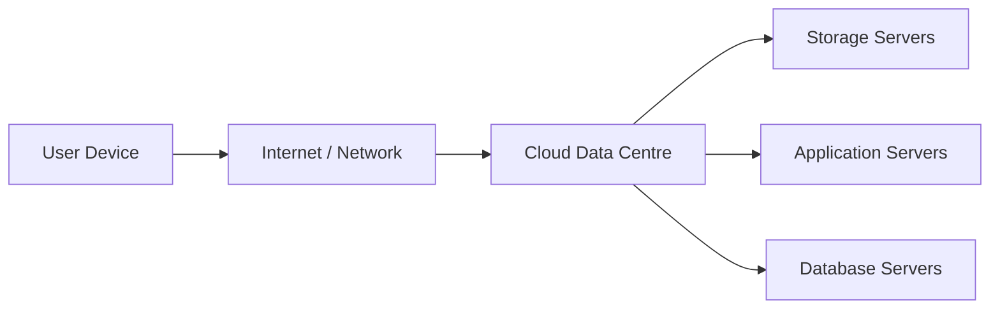

# Cloud Computing

## 1. Lesson Goals

By the end of this lesson, students should be able to:

- explain what cloud computing is
- distinguish local computing and cloud computing
- explain the role of remote servers and data centres
- describe common cloud services such as storage, software, platforms, and infrastructure
- distinguish SaaS, PaaS, and IaaS at a basic level
- explain advantages of cloud computing
- explain disadvantages and risks of cloud computing
- explain public cloud, private cloud, and hybrid cloud at a basic level
- apply cloud computing ideas to real-world scenarios
- explain cloud security, privacy, and reliability concerns
- avoid common misconceptions about cloud computing
- answer exam-style questions about cloud computing

---

## 2. Syllabus Mapping

| Item | Detail |
|---|---|
| Unit | A1 Computer Fundamentals |
| Label | SL Core |
| Main skill | Understanding how computing resources can be provided through remote networked services |
| Connected topics | Secondary storage, networks, databases, security, privacy, operating systems |
| Practical focus | Explaining benefits, risks, and suitable uses of cloud-based services |
| Exam relevance | Definitions, comparison, advantages/disadvantages, scenario evaluation |

::: tip Learning Focus
Cloud computing does not mean data is stored “in the air”. It means computing resources are provided by remote servers accessed through a network, usually the internet.
:::

---

## 3. Key Terms

| English Term | 中文解释 | Exam-style meaning |
|---|---|---|
| Cloud computing | 云计算 | Using remote servers over a network to store, process, or manage data |
| Cloud storage | 云存储 | Storing files on remote servers accessed through the internet |
| Local storage | 本地存储 | Data stored on the user's own device |
| Data centre | 数据中心 | Facility containing many servers and networking equipment |
| Server | 服务器 | Computer that provides services or resources to other computers |
| Client | 客户端 | Device or program that requests services from a server |
| SaaS | 软件即服务 | Software delivered through the cloud, often through a browser |
| PaaS | 平台即服务 | Cloud platform for developing and deploying applications |
| IaaS | 基础设施即服务 | Cloud access to virtual servers, storage, and networking |
| Public cloud | 公有云 | Cloud services shared across many customers |
| Private cloud | 私有云 | Cloud infrastructure dedicated to one organization |
| Hybrid cloud | 混合云 | Combination of public and private cloud |
| Scalability | 可扩展性 | Ability to increase or decrease resources when needed |
| Availability | 可用性 | Whether a service is accessible when needed |
| Synchronization | 同步 | Keeping files/data updated across devices |
| Subscription | 订阅 | Payment model where users pay regularly for access |
| Vendor lock-in | 供应商锁定 | Difficulty moving away from a cloud provider |

---

## 4. Concept Explanation

<LangBlock>
<template #cn>

### 中文讲解

**Cloud computing（云计算）** 指的是通过网络使用远程服务器提供的计算资源。

这些资源可以包括：

```text
storage
software
databases
servers
development platforms
processing power
```

例如，当你使用 Google Drive、OneDrive、iCloud 或学校的云盘时，你的文件不是只存在自己电脑里，而是保存在远程服务器上。你通过 internet 访问它们。

所以 cloud 不是“数据飘在空中”。  
真实情况是：

```text
your device
→ internet
→ cloud provider's data centre
→ remote servers and storage
```

云计算的好处包括：

```text
anywhere access
easy sharing
automatic backup/sync
scalability
less need to buy own servers
```

但也有风险：

```text
needs internet
privacy concerns
security risks
ongoing subscription cost
provider outage
vendor lock-in
```

简单来说：

```text
local computing = resources on your own device
cloud computing = resources provided by remote servers
```

</template>

<template #en>

### English Explanation

**Cloud computing** means using computing resources provided by remote servers over a network.

These resources may include:

```text
storage
software
databases
servers
development platforms
processing power
```

For example, when you use Google Drive, OneDrive, iCloud, or school cloud storage, your files are not only stored on your own computer. They are stored on remote servers and accessed through the internet.

So the cloud does not mean “data floating in the air”.  
The real structure is:

```text
your device
→ internet
→ cloud provider's data centre
→ remote servers and storage
```

Benefits of cloud computing include:

```text
anywhere access
easy sharing
automatic backup/sync
scalability
less need to buy own servers
```

But there are also risks:

```text
requires internet
privacy concerns
security risks
ongoing subscription cost
provider outage
vendor lock-in
```

In simple terms:

```text
local computing = resources on your own device
cloud computing = resources provided by remote servers
```

</template>
</LangBlock>

---

## 5. What Is Cloud Computing?

Cloud computing provides computing resources through remote servers accessed over a network.

These resources can include:

```text
file storage
application software
databases
virtual machines
development platforms
processing power
backup services
collaboration tools
```

### Simple Diagram



### Important

Cloud computing still uses real physical hardware.

The difference is that the hardware is usually owned and managed by a cloud provider, not by the user directly.

---

## 6. Local Computing vs Cloud Computing

| Feature | Local Computing | Cloud Computing |
|---|---|---|
| Where resources are | user's own device/local server | remote servers/data centres |
| Internet needed? | not always | usually yes |
| Maintenance | user/organization manages hardware | provider manages infrastructure |
| Access | usually from one device/location | often from many devices/locations |
| Upfront cost | may require buying hardware | often subscription/pay-as-you-go |
| Scalability | limited by owned hardware | easier to scale |
| Control | more direct local control | depends on provider settings |
| Risk | local device failure | network/provider/account risks |

### Example

Local storage:

```text
file saved on laptop SSD
```

Cloud storage:

```text
file saved in OneDrive and accessed through internet
```

---

## 7. Cloud Storage

Cloud storage stores files on remote servers.

Examples:

```text
Google Drive
OneDrive
iCloud
Dropbox
school cloud storage
company cloud backup
```

### Advantages

```text
access files from different devices
easy file sharing
automatic synchronization
off-site backup
less risk from losing one device
```

### Disadvantages

```text
requires internet access
depends on provider availability
privacy and security concerns
subscription cost may apply
large uploads/downloads may be slow
```

### Example

A student writes a document on a laptop and later opens it on a tablet because the file is synchronized through cloud storage.

---

## 8. Cloud Software

Cloud software is software accessed through the internet rather than fully installed and run locally.

Examples:

```text
Google Docs
Microsoft 365 online
Canva
Figma
GitHub Codespaces
web-based email
learning management systems
```

### Advantages

```text
no need for full local installation
updates handled by provider
collaboration is easier
can access from many devices
```

### Disadvantages

```text
depends on internet connection
may have fewer offline features
data is stored with provider
subscription or account required
```

---

## 9. Data Centres

A data centre is a facility containing many servers and networking systems.

It may include:

```text
server racks
storage systems
network switches and routers
cooling systems
backup power
fire suppression
physical security
monitoring systems
```

### Why Data Centres Matter

Cloud services depend on data centres because they host the servers that store and process data.

### Environmental Note

Data centres can use large amounts of electricity and water for power and cooling.  
This creates environmental concerns, but efficient large-scale infrastructure may also reduce duplicated local hardware in some cases.

---

## 10. Client-Server Idea

Cloud computing often uses a client-server model.

```text
client = user device or app requesting service
server = remote computer providing service
```

### Example: Cloud Document

```text
client: student's browser
server: cloud document service
```

When the student edits a document:

```text
browser sends changes to server
server stores document
other users can receive updates
```

---

## 11. SaaS: Software as a Service

SaaS means software is provided through the cloud.

The user usually accesses it through:

```text
web browser
mobile app
thin client
```

### Examples

```text
Google Docs
Microsoft 365 online
Gmail
Zoom web app
Canva
Salesforce
```

### Characteristics

```text
software managed by provider
updates handled by provider
users usually pay by subscription or account
access from multiple devices
```

### Example

Instead of installing a full word processor on every computer, students can use a cloud-based document editor in a browser.

---

## 12. PaaS: Platform as a Service

PaaS provides a cloud platform for developing, testing, and deploying applications.

It may include:

```text
runtime environment
development tools
databases
hosting
deployment tools
APIs
```

### Examples

```text
cloud app hosting platforms
online database platforms
web app deployment services
```

### Who Uses PaaS?

Usually:

```text
developers
software teams
students building web apps
organizations deploying applications
```

### Simple Meaning

PaaS gives developers a platform so they do not need to manage all server infrastructure themselves.

---

## 13. IaaS: Infrastructure as a Service

IaaS provides computing infrastructure through the cloud.

It may include:

```text
virtual machines
cloud storage
networking
firewalls
load balancers
virtual servers
```

### Who Uses IaaS?

Usually:

```text
system administrators
developers
companies
schools or organizations needing servers
```

### Simple Meaning

IaaS is like renting virtual computer hardware instead of buying physical servers.

---

## 14. SaaS vs PaaS vs IaaS

| Type | What Provider Gives | Main User |
|---|---|---|
| SaaS | ready-to-use software | general users |
| PaaS | platform for building/deploying apps | developers |
| IaaS | virtual infrastructure such as servers/storage | IT teams/developers |

### Simple Analogy

```text
SaaS = use the finished app
PaaS = build your app on a prepared platform
IaaS = rent the virtual machines and infrastructure
```

### Example

| Need | Suitable Cloud Model |
|---|---|
| Write documents online | SaaS |
| Deploy a small web app without managing servers deeply | PaaS |
| Rent virtual servers for a company system | IaaS |

---

## 15. Public, Private, and Hybrid Cloud

### Public Cloud

Public cloud services are provided over shared infrastructure to many customers.

Examples:

```text
large cloud providers
public cloud storage services
public cloud virtual machines
```

### Private Cloud

Private cloud is cloud infrastructure dedicated to one organization.

It may be managed:

```text
by the organization
or by a provider
```

### Hybrid Cloud

Hybrid cloud combines public and private cloud.

Example:

```text
school keeps sensitive student data in private systems
but uses public cloud for general collaboration documents
```

---

## 16. Advantages of Cloud Computing

| Advantage | Explanation |
|---|---|
| Access anywhere | users can access data/services from different devices |
| Collaboration | multiple users can work on same file/system |
| Scalability | resources can increase/decrease as needed |
| Lower upfront cost | less need to buy servers immediately |
| Automatic updates | provider can update software/services |
| Backup and recovery | cloud can support off-site backups |
| Reliability features | providers may use redundancy |
| Reduced local maintenance | provider manages much infrastructure |

### Example

A school can use cloud document tools so students can work on group projects from home and school without emailing files back and forth.

---

## 17. Disadvantages and Risks

| Risk | Explanation |
|---|---|
| Internet dependence | service may be unavailable without connection |
| Provider outage | service can be unavailable if provider has problems |
| Privacy concerns | data is stored with third-party provider |
| Security risks | accounts or cloud systems may be attacked |
| Ongoing cost | subscription or usage fees may continue |
| Vendor lock-in | difficult to move to another provider |
| Less direct control | provider controls infrastructure |
| Data location/legal issues | data may be stored in another region/country |
| Performance variation | depends on network speed and provider load |

### Balanced View

Cloud computing is useful, but it is not automatically the best choice for every situation.

---

## 18. Scalability

Scalability means resources can be increased or decreased when needed.

### Example

An online shop has normal traffic most of the year but very high traffic during a sale.

With cloud infrastructure, the shop may increase server capacity during the sale and reduce it later.

### Why It Matters

Scalability helps organizations avoid:

```text
buying too much hardware for normal use
running out of capacity during peak demand
long setup time for new servers
```

---

## 19. Availability and Reliability

Availability means a service is accessible when needed.

Cloud providers may improve availability using:

```text
multiple servers
backup power
redundant storage
multiple data centres
monitoring
automatic failover
```

### But

Cloud services can still fail.

Possible causes:

```text
provider outage
network failure
account problem
configuration error
cyberattack
```

### Exam Phrase

Cloud services can improve availability through redundancy, but users still depend on the provider and network connection.

---

## 20. Cloud Security

Cloud security protects cloud data and services.

Common controls include:

```text
strong passwords
multi-factor authentication
encryption
access permissions
audit logs
regular updates
backup and recovery
secure configuration
```

### User Responsibility

Users and organizations must still manage:

```text
account security
sharing permissions
passwords
MFA
data classification
safe use policies
```

Cloud provider security does not remove all user responsibility.

---

## 21. Cloud Privacy

Privacy concerns include:

```text
what data is collected
where data is stored
who can access it
whether data is shared with third parties
how long data is kept
how data can be deleted
which laws apply
```

### Example

A school using cloud storage for student data must consider:

```text
student privacy
parent/guardian consent where required
access permissions
data retention
provider terms
data location
```

---

## 22. Cloud Backup and Recovery

Cloud services can help backup data.

Advantages:

```text
off-site copy
automatic backup
easy restore for some services
protection against local device loss
version history in some tools
```

Risks:

```text
account compromise
accidental sync deletion
provider outage
misconfigured backup
subscription/account loss
```

### Important

Cloud sync is not always the same as backup.

If a file is deleted and the deletion syncs across devices, the file may disappear everywhere unless version history or backup is available.

---

## 23. Cloud Computing in Schools

A school may use cloud services for:

```text
email
learning management systems
student documents
shared lesson resources
online assessments
backup
video meetings
collaboration
```

### Benefits

```text
students can access work from home
teachers can share resources easily
group projects are easier
school may need fewer local servers
```

### Concerns

```text
student privacy
internet dependence
account security
service outages
digital divide for students without reliable internet
```

---

## 24. Cloud Computing for Developers

Developers may use cloud computing for:

```text
code repositories
online IDEs
test servers
databases
deployment platforms
virtual machines
container hosting
CI/CD systems
```

### Example

A student creates a web app and deploys it to a cloud platform.

The cloud provider may manage:

```text
server runtime
network access
database hosting
scaling
logs
deployment
```

This can make deployment easier than managing a physical server.

---

## 25. Cloud Computing and Databases

Many databases can be hosted in the cloud.

### Benefits

```text
easier remote access
managed backup options
scalability
less local server maintenance
```

### Risks

```text
data breach
misconfigured permissions
network latency
provider cost
legal/privacy concerns
```

### Example

A school might use a cloud-hosted database for student records, but must protect access and follow privacy rules.

---

## 26. Worked Example: Student Cloud Storage

A student writes an essay using cloud storage.

### Process

```text
1. Student edits document on laptop.
2. Changes are sent through internet.
3. Cloud server stores updated document.
4. Student opens same document on tablet.
5. Latest version is synchronized.
```

### Benefits

```text
access from multiple devices
automatic saving
easy sharing with teacher
```

### Risks

```text
needs internet
wrong sharing settings may expose file
account password must be protected
```

---

## 27. Worked Example: Online Game Server

An online game uses cloud servers.

Cloud resources may provide:

```text
matchmaking
player accounts
game servers
databases
leaderboards
updates
anti-cheat services
```

### Benefits

```text
servers can scale with player numbers
players connect from different regions
data can be backed up
```

### Risks

```text
network latency
server outage
security attacks
high cost if usage increases
```

---

## 28. Worked Example: School File System

A school decides whether to use local servers or cloud storage.

| Option | Strength | Weakness |
|---|---|---|
| Local server | more direct control, can work on local network | hardware maintenance, backup responsibility |
| Cloud storage | access anywhere, easier sharing, provider maintenance | internet dependence, privacy/provider concerns |

### Good Answer Style

A strong answer should not say one option is always best.  
It should connect the choice to:

```text
cost
security
access needs
internet reliability
data sensitivity
maintenance ability
```

---

## 29. Common Mistakes

| Mistake | Why it is wrong | Better understanding |
|---|---|---|
| Cloud means data is not stored physically | Cloud data is stored on remote physical servers | Data centres contain real hardware |
| Cloud storage is always backup | Sync is not always backup | Deletion may sync too |
| Cloud is always cheaper | Costs can grow over time | Depends on usage/subscription |
| Cloud is always more secure | Misconfiguration and account attacks are possible | Security is shared responsibility |
| Local is always safer | Local devices can be stolen/damaged | Each option has risks |
| SaaS/PaaS/IaaS are the same | They provide different levels of service | Software vs platform vs infrastructure |
| Internet is not needed for cloud | Most cloud services need network access | Offline access may be limited |
| Provider handles everything | Users still manage accounts/permissions | Shared responsibility |
| Cloud always improves performance | Network latency can reduce performance | Depends on workload and connection |
| Public cloud means free cloud | Public means shared provider infrastructure | It may still cost money |

---

## 30. Guided Practice

### Practice 1: Define Cloud Computing

Explain cloud computing in one sentence.

<details>
<summary>Suggested Answer</summary>

Cloud computing is the use of remote servers accessed over a network to store, process, or manage data and services.

</details>

---

### Practice 2: Local or Cloud?

A file is saved only on a laptop SSD. Is this local or cloud storage?

<details>
<summary>Suggested Answer</summary>

Local storage, because the file is stored on the user's own device.

</details>

---

### Practice 3: SaaS, PaaS, or IaaS?

A student uses Google Docs in a browser. Which model is this most like?

<details>
<summary>Suggested Answer</summary>

SaaS, because it is ready-to-use software delivered through the cloud.

</details>

---

### Practice 4: Cloud Risk

Give one risk of using cloud storage for student records.

<details>
<summary>Suggested Answer</summary>

Possible risks include privacy concerns, unauthorized access, misconfigured sharing permissions, provider outage, or account compromise.

</details>

---

### Practice 5: Scalability

Why might cloud computing help an online shop during a large sale?

<details>
<summary>Suggested Answer</summary>

Cloud resources can be scaled up to handle more users during the sale and scaled down afterwards, avoiding the need to permanently buy extra hardware.

</details>

---

## 31. Independent Practice

### Question 1

Define cloud computing.

### Question 2

Explain the difference between local storage and cloud storage.

### Question 3

Give three examples of cloud services.

### Question 4

Explain the role of data centres in cloud computing.

### Question 5

Distinguish between SaaS, PaaS, and IaaS.

### Question 6

Give three advantages of cloud computing.

### Question 7

Give three disadvantages or risks of cloud computing.

### Question 8

Explain why cloud sync is not always the same as backup.

### Question 9

A school wants to use cloud storage for student work. Explain two benefits and two concerns.

### Question 10

A company has highly sensitive data but also wants scalable web hosting. Explain how a hybrid cloud approach could help.

---

## 32. Exam-style Questions

### Question 1 [4 marks]

Define cloud computing and give one example.

<details>
<summary>Mark Scheme Style Answer</summary>

Cloud computing is the use of remote servers accessed over a network to store, process, or manage data and services. An example is cloud storage such as Google Drive or OneDrive, or cloud-based software such as Google Docs.

</details>

---

### Question 2 [5 marks]

Distinguish between local storage and cloud storage.

<details>
<summary>Mark Scheme Style Answer</summary>

Local storage stores data on the user's own device or local hardware, such as an SSD or local server. Cloud storage stores data on remote servers accessed through a network, usually the internet. Local storage may be available without internet, while cloud storage allows access from multiple devices but usually depends on network connection and provider availability.

</details>

---

### Question 3 [6 marks]

Explain two advantages and one disadvantage of cloud computing for a school.

<details>
<summary>Mark Scheme Style Answer</summary>

One advantage is that students and teachers can access files and services from different locations and devices. Another advantage is easier collaboration, because multiple users can work on shared documents. A disadvantage is dependence on internet access or provider availability. There may also be privacy and security concerns when storing student data with a third-party provider.

</details>

---

### Question 4 [6 marks]

Compare SaaS, PaaS, and IaaS.

<details>
<summary>Mark Scheme Style Answer</summary>

SaaS provides ready-to-use software through the cloud, such as an online document editor. PaaS provides a platform for developers to build, test, and deploy applications without managing all infrastructure. IaaS provides virtual infrastructure such as virtual machines, storage, and networking, giving users more control but more responsibility.

</details>

---

### Question 5 [6 marks]

Explain why cloud computing can improve scalability but also create risks.

<details>
<summary>Mark Scheme Style Answer</summary>

Cloud computing can improve scalability because resources such as storage or server capacity can be increased or decreased when demand changes. This helps organizations handle peak usage without buying permanent hardware. However, risks include dependence on internet access, provider outages, ongoing costs, privacy concerns, and security issues such as account compromise or misconfigured permissions.

</details>

---

## 33. Practice task
### Activity 1: Cloud or Local Sort

Students classify examples:

```text
file saved on laptop SSD
Google Docs document
school local file server
OneDrive folder
USB backup
cloud-hosted database
```

---

### Activity 2: SaaS / PaaS / IaaS Matching

Students match scenarios to cloud service models:

```text
using online email
deploying a web app
renting a virtual server
editing a shared document
hosting a database platform
```

---

### Activity 3: School Cloud Debate

Prompt:

```text
Should a school move student files to cloud storage?
```

Students must discuss:

```text
access
cost
privacy
security
internet dependence
backup
collaboration
```

---

## 34. Independent practice
### Independent practice part A: Concept Explanation

In 5-6 sentences, explain what cloud computing is and how it is different from local computing.

---

### Independent practice part B: Comparison Table

Create a comparison table for:

```text
local storage
cloud storage
```

Include:

```text
access
cost
control
security
internet dependence
best use
```

---

### Independent practice part C: Scenario Analysis

A small game company wants to host online multiplayer servers.

Explain:

```text
how cloud computing could help
what risks it creates
what security concerns should be considered
```

---

### Independent practice part D: Written Answer

Explain why cloud computing is useful for collaboration but can create privacy concerns.

---

## 35. One-page Revision Summary

| Point | Summary |
|---|---|
| Cloud computing | Using remote servers over a network |
| Cloud storage | Files stored on remote servers |
| Local storage | Files stored on own device/local server |
| Data centre | Facility containing many servers |
| Client-server | Client requests, server provides |
| SaaS | Ready-to-use cloud software |
| PaaS | Cloud platform for app development/deployment |
| IaaS | Virtual infrastructure such as servers/storage |
| Public cloud | Shared provider infrastructure |
| Private cloud | Dedicated cloud infrastructure |
| Hybrid cloud | Mix of public and private cloud |
| Scalability | Resources can grow/shrink with demand |
| Main benefit | Access, collaboration, scalability |
| Main risk | Internet dependence, privacy/security, provider reliance |
| Exam phrase | Cloud computing provides storage, software, or computing resources from remote servers accessed through a network |

---

## 36. Quick Self-test

Before moving on, students should be able to answer these:

1. What is cloud computing?
2. What is cloud storage?
3. What is a data centre?
4. What is the difference between local and cloud storage?
5. What is SaaS?
6. What is PaaS?
7. What is IaaS?
8. What is scalability?
9. Give two advantages of cloud computing.
10. Give two risks of cloud computing.

