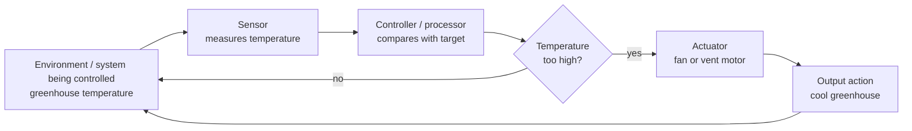
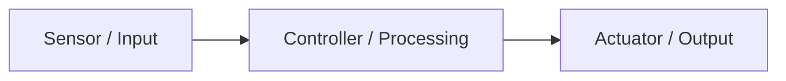
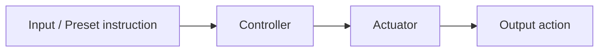
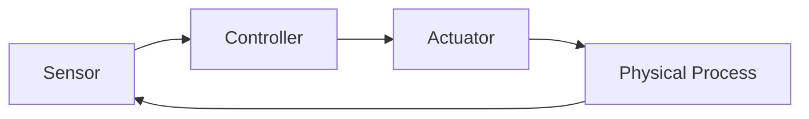

# Control Systems

## Page map

- [Lesson goals](#1-lesson-goals)
- [Syllabus mapping](#2-syllabus-mapping)
- [Core checklist](#core-checklist)
- [Key terms and detailed lesson](#3-key-terms)

---

## 1. Lesson Goals

By the end of this lesson, students should be able to:

- explain what a control system is
- distinguish input, processing, and output in a control system
- explain the role of sensors
- explain the role of actuators
- explain how a microprocessor or controller uses sensor data
- distinguish open-loop and closed-loop control systems
- explain feedback in a closed-loop system
- describe real-world examples of control systems
- trace the steps in a simple control system
- explain advantages and limitations of control systems
- avoid common misconceptions about sensors, actuators, and feedback
- answer exam-style questions about control systems

---

## 2. Syllabus Mapping

| Item | Detail |
|---|---|
| Unit | A1 Computer Fundamentals |
| Label | SL Core |
| Main skill | Understanding how computer systems monitor and control physical processes |
| Connected topics | Hardware, input/output devices, embedded systems, sensors, actuators, operating systems, logic gates |
| Practical focus | Explaining control system scenarios using input-process-output-feedback |
| Exam relevance | Definitions, scenario explanation, open-loop vs closed-loop, sensor/actuator roles |

::: tip Learning Focus
A control system is not just a program. It connects the digital computer system to the physical world through sensors, processing, and actuators.
:::

---

## Start here: sensors input, controller decides, actuator acts

A **control system** is a computer-based system that uses input data to control something in the physical world. It usually takes data from **sensors**, processes the data using a **processor/controller**, and controls output through **actuators**.

The core pattern is:

```text
sensor input -> controller processing -> actuator output/action
```

If the system uses **feedback**, it checks the current result and adjusts again. Core keywords for this page are **control system**, **sensor**, **actuator**, **input**, **output**, **processor/controller**, **feedback**, **monitoring**, and **embedded system**.

---

## Core checklist

By the end of this page, you should be able to:

- define a **control system**
- identify sensors, processors/controllers, and actuators in a scenario
- distinguish **monitoring** from **control**
- explain **open-loop** and **closed-loop** systems at a simple level
- explain **feedback**
- apply control systems to heating, traffic lights, automatic doors, greenhouse systems, washing machines, and hospital monitoring

---

## Key terms exam table

| Term | 简单中文解释 | English mark-scheme phrase | Simple example |
|---|---|---|---|
| Control system | 根据输入自动控制物理过程的系统 | A system that automatically changes output based on input data | Thermostat controls heating |
| Sensor | 检测环境数据的输入设备 | An input device that collects data from the environment | Temperature sensor reads room temperature |
| Actuator | 执行物理动作的输出设备 | An output device that carries out a physical action | Motor opens an automatic door |
| Input | 系统接收的数据 | Data received by the system | Light level from a light sensor |
| Output | 系统产生的信号或动作 | Signal or action produced by the system | Heater turns on |
| Processor / controller | 处理输入并作决定的部件 | Processes sensor data and decides the output | Microcontroller compares temperature with target |
| Feedback | 输出结果或当前状态返回系统 | Information about current state used to adjust output | New temperature reading after heating |
| Open-loop system | 不使用反馈的控制系统 | Control system that does not use feedback | Timed sprinkler runs for 10 minutes |
| Closed-loop system | 使用反馈调整输出的控制系统 | Control system that uses feedback to adjust output | Heating turns off when target temperature is reached |
| Monitoring system | 只记录或显示数据，不自动控制 | Records or displays data without automatically controlling the process | Hospital monitor displays heart rate |
| Embedded system | 嵌入在设备中的专用计算机系统 | A computer system built into a larger device for a specific purpose | Washing machine controller |

---

## Monitoring system vs control system

| Point | Monitoring system | Control system |
|---|---|---|
| Purpose | Observe, record, or display data | Automatically change or control a process |
| Input | Sensor readings or data | Sensor readings or data |
| Processing | Checks, stores, displays, or alerts | Compares data with rules, targets, or thresholds |
| Output/action | Usually display, log, report, or alarm | Sends signal to actuator for physical action |
| Human involvement | Human often decides what to do next | System can act automatically |
| Example | Hospital heart-rate monitor alerts nurse | Greenhouse turns fan on when too hot |
| Common exam phrase | "A monitoring system records or displays data but does not automatically control the process." | "A control system automatically changes output based on input data." |

---

## Open-loop vs closed-loop system

| Point | Open-loop system | Closed-loop system |
|---|---|---|
| Feedback used? | No feedback | Uses feedback |
| Accuracy | Less accurate if conditions change | More accurate because it checks current state |
| Complexity | Simpler | More complex |
| Cost | Usually cheaper | Usually more expensive because sensors/feedback are needed |
| Example | Timed traffic light or timed sprinkler | Thermostat or greenhouse temperature control |
| Common exam phrase | "An open-loop system follows preset instructions and does not check the result." | "A closed-loop system uses feedback to adjust its output." |

---

## Step-by-step scenario: greenhouse temperature control

A greenhouse needs to keep temperature near a target value, such as `25°C`.

1. The **temperature sensor** detects the current greenhouse temperature.
2. The **controller** compares the sensor value with the target temperature.
3. If the temperature is too high, the controller sends a signal to an **actuator**, such as a fan or vent motor.
4. The actuator performs a physical action, such as turning the fan on or opening the vent.
5. The sensor keeps measuring the temperature.
6. The new sensor reading is **feedback**, so the controller can adjust again.

This is a **closed-loop control system** because the system uses feedback to decide whether the output should change.

---

## Control system feedback diagram



The arrow back to the environment shows the feedback loop: the system measures the result again and can adjust its next output.

---

## Exam focus

| Command term | What to write |
|---|---|
| State | Give the correct term or a short definition. |
| Identify | Pick out the sensor, controller, actuator, input, or output from a scenario. |
| Outline | Give the main idea plus one relevant detail. |
| Describe | Explain the role of each component in the system. |
| Explain | Link sensor input, controller decision, actuator output, and feedback to the scenario. |
| Compare | Give paired differences, such as monitoring vs control or open-loop vs closed-loop. |

For mark levels:

- **1 mark:** name one correct component or definition.
- **2 marks:** identify two components or give a definition plus example.
- **3 marks:** describe sensor, controller, and actuator roles.
- **4 marks:** explain a sequence using input, processing, and output.
- **6 marks:** include scenario-specific sensor data, controller comparison, actuator action, feedback, and whether the system is open-loop or closed-loop.

Avoid vague answers such as:

```text
the sensor controls it
the computer checks it
feedback means user feedback
```

Better answers explain each component's role: the sensor collects data, the controller processes data and decides, and the actuator performs the physical action.

---

## Reusable mark-scheme style phrases

- "A sensor collects data from the environment."
- "A controller processes the sensor data and makes a decision."
- "An actuator carries out a physical action based on the controller's output."
- "A control system automatically changes the output of a system based on input data."
- "A monitoring system records or displays data but does not automatically control the process."
- "A closed-loop system uses feedback to adjust its output."
- "An open-loop system follows preset instructions and does not use feedback."
- "Feedback allows the controller to compare the current state with the target and adjust again."

---

## Common mistakes table

| Mistake | Why it is wrong | Better understanding |
|---|---|---|
| Confusing sensor and actuator | Sensor is input; actuator is output/action | Temperature sensor reads data; heater changes temperature |
| Saying sensors output physical actions | Sensors collect data | Actuators perform physical actions |
| Saying actuators collect data | Actuators receive control signals | Sensors collect data from the environment |
| Confusing monitoring with control | Monitoring may only display or record data | Control automatically changes output |
| Forgetting the processor/controller | The system needs a component to make decisions | Sensor data must be processed before output |
| Forgetting feedback in closed-loop systems | Closed-loop depends on checking the current state again | Feedback is sensor data about the result/current state |
| Treating all control systems as AI | Many use simple rules and thresholds | A thermostat can use basic comparison logic |
| Not linking the answer to the scenario | Generic answers lose application marks | Name the exact sensor, actuator, and action in the scenario |

---

## Quick-check questions with short answers

1. What is a control system?  
   **Answer:** A system that uses input data to automatically control a physical process or device.

2. What does a sensor do?  
   **Answer:** It collects data from the environment.

3. What does an actuator do?  
   **Answer:** It carries out a physical action.

4. What does the controller do?  
   **Answer:** It processes sensor data and decides the output.

5. What is feedback?  
   **Answer:** Information about the current state or result sent back into the system.

6. What is an open-loop system?  
   **Answer:** A system that does not use feedback.

7. What is a closed-loop system?  
   **Answer:** A system that uses feedback to adjust output.

8. What is the difference between monitoring and control?  
   **Answer:** Monitoring records or displays data; control automatically changes output.

9. Give one actuator in an automatic door.  
   **Answer:** A motor that opens or closes the door.

10. Give one sensor in a greenhouse system.  
    **Answer:** Temperature sensor, humidity sensor, light sensor, or soil moisture sensor.

---

## Exam-style practice: control systems

### Question A [6 marks]

An automatic door opens when a person approaches. Identify a suitable sensor, controller, actuator, input, and output in this system.

<details>
<summary>Mark Scheme Style Answer</summary>

A suitable sensor is a motion or proximity sensor. The input is data showing that a person is near the door. The controller or microprocessor receives the sensor data and decides whether the door should open. The actuator is a motor connected to the door mechanism. The output is the physical action of opening the door. The system may also use feedback to check whether the door is fully open or whether someone is still in the doorway.

</details>

---

### Question B [6 marks]

Compare a monitoring system and a control system using a hospital example.

<details>
<summary>Mark Scheme Style Answer</summary>

A monitoring system records or displays data but does not automatically control the process. For example, a hospital monitor may display a patient's heart rate and sound an alarm if it is too high or too low, so a nurse or doctor decides what to do. A control system automatically changes output based on input data. For example, an automatic infusion system could use sensor data and a controller to adjust a pump. Both systems use input data, but a control system sends output to an actuator to perform an action automatically.

</details>

---

### Question C [6 marks]

Explain how a closed-loop greenhouse temperature control system uses feedback.

<details>
<summary>Mark Scheme Style Answer</summary>

A temperature sensor measures the current greenhouse temperature and sends the value to the controller. The controller compares the reading with a target or threshold, such as 25°C. If the temperature is too high, the controller sends a signal to an actuator, such as a fan or vent motor. The actuator performs the physical action to cool the greenhouse. The sensor continues measuring the temperature after the action, and this new reading is feedback. The controller uses the feedback to decide whether to keep the fan on, turn it off, or adjust again.

</details>

---

## 3. Key Terms

| English Term | 中文解释 | Exam-style meaning |
|---|---|---|
| Control system | 控制系统 | A system that monitors and controls a process or device |
| Sensor | 传感器 | Input device that detects physical conditions |
| Actuator | 执行器 | Output device that causes a physical action |
| Microprocessor | 微处理器 | Processor that processes sensor data and controls outputs |
| Controller | 控制器 | Device or program that makes control decisions |
| Input | 输入 | Data received from sensors or users |
| Processing | 处理 | Decision-making based on input data |
| Output | 输出 | Signal or action produced by the system |
| Feedback | 反馈 | Output/result information sent back into the system |
| Open-loop system | 开环系统 | Control system with no feedback |
| Closed-loop system | 闭环系统 | Control system that uses feedback |
| Threshold | 阈值 | A set value used for comparison |
| Set point | 设定值 | Target value the system tries to maintain |
| Monitoring | 监测 | Checking sensor readings or system state |
| Control signal | 控制信号 | Signal sent from controller to actuator |
| Real-time system | 实时系统 | System that must respond within a required time |

---

## 4. Concept Explanation

<LangBlock>
<template #cn>

### 中文讲解

**Control system（控制系统）** 是一种用计算机或微处理器监测并控制设备或过程的系统。

它通常包含：

```text
sensor
processor / controller
actuator
```

基本过程是：

```text
sensor collects data
controller processes data
actuator performs action
```

例如自动路灯：

```text
light sensor 检测环境亮度
controller 判断是否太暗
如果太暗，actuator / output circuit 打开灯
```

控制系统可以分为：

```text
open-loop system
closed-loop system
```

**Open-loop** 不使用 feedback。  
它只是按照预设规则运行，不检查结果是否真的达到目标。

例如：

```text
定时洒水器每天早上 7 点洒水 10 分钟
```

它不会检查土壤是否已经湿了。

**Closed-loop** 使用 feedback。  
它会不断检测当前状态，并根据结果调整输出。

例如：

```text
恒温器检测室温
如果温度低于设定值，就打开暖气
温度达到设定值后，关闭暖气
```

简单来说：

```text
sensor = input from physical world
controller = decision maker
actuator = physical output/action
feedback = check result and adjust
```

</template>

<template #en>

### English Explanation

A **control system** is a system that uses a computer or microprocessor to monitor and control a device or process.

It usually includes:

```text
sensor
processor / controller
actuator
```

The basic process is:

```text
sensor collects data
controller processes data
actuator performs action
```

For example, an automatic street light:

```text
a light sensor detects brightness
the controller decides whether it is too dark
if it is too dark, an actuator/output circuit turns on the light
```

Control systems can be divided into:

```text
open-loop system
closed-loop system
```

An **open-loop** system does not use feedback.  
It follows preset rules and does not check whether the desired result was actually reached.

Example:

```text
a timed sprinkler waters plants for 10 minutes every morning at 7
```

It does not check whether the soil is already wet.

A **closed-loop** system uses feedback.  
It keeps checking the current state and adjusts output based on the result.

Example:

```text
a thermostat checks room temperature
if the temperature is below the set point, it turns heating on
when the temperature reaches the set point, it turns heating off
```

In simple terms:

```text
sensor = input from physical world
controller = decision maker
actuator = physical output/action
feedback = check result and adjust
```

</template>
</LangBlock>

---

## 5. What Is a Control System?

A control system monitors and controls a physical process.

### Common Examples

```text
automatic washing machine
central heating system
traffic light system
automatic door
greenhouse control system
car engine control
anti-lock braking system
smart thermostat
robot arm
street lighting system
```

### Basic Structure

```text
Input → Processing → Output
```

For control systems, this often becomes:

```text
Sensor → Controller → Actuator
```

### Diagram



---

## 6. Sensors

A sensor is an input device that detects a physical condition and converts it into data.

### Common Sensors

| Sensor | Detects |
|---|---|
| temperature sensor | temperature |
| light sensor | brightness |
| motion sensor | movement |
| pressure sensor | pressure |
| humidity sensor | moisture in air |
| proximity sensor | nearby objects |
| sound sensor | sound level |
| smoke sensor | smoke particles |
| gas sensor | gas concentration |
| water level sensor | liquid level |

### Key Idea

A sensor does not usually perform the final physical action.  
It provides input data for the controller.

::: tip Exam Phrase
A sensor is an input device that detects a physical quantity and sends data to the processor or controller.
:::

---

## 7. Actuators

An actuator is an output device that causes a physical action.

### Common Actuators

| Actuator | Physical Action |
|---|---|
| motor | movement/rotation |
| heater | increases temperature |
| pump | moves liquid |
| valve | opens/closes flow |
| relay | switches circuit on/off |
| buzzer | produces sound |
| LED/light | produces light |
| servo | controlled movement |
| brake actuator | applies braking force |
| lock mechanism | locks/unlocks door |

### Key Idea

An actuator changes something in the physical world.

::: tip Exam Phrase
An actuator is an output device that receives a signal from the controller and performs a physical action.
:::

---

## 8. Controller / Microprocessor

The controller processes input data and decides what action should happen.

It may:

```text
read sensor values
compare values with thresholds
follow programmed rules
send control signals
turn actuators on or off
adjust output gradually
```

### Example

A greenhouse controller may use:

```text
temperature sensor
humidity sensor
light sensor
```

Then decide whether to:

```text
turn on fan
turn on heater
open vent
start water pump
switch on lights
```

---

## 9. Threshold and Set Point

A threshold is a value used for comparison.

A set point is a target value the system tries to maintain.

### Example: Heating

```text
set point = 22°C
current temperature = 18°C
```

Decision:

```text
18°C < 22°C
turn heating on
```

When:

```text
current temperature = 22°C
```

Decision:

```text
turn heating off
```

### Example: Alarm

```text
sound level threshold = 80 dB
sensor reading = 95 dB
```

Decision:

```text
sound alarm
```

---

## 10. Open-loop Control Systems

An open-loop control system does not use feedback.

It does not check whether the desired result has been achieved.

### Example: Timed Sprinkler

```text
At 7:00 AM, sprinkler turns on.
After 10 minutes, sprinkler turns off.
```

The system does not check:

```text
soil moisture
weather
rain
plant condition
```

### Diagram



### Advantages

```text
simple
cheap
easy to design
fewer sensors needed
```

### Disadvantages

```text
less accurate
cannot correct errors
may waste resources
does not adapt to changes
```

---

## 11. Closed-loop Control Systems

A closed-loop control system uses feedback.

It checks the result and adjusts output.

### Example: Thermostat

```text
temperature sensor reads current temperature
controller compares it with set point
heating turns on/off
sensor checks temperature again
system repeats
```

### Diagram



### Advantages

```text
more accurate
can correct errors
adapts to changes
can maintain target value
```

### Disadvantages

```text
more complex
more expensive
requires sensors
may need careful tuning
```

---

## 12. Open-loop vs Closed-loop

| Feature | Open-loop | Closed-loop |
|---|---|---|
| Uses feedback? | no | yes |
| Checks output/result? | no | yes |
| Complexity | simpler | more complex |
| Cost | often lower | often higher |
| Accuracy | lower if conditions change | higher |
| Example | timed sprinkler | thermostat |
| Main weakness | cannot correct errors | needs sensors/control design |

### Quick Memory

```text
open-loop = no feedback
closed-loop = feedback
```

---

## 13. Feedback

Feedback means information about the output or current state is sent back into the system.

### Why Feedback Matters

Feedback allows the system to:

```text
check whether the target has been reached
adjust output
correct errors
respond to changes
maintain stability
```

### Example

In a heating system:

```text
sensor measures current temperature
controller compares with set point
heater turns on/off
sensor measures again
```

The temperature reading is feedback.

---

## 14. Worked Example: Automatic Heating System

### Goal

Maintain room temperature at:

```text
22°C
```

### Components

| Component | Example |
|---|---|
| Sensor | temperature sensor |
| Controller | microprocessor / thermostat |
| Actuator | heater switch / heating relay |
| Set point | 22°C |
| Output | heating on/off |

### Process

```text
1. Temperature sensor reads room temperature.
2. Controller compares reading with 22°C.
3. If temperature is below 22°C, heater turns on.
4. If temperature reaches or exceeds 22°C, heater turns off.
5. Sensor continues sending readings.
```

### Type

This is a closed-loop system because it uses temperature feedback.

---

## 15. Worked Example: Automatic Door

### Goal

Open the door when a person is nearby.

### Components

| Component | Example |
|---|---|
| Sensor | motion/proximity sensor |
| Controller | microprocessor |
| Actuator | door motor |
| Output | door opens/closes |

### Process

```text
1. Sensor detects person near door.
2. Controller receives sensor data.
3. Controller sends signal to motor.
4. Motor opens the door.
5. After delay or no person detected, motor closes door.
```

### Possible Feedback

Some doors may use feedback sensors to check:

```text
door fully open
door blocked
person still in doorway
```

---

## 16. Worked Example: Traffic Lights

A traffic light control system may use:

```text
timer
vehicle sensors
pedestrian button
controller
lights
```

### Simple Timed System

A purely timed traffic light can be open-loop:

```text
green for 60 seconds
yellow for 5 seconds
red for 60 seconds
```

It does not check traffic conditions.

### Sensor-based System

A sensor-based traffic light can be closed-loop:

```text
vehicle sensor detects traffic
pedestrian button sends request
controller adjusts light timing
```

This uses input from the environment.

---

## 17. Worked Example: Greenhouse Control

A greenhouse may need to control:

```text
temperature
humidity
light
soil moisture
```

### Components

| Input Sensor | Possible Actuator |
|---|---|
| temperature sensor | heater / fan |
| humidity sensor | misting system / ventilation |
| light sensor | grow lights / blinds |
| soil moisture sensor | water pump |

### Example Rule

```text
IF soil moisture is below threshold
THEN turn on water pump
```

This connects control systems to programming conditions and logic.

---

## 18. Worked Example: Washing Machine

A washing machine contains an embedded control system.

### Inputs

```text
water level sensor
door sensor
temperature sensor
user program selection
```

### Outputs

```text
motor rotation
water valve
heater
pump
display lights
buzzer
```

### Process

```text
1. User selects washing program.
2. Controller checks door is closed.
3. Water valve opens until correct level.
4. Motor rotates drum.
5. Heater controls water temperature.
6. Pump drains water.
7. Buzzer signals completion.
```

---

## 19. Control Systems and Embedded Systems

Many control systems are embedded systems.

An embedded system is a computer system built into a larger device for a specific purpose.

Examples:

```text
washing machine controller
car braking system
microwave oven controller
smart thermostat
traffic light controller
robot vacuum
```

### Connection

| Embedded System Idea | Control System Example |
|---|---|
| dedicated function | control heating or washing |
| sensors | temperature, motion, pressure |
| processor | controller/microprocessor |
| actuators | motor, heater, valve |
| real-time response | brake system or alarm |

---

## 20. Real-time Response

Some control systems must respond quickly.

Examples:

```text
car anti-lock braking system
airbag system
medical monitoring alarm
industrial safety shutoff
robot collision detection
```

### Why Timing Matters

If response is late:

```text
accident may occur
safety risk increases
system may fail
damage may happen
```

### Exam Phrase

A real-time control system must process inputs and produce outputs within a required time limit.

---

## 21. Control System Algorithm Pattern

Many control systems follow this pattern:

```text
LOOP forever
    read sensor value
    compare value with set point or threshold
    decide output
    send signal to actuator
END LOOP
```

### Example Pseudocode

```text
REPEAT
    temperature ← read temperature sensor
    IF temperature < 22 THEN
        turn heater ON
    ELSE
        turn heater OFF
    END IF
FOREVER
```

### Key Idea

Control systems often continuously monitor and adjust.

---

## 22. Control Systems and Logic Gates

Control systems can use Boolean logic.

Example:

```text
Alarm sounds if door is open AND system is armed.
```

Boolean expression:

```text
doorOpen AND systemArmed
```

Example:

```text
Heating turns on if temperature is low AND window is NOT open.
```

Boolean expression:

```text
temperatureLow AND (NOT windowOpen)
```

This connects control systems with logic gates and programming conditions.

---

## 23. Advantages of Computer Control Systems

| Advantage | Explanation |
|---|---|
| Consistency | Performs same task repeatedly without getting tired |
| Speed | Can react quickly to sensor changes |
| Accuracy | Can measure and adjust precisely |
| Automation | Reduces need for human control |
| Safety | Can monitor dangerous environments |
| Efficiency | Can reduce waste of energy/materials |
| Continuous operation | Can work 24/7 |
| Data logging | Can record sensor readings and actions |

---

## 24. Limitations and Risks

| Limitation / Risk | Explanation |
|---|---|
| Sensor failure | Wrong input can cause wrong output |
| Actuator failure | System may decide correctly but action fails |
| Software bug | Incorrect logic can cause wrong control |
| Power/network failure | System may stop working |
| Cost | Sensors/controllers/maintenance can be expensive |
| Over-reliance | Humans may stop monitoring properly |
| Security risk | Connected control systems may be attacked |
| Poor calibration | Sensor readings may be inaccurate |

### Example

If a temperature sensor gives incorrect readings, a heating system may turn heating on or off at the wrong time.

---

## 25. Common Mistakes

| Mistake | Why it is wrong | Better understanding |
|---|---|---|
| Sensor is output | Sensor provides input | Sensor detects physical conditions |
| Actuator is input | Actuator creates output/action | Actuator changes physical world |
| All control systems use feedback | Open-loop systems do not | Closed-loop systems use feedback |
| Feedback means user feedback only | Feedback means system output/state measured again | Sensor readings can be feedback |
| Controller and actuator are the same | Controller decides; actuator acts | Different roles |
| Open-loop is always bad | It can be simple and cheap | Good when feedback is not needed |
| Closed-loop is always best | It can be more complex and expensive | Choose by scenario |
| Output always means screen display | Output can be physical action | Motor/heater/light can be output |
| Sensor data is always accurate | Sensors can fail or need calibration | Validate and maintain sensors |
| Control system is only software | It includes hardware and software | Sensors, processor, actuators |

---

## 26. Guided Practice

### Practice 1: Sensor or Actuator?

Classify each item:

```text
temperature sensor
motor
light sensor
heater
pump
motion sensor
```

<details>
<summary>Suggested Answer</summary>

| Item | Type |
|---|---|
| temperature sensor | sensor/input |
| motor | actuator/output |
| light sensor | sensor/input |
| heater | actuator/output |
| pump | actuator/output |
| motion sensor | sensor/input |

</details>

---

### Practice 2: Open-loop or Closed-loop?

A sprinkler turns on every day at 7:00 AM for 10 minutes, without checking soil moisture. What type is it?

<details>
<summary>Suggested Answer</summary>

Open-loop, because it does not use feedback to check the result or current soil moisture.

</details>

---

### Practice 3: Feedback

A thermostat keeps checking room temperature and turns heating on or off. What is the feedback?

<details>
<summary>Suggested Answer</summary>

The temperature sensor reading is feedback because it tells the controller the current room temperature after heating changes.

</details>

---

### Practice 4: Control Rule

Write a simple rule for a light that turns on when it is dark.

<details>
<summary>Suggested Answer</summary>

```text
IF light level is below threshold
THEN turn light ON
ELSE turn light OFF
```

</details>

---

### Practice 5: Real-time System

Why does a car braking control system need fast response?

<details>
<summary>Suggested Answer</summary>

Because a late response could cause loss of control or an accident. The system must process sensor data and apply braking within a required time limit.

</details>

---

## 27. Independent Practice

### Question 1

Define control system.

### Question 2

Explain the role of sensors in a control system.

### Question 3

Explain the role of actuators in a control system.

### Question 4

Distinguish between open-loop and closed-loop control systems.

### Question 5

Explain feedback using a thermostat example.

### Question 6

For an automatic door, identify input, processing, and output.

### Question 7

For a greenhouse control system, suggest two sensors and two actuators.

### Question 8

Write pseudocode for a fan that turns on when temperature is above 30°C.

### Question 9

Explain two advantages of computer control systems.

### Question 10

Explain two risks or limitations of control systems.

---

## 28. Exam-style Questions

### Question 1 [4 marks]

Define control system and give one example.

<details>
<summary>Mark Scheme Style Answer</summary>

A control system is a system that monitors and controls a physical process or device using inputs, processing, and outputs. It often uses sensors to collect data, a processor/controller to make decisions, and actuators to perform actions. An example is a thermostat-controlled heating system.

</details>

---

### Question 2 [4 marks]

Distinguish between a sensor and an actuator.

<details>
<summary>Mark Scheme Style Answer</summary>

A sensor is an input device that detects a physical condition such as temperature, light, or motion and sends data to the controller. An actuator is an output device that receives a signal from the controller and performs a physical action, such as moving a motor, turning on a heater, or opening a valve.

</details>

---

### Question 3 [6 marks]

Explain the difference between open-loop and closed-loop control systems.

<details>
<summary>Mark Scheme Style Answer</summary>

An open-loop control system does not use feedback and does not check whether the desired output has been achieved. It follows preset instructions, such as a sprinkler that runs for a fixed time. A closed-loop control system uses feedback from sensors to monitor the current state and adjust its output. A thermostat is closed-loop because it measures temperature and turns heating on or off based on the reading.

</details>

---

### Question 4 [6 marks]

A greenhouse system keeps temperature near 25°C. Explain how the control system could work.

<details>
<summary>Mark Scheme Style Answer</summary>

A temperature sensor measures the current greenhouse temperature and sends the reading to a controller. The controller compares the reading with the set point of 25°C. If the temperature is too low, it may turn on a heater. If the temperature is too high, it may turn on a fan or open a vent. The sensor continues measuring temperature, providing feedback so the system can adjust its output.

</details>

---

### Question 5 [6 marks]

Explain two advantages and one limitation of using computer control in a washing machine.

<details>
<summary>Mark Scheme Style Answer</summary>

One advantage is automation, because the machine can run a washing program without constant human control. Another advantage is consistency, because the controller can follow the same timing, water level, and temperature rules each time. A limitation is that sensor or software failure can cause incorrect behaviour, such as filling with too much water or not detecting that the door is open.

</details>

---

## 29. Practice task
### Activity 1: Sensor and Actuator Sort

Students sort cards into:

```text
sensor
actuator
controller
other hardware
```

Cards:

```text
temperature sensor
motor
microprocessor
heater
light sensor
pump
screen
motion sensor
valve
```

---

### Activity 2: Control System Diagram

Groups draw diagrams for:

```text
automatic door
thermostat
greenhouse
traffic lights
washing machine
smart street light
```

Each diagram must include:

```text
sensor
controller
actuator
input
processing
output
feedback if closed-loop
```

---

### Activity 3: Open-loop vs Closed-loop Debate

Students decide whether these should be open-loop or closed-loop:

```text
traffic lights
sprinkler
heating system
school bell
robot vacuum
greenhouse watering
```

They must justify their answers.

---

## 30. Independent practice
### Independent practice part A: Concept Explanation

In 5-6 sentences, explain how a control system uses sensors, a controller, and actuators.

---

### Independent practice part B: Scenario Analysis

Choose one system:

```text
automatic door
washing machine
greenhouse
smart street light
traffic light
```

Identify:

```text
inputs
processing
outputs
sensors
actuators
whether it is open-loop or closed-loop
```

---

### Independent practice part C: Pseudocode

Write pseudocode for one of these systems:

```text
fan turns on if temperature is above 30°C
light turns on if it is dark and motion is detected
pump turns on if soil moisture is below threshold
```

---

### Independent practice part D: Written Answer

Explain why feedback can make a control system more accurate, but also more complex.

---

## 31. One-page Revision Summary

| Point | Summary |
|---|---|
| Control system | Monitors and controls a physical process |
| Sensor | Input device detecting physical condition |
| Actuator | Output device causing physical action |
| Controller | Processes input and decides output |
| Threshold | Value used for comparison |
| Set point | Target value to maintain |
| Open-loop | No feedback |
| Closed-loop | Uses feedback |
| Feedback | Current state/result sent back to controller |
| Real-time | Must respond within required time |
| Common examples | thermostat, washing machine, traffic lights, automatic door |
| Exam phrase | A control system uses sensor input, processing by a controller, and actuator output to control a physical process |

---

## 32. Quick Self-test

Before moving on, students should be able to answer these:

1. What is a control system?
2. What does a sensor do?
3. What does an actuator do?
4. What does a controller do?
5. What is a threshold?
6. What is a set point?
7. What is an open-loop system?
8. What is a closed-loop system?
9. What is feedback?
10. Why can sensor failure be dangerous?
