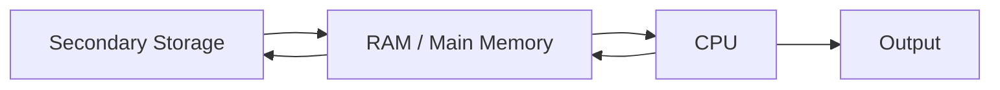

# CPU Components

## 1. Lesson Goals

By the end of this lesson, students should be able to:

- explain the role of the CPU in a computer system
- identify the main components of the CPU
- explain the role of the Control Unit
- explain the role of the Arithmetic Logic Unit
- explain the role of registers
- explain the purpose of the Program Counter, Memory Address Register, Memory Data Register, and Current Instruction Register
- explain the role of cache at a basic level
- describe how the CPU works with memory
- distinguish CPU, RAM, cache, and secondary storage
- explain how CPU features can affect performance
- avoid common CPU misconceptions
- answer exam-style questions about CPU components

---

## 2. Syllabus Mapping

| Item | Detail |
|---|---|
| Unit | A1 Computer Fundamentals |
| Label | SL Core |
| Main skill | Understanding how the CPU processes instructions |
| Connected topics | Computer hardware, fetch-decode-execute cycle, primary memory, secondary storage, operating systems |
| Practical focus | Explaining CPU component roles using clear examples |
| Exam relevance | Definitions, component roles, register explanations, performance factors |

::: tip Learning Focus
Students should understand the CPU as a processor that repeatedly fetches, decodes, and executes instructions. The CPU is not the whole computer, and it does not permanently store all user files.
:::

---

## 3. Key Terms

| English Term | 中文解释 | Exam-style meaning |
|---|---|---|
| CPU | 中央处理器 | Main processor that executes program instructions |
| Processor | 处理器 | Hardware that processes instructions and data |
| Control Unit | 控制单元 | Directs and coordinates CPU operations |
| ALU | 算术逻辑单元 | Performs arithmetic and logical operations |
| Register | 寄存器 | Very small, very fast storage location inside the CPU |
| Program Counter | 程序计数器 | Holds the address of the next instruction to be fetched |
| MAR | 存储器地址寄存器 | Holds the memory address currently being accessed |
| MDR | 存储器数据寄存器 | Holds data being transferred to or from memory |
| CIR | 当前指令寄存器 | Holds the current instruction being decoded or executed |
| Cache | 高速缓存 | Small, fast memory close to or inside the CPU |
| Clock speed | 时钟频率 | Number of CPU cycles per second |
| Core | 核心 | Processing unit within a CPU |
| Instruction | 指令 | A command that the CPU can execute |
| Bus | 总线 | Communication pathway for data, addresses, or control signals |
| Main memory | 主存储器 | Memory directly accessed by CPU, usually RAM |

---

## 4. Concept Explanation

<LangBlock>
<template #cn>

### 中文讲解

**CPU（Central Processing Unit）** 是计算机中的主要处理器。  
它的主要任务是执行程序指令。

当你运行一个程序时，例如浏览器、游戏、Java 程序或数据库查询，CPU 会不断执行类似这样的循环：

```text
fetch instruction
decode instruction
execute instruction
```

CPU 内部有几个重要部分：

```text
Control Unit
ALU
Registers
Cache
```

其中：

```text
Control Unit 负责控制和协调操作
ALU 负责计算和逻辑判断
Registers 是 CPU 内部非常小但非常快的临时存储位置
Cache 是接近 CPU 的高速内存，用来减少访问 RAM 的等待时间
```

CPU 不会长期保存你的文件。  
你的文件通常保存在 SSD / HDD 等 secondary storage 中。  
程序运行时，相关指令和数据会被加载到 RAM，CPU 再从 RAM 中取指令和数据进行处理。

简单来说：

```text
storage 保存长期文件
RAM 保存当前运行的数据和程序
CPU 处理指令
registers 保存 CPU 当前正在使用的小量数据
```

</template>

<template #en>

### English Explanation

The **CPU**, or Central Processing Unit, is the main processor in a computer.  
Its main job is to execute program instructions.

When you run a program, such as a browser, game, Java program, or database query, the CPU repeatedly performs a cycle like this:

```text
fetch instruction
decode instruction
execute instruction
```

Inside the CPU, there are several important parts:

```text
Control Unit
ALU
Registers
Cache
```

Their roles are:

```text
Control Unit controls and coordinates operations
ALU performs arithmetic and logical operations
Registers are very small but very fast temporary storage locations inside the CPU
Cache is fast memory close to the CPU that reduces waiting time when accessing RAM
```

The CPU does not permanently store your files.  
Your files are usually stored on secondary storage such as SSD or HDD.  
When a program runs, relevant instructions and data are loaded into RAM, and then the CPU fetches and processes them.

In simple terms:

```text
storage keeps long-term files
RAM keeps currently running data and programs
CPU processes instructions
registers keep small amounts of data currently used by the CPU
```

</template>
</LangBlock>

---

## 5. What Does the CPU Do?

The CPU processes instructions and data.

It is responsible for:

```text
fetching instructions from memory
decoding instructions
executing instructions
performing arithmetic operations
performing logical comparisons
controlling data movement
coordinating other components
```

### Example: Running a Simple Calculation

If a program needs to calculate:

```text
5 + 3
```

The CPU must:

```text
fetch the instruction
decode that it is an addition operation
send values to the ALU
calculate the result
store or output the result
```

::: tip Exam Phrase
The CPU fetches, decodes, and executes instructions and controls the processing of data in the computer system.
:::

---

## 6. CPU Is Not the Whole Computer

Students often say:

```text
The CPU is the computer.
```

This is not accurate.

The CPU is one important component, but a computer system also needs:

```text
RAM
storage
motherboard
input devices
output devices
operating system
application software
data
users
```

### Comparison

| Component | Role |
|---|---|
| CPU | processes instructions |
| RAM | temporarily stores running programs and data |
| SSD/HDD | stores files long term |
| Input devices | enter data |
| Output devices | present results |
| Operating system | manages hardware and software resources |

The CPU is essential, but it cannot work alone.

---

## 7. Main CPU Components

The main CPU components are:

```text
Control Unit
Arithmetic Logic Unit
Registers
Cache
```

### Overview Table

| Component | Main Role |
|---|---|
| Control Unit | directs and coordinates CPU operations |
| ALU | performs arithmetic and logic operations |
| Registers | store small amounts of data/instructions very quickly |
| Cache | stores frequently used data/instructions for faster access |

### Simple Diagram

```text
CPU
├── Control Unit
├── ALU
├── Registers
└── Cache
```

---

## 8. Control Unit

The **Control Unit**, or CU, manages and coordinates CPU operations.

It does not usually perform calculations itself.  
Instead, it controls the movement of instructions and data.

### Main Roles

The Control Unit:

```text
fetches instructions from memory
decodes instructions
sends control signals
coordinates ALU, registers, and memory
manages the sequence of operations
```

### Simple Analogy

The Control Unit is like a manager or conductor.

It tells other parts:

```text
what to do
when to do it
where data should move
```

### Example

If an instruction says:

```text
ADD two numbers
```

The Control Unit decodes the instruction and coordinates the ALU to perform addition.

---

## 9. Arithmetic Logic Unit

The **Arithmetic Logic Unit**, or **ALU**, performs arithmetic and logical operations.

### Arithmetic Operations

Examples:

```text
addition
subtraction
multiplication
division
increment
decrement
```

### Logic Operations

Examples:

```text
compare two values
check if one value is greater than another
check if two values are equal
perform AND / OR / NOT operations
```

### Example

For this condition:

```java
if (score >= 50)
```

The ALU may be involved in comparing:

```text
score and 50
```

Then the CPU can decide which instruction to execute next.

::: tip Exam Phrase
The ALU performs arithmetic calculations and logical comparisons.
:::

---

## 10. Registers

Registers are very small, very fast storage locations inside the CPU.

They temporarily hold:

```text
instructions
memory addresses
data being processed
intermediate results
control information
```

### Why Registers Are Needed

The CPU needs extremely fast access to small amounts of data during processing.

RAM is fast compared with storage, but registers are even faster because they are inside the CPU.

### Register Characteristics

| Feature | Register |
|---|---|
| Location | inside CPU |
| Size | very small |
| Speed | extremely fast |
| Purpose | hold current instruction/data/address |
| Persistence | temporary |

---

## 11. Important CPU Registers

Common registers include:

```text
Program Counter
Memory Address Register
Memory Data Register
Current Instruction Register
Accumulator
```

Different courses and textbooks may use slightly different register names.  
For this website, the core registers are:

```text
PC
MAR
MDR
CIR
```

---

## 12. Program Counter

The **Program Counter**, or **PC**, stores the address of the next instruction to be fetched.

### Role

```text
PC tells the CPU where the next instruction is in memory.
```

### Example

If the next instruction is stored at memory address:

```text
2048
```

then:

```text
PC = 2048
```

After fetching the instruction, the PC is usually updated to point to the next instruction.

### Exam Phrase

The Program Counter holds the memory address of the next instruction to be fetched.

---

## 13. Memory Address Register

The **Memory Address Register**, or **MAR**, holds the address in memory that the CPU wants to access.

### Role

```text
MAR stores the memory address currently being read from or written to.
```

### Example

If the CPU wants to read data from memory address:

```text
2048
```

then:

```text
MAR = 2048
```

The address is sent to memory so the correct location can be accessed.

### Exam Phrase

The MAR stores the address of the memory location currently being accessed.

---

## 14. Memory Data Register

The **Memory Data Register**, or **MDR**, holds data being transferred to or from memory.

### Role

```text
MDR stores the actual data or instruction moving between CPU and memory.
```

### Example

If memory address 2048 contains:

```text
LOAD A
```

then after reading memory:

```text
MDR = LOAD A
```

### Read and Write

| Operation | MDR Role |
|---|---|
| Read from memory | receives data from memory |
| Write to memory | holds data to be written to memory |

### Exam Phrase

The MDR holds data being transferred between the CPU and memory.

---

## 15. Current Instruction Register

The **Current Instruction Register**, or **CIR**, holds the instruction currently being decoded or executed.

### Role

```text
CIR stores the current instruction while the CPU decodes or executes it.
```

### Example

If the CPU has fetched:

```text
ADD 5, 3
```

then:

```text
CIR = ADD 5, 3
```

The Control Unit decodes the instruction in the CIR.

### Exam Phrase

The CIR stores the current instruction being decoded or executed.

---

## 16. Register Summary

| Register | Full Name | Main Role |
|---|---|---|
| PC | Program Counter | address of next instruction |
| MAR | Memory Address Register | address currently accessed in memory |
| MDR | Memory Data Register | data/instruction transferred to/from memory |
| CIR | Current Instruction Register | current instruction being decoded/executed |

### Quick Memory

```text
PC = next instruction address
MAR = memory address being accessed
MDR = data moving between memory and CPU
CIR = current instruction
```

---

## 17. Cache

Cache is small, fast memory close to or inside the CPU.

It stores frequently used or recently used data and instructions.

### Why Cache Is Useful

Accessing RAM is slower than accessing cache.

If the CPU can find needed data in cache, it can reduce waiting time.

### Cache Characteristics

| Feature | Cache |
|---|---|
| Location | close to or inside CPU |
| Size | small |
| Speed | very fast |
| Cost | expensive per unit |
| Purpose | speed up repeated access to data/instructions |

### Simple Example

If a loop uses the same instruction many times, the CPU may access it from cache instead of repeatedly fetching from RAM.

---

## 18. CPU and RAM Working Together

The CPU does not usually execute instructions directly from secondary storage.

A common simplified flow is:

```text
program stored on SSD
→ loaded into RAM
→ CPU fetches instructions from RAM
→ CPU processes instructions
→ results stored in RAM or sent to output/storage
```

### Diagram



### Key Idea

RAM acts as the CPU's main working area while programs are running.

---

## 19. CPU, RAM, Cache, and Storage

| Component | Role | Speed | Capacity | Volatile? |
|---|---|---|---|---|
| Registers | current CPU data/instructions | fastest | tiny | yes |
| Cache | frequently used data/instructions | very fast | small | usually yes |
| RAM | active programs/data | fast | medium/large | yes |
| SSD/HDD | long-term files/programs | slower | large | no |

### Memory Hierarchy

```text
Registers
↓
Cache
↓
RAM
↓
Secondary Storage
```

Generally:

```text
higher = faster, smaller, more expensive per unit
lower = slower, larger, cheaper per unit
```

---

## 20. Buses Preview

Buses are communication pathways between CPU, memory, and other components.

Common buses include:

```text
address bus
data bus
control bus
```

### Simple Roles

| Bus | Purpose |
|---|---|
| Address bus | carries memory addresses |
| Data bus | carries data |
| Control bus | carries control signals |

### Example

During a memory read:

```text
address bus carries the address
control bus indicates read operation
data bus carries the data back
```

::: info Level Control
This is a preview. The fetch-decode-execute page will connect buses more directly to instruction processing.
:::

---

## 21. CPU Performance Factors

CPU performance can be affected by several features.

| Factor | Explanation |
|---|---|
| Clock speed | More cycles per second can allow more instructions to be processed |
| Number of cores | More cores can process more tasks in parallel if software supports it |
| Cache size | Larger/faster cache may reduce waiting for RAM |
| CPU architecture | Design affects efficiency |
| Word size | Amount of data CPU can process at once |
| Heat and cooling | Overheating can reduce speed |
| Software efficiency | Poor software can waste CPU time |

### Important

A higher clock speed does not always mean better performance in every task.  
Performance depends on the whole system and the workload.

---

## 22. Multiple Cores

A core is a processing unit within a CPU.

A CPU may have:

```text
2 cores
4 cores
8 cores
16 cores
or more
```

### Why More Cores Can Help

More cores can allow:

```text
multiple tasks to run at the same time
parallel processing for suitable programs
better multitasking
```

### Limitation

A program must be designed to use multiple cores effectively.  
Some tasks cannot be easily split into parallel parts.

---

## 23. Clock Speed

Clock speed is the number of cycles per second.

It is often measured in:

```text
GHz
```

For example:

```text
3.5 GHz
```

means about 3.5 billion cycles per second.

### Important

Clock speed affects how quickly instructions may be processed, but it is not the only factor.

Other factors include:

```text
number of cores
cache size
CPU architecture
RAM speed
software design
```

---

## 24. Worked Example: Opening a Program

When a student opens a Java IDE:

```text
1. The program is stored on SSD.
2. The operating system loads needed parts into RAM.
3. The CPU fetches instructions from RAM.
4. The Control Unit decodes instructions.
5. The ALU performs calculations or comparisons when needed.
6. Registers temporarily hold addresses, instructions, and data.
7. Cache may speed up repeated access.
8. Output appears on the screen.
```

This uses:

```text
secondary storage
RAM
CPU
registers
cache
output hardware
operating system
```

---

## 25. Worked Example: Simple Instruction Flow

Suppose a simplified program instruction says:

```text
ADD 5 and 3
```

The CPU may:

```text
fetch the instruction from RAM
store it in the CIR
decode it using the Control Unit
send values to the ALU
ALU calculates 8
store the result in a register or memory
```

This example connects:

```text
Control Unit
ALU
Registers
RAM
```

---

## 26. Common Mistakes

| Mistake | Why it is wrong | Better understanding |
|---|---|---|
| CPU is the whole computer | CPU is only the main processor | Computer has CPU, memory, storage, software, etc. |
| CPU permanently stores files | Files are stored on SSD/HDD | CPU only temporarily processes data |
| RAM and registers are the same | Registers are inside CPU and much smaller/faster | RAM is main memory |
| Cache and secondary storage are the same | Cache is fast CPU memory | Secondary storage is long-term |
| Control Unit performs calculations | ALU performs calculations | CU controls and coordinates |
| ALU controls all hardware | CU sends control signals | ALU calculates and compares |
| PC stores the current instruction | PC stores address of next instruction | CIR stores current instruction |
| MAR stores data | MAR stores memory address | MDR stores data |
| MDR stores address | MDR stores data moving to/from memory | MAR stores address |
| More GHz always means better performance | Performance depends on many factors | Consider cores, cache, architecture, workload |

---

## 27. Guided Practice

### Practice 1: CU or ALU?

Which component performs arithmetic calculations?

<details>
<summary>Suggested Answer</summary>

The ALU performs arithmetic calculations.

</details>

---

### Practice 2: Register Role

Which register holds the address of the next instruction?

<details>
<summary>Suggested Answer</summary>

The Program Counter, or PC.

</details>

---

### Practice 3: MAR or MDR?

The CPU wants to read from memory address 500. Which register stores 500?

<details>
<summary>Suggested Answer</summary>

The MAR stores the memory address 500.

</details>

---

### Practice 4: CIR

What does the CIR store?

<details>
<summary>Suggested Answer</summary>

The CIR stores the current instruction being decoded or executed.

</details>

---

### Practice 5: Cache

Why can cache improve CPU performance?

<details>
<summary>Suggested Answer</summary>

Cache stores frequently or recently used data and instructions close to the CPU, so the CPU can access them faster than repeatedly accessing RAM.

</details>

---

## 28. Independent Practice

### Question 1

Define CPU.

### Question 2

Explain the role of the Control Unit.

### Question 3

Explain the role of the ALU.

### Question 4

What are registers and why are they needed?

### Question 5

Complete the table:

| Register | Role |
|---|---|
| PC | |
| MAR | |
| MDR | |
| CIR | |

### Question 6

Explain the difference between cache and RAM.

### Question 7

Explain why the CPU needs RAM when running a program.

### Question 8

A student says, “The CPU stores all my files.” Explain why this is wrong.

### Question 9

Explain how clock speed and number of cores can affect performance.

### Question 10

Describe what happens when a simple instruction is processed by the CPU.

---

## 29. Exam-style Questions

### Question 1 [4 marks]

Define CPU and state two tasks it performs.

<details>
<summary>Mark Scheme Style Answer</summary>

The CPU is the central processing unit and is the main processor of a computer system. It fetches, decodes, and executes instructions. It also performs calculations, logical comparisons, and controls the movement of data between components.

</details>

---

### Question 2 [4 marks]

Distinguish between the Control Unit and the ALU.

<details>
<summary>Mark Scheme Style Answer</summary>

The Control Unit coordinates CPU operations, fetches and decodes instructions, and sends control signals to other components. The ALU performs arithmetic calculations and logical operations such as comparisons.

</details>

---

### Question 3 [6 marks]

Explain the roles of the PC, MAR, MDR, and CIR.

<details>
<summary>Mark Scheme Style Answer</summary>

The Program Counter stores the address of the next instruction to be fetched. The Memory Address Register stores the address of the memory location currently being accessed. The Memory Data Register stores data being transferred to or from memory. The Current Instruction Register stores the instruction currently being decoded or executed.

</details>

---

### Question 4 [5 marks]

Explain how cache can improve CPU performance.

<details>
<summary>Mark Scheme Style Answer</summary>

Cache is small, fast memory close to or inside the CPU. It stores frequently or recently used data and instructions. If the CPU can access data from cache instead of slower RAM, it reduces waiting time and can improve processing speed.

</details>

---

### Question 5 [6 marks]

A student says that a CPU with a higher clock speed is always faster for every task. Explain why this is not always true.

<details>
<summary>Mark Scheme Style Answer</summary>

Clock speed affects how many cycles a CPU can perform per second, but performance also depends on other factors such as the number of cores, cache size, CPU architecture, RAM speed, cooling, and whether the software can use multiple cores. A CPU with a lower clock speed but better architecture or more suitable cores may perform better for some tasks.

</details>

---

## 30. Classroom Activity

### Activity 1: CPU Role Cards

Students receive cards:

```text
Control Unit
ALU
PC
MAR
MDR
CIR
RAM
Cache
```

They match each card to its role.

---

### Activity 2: Human CPU Simulation

Students act as:

```text
PC
MAR
MDR
CIR
Control Unit
ALU
RAM
```

They simulate fetching and executing a simple instruction.

---

### Activity 3: Performance Discussion

Groups compare two computer specifications and decide which might be better for:

```text
gaming
programming
video editing
basic school work
server use
```

They must justify using CPU, RAM, cache, and storage ideas.

---

## 31. Homework

### Homework Part A: Concept Explanation

In 5-6 sentences, explain the role of the CPU and name its main components.

---

### Homework Part B: Register Table

Create a table explaining:

```text
PC
MAR
MDR
CIR
```

For each, include:

```text
full name
what it stores
when it is used
```

---

### Homework Part C: Misconception Correction

Correct these statements:

```text
The CPU is the whole computer.
The Control Unit performs calculations.
The MAR stores data.
The PC stores the current instruction.
Cache is the same as secondary storage.
```

---

### Homework Part D: Performance Answer

Explain why CPU performance depends on more than clock speed.

---

## 32. One-page Revision Summary

| Point | Summary |
|---|---|
| CPU | Main processor that executes instructions |
| Control Unit | Controls and coordinates CPU operations |
| ALU | Performs arithmetic and logical operations |
| Register | Small, fast storage inside CPU |
| PC | Address of next instruction |
| MAR | Address currently accessed in memory |
| MDR | Data moving to/from memory |
| CIR | Current instruction being decoded/executed |
| Cache | Small fast memory close to CPU |
| RAM | Main memory used while programs run |
| Secondary storage | Long-term storage for files/programs |
| Clock speed | Cycles per second |
| Core | Processing unit within CPU |
| Exam phrase | The CPU fetches, decodes, and executes instructions using the Control Unit, ALU, registers, and cache |

---

## 33. Quick Self-test

Before moving on, students should be able to answer these:

1. What does CPU stand for?
2. What is the main role of the CPU?
3. What does the Control Unit do?
4. What does the ALU do?
5. What is a register?
6. What does the PC store?
7. What does the MAR store?
8. What does the MDR store?
9. What does the CIR store?
10. Why is cache useful?
