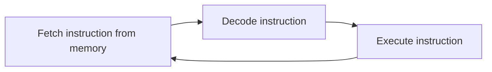
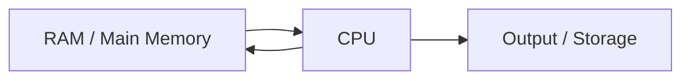

# Fetch-Decode-Execute Cycle

## 1. Lesson Goals

By the end of this lesson, students should be able to:

- explain what the fetch-decode-execute cycle is
- describe the main steps of the cycle
- explain the role of the Program Counter, MAR, MDR, and CIR during the cycle
- explain how the CPU communicates with memory
- describe the roles of the address bus, data bus, and control bus at a basic level
- explain how the Control Unit and ALU are used during instruction execution
- trace a simple instruction through the cycle
- explain why the cycle repeats continuously while a program is running
- avoid common misconceptions about instruction processing
- answer exam-style questions about the fetch-decode-execute cycle

---

## 2. Syllabus Mapping

| Item | Detail |
|---|---|
| Unit | A1 Computer Fundamentals |
| Label | SL Core |
| Main skill | Understanding how the CPU executes instructions |
| Connected topics | CPU components, primary memory, registers, buses, operating systems, machine instructions |
| Practical focus | Step-by-step tracing of instruction processing |
| Exam relevance | Process explanation, register roles, CPU-memory interaction, sequence questions |

::: tip Learning Focus
The fetch-decode-execute cycle is the repeated process the CPU uses to run program instructions. Students must understand the order and the role of CPU registers, not just memorize the phrase.
:::

---

## 3. Key Terms

| English Term | 中文解释 | Exam-style meaning |
|---|---|---|
| Fetch-decode-execute cycle | 取指-译码-执行周期 | Repeated process used by the CPU to process instructions |
| Fetch | 取指 | Get the next instruction from memory |
| Decode | 译码 | Interpret what the instruction means |
| Execute | 执行 | Carry out the instruction |
| CPU | 中央处理器 | Main processor that executes instructions |
| Main memory | 主存储器 | Memory storing currently running programs and data |
| RAM | 随机存取存储器 | Volatile main memory used while programs run |
| Program Counter | 程序计数器 | Holds the address of the next instruction |
| MAR | 存储器地址寄存器 | Holds the memory address currently being accessed |
| MDR | 存储器数据寄存器 | Holds data/instruction moving to or from memory |
| CIR | 当前指令寄存器 | Holds the current instruction being decoded/executed |
| Control Unit | 控制单元 | Decodes instructions and sends control signals |
| ALU | 算术逻辑单元 | Performs arithmetic and logic operations |
| Address bus | 地址总线 | Carries memory addresses |
| Data bus | 数据总线 | Carries data between CPU and memory |
| Control bus | 控制总线 | Carries control signals such as read/write |
| Clock cycle | 时钟周期 | One timing pulse used to coordinate CPU operations |

---

## 4. Concept Explanation

<LangBlock>
<template #cn>

### 中文讲解

**Fetch-decode-execute cycle** 是 CPU 执行程序指令时不断重复的过程。

当一个程序运行时，程序的指令通常会被加载到 RAM 中。  
CPU 会一条一条地从内存中取出指令，然后理解指令，再执行指令。

最基本过程是：

```text
Fetch → Decode → Execute
```

也可以理解为：

```text
取出指令 → 理解指令 → 执行指令
```

在这个过程中，几个寄存器非常重要：

```text
PC  保存下一条指令的地址
MAR 保存当前要访问的内存地址
MDR 保存从内存读出或写入内存的数据
CIR 保存当前正在译码或执行的指令
```

CPU 和 memory 之间还会通过 buses 传递信息：

```text
address bus 传递地址
data bus 传递数据
control bus 传递控制信号
```

简单来说：

```text
PC tells where the next instruction is
MAR sends the address to memory
MDR receives the instruction/data from memory
CIR holds the instruction for decoding
Control Unit decodes and controls
ALU may calculate or compare
```

</template>

<template #en>

### English Explanation

The **fetch-decode-execute cycle** is the repeated process used by the CPU to execute program instructions.

When a program runs, its instructions are usually loaded into RAM.  
The CPU gets each instruction from memory, understands it, and then carries it out.

The basic process is:

```text
Fetch → Decode → Execute
```

This means:

```text
get the instruction → understand the instruction → carry out the instruction
```

Several registers are important in this process:

```text
PC stores the address of the next instruction
MAR stores the memory address currently being accessed
MDR stores data being read from or written to memory
CIR stores the current instruction being decoded or executed
```

The CPU and memory also communicate through buses:

```text
address bus carries addresses
data bus carries data
control bus carries control signals
```

In simple terms:

```text
PC tells where the next instruction is
MAR sends the address to memory
MDR receives the instruction/data from memory
CIR holds the instruction for decoding
Control Unit decodes and controls
ALU may calculate or compare
```

</template>
</LangBlock>

---

## 5. Big Picture

When a program runs:

```text
1. Program instructions are loaded from storage into RAM.
2. CPU fetches the next instruction from RAM.
3. CPU decodes what the instruction means.
4. CPU executes the instruction.
5. CPU moves to the next instruction.
6. The cycle repeats.
```

### Simple Diagram



### Important

The cycle happens extremely quickly and repeatedly while programs are running.

---

## 6. Why the Cycle Is Needed

A program is made of instructions.

Example instructions may include:

```text
load a value
add two values
compare two values
store a result
jump to another instruction
output a value
```

The CPU cannot run the whole program all at once.  
It processes instructions step by step.

The fetch-decode-execute cycle gives the CPU a repeatable method for processing instructions.

---

## 7. CPU and Memory During the Cycle

The CPU works closely with main memory.

```text
Main memory stores instructions and data currently in use.
CPU fetches instructions and processes them.
```

### Simplified Flow

```text
RAM → CPU → RAM / output / storage
```

### Diagram



### Key Idea

The CPU usually fetches instructions from RAM, not directly from secondary storage.

---

## 8. Registers Used in the Cycle

| Register | Full Name | Role in the Cycle |
|---|---|---|
| PC | Program Counter | stores address of next instruction |
| MAR | Memory Address Register | stores address currently sent to memory |
| MDR | Memory Data Register | stores instruction/data transferred from/to memory |
| CIR | Current Instruction Register | stores instruction currently being decoded/executed |

### Quick Memory

```text
PC = next instruction address
MAR = address sent to memory
MDR = data/instruction from memory
CIR = current instruction
```

---

## 9. Step 1: Fetch

The fetch step gets the next instruction from memory.

### Typical Fetch Steps

```text
1. PC contains the address of the next instruction.
2. Address from PC is copied into MAR.
3. Control Unit sends a memory read signal.
4. Memory uses the address in MAR to find the instruction.
5. Instruction is copied from memory into MDR.
6. Instruction is copied from MDR into CIR.
7. PC is updated to point to the next instruction.
```

### Example

If:

```text
PC = 100
Memory[100] = LOAD A
```

Then after fetching:

```text
MAR = 100
MDR = LOAD A
CIR = LOAD A
PC = 101
```

::: tip Exam Phrase
During fetch, the address in the Program Counter is copied to the MAR, the instruction is read from memory into the MDR, and then copied to the CIR.
:::

---

## 10. Step 2: Decode

The decode step interprets the instruction.

The Control Unit examines the instruction in the CIR and works out:

```text
what operation is required
which data is needed
which registers or memory locations are involved
whether the ALU is needed
whether memory needs to be read or written
```

### Example

Instruction:

```text
ADD 5, 3
```

Decode means the CPU understands:

```text
operation = addition
operands = 5 and 3
ALU is needed
```

### Key Component

```text
Control Unit
```

The Control Unit is responsible for decoding and coordinating execution.

---

## 11. Step 3: Execute

The execute step carries out the instruction.

Depending on the instruction, execution may involve:

```text
ALU calculation
logical comparison
reading more data from memory
writing data to memory
changing the Program Counter
sending data to output
```

### Examples

| Instruction Type | Possible Execution |
|---|---|
| Add | ALU adds values |
| Compare | ALU compares values |
| Load | data is copied from memory/register |
| Store | result is written to memory |
| Jump | PC is changed to another address |
| Output | data is sent to output device/buffer |

### Example

Instruction:

```text
ADD 5, 3
```

Execution:

```text
ALU calculates 8
result stored in register or memory
```

---

## 12. Step 4: Repeat

After executing an instruction, the CPU repeats the cycle for the next instruction.

```text
Fetch next instruction
Decode it
Execute it
Repeat
```

This continues until:

```text
program finishes
program waits for input
operating system switches task
error occurs
system is turned off
```

### Important

The CPU can perform many cycles per second.  
This is related to clock speed.

---

## 13. Full Cycle Summary

| Stage | What Happens | Key Components |
|---|---|---|
| Fetch | Instruction is retrieved from memory | PC, MAR, MDR, CIR, memory |
| Decode | Instruction is interpreted | CIR, Control Unit |
| Execute | Instruction is carried out | Control Unit, ALU, registers, memory |
| Repeat | Next instruction is processed | PC, clock |

### Simple Version

```text
Fetch = get instruction
Decode = understand instruction
Execute = do instruction
```

---

## 14. Buses in the Cycle

Buses carry information between CPU, memory, and other components.

### Bus Types

| Bus | Carries | Example Use |
|---|---|---|
| Address bus | memory addresses | CPU sends address 100 to memory |
| Data bus | data/instructions | memory sends instruction to CPU |
| Control bus | control signals | CPU sends read or write signal |

### During Fetch

```text
address bus carries address from MAR to memory
control bus carries read signal
data bus carries instruction from memory to MDR
```

::: info Exam Level
You usually do not need to describe every electrical detail. Focus on the role of each bus.
:::

---

## 15. Example Trace 1: Simple Fetch

Assume:

```text
PC = 200
Memory[200] = LOAD 50
```

### Fetch Trace

| Step | Result |
|---|---|
| PC value copied to MAR | MAR = 200 |
| Memory read signal sent | control bus = READ |
| Instruction from Memory[200] copied to MDR | MDR = LOAD 50 |
| Instruction copied to CIR | CIR = LOAD 50 |
| PC updated | PC = 201 |

Now the CPU can decode:

```text
LOAD 50
```

---

## 16. Example Trace 2: Add Instruction

Assume the instruction in CIR is:

```text
ADD R1, R2
```

### Decode

The Control Unit interprets:

```text
operation = ADD
operands = R1 and R2
ALU is needed
```

### Execute

The ALU adds the values in R1 and R2.

Example:

```text
R1 = 5
R2 = 3
```

Result:

```text
8
```

The result may be stored in a register or memory depending on the instruction.

---

## 17. Example Trace 3: Jump Instruction

Some instructions change the normal order of execution.

Example:

```text
JUMP 500
```

### Normal Behaviour

Normally, after fetching address 200:

```text
PC = 201
```

### Jump Behaviour

If the instruction is:

```text
JUMP 500
```

then during execute:

```text
PC = 500
```

The next fetch will get the instruction at address 500.

### Why This Matters

Jumps are used for:

```text
loops
if statements
function calls
program branching
```

This connects CPU instruction processing to programming logic.

---

## 18. Fetch-Decode-Execute and Programming

High-level code like Java:

```java
if (score >= 50) {
    System.out.println("Pass");
}
```

is eventually translated into lower-level instructions.

The CPU may need to:

```text
load score
compare score with 50
jump depending on comparison result
output text
```

### Key Idea

The CPU does not directly understand Java source code.  
Java code must be compiled or interpreted into instructions that can be executed by the machine.

---

## 19. Clock and Cycle Timing

The CPU uses clock signals to coordinate operations.

A clock speed such as:

```text
3 GHz
```

means about:

```text
3 billion clock cycles per second
```

### Important

One machine instruction may take one or more clock cycles.  
A higher clock speed can help performance, but it is not the only factor.

Other factors include:

```text
CPU architecture
number of cores
cache size
RAM speed
software efficiency
```

---

## 20. Interrupts Preview

Sometimes the CPU must temporarily pause its current task to respond to another event.

Examples:

```text
keyboard input
mouse click
network data received
printer signal
timer event
hardware error
```

This is called an interrupt.

### Simple Idea

An interrupt tells the CPU:

```text
Something needs attention.
```

The CPU may save its current state, handle the interrupt, then return to the previous task.

::: info Preview Only
Interrupts may be covered more deeply later with operating systems. Here, students only need a basic awareness that the normal cycle can be interrupted.
:::

---

## 21. Worked Example: Running a Print Statement

Java code:

```java
System.out.println("Hello");
```

At a simplified level:

```text
1. The program is loaded into RAM.
2. CPU fetches an instruction.
3. Control Unit decodes the instruction.
4. CPU executes instructions that prepare output.
5. Output data is sent through the operating system to the screen.
6. The text "Hello" appears.
```

This involves:

```text
CPU
RAM
registers
Control Unit
ALU if needed
operating system
output device
```

---

## 22. Worked Example: Simple Calculation

Program:

```text
result = 5 + 3
```

Simplified CPU process:

```text
1. Fetch instruction to load 5.
2. Decode load instruction.
3. Execute by placing 5 in a register.
4. Fetch instruction to add 3.
5. Decode add instruction.
6. ALU calculates 5 + 3.
7. Result 8 is stored in a register or memory.
```

---

## 23. Common Mistakes

| Mistake | Why it is wrong | Better understanding |
|---|---|---|
| Thinking fetch means fetch from storage | CPU usually fetches from RAM/main memory | Program is loaded from storage to RAM first |
| PC stores the instruction | PC stores address of next instruction | CIR stores current instruction |
| MAR stores data | MAR stores memory address | MDR stores data/instruction |
| MDR stores memory address | MDR stores data moving to/from memory | MAR stores address |
| Decode means calculate | Decode means interpret instruction | ALU performs calculation in execute |
| Execute always means arithmetic | Execution depends on instruction | It may load, store, compare, jump, output |
| Cycle happens only once | It repeats continuously | One instruction after another |
| Control Unit does calculations | ALU calculates | CU controls/decodes |
| Address bus carries data | Address bus carries addresses | Data bus carries data |
| Higher clock speed always means faster program | Many factors affect performance | architecture, cache, cores, RAM, software also matter |

---

## 24. Guided Practice

### Practice 1: Order the Steps

Put these in order:

```text
execute
fetch
decode
```

<details>
<summary>Suggested Answer</summary>

```text
fetch → decode → execute
```

</details>

---

### Practice 2: Register Role

Which register stores the current instruction?

<details>
<summary>Suggested Answer</summary>

The CIR stores the current instruction being decoded or executed.

</details>

---

### Practice 3: PC Role

If the PC contains 300, what does this mean?

<details>
<summary>Suggested Answer</summary>

It means the next instruction to be fetched is stored at memory address 300.

</details>

---

### Practice 4: Bus Role

Which bus carries memory addresses?

<details>
<summary>Suggested Answer</summary>

The address bus carries memory addresses.

</details>

---

### Practice 5: Find the Mistake

A student says:

```text
The MAR stores the instruction fetched from memory.
```

Correct this.

<details>
<summary>Suggested Answer</summary>

The MAR stores the memory address being accessed.  
The instruction fetched from memory is held in the MDR and then copied to the CIR.

</details>

---

## 25. Independent Practice

### Question 1

Define fetch-decode-execute cycle.

### Question 2

Describe the fetch step.

### Question 3

Describe the decode step.

### Question 4

Describe the execute step.

### Question 5

Explain the role of the PC during the cycle.

### Question 6

Explain the roles of MAR, MDR, and CIR during fetch.

### Question 7

Explain the difference between the address bus and the data bus.

### Question 8

Trace this simplified example:

```text
PC = 120
Memory[120] = ADD R1, R2
```

What happens during fetch?

### Question 9

Explain how a jump instruction can change the Program Counter.

### Question 10

Explain why the CPU usually fetches instructions from RAM rather than directly from SSD.

---

## 26. Exam-style Questions

### Question 1 [4 marks]

Define the fetch-decode-execute cycle.

<details>
<summary>Mark Scheme Style Answer</summary>

The fetch-decode-execute cycle is the repeated process used by the CPU to process program instructions. The CPU fetches the next instruction from memory, decodes the instruction to determine what operation is required, and then executes the instruction.

</details>

---

### Question 2 [6 marks]

Describe the fetch stage of the fetch-decode-execute cycle.

<details>
<summary>Mark Scheme Style Answer</summary>

The Program Counter holds the address of the next instruction. This address is copied to the Memory Address Register. A memory read signal is sent, and the instruction at that address is copied from memory into the Memory Data Register. The instruction is then copied into the Current Instruction Register, and the Program Counter is updated to point to the next instruction.

</details>

---

### Question 3 [5 marks]

Explain the roles of the MAR and MDR.

<details>
<summary>Mark Scheme Style Answer</summary>

The Memory Address Register stores the address of the memory location currently being accessed. The Memory Data Register stores the data or instruction being transferred to or from memory. During a memory read, the MAR holds the address to read from, while the MDR receives the data or instruction from that address.

</details>

---

### Question 4 [6 marks]

Explain what happens during the decode and execute stages.

<details>
<summary>Mark Scheme Style Answer</summary>

During decode, the Control Unit interprets the instruction stored in the Current Instruction Register and determines what operation is required and what data or components are needed. During execute, the instruction is carried out. This may involve the ALU performing a calculation or comparison, data being read from or written to memory, output being produced, or the Program Counter being changed by a jump instruction.

</details>

---

### Question 5 [6 marks]

A student says: “The fetch-decode-execute cycle happens once when a program starts.” Explain why this is incorrect.

<details>
<summary>Mark Scheme Style Answer</summary>

This is incorrect because a program contains many instructions. The CPU uses the fetch-decode-execute cycle repeatedly, usually once for each instruction or part of an instruction sequence. After one instruction is executed, the CPU fetches the next instruction, and the cycle continues while the program is running.

</details>

---

## 27. Practice task
### Activity 1: Human Fetch-Decode-Execute

Students act as:

```text
PC
MAR
MDR
CIR
Control Unit
ALU
RAM
```

The class simulates fetching an instruction from memory and executing it.

---

### Activity 2: Register Matching

Match each register to its role:

```text
PC
MAR
MDR
CIR
```

Students must also explain why common wrong answers are wrong.

---

### Activity 3: Instruction Trace

Give groups a small memory table:

| Address | Instruction |
|---:|---|
| 100 | LOAD A |
| 101 | ADD B |
| 102 | STORE C |

Students trace:

```text
PC
MAR
MDR
CIR
```

for each instruction fetch.

---

## 28. Independent practice
### Independent practice part A: Process Explanation

In 6-8 sentences, explain the fetch-decode-execute cycle.

---

### Independent practice part B: Register Table

Complete a table for:

```text
PC
MAR
MDR
CIR
```

Include:

```text
full name
what it stores
how it is used during the cycle
```

---

### Independent practice part C: Misconception Correction

Correct these statements:

```text
The PC stores the current instruction.
The MAR stores data from memory.
The MDR stores memory addresses.
The Control Unit performs addition.
The cycle runs only once per program.
```

---

### Independent practice part D: Trace Task

Given:

```text
PC = 400
Memory[400] = LOAD X
```

Describe what happens during the fetch stage.

---

## 29. One-page Revision Summary

| Point | Summary |
|---|---|
| Fetch | Get next instruction from memory |
| Decode | Control Unit interprets instruction |
| Execute | Carry out instruction |
| PC | Address of next instruction |
| MAR | Memory address currently accessed |
| MDR | Data/instruction transferred to/from memory |
| CIR | Current instruction being decoded/executed |
| Control Unit | Decodes and coordinates operations |
| ALU | Performs calculations/comparisons |
| Address bus | Carries addresses |
| Data bus | Carries data |
| Control bus | Carries control signals |
| Cycle repeats | CPU processes many instructions |
| Exam phrase | The CPU repeatedly fetches instructions from memory, decodes them, and executes them |

---

## 30. Quick Self-test

Before moving on, students should be able to answer these:

1. What are the three main stages of the cycle?
2. What happens during fetch?
3. What happens during decode?
4. What happens during execute?
5. What does the PC store?
6. What does the MAR store?
7. What does the MDR store?
8. What does the CIR store?
9. Which bus carries addresses?
10. Why does the cycle repeat?

