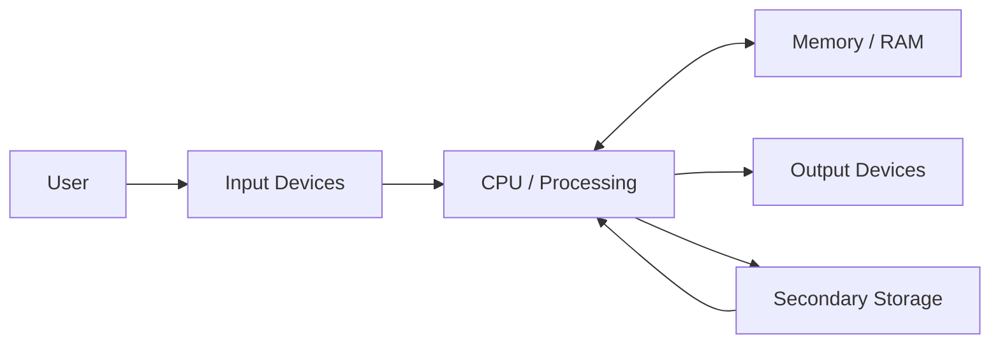

# Computer System Overview

## 1. Lesson Goals

By the end of this lesson, students should be able to:

- explain what a computer system is
- identify the main parts of a computer system
- distinguish hardware, software, data, and users
- explain the input-process-output-storage model
- describe how data flows through a computer system
- give examples of input, output, processing, memory, and storage
- explain why hardware and software must work together
- identify computer systems in everyday life
- avoid common beginner misconceptions about computer systems
- answer exam-style questions about computer system fundamentals

---

## 2. Syllabus Mapping

| Item | Detail |
|---|---|
| Unit | A1 Computer Fundamentals |
| Label | SL Core |
| Main skill | Understanding the whole computer system before studying individual components |
| Connected topics | Hardware, software, CPU, memory, storage, operating systems, embedded systems |
| Practical focus | Describing how input, processing, output, and storage work together |
| Exam relevance | Definitions, classification, system explanation, scenario questions |

::: tip Learning Focus
A computer is not only the screen or the CPU. A computer system includes hardware, software, data, and users working together to input, process, output, and store data.
:::

---

## 3. Key Terms

| English Term | 中文解释 | Exam-style meaning |
|---|---|---|
| Computer system | 计算机系统 | A combination of hardware, software, data, and users working together |
| Hardware | 硬件 | Physical parts of a computer system |
| Software | 软件 | Programs and instructions that tell hardware what to do |
| Data | 数据 | Raw facts or values processed by the computer |
| User | 用户 | A person or another system that interacts with the computer |
| Input | 输入 | Data entered into a computer system |
| Processing | 处理 | Changing or using data to produce a result |
| Output | 输出 | Information produced by the computer system |
| Storage | 存储 | Saving data, programs, or files for later use |
| CPU | 中央处理器 | Main processor that executes instructions |
| Memory | 内存 | Fast working area used while programs are running |
| Secondary storage | 辅助存储 | Long-term storage such as SSD, HDD, USB drive |
| Operating system | 操作系统 | System software that manages hardware and provides services |
| Application software | 应用软件 | Software used to perform user tasks |
| System software | 系统软件 | Software that manages or supports the computer system |
| IPO model | 输入-处理-输出模型 | Input, Processing, Output model |

---

## 4. Concept Explanation

<LangBlock>
<template #cn>

### 中文讲解

**Computer system（计算机系统）** 不是单独指显示器，也不是单独指主机。  
它是由多个部分一起组成的系统：

```text
hardware
software
data
users
```

例如一台学生电脑运行浏览器和编程 IDE 时：

```text
keyboard / mouse 输入数据
CPU 处理指令
RAM 临时保存正在运行的程序和数据
SSD 长期保存文件和软件
screen 显示结果
operating system 管理硬件和程序
user 控制和使用系统
```

计算机系统最基本的工作模式可以用 **IPO model** 表示：

```text
Input → Processing → Output
```

很多时候还要加上：

```text
Storage
```

所以更完整的理解是：

```text
Input → Processing → Output
           ↓
        Storage
```

简单来说：

```text
input = enter data
processing = CPU and software work on data
output = show or produce result
storage = save data for later
```

</template>

<template #en>

### English Explanation

A **computer system** does not only mean the monitor, and it does not only mean the computer case.  
It is a system made of several parts working together:

```text
hardware
software
data
users
```

For example, when a student laptop runs a browser and a programming IDE:

```text
keyboard / mouse enter data
CPU processes instructions
RAM temporarily stores running programs and data
SSD stores files and software long term
screen displays results
operating system manages hardware and programs
user controls and uses the system
```

The most basic working model of a computer system can be shown using the **IPO model**:

```text
Input → Processing → Output
```

Often, we also include:

```text
Storage
```

So a more complete understanding is:

```text
Input → Processing → Output
           ↓
        Storage
```

In simple terms:

```text
input = enter data
processing = CPU and software work on data
output = show or produce result
storage = save data for later
```

</template>
</LangBlock>

---

## 5. What Is a Computer System?

A computer system is a set of connected parts that work together to process data.

### Main Parts

```text
hardware
software
data
users
```

| Part | Meaning | Example |
|---|---|---|
| Hardware | Physical components | CPU, RAM, SSD, keyboard, screen |
| Software | Programs and instructions | operating system, browser, IDE |
| Data | Raw values being used | text, images, numbers, files |
| User | Person or system using it | student, teacher, admin, another computer |

### Important

A computer system needs both hardware and software.

Hardware without software:

```text
physical machine with nothing useful to run
```

Software without hardware:

```text
instructions with nowhere to execute
```

::: tip Exam Phrase
A computer system consists of hardware and software working together to input, process, output, and store data.
:::

---

## 6. IPO Model

The IPO model stands for:

```text
Input → Processing → Output
```

### Example: Calculator App

| Stage | Example |
|---|---|
| Input | User enters `5 + 3` |
| Processing | CPU and software calculate the result |
| Output | Screen displays `8` |

### Example: Search Engine

| Stage | Example |
|---|---|
| Input | User types search keywords |
| Processing | Server searches database and ranks results |
| Output | Browser displays search results |

### Storage Extension

Many systems also store data:

```text
Input → Processing → Output
           ↓
        Storage
```

Example:

```text
A student types an essay.
The computer processes keystrokes.
The screen shows the essay.
The file is saved to storage.
```

---

## 7. Data Flow in a Computer System

### General Flow

```text
User
  ↓
Input device
  ↓
CPU / Processing
  ↔
Memory
  ↓
Output device
  ↓
Storage when saved
```

### Mermaid Diagram



### Explanation

| Component | Role |
|---|---|
| User | gives instructions or provides data |
| Input device | enters data into the system |
| CPU | processes instructions and data |
| RAM | temporarily holds running programs and data |
| Output device | shows or produces the result |
| Storage | saves files and programs long term |

---

## 8. Hardware

Hardware means the physical parts of a computer system.

### Examples

| Category | Examples |
|---|---|
| Input hardware | keyboard, mouse, scanner, microphone |
| Output hardware | monitor, printer, speaker |
| Processing hardware | CPU, GPU |
| Memory hardware | RAM, cache, ROM |
| Storage hardware | SSD, HDD, USB drive |
| Network hardware | router, network card |

### Key Idea

If you can physically touch it, it is usually hardware.

But do not oversimplify too much.  
Data stored on a drive is not hardware itself; the drive is hardware.

---

## 9. Software

Software means programs and instructions.

### Main Types

```text
system software
application software
```

### System Software

System software manages or supports the computer system.

Examples:

```text
operating system
device drivers
utility software
```

### Application Software

Application software helps users perform tasks.

Examples:

```text
web browser
word processor
spreadsheet
game
programming IDE
media player
```

### Comparison

| System Software | Application Software |
|---|---|
| manages/supports the computer | helps user complete tasks |
| often runs in background | usually directly used by user |
| example: operating system | example: browser |
| example: device driver | example: word processor |

---

## 10. Data

Data is raw facts or values used by the computer.

Examples:

```text
text typed by a user
numbers in a spreadsheet
pixels in an image
audio samples
sensor readings
student records
program code
```

Data can be:

```text
input
processed
stored
output as information
transmitted over networks
```

### Example

A student types:

```text
print("Hello")
```

This text is data.  
The IDE displays it, the file system stores it, and the compiler/interpreter may process it later.

---

## 11. Users

A user is a person or another system that interacts with the computer system.

Examples:

```text
student using a laptop
teacher entering marks
bank customer using ATM
driver using car navigation
doctor using hospital database
another computer sending data
```

### Human and Non-human Users

Sometimes the "user" is not a person.

Example:

```text
A weather sensor sends data to a computer system.
```

The sensor acts as a data source.

---

## 12. Input, Processing, Output, and Storage

| Stage | Meaning | Examples |
|---|---|---|
| Input | data enters the system | keyboard, mouse, sensor |
| Processing | data is used or changed | CPU calculations, searching, sorting |
| Output | result is produced | screen, printer, speaker |
| Storage | data is saved | SSD, HDD, cloud storage |

### Key Idea

Processing is not only mathematics.  
It can include searching, sorting, comparing, converting, rendering, and decision making.

---

## 13. Worked Example: Student Laptop

A student opens a programming IDE and runs a Java program.

| Part | Role |
|---|---|
| User | opens IDE and writes code |
| Keyboard | inputs code |
| SSD | stores IDE, Java files, and project files |
| RAM | holds IDE and code while running |
| CPU | executes instructions |
| Operating system | manages memory, files, input/output devices |
| Screen | displays IDE, code, and output |

### Data Flow

```text
keyboard input
→ IDE receives text
→ RAM stores active program data
→ CPU processes commands
→ screen displays code/output
→ SSD saves project file
```

---

## 14. Worked Example: Web Browser

A student opens a website.

| Stage | Example |
|---|---|
| Input | user types URL or clicks link |
| Processing | browser sends request and renders page |
| Network | data is sent and received |
| Memory | webpage data is temporarily stored |
| Output | webpage appears on screen |
| Storage | browser may save cache, cookies, downloads |

### Important

Even a simple action like opening a website uses many parts of the computer system.

---

## 15. Worked Example: ATM

An ATM is also a computer system.

| Part | Example |
|---|---|
| Input | keypad, card reader, touchscreen |
| Processing | checks PIN, communicates with bank server |
| Output | screen message, printed receipt, cash |
| Storage | transaction records in bank database |
| Hardware | cash dispenser, screen, keypad |
| Software | ATM program and operating system |
| Data | account number, transaction amount |
| User | bank customer |

The ATM example shows that computer systems are not only laptops or desktops.

---

## 16. General-purpose vs Dedicated Systems Preview

### General-purpose Computer

A general-purpose computer can perform many different tasks.

Examples:

```text
laptop
desktop PC
smartphone
tablet
```

Tasks:

```text
browse web
write documents
play games
program
edit images
```

### Dedicated / Embedded System

A dedicated system is designed for a specific purpose.

Examples:

```text
washing machine controller
traffic light system
microwave oven
car engine control unit
smart thermostat
```

This will be studied more deeply in the Embedded Systems page.

---

## 17. Hardware and Software Working Together

A computer system only works when hardware and software cooperate.

### Example: Printing a Document

| Step | Component |
|---|---|
| User clicks print | application software |
| OS sends print job | operating system |
| Printer driver translates instructions | system software |
| Printer receives data | hardware |
| Paper output is produced | output hardware |

### Key Idea

Software gives instructions.  
Hardware physically carries out the instructions.

---

## 18. Common Computer Systems

| System | Input | Processing | Output | Storage |
|---|---|---|---|---|
| Laptop | keyboard, mouse | CPU | screen, speakers | SSD |
| Smartphone | touchscreen, camera | mobile processor | screen, speaker | flash storage |
| ATM | card reader, keypad | transaction processing | screen, cash, receipt | bank database |
| Game console | controller | CPU/GPU | TV display, sound | internal storage |
| Smart watch | sensors, buttons | processor | screen, vibration | flash storage |
| Traffic lights | sensors/timer | controller | lights | small program memory |

---

## 19. Common Mistakes

| Mistake | Why it is wrong | Better understanding |
|---|---|---|
| Computer means only monitor | Monitor is only output hardware | Computer system has many parts |
| CPU is the whole computer | CPU is one processing component | System includes CPU, memory, storage, software, etc. |
| Hardware means only inside the case | Hardware includes input/output devices too | Keyboard and screen are hardware |
| Software means only apps | OS and utilities are also software | Software includes system and application software |
| RAM stores files permanently | RAM is temporary working memory | Files are stored on secondary storage |
| Storage and memory are the same | They have different roles | Memory is working area; storage is long-term |
| Input and data are the same | Input is data entering system | Data can also be stored or output |
| Output is always on screen | Output can be sound, print, movement | Many output forms exist |
| User must always be human | Another system/sensor may interact | User/data source can be non-human |
| IPO ignores storage | Basic IPO shows flow, but real systems often store data | Add storage when explaining real systems |

---

## 20. Guided Practice

### Practice 1: Identify the Parts

A student uses a laptop to write an essay.

Identify:

1. one input device
2. one output device
3. one storage device
4. one example of software

<details>
<summary>Suggested Answer</summary>

1. Input device: keyboard
2. Output device: screen
3. Storage device: SSD
4. Software: word processor or operating system

</details>

---

### Practice 2: Hardware or Software?

Classify each item.

```text
keyboard
operating system
web browser
RAM
printer
antivirus utility
```

<details>
<summary>Suggested Answer</summary>

| Item | Type |
|---|---|
| keyboard | hardware |
| operating system | software |
| web browser | software |
| RAM | hardware |
| printer | hardware |
| antivirus utility | software |

</details>

---

### Practice 3: IPO Model

A user enters two numbers into a calculator app and sees the result.

Identify input, processing, and output.

<details>
<summary>Suggested Answer</summary>

Input: the two numbers and operation entered by the user.  
Processing: the CPU and calculator app calculate the result.  
Output: the result displayed on the screen.

</details>

---

### Practice 4: Memory or Storage?

Where is a saved project file kept after the computer is turned off?

<details>
<summary>Suggested Answer</summary>

It is kept in secondary storage, such as an SSD or HDD, because storage keeps data long term.

</details>

---

### Practice 5: System Explanation

Why does a computer need both hardware and software?

<details>
<summary>Suggested Answer</summary>

Hardware provides the physical components that can input, process, output, and store data. Software provides the instructions that tell the hardware what to do. Without software, hardware cannot perform useful tasks; without hardware, software cannot run.

</details>

---

## 21. Independent Practice

### Question 1

Define computer system.

### Question 2

Explain the difference between hardware and software.

### Question 3

Give three examples of hardware and three examples of software.

### Question 4

Explain the IPO model using a school printer example.

### Question 5

A student opens a browser and downloads a PDF. Identify input, processing, output, and storage.

### Question 6

Explain why RAM and SSD do not have the same role.

### Question 7

Classify each as input, output, processing, memory, or storage:

```text
CPU
RAM
keyboard
monitor
SSD
microphone
printer
```

### Question 8

Explain how hardware, software, data, and users interact in an ATM.

### Question 9

Give two examples of general-purpose computers and two examples of dedicated or embedded systems.

### Question 10

Explain why “the CPU is the computer” is not an accurate statement.

---

## 22. Exam-style Questions

### Question 1 [4 marks]

Define computer system and give two components of a computer system.

<details>
<summary>Mark Scheme Style Answer</summary>

A computer system is a combination of hardware, software, data, and users working together to input, process, output, and store data. Components include hardware such as CPU or keyboard, software such as the operating system, data, and users.

</details>

---

### Question 2 [4 marks]

Distinguish between hardware and software.

<details>
<summary>Mark Scheme Style Answer</summary>

Hardware is the physical part of a computer system that can be touched, such as the CPU, keyboard, RAM, or monitor. Software is the set of programs and instructions that tell the hardware what to do, such as the operating system or a web browser.

</details>

---

### Question 3 [5 marks]

Explain the input-process-output model using a calculator app.

<details>
<summary>Mark Scheme Style Answer</summary>

The input is the numbers and operation entered by the user, such as 5 + 3. The processing is the calculation performed by the CPU under the control of the calculator software. The output is the result, such as 8, displayed on the screen.

</details>

---

### Question 4 [6 marks]

A student uses a laptop to write and save a document. Explain how hardware and software are involved.

<details>
<summary>Mark Scheme Style Answer</summary>

The keyboard is hardware used to input text. The word processor is application software used to create and edit the document. The CPU processes instructions, while RAM temporarily stores the program and document while they are being used. The operating system manages files and hardware resources. When the student saves the document, it is stored on secondary storage such as an SSD.

</details>

---

### Question 5 [6 marks]

Explain why storage and memory are not the same thing.

<details>
<summary>Mark Scheme Style Answer</summary>

Memory, such as RAM, is used as a fast working area while programs are running. It temporarily stores active programs and data needed by the CPU. Storage, such as an SSD or HDD, stores files, programs, and data long term. RAM is usually volatile, so its contents are lost when power is off, while secondary storage is non-volatile.

</details>

---

## 23. Classroom Activity

### Activity 1: Computer System Sorting

Give students cards:

```text
CPU
RAM
SSD
keyboard
monitor
operating system
browser
student data
user
```

Students sort them into:

```text
hardware
software
data
user
```

---

### Activity 2: IPO Role-play

Students act as:

```text
user
keyboard
CPU
RAM
screen
storage
```

They simulate typing and saving a document.

---

### Activity 3: Everyday Computer Systems

Groups choose one system:

```text
ATM
smartphone
traffic lights
game console
school printer
self-checkout machine
```

They identify:

```text
input
processing
output
storage
hardware
software
data
user
```

---

## 24. Homework

### Homework Part A: Concept Explanation

In 5-6 sentences, explain what a computer system is. Include hardware, software, data, and users.

---

### Homework Part B: IPO Scenario

Choose one system:

```text
ATM
online shopping website
game console
school attendance system
```

Explain its:

```text
input
processing
output
storage
```

---

### Homework Part C: Classification Table

Create a table with 12 items and classify each as:

```text
hardware
software
data
user
```

At least 5 items must be hardware and at least 3 must be software.

---

### Homework Part D: Written Answer

Explain why a computer needs both memory and storage.

---

## 25. One-page Revision Summary

| Point | Summary |
|---|---|
| Computer system | Hardware, software, data, and users working together |
| Hardware | Physical components |
| Software | Programs and instructions |
| Data | Raw values processed or stored by computer |
| User | Person or system interacting with computer |
| Input | Data entered into system |
| Processing | CPU/software work on data |
| Output | Result produced by system |
| Storage | Data saved for later use |
| IPO model | Input → Processing → Output |
| RAM | Temporary working memory |
| Secondary storage | Long-term file/program storage |
| System software | Manages/supports computer system |
| Application software | Helps user complete tasks |
| Exam phrase | A computer system uses hardware and software to input, process, output, and store data |

---

## 26. Quick Self-test

Before moving on, students should be able to answer these:

1. What is a computer system?
2. What is hardware?
3. What is software?
4. What is data?
5. What is a user?
6. What does IPO stand for?
7. Give one input device.
8. Give one output device.
9. Why is RAM different from storage?
10. Why do hardware and software need each other?
