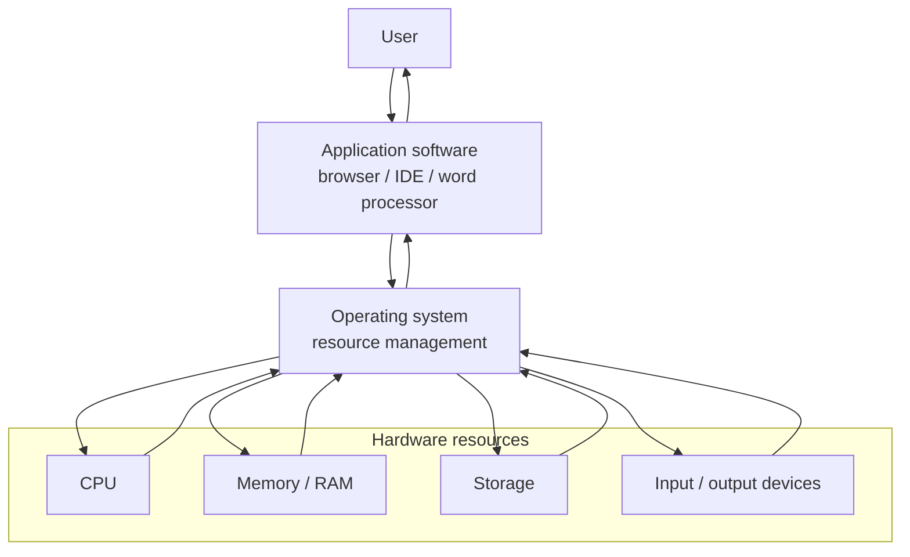
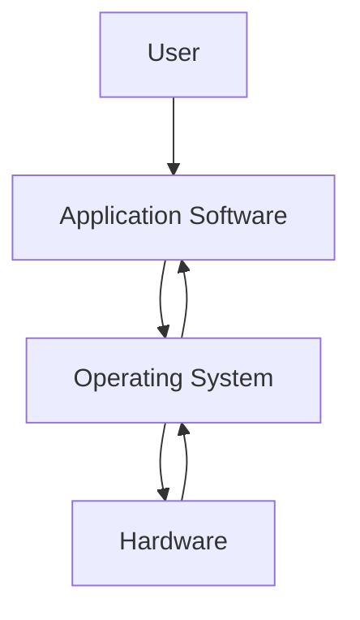

# Operating Systems

## Page map

- [Lesson goals](#1-lesson-goals)
- [Syllabus mapping](#2-syllabus-mapping)
- [Core checklist](#core-checklist)
- [Key terms and detailed lesson](#3-key-terms)

---

## 1. Lesson Goals

By the end of this lesson, students should be able to:

- define operating system
- explain why a computer needs an operating system
- distinguish system software and application software
- describe key functions of an operating system
- explain user interface, file management, memory management, process management, device management, and security management
- explain how an operating system manages hardware resources
- explain multitasking at a basic level
- explain the role of device drivers
- compare command-line interface and graphical user interface
- apply operating system functions to real-world scenarios
- avoid common misconceptions about operating systems
- answer exam-style questions about operating systems

---

## 2. Syllabus Mapping

| Item | Detail |
|---|---|
| Unit | A1 Computer Fundamentals |
| Label | SL Core |
| Main skill | Understanding how system software manages computer resources |
| Connected topics | Hardware, CPU, memory, storage, utility software, security, user interfaces |
| Practical focus | Explaining OS functions using everyday computer scenarios |
| Exam relevance | Definitions, function explanation, comparison, scenario questions |

::: tip Learning Focus
An operating system is not just the desktop screen. It is system software that manages hardware, software, files, memory, processes, devices, users, and security.
:::

---

## Start here: the OS manages the computer system

An **operating system** is **system software** that manages the computer's hardware and software resources. It acts as an interface between the **user**, **application software**, **hardware**, and system resources.

When a student opens a browser, saves a file, prints a document, or logs in to a school computer, the OS is coordinating many parts of the system in the background.

Core keywords for this page: **operating system**, **user interface**, **resource management**, **memory management**, **processor scheduling**, **file management**, **device management**, and **security**.

---

## Core checklist

By the end of this page, you should be able to:

- define **operating system**
- describe the main functions of an OS
- explain why a computer needs an OS
- distinguish **system software** from **application software**
- explain how the OS manages memory, CPU time, files, devices, and users
- apply OS functions to school, hospital, business, and personal computer scenarios

---

## Main OS functions exam table

| Function | 简单中文解释 | English mark-scheme phrase | Simple example |
|---|---|---|---|
| User interface | 让用户和电脑交互 | Provides a way for the user to interact with the computer | GUI desktop or CLI terminal |
| Memory management | 分配和回收主存/RAM | Allocates and frees main memory for running programs | Browser and IDE each receive RAM |
| Processor / CPU scheduling | 分配 CPU 时间给进程 | Decides which process receives CPU time | Video call and browser take turns using CPU time |
| File management | 管理文件和文件夹 | Organizes files, folders, metadata, and permissions | Saving a document in a folder |
| Device / peripheral management | 管理输入输出设备 | Uses drivers to communicate with hardware devices | Sending a print job to a printer |
| Security and access control | 控制谁能访问资源 | Controls user access to protected files, settings, and resources | Student cannot delete system files |
| User management | 管理用户账户和权限 | Manages user accounts, roles, and permissions | Admin account can install software |
| Error handling | 检测并处理错误 | Detects errors and responds to system or program problems | Warning when a printer is unavailable |
| Utility support | 支持维护和系统工具 | Supports utilities for maintenance, backup, updates, and monitoring | Task Manager shows CPU and memory use |

---

## System software vs application software

| Comparison point | System software | Application software |
|---|---|---|
| Purpose | Manages or supports the computer system | Helps users perform specific tasks |
| Examples | Operating system, device drivers, utilities, firmware | Browser, word processor, spreadsheet, game, IDE |
| Relationship with hardware | Works close to hardware and system resources | Uses hardware through the OS |
| Relationship with user tasks | Provides the platform for tasks | Performs the task the user wants |
| Common exam phrase | "System software manages hardware and supports application software." | "Application software allows users to perform specific tasks." |

The OS is system software. A browser or word processor is application software because it runs on top of the OS to do a user task.

---

## Multitasking and CPU scheduling

Several programs may appear to run at the same time, such as a browser, video call, music app, and IDE.

The OS manages this by:

- allocating **CPU time** to running processes
- using **scheduling** to decide which process runs next
- switching quickly between processes so the system feels responsive
- managing memory so programs do not interfere with each other

On a single-core CPU, programs are not literally all executing at exactly the same instant. The OS switches CPU time between them very quickly. On multi-core CPUs, some processes can run in parallel, but the OS still manages scheduling.

---

## Memory management

Programs and data must be loaded into **main memory (RAM)** before the CPU can execute them.

The OS manages memory by:

- tracking which memory locations are in use
- allocating memory to programs when they start
- freeing memory when programs close
- protecting memory so one process does not change another process's data
- using virtual memory if RAM is low

Example: if a student opens a browser and an IDE, the OS allocates RAM to both and keeps their data separate.

---

## File and device management

### File management

The OS file system organizes files and folders. It stores metadata such as:

```text
file name
file size
file type
file location
permissions
created/modified date
```

This lets users save, open, rename, move, delete, search, and protect files.

### Device management

The OS communicates with hardware devices using **device drivers**. A driver is software that translates OS requests into instructions the device can understand.

Student-friendly examples:

- a keyboard sends input to the OS
- a mouse moves the pointer
- a storage device saves files
- a printer uses a driver and print queue
- a webcam and microphone are controlled for a video call

---

## Operating system interface diagram



The user normally works through application software. The application asks the OS for access to hardware resources such as CPU time, memory, storage, and input/output devices.

---

## Exam focus

| Command term | What to write |
|---|---|
| State | Give the term or one short definition. |
| Identify | Pick the correct OS function from a scenario. |
| Outline | Give the main idea plus one relevant detail. |
| Describe | Explain what the OS function does using correct keywords. |
| Explain | Link the OS function to why it is needed in the scenario. |
| Compare | Give paired differences, such as system software vs application software. |

For mark levels:

- **1 mark:** give one correct term or function.
- **2 marks:** define a term and give one example.
- **3 marks:** describe a function using a correct OS keyword.
- **4 marks:** explain two functions or one function with clear scenario detail.
- **6 marks:** combine definition, multiple OS functions, resource examples, and scenario-specific explanation.

Avoid vague answers such as:

```text
the OS runs the computer
the OS stores files
the OS makes the computer faster
```

Better answers name the exact function, such as file management, memory management, processor scheduling, device management, or access control, then explain what it does.

---

## Reusable mark-scheme style phrases

- "An operating system is system software that manages hardware and software resources."
- "The OS provides an interface between the user and the computer system."
- "Memory management allocates and frees main memory for running programs."
- "Processor scheduling decides which process receives CPU time."
- "File management organizes files and controls access permissions."
- "Device drivers allow the OS to communicate with peripheral devices."
- "Access control helps prevent unauthorized users from using protected resources."
- "The OS allows application software to use hardware resources without controlling the hardware directly."

---

## Common mistakes table

| Mistake | Why it is wrong | Better understanding |
|---|---|---|
| Confusing operating system with application software | The OS supports and manages the system; apps perform user tasks | Windows is an OS; Word is an application |
| Saying the OS is the same as the CPU | The CPU is hardware; the OS is software that manages CPU time | The OS schedules processes for the CPU |
| Saying memory management means secondary storage only | Memory management mainly refers to RAM/main memory | Storage management and memory management are different |
| Forgetting device drivers | Drivers are needed for OS-device communication | A printer driver helps the OS control the printer |
| Saying multitasking means a single-core CPU runs all programs at exactly the same instant | On one core, the OS switches CPU time rapidly | Scheduling makes tasks appear to run together |
| Confusing file management with database management | File management organizes files/folders; databases organize related data in tables | Saving a file is not the same as querying a database |
| Forgetting security/access control as an OS function | The OS manages users, permissions, and protected resources | Login and file permissions are OS functions |
| Writing examples without explaining the function | Examples alone may not earn full marks | Name the function and explain what it manages |

---

## Quick-check questions with short answers

1. What is an operating system?  
   **Answer:** System software that manages hardware and software resources.

2. Why does a computer need an OS?  
   **Answer:** To provide a controlled way for users and applications to use hardware resources.

3. Is a browser system software or application software?  
   **Answer:** Application software.

4. What is memory management?  
   **Answer:** Allocating, tracking, protecting, and freeing main memory for running programs.

5. What is processor scheduling?  
   **Answer:** Deciding which process receives CPU time.

6. What does file management do?  
   **Answer:** Organizes files/folders and manages metadata and permissions.

7. What is a device driver?  
   **Answer:** Software that allows the OS to communicate with a hardware device.

8. What is access control?  
   **Answer:** Controlling which users can access protected files, settings, or resources.

9. What is multitasking?  
   **Answer:** Allowing multiple tasks to run or appear to run by sharing CPU time.

10. Give one OS function used when printing.  
    **Answer:** Device management, because the OS uses a driver and print queue to communicate with the printer.

---

## Exam-style practice: operating systems

### Question A [6 marks]

Describe three main functions of an operating system.

<details>
<summary>Mark Scheme Style Answer</summary>

An operating system manages memory by allocating RAM to running programs and freeing it when programs close. It manages processor scheduling by deciding which process receives CPU time, allowing several programs to appear to run at the same time. It also manages files by organizing files and folders, storing metadata, and controlling permissions. Other valid functions include device management, user interface, security/access control, user management, and error handling.

</details>

---

### Question B [6 marks]

Compare system software and application software.

<details>
<summary>Mark Scheme Style Answer</summary>

System software manages or supports the computer system and works close to hardware resources. Examples include an operating system, device drivers, and utility software. Application software helps users perform specific tasks, such as browsing the web, writing documents, or editing images. Application software usually runs on top of system software and uses hardware through the OS. The OS is needed to manage resources, while applications are chosen for user tasks.

</details>

---

### Question C [6 marks]

A student has a browser, video call, music player, and IDE open at the same time. Explain how the operating system manages resources in this situation.

<details>
<summary>Mark Scheme Style Answer</summary>

The OS manages processor scheduling by allocating CPU time to each running process and switching between them quickly. It manages memory by allocating RAM to the browser, video call, music player, and IDE while keeping their memory areas separate. It manages devices such as the microphone, camera, speakers, keyboard, mouse, and screen, using drivers where needed. It also manages files and network access if the student downloads files or uses the video call. This allows the programs to run safely without each program controlling the hardware directly.

</details>

---

## 3. Key Terms

| English Term | 中文解释 | Exam-style meaning |
|---|---|---|
| Operating system | 操作系统 | System software that manages hardware and software resources |
| System software | 系统软件 | Software that manages or supports the computer system |
| Application software | 应用软件 | Software used by users to perform tasks |
| User interface | 用户界面 | Way users interact with the computer |
| GUI | 图形用户界面 | Interface using windows, icons, menus, and pointer |
| CLI | 命令行界面 | Interface where users type commands |
| File management | 文件管理 | Organizing, storing, naming, moving, and deleting files |
| Memory management | 内存管理 | Allocating and tracking RAM use |
| Process management | 进程管理 | Managing running programs and CPU time |
| Device management | 设备管理 | Managing input/output devices and hardware communication |
| Device driver | 设备驱动程序 | Software that allows the OS to communicate with hardware |
| Security management | 安全管理 | Controlling users, permissions, passwords, and access |
| Multitasking | 多任务处理 | Running or switching between multiple tasks |
| Resource management | 资源管理 | Managing CPU, memory, storage, and devices |
| Booting | 启动 | Starting the computer and loading the operating system |
| Kernel | 内核 | Core part of the OS that manages system resources |

---

## 4. Concept Explanation

<LangBlock>
<template #cn>

### 中文讲解

**Operating system（操作系统）** 是一种 system software。  
它的主要作用是管理计算机的硬件和软件资源，并为用户和应用程序提供一个可用的环境。

常见操作系统包括：

```text
Windows
macOS
Linux
Android
iOS
```

很多学生会以为操作系统只是桌面、窗口和图标。  
其实 GUI 只是操作系统提供给用户的一种 interface。操作系统还在后台做很多事情：

```text
管理 CPU 时间
管理 RAM
管理文件和文件夹
管理输入输出设备
管理用户账户和权限
提供安全保护
运行和关闭程序
```

例如你打开浏览器和 IntelliJ IDEA 时：

```text
OS 把程序从 SSD 加载到 RAM
OS 分配内存
OS 让 CPU 在不同程序之间切换
OS 管理键盘、鼠标、屏幕和网络设备
OS 允许你保存和打开文件
```

简单来说：

```text
operating system = manager of the computer system
```

</template>

<template #en>

### English Explanation

An **operating system** is a type of system software.  
Its main role is to manage the computer's hardware and software resources and provide a usable environment for users and applications.

Common operating systems include:

```text
Windows
macOS
Linux
Android
iOS
```

Many students think the operating system is only the desktop, windows, and icons.  
Actually, the GUI is only one interface provided by the operating system. The OS also does many things in the background:

```text
manages CPU time
manages RAM
manages files and folders
manages input/output devices
manages user accounts and permissions
provides security protection
starts and stops programs
```

For example, when you open a browser and IntelliJ IDEA:

```text
the OS loads programs from SSD into RAM
the OS allocates memory
the OS lets the CPU switch between programs
the OS manages keyboard, mouse, screen, and network devices
the OS lets you save and open files
```

In simple terms:

```text
operating system = manager of the computer system
```

</template>
</LangBlock>

---

## 5. What Is an Operating System?

An operating system is system software that manages a computer system.

It provides a link between:

```text
user
application software
hardware
```

### Simple Diagram



### Examples of Operating Systems

```text
Windows
macOS
Linux
ChromeOS
Android
iOS
```

### Important

An operating system is required for most general-purpose computers because users and applications need a controlled way to use hardware resources.

::: tip Exam Phrase
An operating system is system software that manages hardware and software resources and provides an interface between the user, applications, and hardware.
:::

---

## 6. Why a Computer Needs an Operating System

Without an operating system, the user and application programs would have to control hardware directly.

This would be difficult because the system must manage:

```text
CPU time
memory allocation
file storage
input/output devices
security
user accounts
network communication
running programs
```

### Example

When you open a document, the operating system helps to:

```text
find the file in storage
load the application
allocate RAM
display the window
receive keyboard/mouse input
save changes back to storage
```

The user does not need to manually control the CPU, RAM, SSD, and screen.

---

## 7. System Software vs Application Software

### System Software

System software manages or supports the computer system.

Examples:

```text
operating system
device drivers
utility software
firmware
```

### Application Software

Application software helps users perform tasks.

Examples:

```text
web browser
word processor
spreadsheet
game
programming IDE
media player
```

### Comparison Table

| System Software | Application Software |
|---|---|
| manages/supports the computer system | helps users perform tasks |
| usually closer to hardware | usually closer to user tasks |
| example: operating system | example: web browser |
| example: device driver | example: word processor |
| needed for system operation | installed for specific tasks |

---

## 8. Main Functions of an Operating System

Common operating system functions include:

```text
user interface
file management
memory management
process management
device management
security management
resource management
network management
error handling
```

### Overview Table

| Function | Purpose |
|---|---|
| User interface | allows user interaction |
| File management | organizes files and folders |
| Memory management | controls RAM allocation |
| Process management | manages running programs |
| Device management | controls hardware devices |
| Security management | protects users, files, and system access |
| Network management | handles network communication |
| Error handling | detects and responds to problems |

---

## 9. User Interface

The user interface lets the user interact with the computer.

Two common types are:

```text
GUI
CLI
```

### GUI

GUI stands for Graphical User Interface.

It uses:

```text
windows
icons
menus
pointer
buttons
drag and drop
```

Examples:

```text
Windows desktop
macOS Finder
phone home screen
```

### CLI

CLI stands for Command Line Interface.

It uses typed commands.

Examples:

```text
Command Prompt
PowerShell
Terminal
Linux shell
```

---

## 10. GUI vs CLI

| Feature | GUI | CLI |
|---|---|---|
| Interaction | windows, icons, menus, pointer | typed commands |
| Ease for beginners | usually easier | usually harder |
| Speed for experts | can be slower for repeated tasks | can be very fast for experts |
| Resource use | often uses more resources | often uses fewer resources |
| Automation | possible but less direct | strong for scripts |
| Example | desktop interface | terminal |

### Balanced View

GUI is usually easier for general users.  
CLI can be powerful for advanced users, programmers, and system administrators.

---

## 11. File Management

The operating system manages files and folders.

It allows users to:

```text
create files
open files
save files
copy files
move files
rename files
delete files
organize folders
search for files
set file permissions
```

### Example

When you save a Word document or Java file, the OS handles where and how it is stored on the storage device.

### File Metadata

The OS may store metadata such as:

```text
file name
file size
file type
created date
modified date
permissions
location/path
```

---

## 12. Memory Management

The OS manages RAM.

It decides:

```text
which programs are loaded into RAM
how much memory each process gets
where in memory data is stored
how to protect one process from another
when to use virtual memory
what to do when memory is full
```

### Example

If you open:

```text
browser
IDE
PDF reader
music player
```

the OS allocates memory to each running program.

### Why Memory Management Matters

Without memory management:

```text
programs may overwrite each other's memory
system may crash
memory may be wasted
large programs may not run properly
```

---

## 13. Process Management

A process is a running program.

The OS manages processes by:

```text
starting programs
stopping programs
allocating CPU time
switching between processes
tracking process status
handling crashed programs
supporting multitasking
```

### Example

You may have many tasks open:

```text
browser
video call
IDE
file explorer
music app
```

The CPU can switch quickly between processes, making it seem like several programs run at the same time.

---

## 14. Multitasking

Multitasking means the OS allows multiple tasks to run or appear to run at the same time.

### How It Works

The OS can divide CPU time between processes.

Simplified example:

```text
browser gets CPU time
then IDE gets CPU time
then music app gets CPU time
then browser gets CPU time again
```

This switching happens very quickly.

### Important

On multi-core CPUs, some tasks can truly run in parallel.  
On a single core, the OS can still switch quickly between tasks.

---

## 15. Device Management

The OS manages hardware devices.

Examples:

```text
keyboard
mouse
screen
printer
scanner
camera
speaker
network adapter
storage drive
```

### Device Driver

A device driver is software that allows the OS to communicate with a hardware device.

Example:

```text
printer hardware + printer driver software = OS can send print jobs correctly
```

### Why Drivers Are Needed

Different devices may use different commands and features.  
Drivers translate OS requests into instructions the device can understand.

---

## 16. Security Management

The OS helps protect the system.

Security functions include:

```text
user accounts
password login
permissions
file access control
screen lock
encryption support
firewall support
software updates
malware protection support
```

### Example

A student account may be allowed to:

```text
open own files
use installed applications
connect to school Wi-Fi
```

but not allowed to:

```text
change system settings
delete system files
install unauthorized software
view another student's files
```

---

## 17. User Accounts and Permissions

Operating systems can manage different user accounts.

### Example Roles

| User Type | Possible Permissions |
|---|---|
| Guest | limited access |
| Standard user | use apps and own files |
| Administrator | install software and change settings |
| Parent/teacher account | manage child/student settings |

### Why Permissions Matter

Permissions protect:

```text
system files
private user files
security settings
shared devices
```

---

## 18. Resource Management

The OS manages limited resources.

Resources include:

```text
CPU time
RAM
storage space
input/output devices
network access
battery power
```

### Example

If a program uses too much CPU or RAM, the OS may:

```text
slow it down
show warning
terminate it
use virtual memory
allow user to close it
```

### Task Manager / Activity Monitor

Tools such as Task Manager or Activity Monitor show:

```text
CPU usage
memory usage
disk usage
network usage
running processes
```

---

## 19. Network Management

The OS helps manage network connections.

It may handle:

```text
Wi-Fi connection
Ethernet connection
IP address configuration
Bluetooth connection
network permissions
sharing files or printers
firewall settings
```

### Example

When opening a website, the OS helps the browser use the network adapter to send and receive data.

---

## 20. Booting the Computer

Booting is the process of starting a computer and loading the operating system.

Simplified steps:

```text
1. Power is turned on.
2. Firmware runs initial checks.
3. Boot device is found.
4. Operating system is loaded from storage into RAM.
5. OS starts system services.
6. Login screen or desktop appears.
```

### Important

The OS is stored in secondary storage but must be loaded into RAM to run.

---

## 21. Worked Example: Opening a Program

A student opens a programming IDE.

The OS helps by:

```text
finding the IDE files on storage
loading needed parts into RAM
creating a process
allocating CPU time
displaying the application window
handling keyboard and mouse input
allowing the user to open/save files
```

This involves:

```text
file management
memory management
process management
device management
user interface
```

---

## 22. Worked Example: Printing a Document

When printing a document:

```text
1. User clicks print in application software.
2. OS receives the print request.
3. Printer driver translates data for the printer.
4. OS places job in print queue.
5. Data is sent to printer.
6. Printer produces output.
```

This uses:

```text
device management
file/process management
driver software
output hardware
```

---

## 23. Worked Example: Running Many Apps

A student runs:

```text
browser
IDE
video call
music player
PDF reader
```

The OS manages:

```text
CPU time for each process
RAM allocation
audio input/output
camera access
network access
file access
user interface windows
```

If RAM becomes low, the OS may use virtual memory.

---

## 24. Operating Systems on Different Devices

Operating systems exist on many types of devices.

| Device | Possible OS |
|---|---|
| Desktop PC | Windows, Linux |
| Mac computer | macOS |
| Smartphone | Android, iOS |
| Tablet | iPadOS, Android |
| Server | Linux, Windows Server |
| Smart watch | watchOS or embedded OS |
| Router | embedded OS / firmware |

### Key Idea

Different devices may use different operating systems depending on purpose, hardware, security, and user needs.

---

## 25. Common Mistakes

| Mistake | Why it is wrong | Better understanding |
|---|---|---|
| OS is only the desktop screen | GUI is only one part | OS also manages resources |
| OS is application software | OS is system software | It supports apps and hardware |
| Browser is an OS | Browser is application software | It runs on top of OS |
| Device driver is hardware | Driver is software | It helps OS control hardware |
| Files are managed only by apps | OS manages file system | Apps request file operations |
| CPU alone manages multitasking | OS schedules processes | CPU executes, OS manages |
| RAM manages itself | OS allocates and tracks memory | Memory management is OS function |
| CLI is always worse than GUI | CLI can be powerful and efficient | Choice depends on user/task |
| All users should be administrators | This is risky | Use least privilege |
| Booting means opening an app | Booting starts the computer and loads OS | App launch happens after OS is running |

---

## 26. Guided Practice

### Practice 1: System or Application Software?

Classify each item:

```text
Windows
web browser
device driver
word processor
Linux
antivirus utility
```

<details>
<summary>Suggested Answer</summary>

| Item | Type |
|---|---|
| Windows | system software / operating system |
| web browser | application software |
| device driver | system software |
| word processor | application software |
| Linux | system software / operating system |
| antivirus utility | utility/system software |

</details>

---

### Practice 2: OS Function

Which OS function is used when a user creates, renames, and deletes folders?

<details>
<summary>Suggested Answer</summary>

File management.

</details>

---

### Practice 3: Memory Management

A browser and IDE are open at the same time. What does the OS manage?

<details>
<summary>Suggested Answer</summary>

The OS allocates RAM to each program and tracks memory use so programs can run without interfering with each other.

</details>

---

### Practice 4: Device Driver

Why might a printer need a driver?

<details>
<summary>Suggested Answer</summary>

The driver allows the operating system to communicate with the printer and translate print requests into instructions the printer can understand.

</details>

---

### Practice 5: GUI or CLI?

Which interface is often better for scripting and repeated administrative tasks?

<details>
<summary>Suggested Answer</summary>

CLI is often better because commands can be scripted and repeated efficiently.

</details>

---

## 27. Independent Practice

### Question 1

Define operating system.

### Question 2

Explain why a computer needs an operating system.

### Question 3

Distinguish between system software and application software.

### Question 4

Compare GUI and CLI.

### Question 5

Explain file management using an example.

### Question 6

Explain memory management using an example.

### Question 7

Explain process management and multitasking.

### Question 8

Explain why device drivers are needed.

### Question 9

Explain how an OS helps protect a computer system.

### Question 10

Describe what happens when a computer boots.

---

## 28. Exam-style Questions

### Question 1 [4 marks]

Define operating system and state two functions.

<details>
<summary>Mark Scheme Style Answer</summary>

An operating system is system software that manages hardware and software resources and provides an interface between the user, applications, and hardware. Functions include file management, memory management, process management, device management, user interface, and security management.

</details>

---

### Question 2 [5 marks]

Distinguish between system software and application software.

<details>
<summary>Mark Scheme Style Answer</summary>

System software manages or supports the computer system and hardware resources, such as an operating system or device driver. Application software helps users perform specific tasks, such as writing documents, browsing the web, editing images, or playing games. Application software usually runs on top of system software.

</details>

---

### Question 3 [6 marks]

Explain how an operating system manages memory and processes.

<details>
<summary>Mark Scheme Style Answer</summary>

The operating system manages memory by allocating RAM to running programs, tracking memory use, protecting one process from another, and using virtual memory when needed. It manages processes by starting and stopping programs, allocating CPU time, switching between tasks, and keeping track of process status. This allows multiple programs to run safely and efficiently.

</details>

---

### Question 4 [5 marks]

Compare GUI and CLI.

<details>
<summary>Mark Scheme Style Answer</summary>

A GUI uses graphical elements such as windows, icons, menus, and a pointer, making it easier for many beginners to use. A CLI requires users to type commands, so it can be harder to learn. However, CLI can be faster and more powerful for expert users, especially for automation and repeated administrative tasks. GUI usually uses more system resources than CLI.

</details>

---

### Question 5 [6 marks]

A user prints a document. Explain how the operating system is involved.

<details>
<summary>Mark Scheme Style Answer</summary>

The operating system receives the print request from the application software and manages communication with the printer. It may use a printer driver to translate the print job into a form the printer can understand. It can place the job in a print queue and manage when it is sent to the printer. This is an example of device management and resource management.

</details>

---

## 29. Practice task
### Activity 1: OS Function Matching

Match tasks to OS functions:

```text
saving a file
opening a program
allocating RAM
printing a document
logging in with password
switching between apps
connecting to Wi-Fi
```

Functions:

```text
file management
process management
memory management
device management
security management
network management
user interface
```

---

### Activity 2: GUI vs CLI Debate

Students compare GUI and CLI for:

```text
beginner student
programmer
system administrator
school office worker
server maintenance
```

---

### Activity 3: Human Operating System

Students act as:

```text
user
application
operating system
CPU
RAM
storage
printer
keyboard
screen
```

They role-play opening, editing, saving, and printing a document.

---

## 30. Independent practice
### Independent practice part A: Concept Explanation

In 5-6 sentences, explain what an operating system is and why it is needed.

---

### Independent practice part B: Function Table

Create a table for these OS functions:

```text
user interface
file management
memory management
process management
device management
security management
```

For each, give:

```text
meaning
one example
```

---

### Independent practice part C: Scenario Explanation

A student opens a browser, joins a video call, downloads a file, and saves a screenshot.

Explain at least four OS functions involved.

---

### Independent practice part D: Misconception Correction

Correct these statements:

```text
The operating system is just the desktop background.
A browser is an operating system.
The CPU alone manages all running programs.
A printer driver is hardware.
Every user should have administrator permissions.
```

---

## 31. One-page Revision Summary

| Point | Summary |
|---|---|
| Operating system | System software managing hardware/software resources |
| System software | Supports/manages system |
| Application software | Helps users perform tasks |
| GUI | Graphical interface |
| CLI | Typed command interface |
| File management | Organizes files/folders |
| Memory management | Allocates and tracks RAM |
| Process management | Manages running programs and CPU time |
| Device management | Controls hardware devices |
| Device driver | Software allowing OS-device communication |
| Security management | Users, passwords, permissions, access |
| Multitasking | Running/switching between multiple tasks |
| Booting | Starting computer and loading OS |
| Exam phrase | The OS acts as an interface between users/applications and hardware while managing resources such as CPU, memory, files, and devices |

---

## 32. Quick Self-test

Before moving on, students should be able to answer these:

1. What is an operating system?
2. Is an OS system software or application software?
3. Give three OS examples.
4. What is file management?
5. What is memory management?
6. What is process management?
7. What is device management?
8. What is a device driver?
9. What is the difference between GUI and CLI?
10. Why are user permissions important?
