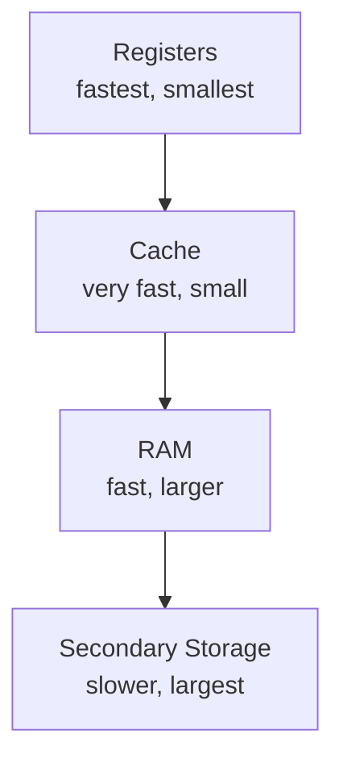
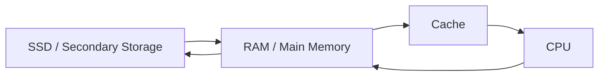

# Primary Memory

## 1. Lesson Goals

By the end of this lesson, students should be able to:

- explain what primary memory is
- distinguish primary memory and secondary storage
- explain the role of RAM
- explain the role of ROM
- explain the role of cache memory
- distinguish volatile and non-volatile memory
- explain why programs need to be loaded into RAM
- explain how the CPU uses primary memory during processing
- compare RAM, ROM, cache, registers, and secondary storage
- explain how memory affects system performance
- avoid common misconceptions about memory and storage
- answer exam-style questions about primary memory

---

## 2. Syllabus Mapping

| Item | Detail |
|---|---|
| Unit | A1 Computer Fundamentals |
| Label | SL Core |
| Main skill | Understanding memory directly used by the CPU |
| Connected topics | Computer hardware, CPU components, fetch-decode-execute cycle, secondary storage, operating systems |
| Practical focus | Explaining how RAM, ROM, and cache support program execution |
| Exam relevance | Definitions, comparisons, volatility, memory hierarchy, performance explanation |

::: tip Learning Focus
Students often confuse memory and storage. Primary memory is used directly by the CPU while a program is running. Secondary storage keeps files and programs long term.
:::

---

## 3. Key Terms

| English Term | 中文解释 | Exam-style meaning |
|---|---|---|
| Primary memory | 主存储器 / 主存 | Memory directly accessible by the CPU |
| Main memory | 主存储器 | Usually refers to RAM used while programs run |
| RAM | 随机存取存储器 | Volatile memory storing currently running programs and data |
| ROM | 只读存储器 | Non-volatile memory storing firmware or startup instructions |
| Cache memory | 高速缓存 | Small, fast memory close to the CPU |
| Register | 寄存器 | Very small, very fast storage inside the CPU |
| Volatile | 易失性 | Data is lost when power is turned off |
| Non-volatile | 非易失性 | Data remains when power is turned off |
| Secondary storage | 辅助存储 | Long-term storage such as SSD, HDD, USB drive |
| Firmware | 固件 | Low-level software stored in non-volatile memory |
| Memory hierarchy | 存储层级 | Arrangement of storage by speed, size, and cost |
| Access time | 访问时间 | Time needed to read or write data |
| Capacity | 容量 | Amount of data that can be stored |
| Virtual memory | 虚拟内存 | Using secondary storage to extend RAM when RAM is insufficient |
| Booting | 启动 | Starting a computer and loading the operating system |

---

## 4. Concept Explanation

<LangBlock>
<template #cn>

### 中文讲解

**Primary memory（主存储器）** 是 CPU 可以直接快速访问的内存。  
它主要包括：

```text
RAM
ROM
cache
```

有时也会把 CPU registers 作为存储层级中最靠近 CPU 的部分一起比较。

最重要的是区分：

```text
memory = 程序运行时使用的工作区域
storage = 长期保存文件和程序
```

例如你打开 IntelliJ IDEA 或浏览器时：

```text
程序原本保存在 SSD 中
打开程序后，操作系统把需要的部分加载到 RAM
CPU 从 RAM 中取指令和数据进行处理
cache 保存 CPU 常用的数据和指令，加快访问
ROM / firmware 帮助电脑启动
```

RAM 通常是 volatile memory：

```text
断电后内容会丢失
```

SSD / HDD 是 non-volatile storage：

```text
断电后文件仍然保留
```

简单来说：

```text
RAM = currently running programs and data
ROM = startup / firmware instructions
cache = very fast memory near CPU
secondary storage = long-term files and programs
```

</template>

<template #en>

### English Explanation

**Primary memory** is memory that the CPU can access directly and quickly.  
It mainly includes:

```text
RAM
ROM
cache
```

CPU registers are also often compared as the closest and fastest storage locations in the memory hierarchy.

The most important distinction is:

```text
memory = working area used while programs run
storage = long-term place for files and programs
```

For example, when you open IntelliJ IDEA or a browser:

```text
the program is originally stored on the SSD
when opened, the operating system loads needed parts into RAM
the CPU fetches instructions and data from RAM
cache stores frequently used data and instructions to speed up access
ROM / firmware helps the computer start
```

RAM is usually volatile memory:

```text
its contents are lost when power is off
```

SSD / HDD are non-volatile storage:

```text
files remain even when power is off
```

In simple terms:

```text
RAM = currently running programs and data
ROM = startup / firmware instructions
cache = very fast memory near CPU
secondary storage = long-term files and programs
```

</template>
</LangBlock>

---

## 5. What Is Primary Memory?

Primary memory is memory that the CPU can access directly during processing.

It is used to hold:

```text
currently running programs
currently used data
instructions needed by the CPU
temporary results
startup instructions
frequently used data
```

### Main Types

| Type | Main Role |
|---|---|
| RAM | stores active programs and data |
| ROM | stores firmware/startup instructions |
| Cache | stores frequently used data/instructions close to CPU |

### Important

Primary memory is generally faster than secondary storage, but it is usually smaller and more expensive per unit.

---

## 6. Primary Memory vs Secondary Storage

| Feature | Primary Memory | Secondary Storage |
|---|---|---|
| Main purpose | active use by CPU | long-term storage |
| Access | directly/quickly accessed by CPU | accessed through storage system |
| Speed | faster | slower |
| Capacity | usually smaller | usually larger |
| Volatility | RAM/cache usually volatile | usually non-volatile |
| Examples | RAM, ROM, cache | SSD, HDD, USB drive |
| Use case | running programs | saved files and installed apps |

### Example

When a Java project is saved:

```text
project files are stored on SSD
```

When the project is opened and run:

```text
IDE and project data are loaded into RAM
CPU processes instructions from memory
```

::: tip Exam Phrase
Primary memory is directly accessible by the CPU and holds data/instructions currently in use, while secondary storage stores data and programs long term.
:::

---

## 7. RAM

RAM stands for **Random Access Memory**.

RAM is the main working memory of a computer.

It stores:

```text
currently running programs
open files
temporary data
data waiting to be processed
instructions used by the CPU
```

### Example

If you are using:

```text
browser
IntelliJ IDEA
music player
PDF viewer
```

parts of these running programs and their data are stored in RAM.

### Why RAM Is Needed

The CPU needs fast access to instructions and data.  
Secondary storage is too slow for active processing, so data is loaded into RAM first.

---

## 8. RAM Is Volatile

RAM is usually volatile.

This means:

```text
data in RAM is lost when power is turned off
```

### Example

If you type an essay but do not save it:

```text
the active document may be in RAM
if the computer loses power, unsaved changes may be lost
```

When you save the file:

```text
the file is written to secondary storage
```

### Key Difference

| RAM | SSD/HDD |
|---|---|
| loses data when power is off | keeps data when power is off |
| used while programs run | used for long-term storage |

---

## 9. Why More RAM Can Help

More RAM can improve performance when:

```text
many programs are open
large files are being edited
a program needs a lot of working data
the system avoids using virtual memory too often
```

### Example

A student opens:

```text
browser with many tabs
IDE
video call
PDF textbook
music player
```

If RAM is too small, the computer may slow down because it cannot keep all active data in RAM.

### But More RAM Is Not Always Enough

More RAM does not automatically make every task faster.

Other factors include:

```text
CPU speed
storage speed
GPU
software efficiency
network speed
```

---

## 10. ROM

ROM stands for **Read Only Memory**.

ROM is usually non-volatile memory.

It stores important instructions that should remain even when power is turned off.

### Common Use

ROM or firmware may store startup instructions needed when the computer first turns on.

Examples:

```text
BIOS
UEFI firmware
device firmware
```

### Why ROM Is Needed

When a computer is first turned on:

```text
RAM is empty
the operating system is not loaded yet
the CPU needs initial instructions
```

Firmware stored in non-volatile memory helps the system start and load the operating system.

---

## 11. RAM vs ROM

| Feature | RAM | ROM |
|---|---|---|
| Full name | Random Access Memory | Read Only Memory |
| Volatile? | Yes, usually | No |
| Writable? | Read/write during use | Usually read-only or rarely changed |
| Main use | active programs and data | startup/firmware instructions |
| Contents after power off | lost | retained |
| Example | open browser data | BIOS/UEFI firmware |

### Common Exam Answer

RAM stores programs and data currently in use and is volatile.  
ROM stores firmware/startup instructions and is non-volatile.

---

## 12. Cache Memory

Cache is small, very fast memory close to or inside the CPU.

It stores:

```text
frequently used data
recently used instructions
data likely to be needed soon
```

### Why Cache Helps

The CPU is very fast.  
Accessing RAM can still be slower than the CPU needs.

Cache reduces waiting time by keeping useful data close to the CPU.

### Example

If a loop repeatedly uses the same instruction or data:

```text
cache may keep it close to the CPU
CPU can access it faster than going to RAM each time
```

---

## 13. Cache vs RAM

| Feature | Cache | RAM |
|---|---|---|
| Location | close to/inside CPU | main memory |
| Speed | faster | fast but slower than cache |
| Capacity | smaller | larger |
| Cost per unit | higher | lower |
| Purpose | speed up CPU access | hold active programs/data |

### Key Idea

Cache is not long-term storage.  
It is temporary, fast memory used to improve CPU performance.

---

## 14. Registers vs Cache vs RAM

| Feature | Registers | Cache | RAM |
|---|---|---|---|
| Location | inside CPU | inside/near CPU | main memory |
| Speed | fastest | very fast | fast |
| Capacity | tiny | small | much larger |
| Use | current instruction/data/address | frequently used data/instructions | active programs/data |
| Example | PC, MAR, MDR, CIR | L1/L2/L3 cache | running IDE and browser |

### Memory Hierarchy

```text
Registers
↓
Cache
↓
RAM
↓
Secondary Storage
```

Generally:

```text
higher = faster, smaller, more expensive
lower = slower, larger, cheaper
```

---

## 15. Memory Hierarchy Diagram



### Explanation

The CPU tries to access data from the fastest available place.  
If the data is not in registers or cache, it may need to access RAM.  
If it is not in RAM, it may need to be loaded from secondary storage.

---

## 16. CPU, RAM, and Storage Working Together

When opening a program:

```text
1. Program files are stored on SSD.
2. User opens the program.
3. Operating system loads needed instructions/data into RAM.
4. CPU fetches instructions from RAM.
5. Cache may store frequently used instructions/data.
6. CPU processes instructions.
7. Results may be stored in RAM, output, or saved to SSD.
```

### Diagram



---

## 17. Virtual Memory Preview

Virtual memory is used when RAM is not enough.

The operating system uses part of secondary storage as if it were extra memory.

### Why It Helps

Virtual memory allows the system to keep running more programs than would fit in RAM alone.

### Why It Can Be Slow

Secondary storage is slower than RAM.

If the system uses virtual memory too often, performance may drop.

### Simple Example

If RAM is full:

```text
some inactive data may be moved from RAM to storage
space is freed in RAM
when that data is needed again, it must be moved back
```

This process is slower than keeping everything in RAM.

::: info Level Control
Virtual memory is included as a helpful preview. Teach it deeply only if your syllabus coverage requires it.
:::

---

## 18. Primary Memory and the Operating System

The operating system manages memory.

It decides:

```text
which programs are loaded into RAM
how memory is allocated
how memory is protected between processes
when virtual memory is used
what happens when memory is full
```

### Example

If a student opens a browser and an IDE:

```text
the OS allocates memory to each program
keeps track of memory use
prevents one program from directly corrupting another program's memory
```

Operating systems will be covered in more detail later.

---

## 19. Worked Example: Opening a Browser

A student clicks a browser icon.

### What Happens?

```text
1. Browser program is stored on SSD.
2. OS loads browser code into RAM.
3. CPU fetches browser instructions from RAM.
4. Cache stores frequently used instructions/data.
5. RAM stores webpage data, tabs, and temporary information.
6. Screen displays the browser window.
```

### If Power Is Turned Off

```text
RAM contents are lost
unsaved temporary data may disappear
installed browser remains on SSD
saved files remain on SSD
```

---

## 20. Worked Example: Running Java Code

A student runs a Java program.

```java
System.out.println("Hello");
```

During execution:

| Component | Role |
|---|---|
| SSD | stores project files and installed tools |
| RAM | holds running IDE, Java runtime, and program data |
| CPU | executes instructions |
| Cache | speeds up access to frequently used instructions/data |
| Registers | hold current instruction/data/address |
| Screen | displays output |

### Key Idea

The source file may be saved on SSD, but the running program uses RAM and CPU.

---

## 21. Worked Example: Game Loading

A game is installed on SSD.

When launched:

```text
game files are read from SSD
textures, maps, and code are loaded into RAM
CPU and GPU process game logic and graphics
cache speeds up repeated access
screen displays output
```

### Why More RAM May Help

More RAM can allow:

```text
larger maps
more game assets loaded at once
less loading from storage
smoother multitasking
```

But graphics performance also depends heavily on:

```text
GPU
CPU
storage speed
software optimization
```

---

## 22. Volatile and Non-volatile Memory

| Type | Meaning | Example |
|---|---|---|
| Volatile | contents lost when power is off | RAM, cache, registers |
| Non-volatile | contents remain when power is off | ROM, SSD, HDD |

### Important

ROM is primary memory but non-volatile.  
SSD is non-volatile but secondary storage.

So do not assume:

```text
all primary memory is volatile
```

or:

```text
all non-volatile memory is secondary storage
```

---

## 23. Common Mistakes

| Mistake | Why it is wrong | Better understanding |
|---|---|---|
| RAM and storage are the same | RAM is active memory; storage is long-term | RAM is volatile, SSD/HDD non-volatile |
| ROM is the same as RAM | Different purpose and volatility | ROM stores firmware/startup instructions |
| Cache stores files permanently | Cache is temporary and small | It speeds up CPU access |
| More RAM always improves every task | Other bottlenecks may matter | CPU, GPU, storage, software also affect speed |
| CPU reads programs directly from SSD all the time | Programs are usually loaded into RAM | CPU works mainly with memory |
| Registers are the same as RAM | Registers are inside CPU and tiny | RAM is main memory |
| Volatile means broken or unsafe | It means data is lost without power | Volatility is a memory characteristic |
| ROM can never be changed in any modern system | Some firmware can be updated | But ROM is normally non-volatile and not used like RAM |
| Virtual memory is faster than RAM | It uses slower storage | It helps capacity, not speed |
| Secondary storage is primary memory because it stores data | Primary memory is directly used by CPU | Storage is long-term |

---

## 24. Guided Practice

### Practice 1: RAM or ROM?

Which memory stores currently running programs and data?

<details>
<summary>Suggested Answer</summary>

RAM stores currently running programs and data.

</details>

---

### Practice 2: Volatile or Non-volatile?

Is RAM volatile or non-volatile?

<details>
<summary>Suggested Answer</summary>

RAM is usually volatile, meaning its contents are lost when power is turned off.

</details>

---

### Practice 3: Cache Role

Why is cache useful?

<details>
<summary>Suggested Answer</summary>

Cache stores frequently or recently used data and instructions close to the CPU, allowing faster access than repeatedly reading from RAM.

</details>

---

### Practice 4: Storage or Memory?

Where is an installed game kept when the computer is off?

<details>
<summary>Suggested Answer</summary>

It is kept in secondary storage, such as an SSD or HDD.

</details>

---

### Practice 5: More RAM

A laptop slows down when many programs are open. Why might more RAM help?

<details>
<summary>Suggested Answer</summary>

More RAM allows more active programs and data to be stored in main memory. This can reduce the need to use slower virtual memory on secondary storage.

</details>

---

## 25. Independent Practice

### Question 1

Define primary memory.

### Question 2

Explain the role of RAM.

### Question 3

Explain the role of ROM.

### Question 4

Explain the role of cache memory.

### Question 5

Distinguish between volatile and non-volatile memory.

### Question 6

Compare RAM and secondary storage.

### Question 7

Explain why a program stored on SSD must be loaded into RAM to run.

### Question 8

Explain why cache can improve CPU performance.

### Question 9

Complete the table:

| Component | Main use | Volatile? |
|---|---|---|
| RAM | | |
| ROM | | |
| Cache | | |
| SSD | | |

### Question 10

Explain why virtual memory can allow more programs to run but may reduce performance.

---

## 26. Exam-style Questions

### Question 1 [4 marks]

Define primary memory and give two examples.

<details>
<summary>Mark Scheme Style Answer</summary>

Primary memory is memory that is directly accessible by the CPU and is used to store data and instructions needed during processing. Examples include RAM, ROM, and cache memory.

</details>

---

### Question 2 [5 marks]

Distinguish between RAM and ROM.

<details>
<summary>Mark Scheme Style Answer</summary>

RAM is volatile memory used to store programs and data currently in use. Its contents are lost when power is turned off. ROM is non-volatile memory that stores firmware or startup instructions. Its contents remain when power is turned off and are not normally changed during normal use.

</details>

---

### Question 3 [5 marks]

Explain why secondary storage is needed even though a computer has RAM.

<details>
<summary>Mark Scheme Style Answer</summary>

RAM is volatile and only stores active programs and data while the computer is running. Its contents are lost when power is turned off. Secondary storage, such as an SSD or HDD, is non-volatile and stores files, programs, and data long term, so they remain available after the computer is switched off.

</details>

---

### Question 4 [6 marks]

Explain how cache memory can improve CPU performance.

<details>
<summary>Mark Scheme Style Answer</summary>

Cache memory is small, fast memory located close to or inside the CPU. It stores frequently or recently used data and instructions. If the CPU can access this data from cache instead of slower RAM, the CPU spends less time waiting for data, which can improve processing performance.

</details>

---

### Question 5 [6 marks]

A student says, “More RAM always makes a computer faster.” Explain why this is not always true.

<details>
<summary>Mark Scheme Style Answer</summary>

More RAM can improve performance when the system does not have enough memory for active programs and data, because it reduces the need to use slower virtual memory. However, if the computer already has enough RAM, performance may be limited by other factors such as CPU speed, number of cores, cache size, GPU, storage speed, or software efficiency. Therefore, more RAM does not always improve every task.

</details>

---

## 27. Practice task
### Activity 1: Memory Hierarchy Cards

Students arrange cards from fastest/smallest to slowest/largest:

```text
registers
cache
RAM
SSD/HDD
```

They explain why the order matters.

---

### Activity 2: Volatile or Non-volatile Sort

Students classify:

```text
RAM
ROM
cache
registers
SSD
HDD
USB drive
```

as volatile or non-volatile.

---

### Activity 3: Opening an App Role-play

Students act as:

```text
SSD
RAM
cache
CPU
screen
operating system
```

They simulate opening and running an application.

---

## 28. Independent practice
### Independent practice part A: Concept Explanation

In 5-6 sentences, explain the difference between RAM, ROM, and cache.

---

### Independent practice part B: Comparison Table

Create a comparison table for:

```text
registers
cache
RAM
ROM
SSD
```

Include:

```text
main role
speed
capacity
volatile or non-volatile
```

---

### Independent practice part C: Scenario Explanation

A student's computer slows down when many browser tabs, an IDE, and a video call are open.

Explain:

```text
why RAM may be involved
how virtual memory may be used
why adding RAM may help
why adding RAM may not solve every performance problem
```

---

### Independent practice part D: Misconception Correction

Correct these statements:

```text
RAM keeps all files after shutdown.
ROM is used to store open browser tabs.
Cache is the same as SSD.
Virtual memory is faster than RAM.
Storage and memory mean exactly the same thing.
```

---

## 29. One-page Revision Summary

| Point | Summary |
|---|---|
| Primary memory | Memory directly accessible by CPU |
| RAM | Active programs/data; volatile |
| ROM | Startup/firmware instructions; non-volatile |
| Cache | Small fast memory close to CPU |
| Registers | Tiny fastest storage inside CPU |
| Secondary storage | Long-term files/programs |
| Volatile | Data lost when power off |
| Non-volatile | Data kept when power off |
| Memory hierarchy | registers → cache → RAM → storage |
| Virtual memory | Uses storage as extra memory when RAM is insufficient |
| Performance link | More RAM/cache can help, but other factors matter |
| Exam phrase | RAM stores active data temporarily, ROM stores startup instructions permanently, and cache speeds up CPU access to frequently used data |

---

## 30. Quick Self-test

Before moving on, students should be able to answer these:

1. What is primary memory?
2. What does RAM store?
3. Why is RAM volatile?
4. What does ROM store?
5. Why is ROM non-volatile?
6. What does cache do?
7. Why is cache faster than RAM?
8. What is secondary storage used for?
9. Why does a program need to be loaded into RAM?
10. What is virtual memory?

