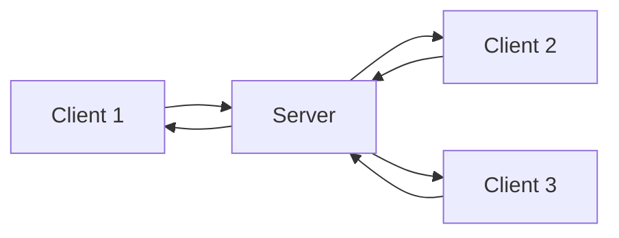
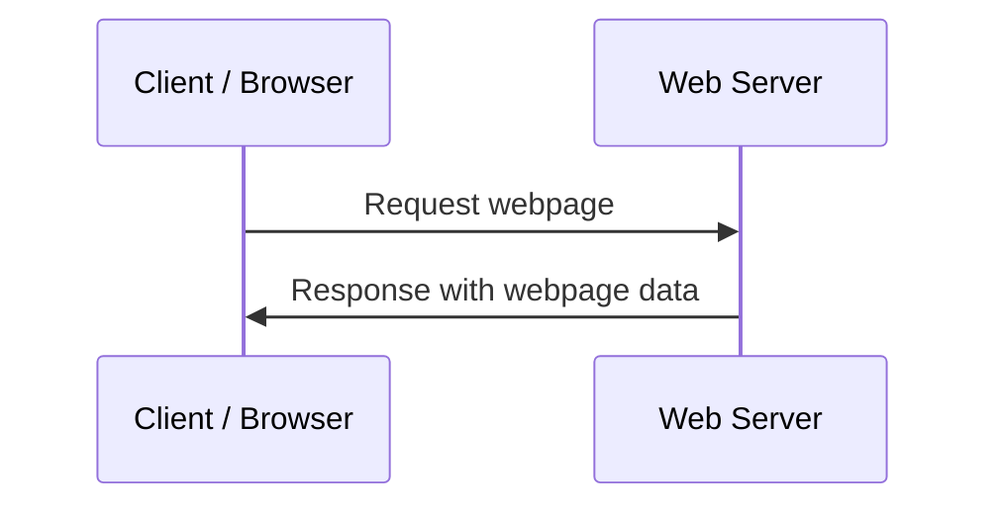
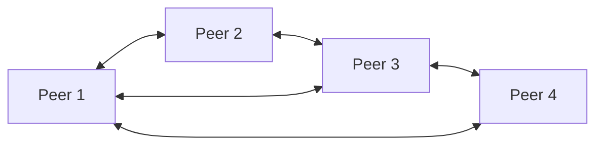

# Client-Server and Peer-to-Peer

## 1. Lesson Goals

By the end of this lesson, students should be able to:

- define client-server network model
- define peer-to-peer network model
- distinguish clients and servers
- explain how requests and responses work
- describe examples of client-server systems
- describe examples of peer-to-peer systems
- compare client-server and peer-to-peer networks
- explain advantages and disadvantages of client-server networks
- explain advantages and disadvantages of peer-to-peer networks
- choose a suitable network model for different scenarios
- explain centralized and decentralized control at a basic level
- avoid common misconceptions about clients, servers, and peers
- answer exam-style questions about client-server and peer-to-peer models

---

## 2. Syllabus Mapping

| Item | Detail |
|---|---|
| Unit | A2 Networks |
| Label | SL Core |
| Main skill | Understanding how devices share resources and services in different network models |
| Connected topics | Network fundamentals, LAN/WAN, network devices, TCP/IP, DNS, web access, cloud computing, network security |
| Practical focus | Explaining network models using websites, school file servers, online games, and file sharing |
| Exam relevance | Definitions, comparisons, advantages/disadvantages, scenario choice |

::: tip Learning Focus
Client-server and peer-to-peer describe how roles are organized in a network. In client-server, clients request services from servers. In peer-to-peer, devices can share directly with each other.
:::

---

## 3. Key Terms

| English Term | 中文解释 | Exam-style meaning |
|---|---|---|
| Client | 客户端 | Device or program that requests a service or resource |
| Server | 服务器 | Computer or program that provides services or resources |
| Client-server model | 客户端-服务器模型 | Network model where clients request services from central servers |
| Peer-to-peer model | 点对点模型 | Network model where devices can act as both client and server |
| Peer | 对等节点 | Device in a peer-to-peer network |
| Request | 请求 | Message sent by a client asking for a service or data |
| Response | 响应 | Message sent back by a server or peer |
| Centralized | 集中式 | Controlled or managed from a central point |
| Decentralized | 去中心化 | Control or resources are spread across multiple devices |
| File server | 文件服务器 | Server that stores and provides files |
| Web server | Web 服务器 | Server that provides webpages |
| Email server | 邮件服务器 | Server that handles email sending/receiving |
| Authentication server | 认证服务器 | Server that checks user login details |
| Resource sharing | 资源共享 | Sharing files, printers, storage, processing, or services |
| Scalability | 可扩展性 | Ability to handle more users/devices/workload |
| Single point of failure | 单点故障 | One component whose failure can affect the whole system |

---

## 4. Concept Explanation

<LangBlock>
<template #cn>

### 中文讲解

网络中设备之间可以用不同方式组织角色。  
最常见的两种模型是：

```text
client-server
peer-to-peer
```

在 **client-server model** 中：

```text
client 请求服务
server 提供服务
```

例如你打开一个网站：

```text
browser = client
web server = server
```

浏览器发送 request，服务器返回 webpage data。

在 **peer-to-peer model** 中：

```text
每个设备都可以既请求资源，也提供资源
```

也就是说，一个 peer 可以像 client 一样请求数据，也可以像 server 一样分享数据。

例如：

```text
两个电脑直接共享文件
P2P file sharing
某些多人游戏的直接连接
```

简单来说：

```text
client-server = central server provides services
peer-to-peer = peers share directly with each other
```

两种模型没有绝对好坏。  
选择哪一种取决于：

```text
network size
security needs
management needs
cost
reliability
performance
type of service
```

</template>

<template #en>

### English Explanation

Devices in a network can organize their roles in different ways.  
The two common models are:

```text
client-server
peer-to-peer
```

In a **client-server model**:

```text
client requests a service
server provides the service
```

For example, when you open a website:

```text
browser = client
web server = server
```

The browser sends a request, and the server sends webpage data back.

In a **peer-to-peer model**:

```text
each device can request resources and also provide resources
```

This means a peer can act like a client when requesting data and like a server when sharing data.

Examples include:

```text
two computers sharing files directly
P2P file sharing
some multiplayer game connections
```

In simple terms:

```text
client-server = central server provides services
peer-to-peer = peers share directly with each other
```

Neither model is always better.  
The choice depends on:

```text
network size
security needs
management needs
cost
reliability
performance
type of service
```

</template>
</LangBlock>

---

## 5. What Is the Client-Server Model?

The client-server model is a network model where clients request services from one or more servers.

### Basic Pattern

```text
client sends request
server processes request
server sends response
```

### Diagram



### Examples

```text
web browser requesting webpage from web server
student computer accessing school file server
email app connecting to email server
online game client connecting to game server
database client querying database server
cloud document app connecting to cloud server
```

::: tip Exam Phrase
In a client-server network, client devices request services or resources from a central server that provides and manages those services.
:::

---

## 6. Client and Server Roles

### Client

A client is a device or program that requests a service.

Examples:

```text
web browser
email app
game client
student laptop
mobile banking app
database front-end
```

### Server

A server is a device or program that provides a service.

Examples:

```text
web server
file server
email server
database server
authentication server
game server
print server
```

### Important

A server can be:

```text
a physical computer
a virtual machine
a cloud service
a program running on a computer
```

A client can also be:

```text
a device
an application
a browser tab
```

---

## 7. Request and Response

Client-server communication often uses a request-response pattern.

### Example: Website

```text
1. User enters URL in browser.
2. Browser sends request to web server.
3. Server finds requested webpage.
4. Server sends response to browser.
5. Browser displays page.
```

### Simple Diagram



### Example: School File Server

```text
1. Student logs in.
2. Client requests file from file server.
3. File server checks permission.
4. File server sends file if allowed.
```

---

## 8. Types of Servers

| Server Type | Service Provided |
|---|---|
| Web server | webpages and web resources |
| File server | shared file storage |
| Print server | manages print jobs |
| Email server | sends, receives, and stores email |
| Database server | stores and queries structured data |
| Authentication server | checks login credentials |
| Game server | manages online game state |
| DNS server | resolves domain names to IP addresses |
| Application server | runs application logic |

### Key Idea

A server is defined by the service it provides, not only by the physical machine.

---

## 9. Advantages of Client-Server

| Advantage | Explanation |
|---|---|
| Centralized management | users, files, security, and services can be managed centrally |
| Better security control | permissions and authentication can be handled by server |
| Easier backup | important data can be backed up from central server |
| Resource sharing | many clients can access shared services |
| Scalability with good design | servers can be upgraded or replicated |
| Consistency | all clients can access same central data |
| Easier maintenance | updates can be applied to server-side services |

### Example

A school file server allows student files to be stored centrally, backed up, and protected by permissions.

---

## 10. Disadvantages of Client-Server

| Disadvantage | Explanation |
|---|---|
| Server cost | dedicated servers and maintenance can be expensive |
| Server dependency | if server fails, clients may lose access |
| Network dependency | clients need network connection to server |
| Bottleneck risk | server may become overloaded |
| Administration needed | requires setup, security, updates, monitoring |
| Target for attacks | central server may be attractive to attackers |

### Single Point of Failure

If there is only one server and it fails:

```text
many clients may be affected
```

This is called a single point of failure.

Possible solutions:

```text
backup server
load balancing
replication
cloud redundancy
regular backup
monitoring
```

---

## 11. What Is Peer-to-Peer?

In a peer-to-peer, or P2P, model, devices communicate and share resources directly with each other.

Each device is called a peer.

A peer can act as:

```text
client when requesting data
server when providing data
```

### Diagram



### Examples

```text
two laptops sharing files directly
small office computers sharing folders
P2P file sharing systems
some voice/video applications
some multiplayer games
blockchain-style networks
```

::: tip Exam Phrase
In a peer-to-peer network, each device can share resources directly and may act as both a client and a server.
:::

---

## 12. Peer Roles

In P2P, there is usually no dedicated central server for all services.

Each peer may:

```text
store its own files
share files with others
request files from others
provide processing or data
communicate directly with peers
```

### Example

Computer A shares a folder.  
Computer B requests a file from that folder.

In this moment:

```text
Computer B acts as client
Computer A acts as server
```

Later, Computer B might share a file, reversing roles.

---

## 13. Advantages of Peer-to-Peer

| Advantage | Explanation |
|---|---|
| Lower setup cost | no dedicated central server may be needed |
| Simple for small networks | easy for a few devices to share resources |
| Direct sharing | peers can share files directly |
| Less central dependency | no single central server for all resources |
| Distributed resources | storage or workload can be spread across peers |
| Can be resilient in some designs | if one peer leaves, others may still communicate |

### Example

In a small group project, students may share files directly between laptops without setting up a server.

---

## 14. Disadvantages of Peer-to-Peer

| Disadvantage | Explanation |
|---|---|
| Harder to manage | no central control over users and resources |
| Weaker security control | each peer must be secured individually |
| Backup is harder | files may be stored across many devices |
| Availability problems | resource unavailable if peer is offline |
| Performance varies | depends on peer device/network speed |
| Hard to scale | becomes difficult with many users/devices |
| Version conflicts | users may have different copies of files |

### Example

If a file is stored only on one peer and that peer is turned off, other peers cannot access it.

---

## 15. Client-Server vs Peer-to-Peer

| Feature | Client-Server | Peer-to-Peer |
|---|---|---|
| Main structure | central server provides services | peers share directly |
| Control | centralized | decentralized |
| Cost | higher server/admin cost | lower initial setup cost |
| Management | easier centrally | harder across devices |
| Security | easier to enforce centrally | each peer must be secured |
| Backup | easier from server | harder if files spread out |
| Reliability | server failure can affect many clients | peer offline can make resource unavailable |
| Scalability | good with proper servers | harder as network grows |
| Example | website, school file server | direct file sharing |

---

## 16. Centralized vs Decentralized

### Centralized

A centralized system has a central point of control or service.

Example:

```text
school file server stores student files
```

Benefits:

```text
easier management
consistent data
central backup
central permissions
```

Risks:

```text
central server failure
central attack target
higher server cost
```

### Decentralized

A decentralized system spreads control or resources across multiple devices.

Example:

```text
peers share files directly
```

Benefits:

```text
less central dependency
resources spread out
may be cheaper for small groups
```

Risks:

```text
harder security
harder backup
availability depends on peers
```

---

## 17. Worked Example: Opening a Website

This is a client-server example.

| Role | Example |
|---|---|
| Client | user's browser |
| Server | web server hosting website |
| Request | browser asks for webpage |
| Response | server sends HTML/CSS/JS/images |

### Process

```text
1. User enters URL.
2. Browser sends request.
3. DNS helps find server IP address.
4. Web server receives request.
5. Server sends response.
6. Browser displays page.
```

This connects to later topics:

```text
DNS
TCP/IP
packet switching
web access
network security
```

---

## 18. Worked Example: School File Server

A school stores student work on a file server.

### Client-Server Roles

```text
student computer = client
file server = server
```

### Process

```text
1. Student logs in.
2. Client requests file.
3. Server checks user permission.
4. Server sends file if allowed.
5. Student saves changes back to server.
```

### Benefits

```text
central backup
permission control
access from different school computers
easier management by IT staff
```

### Risks

```text
server failure affects many users
server must be secured
network access required
```

---

## 19. Worked Example: Online Game

Many online games use client-server.

### Roles

```text
player device = client
game server = server
```

### Server May Handle

```text
matchmaking
player positions
game rules
score
anti-cheat checks
chat
world state
```

### Why Use Server?

```text
keeps shared game state consistent
reduces cheating compared with trusting each client
allows players from different locations to connect
```

### Disadvantage

```text
server outage or high latency can affect gameplay
```

---

## 20. Worked Example: Direct File Sharing

Two computers share files directly.

This can be P2P.

### Process

```text
1. Computer A shares a folder.
2. Computer B connects to Computer A.
3. Computer B downloads a file.
4. Later Computer B may share files with Computer A.
```

### Benefits

```text
simple
no dedicated server needed
direct sharing
```

### Risks

```text
file unavailable when peer is off
security depends on each device
harder to manage permissions centrally
```

---

## 21. Worked Example: P2P File Distribution

Some P2P systems distribute a file by allowing many peers to share pieces of it.

### Basic Idea

```text
file is split into pieces
peers download pieces from different peers
peers also upload pieces to others
```

### Potential Advantages

```text
reduces load on one central server
can use upload capacity of many peers
may continue even if some peers leave
```

### Potential Risks

```text
malware distribution
copyright issues
privacy concerns
variable speed
untrusted peers
```

---

## 22. Hybrid Systems

Some systems combine client-server and peer-to-peer ideas.

### Example

A service may use a central server for:

```text
login
search
coordination
user list
security
```

but peers may exchange some data directly.

### Example: Communication App

A communication app may use central servers to help users connect, but some media data may travel peer-to-peer when possible.

### Why Hybrid?

Hybrid models can balance:

```text
central management
direct peer communication
performance
security
cost
```

---

## 23. Choosing the Right Model

### Use Client-Server When

```text
central management is needed
security and permissions are important
many users need the same consistent data
backup must be reliable
services must be available even when clients are off
organization can manage server cost
```

### Use Peer-to-Peer When

```text
network is small
setup should be simple
dedicated server is not needed
peers can share directly
cost should be low
resources can be distributed
```

### Scenario Table

| Scenario | Better Model | Reason |
|---|---|---|
| school student accounts and files | client-server | central management, permissions, backup |
| two laptops sharing one file directly | peer-to-peer | simple direct sharing |
| public website | client-server | server provides webpage to many clients |
| small home file sharing | peer-to-peer | low cost, simple setup |
| online banking | client-server | security, consistency, central database |
| P2P file distribution | peer-to-peer | many peers share pieces |

---

## 24. Security Considerations

### Client-Server Security

Common controls:

```text
central authentication
server permissions
access logs
firewalls
server updates
backup and recovery
encryption
```

Risks:

```text
server attack
data breach
misconfigured permissions
single point of failure
```

### Peer-to-Peer Security

Common risks:

```text
untrusted peers
malware sharing
weak permissions on each device
no central monitoring
files shared accidentally
```

Controls:

```text
secure sharing settings
firewall rules
anti-malware
user education
encryption where possible
```

---

## 25. Performance Considerations

### Client-Server

Performance depends on:

```text
server capacity
server location
network bandwidth
latency
number of clients
database performance
load balancing
```

### Peer-to-Peer

Performance depends on:

```text
peer upload/download speed
number of available peers
peer reliability
network conditions
device performance
```

### Example

A powerful server can handle many clients, but if too many clients connect and the server is not scaled, it may become a bottleneck.

---

## 26. Common Mistakes

| Mistake | Why it is wrong | Better understanding |
|---|---|---|
| Client means human user | Client is a device or program | User uses a client |
| Server must be a huge machine | Server can be hardware, VM, or software | It provides services |
| Peer-to-peer means no network | Peers are still networked | They communicate directly |
| P2P is always illegal | P2P is a model | It can be legal or illegal depending on use |
| Client-server is always faster | Server can be bottleneck | Performance depends on design |
| Peer-to-peer is always less reliable | Some P2P designs are resilient | But individual resources may disappear |
| Server and router are same | Server provides services; router forwards traffic | Different roles |
| Cloud is never client-server | Cloud services often use client-server | Client accesses remote cloud servers |
| P2P has no security needs | Each peer must be secured | Direct sharing can be risky |
| Centralized always means bad | Central management can improve security/backup | Trade-offs depend on scenario |

---

## 27. Guided Practice

### Practice 1: Client or Server?

When a browser requests a webpage, what is the browser?

<details>
<summary>Suggested Answer</summary>

The browser is the client because it requests a service or resource.

</details>

---

### Practice 2: Server Role

What does a web server provide?

<details>
<summary>Suggested Answer</summary>

A web server provides webpages and related web resources to clients.

</details>

---

### Practice 3: P2P

In a peer-to-peer network, can a device act as both client and server?

<details>
<summary>Suggested Answer</summary>

Yes. A peer can request resources from other peers and also provide resources to them.

</details>

---

### Practice 4: Best Model

A school wants central login, permissions, and backup for student files. Which model is more suitable?

<details>
<summary>Suggested Answer</summary>

Client-server is more suitable because the server can centrally manage users, permissions, files, and backups.

</details>

---

### Practice 5: Single Point of Failure

Why can a single server be a risk?

<details>
<summary>Suggested Answer</summary>

If the server fails, many clients may lose access to the service or data. This makes it a single point of failure unless redundancy or backup systems are used.

</details>

---

## 28. Independent Practice

### Question 1

Define client-server model.

### Question 2

Define peer-to-peer model.

### Question 3

Explain the difference between a client and a server.

### Question 4

Give three examples of client-server systems.

### Question 5

Give two examples of peer-to-peer systems.

### Question 6

Compare client-server and peer-to-peer in terms of management, cost, security, and availability.

### Question 7

Explain why a school file system is usually better as client-server.

### Question 8

Explain one advantage and one risk of peer-to-peer file sharing.

### Question 9

Explain how an online game can use the client-server model.

### Question 10

A small group of students wants to share files without setting up a server. Explain why P2P may be suitable and what risks they should consider.

---

## 29. Exam-style Questions

### Question 1 [4 marks]

Define client-server network model.

<details>
<summary>Mark Scheme Style Answer</summary>

A client-server network model is a model where client devices or programs request services or resources from a central server. The server provides services such as files, webpages, email, authentication, or database access to multiple clients.

</details>

---

### Question 2 [4 marks]

Define peer-to-peer network model.

<details>
<summary>Mark Scheme Style Answer</summary>

A peer-to-peer network model is a model where devices communicate and share resources directly with each other. Each peer can act as both a client when requesting resources and a server when providing resources.

</details>

---

### Question 3 [6 marks]

Compare client-server and peer-to-peer networks.

<details>
<summary>Mark Scheme Style Answer</summary>

In a client-server network, clients request services from a central server, while in a peer-to-peer network, devices share resources directly with each other. Client-server networks are easier to manage centrally and can provide stronger centralized security and backup, but they may be more expensive and depend on the server. Peer-to-peer networks can be cheaper and simpler for small networks, but they are harder to manage, secure, and back up as they grow.

</details>

---

### Question 4 [6 marks]

Explain two advantages and one disadvantage of using a client-server model in a school.

<details>
<summary>Mark Scheme Style Answer</summary>

One advantage is centralized management because user accounts, permissions, files, and services can be controlled from the server. Another advantage is easier backup because important student files can be stored and backed up centrally. A disadvantage is server dependency: if the server fails or the network connection to it is unavailable, many students may lose access to files or services.

</details>

---

### Question 5 [6 marks]

A small office has five computers and wants to share files with low setup cost. Explain whether peer-to-peer could be suitable.

<details>
<summary>Mark Scheme Style Answer</summary>

Peer-to-peer could be suitable because the network is small and files can be shared directly between computers without buying or maintaining a dedicated server. This lowers setup cost and can be simple to configure. However, the office should consider security and backup risks, because each computer must be managed separately and files may be unavailable if the computer storing them is turned off.

</details>

---

## 30. Classroom Activity

### Activity 1: Role Cards

Students receive role cards:

```text
client
server
peer
request
response
file server
web server
game server
```

They act out website access, school file access, and P2P sharing.

---

### Activity 2: Scenario Sorting

Students classify scenarios as client-server, peer-to-peer, or hybrid:

```text
opening a website
school file server
two laptops sharing files directly
online banking
P2P file distribution
cloud document editing
small home folder sharing
online game server
```

---

### Activity 3: Network Model Debate

Prompt:

```text
Should a small school use peer-to-peer file sharing or a central file server?
```

Students must discuss:

```text
cost
security
backup
management
availability
performance
```

---

## 31. Homework

### Homework Part A: Concept Explanation

In 5-6 sentences, explain the difference between client-server and peer-to-peer networks.

---

### Homework Part B: Comparison Table

Create a table comparing client-server and peer-to-peer using:

```text
structure
cost
management
security
backup
availability
scalability
examples
```

---

### Homework Part C: Scenario Analysis

For each scenario, choose client-server or peer-to-peer and justify:

```text
1. school login and file system
2. two friends sharing photos directly
3. public website
4. small home network sharing a folder
5. online banking system
```

---

### Homework Part D: Written Answer

Explain why peer-to-peer can be cheaper for a small network but harder to manage as the network grows.

---

## 32. One-page Revision Summary

| Point | Summary |
|---|---|
| Client | Requests services/resources |
| Server | Provides services/resources |
| Client-server | Clients request from central server |
| Peer | Device in P2P network |
| Peer-to-peer | Peers share directly and can act as client/server |
| Request | Message asking for service/data |
| Response | Message sent back with result/data |
| Centralized | Managed from central point |
| Decentralized | Resources/control spread across peers |
| Client-server advantage | central management, security, backup |
| Client-server disadvantage | server cost/dependency |
| P2P advantage | low cost, simple direct sharing |
| P2P disadvantage | harder security, backup, management |
| Exam phrase | Client-server uses central servers to provide services, while peer-to-peer allows devices to share resources directly with each other |

---

## 33. Quick Self-test

Before moving on, students should be able to answer these:

1. What is a client?
2. What is a server?
3. What is the client-server model?
4. What is a peer?
5. What is the peer-to-peer model?
6. Give one client-server example.
7. Give one P2P example.
8. Give one advantage of client-server.
9. Give one advantage of P2P.
10. Why can a central server become a single point of failure?
