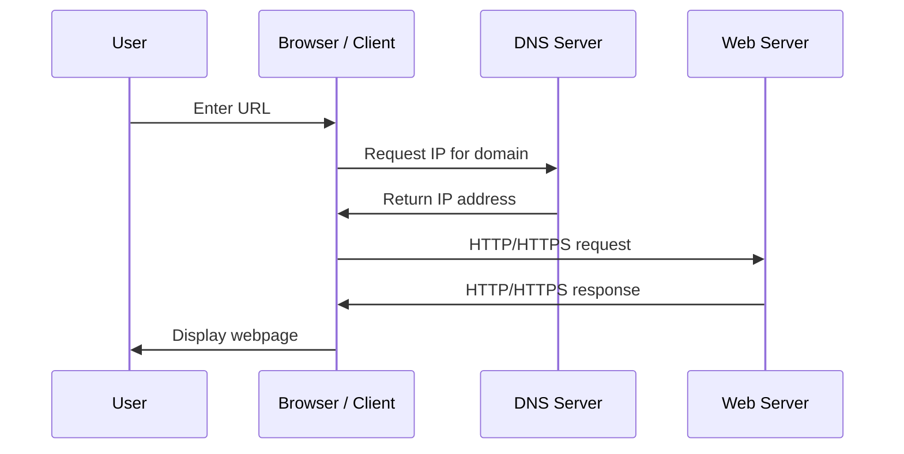

# DNS and Web Access

## 1. Lesson Goals

By the end of this lesson, students should be able to:

- explain what DNS is
- explain why DNS is needed when accessing websites
- distinguish domain name and IP address
- describe the basic steps when a user enters a URL in a browser
- explain the role of a browser as a client
- explain the role of a web server
- explain how DNS, TCP/IP, HTTP/HTTPS, and packet switching work together
- distinguish URL, domain name, IP address, and webpage
- explain the role of HTTP and HTTPS
- explain why HTTPS is more secure than HTTP
- describe how webpage resources are requested and returned
- identify common mistakes in DNS and web access explanations
- answer exam-style questions about DNS and web access

---

## Start here: from URL to web page

When a user enters a URL, the browser must find the server and request the web page.

DNS helps translate a domain name into an IP address. HTTP or HTTPS is then used to request and receive web page data.

Students should learn this as a step-by-step process, not as separate disconnected terms.

---

## Web access workflow

1. The user enters a URL into the browser.
   The browser reads the protocol, domain name, and path.
2. The browser checks whether the address or page data is already cached.
   Cached data can reduce repeated network requests.
3. If needed, DNS is used to find the IP address for the domain name.
   DNS returns the address needed to contact the server.
4. The browser connects to the web server.
   The browser acts as the client in a client-server model.
5. The browser sends an HTTP or HTTPS request.
   The request asks the server for a page or resource.
6. The web server sends back the requested page data.
   The response may include HTML, CSS, JavaScript, images, or status codes.
7. The browser receives the data and displays the web page.
   The browser renders the resources for the user.
8. Data may travel in packets across the network.
   Large requests and responses can be split and reassembled.

---

## Core checklist

After studying this page, you should be able to:

- explain the purpose of DNS
- distinguish a URL, domain name, and IP address
- describe the role of a browser
- describe the role of a web server
- explain why HTTP or HTTPS is used
- outline the steps used to access a web page
- explain how caching can reduce repeated requests
- explain that data may be split into packets during transmission

---

## Key terms: do not mix these up

| Term | What it means | Simple example |
|---|---|---|
| URL | the full web address entered by the user | `https://example.com/page` |
| Domain name | the human-readable name of a website | `example.com` |
| IP address | the numerical address of a device/server | `203.0.113.10` |
| DNS | system that finds the IP address for a domain name | `example.com → IP address` |
| HTTP/HTTPS | protocol used to request and transfer web pages | browser request to server |
| Browser | client software used to access web pages | Chrome, Edge, Safari |
| Web server | computer/service that stores and sends web pages | server hosting a website |

---

## Exam answer pattern

Use this order when answering web access process questions:

1. Start with the user entering the URL.
2. Mention DNS if the domain name needs to be resolved.
3. Explain that DNS returns the IP address.
4. Explain that the browser contacts the web server.
5. Mention HTTP or HTTPS request.
6. Explain that the server sends the web page data back.
7. Mention packets or caching if the question context requires it.
8. Keep the steps in the correct order.

---

## 2. Syllabus Mapping

| Item | Detail |
|---|---|
| Unit | A2 Networks |
| Label | SL Core |
| Main skill | Understanding how a browser accesses a webpage using DNS and network protocols |
| Connected topics | TCP/IP model, packet switching, client-server, network devices, network security, encryption |
| Practical focus | Step-by-step explanation of opening a website |
| Exam relevance | DNS role, URL/IP/domain distinction, HTTP/HTTPS, client-server request-response, process description |

::: tip Learning Focus
Students should not simply say “the browser opens the website”. A strong answer explains DNS lookup, IP address, client-server request, TCP/IP communication, packet transfer, server response, and browser rendering.
:::

---

## 3. Key Terms

| English Term | 中文解释 | Exam-style meaning |
|---|---|---|
| DNS | 域名系统 | Domain Name System; resolves domain names to IP addresses |
| Domain name | 域名 | Human-readable name for a website or internet service |
| IP address | IP 地址 | Numerical/logical address used to locate a device/server on a network |
| URL | 统一资源定位符 | Web address specifying protocol, domain, and resource path |
| Browser | 浏览器 | Client application used to request and display webpages |
| Web server | Web 服务器 | Server that stores and sends webpages/resources |
| HTTP | 超文本传输协议 | Protocol used to transfer webpages |
| HTTPS | 安全超文本传输协议 | Secure version of HTTP using encryption |
| Webpage | 网页 | Document/resource displayed in a browser |
| Website | 网站 | Collection of related webpages/resources |
| Request | 请求 | Message from client asking for a resource |
| Response | 响应 | Message from server returning data or status |
| Resource | 资源 | File requested by browser, such as HTML, CSS, JS, image |
| HTML | 超文本标记语言 | Markup language used to structure webpages |
| CSS | 层叠样式表 | Stylesheet language used for webpage appearance |
| JavaScript | JavaScript 脚本 | Programming language used for interactive webpage behavior |
| TLS | 传输层安全 | Security protocol used to encrypt HTTPS communication |
| Cache | 缓存 | Stored copy of data used to speed up later access |
| ISP | Internet Service Provider | Organization providing internet access |

---

## 4. Concept Explanation

<LangBlock>
<template #cn>

### 中文讲解

当你在浏览器输入一个网址时，例如：

```text
https://www.example.com/index.html
```

浏览器不能只靠这个英文名字直接找到服务器。  
网络传输需要使用 **IP address**，所以需要 **DNS** 把 domain name 转换成 IP address。

简单过程是：

```text
user enters URL
browser extracts domain name
DNS resolves domain name to IP address
browser sends request to web server
server sends response back
browser receives webpage resources
browser displays the webpage
```

在这个过程中，不同网络知识会一起出现：

```text
DNS finds IP address
HTTP/HTTPS defines webpage request and response
TCP/IP handles communication between devices
packet switching sends data as packets
routers forward packets
browser rebuilds and renders the page
```

例如：

```text
domain name = www.example.com
IP address = server's network address
URL = full address including protocol and path
browser = client
web server = server
```

核心思想：

```text
DNS helps humans use names, while networks use IP addresses.
```

</template>

<template #en>

### English Explanation

When you type a web address into a browser, for example:

```text
https://www.example.com/index.html
```

the browser cannot find the server only using the human-readable name.  
Network communication needs an **IP address**, so **DNS** is used to convert the domain name into an IP address.

The simple process is:

```text
user enters URL
browser extracts domain name
DNS resolves domain name to IP address
browser sends request to web server
server sends response back
browser receives webpage resources
browser displays the webpage
```

During this process, several networking ideas work together:

```text
DNS finds IP address
HTTP/HTTPS defines webpage request and response
TCP/IP handles communication between devices
packet switching sends data as packets
routers forward packets
browser rebuilds and renders the page
```

For example:

```text
domain name = www.example.com
IP address = server's network address
URL = full address including protocol and path
browser = client
web server = server
```

Core idea:

```text
DNS helps humans use names, while networks use IP addresses.
```

</template>
</LangBlock>

---

## 5. What Is DNS?

DNS stands for **Domain Name System**.

DNS resolves domain names into IP addresses.

### Why DNS Exists

Humans prefer names:

```text
www.example.com
www.google.com
school.edu
```

Computers and routers use addresses:

```text
93.184.216.34
142.250.x.x
```

DNS connects these two worlds.

### Simple Definition

```text
DNS translates a human-readable domain name into an IP address that can be used to locate the server.
```

::: tip Exam Phrase
DNS resolves domain names into IP addresses so that a client can locate and communicate with the correct server.
:::

---

## 6. Domain Name vs IP Address

| Concept | Meaning | Example |
|---|---|---|
| Domain name | human-readable name | `www.example.com` |
| IP address | network address used for routing | `93.184.216.34` |

### Why Use Domain Names?

Domain names are:

```text
easier for humans to remember
more meaningful than numbers
more stable for users if server IP changes
```

### Why Use IP Addresses?

IP addresses are needed because:

```text
routers forward packets using network addresses
devices need destination addresses
server locations must be identified on a network
```

---

## 7. URL, Domain Name, and Webpage

Students often mix these terms.

### Example URL

```text
https://www.example.com/cs/notes.html
```

| Part | Meaning |
|---|---|
| `https` | protocol |
| `www.example.com` | domain name |
| `/cs/notes.html` | path to resource |
| full line | URL |

### Webpage

The webpage is the content displayed by the browser after resources are received.

### Website

A website is a collection of related webpages and resources.

---

## 8. Browser as Client

A browser is client software.

Examples:

```text
Chrome
Edge
Safari
Firefox
```

### Browser Role

The browser:

```text
accepts URL from user
requests resources from web servers
uses DNS to find server IP address
uses HTTP/HTTPS to communicate
receives HTML/CSS/JavaScript/images
renders webpage for the user
manages cookies, cache, and sessions
```

### Client-Server Link

```text
browser = client
web server = server
```

The browser requests.  
The server responds.

---

## 9. Web Server

A web server provides webpages and web resources to clients.

A web server may store or generate:

```text
HTML files
CSS files
JavaScript files
images
videos
API responses
database-generated pages
```

### Server Role

The web server:

```text
receives HTTP/HTTPS requests
checks requested resource
may run server-side code
may query a database
sends HTTP/HTTPS response
returns status codes and content
```

### Example

If the browser requests:

```text
/index.html
```

the web server may return:

```text
HTML content of index.html
```

---

## 10. Basic Website Access Process

When a user enters a URL:

```text
1. User enters URL in browser.
2. Browser checks cache.
3. Browser extracts domain name.
4. DNS resolves domain name to IP address.
5. Browser establishes connection to server.
6. Browser sends HTTP/HTTPS request.
7. Server processes request.
8. Server sends response.
9. Data travels as packets.
10. Browser receives resources.
11. Browser renders webpage.
```

### Diagram



---

## 11. Step 1: User Enters URL

The user enters something like:

```text
https://www.example.com/about
```

The browser identifies:

```text
protocol = HTTPS
domain name = www.example.com
path = /about
```

### If Protocol Is Missing

Modern browsers may automatically assume:

```text
https://
```

or search the typed text using a search engine if it is not a clear URL.

---

## 12. Step 2: Browser Checks Cache

The browser may check whether it already has some information stored.

### Cache example

Cache may include:

```text
DNS result
HTML file
CSS file
JavaScript file
images
fonts
cookies/session data
```

### Why Cache Helps

Cache can:

```text
reduce loading time
reduce network traffic
avoid downloading unchanged resources again
```

### Important

Cache is not always used.  
The browser may still need to contact the server to check if content has changed.

---

## 13. Step 3: DNS Lookup

If the browser does not already know the IP address, it needs DNS.

### DNS lookup example

### DNS Lookup Goal

```text
domain name → IP address
```

Example:

```text
www.example.com → 93.184.216.34
```

### Simplified DNS Process

```text
1. Browser/OS checks local DNS cache.
2. If not found, request is sent to DNS resolver.
3. DNS resolver finds the correct IP address.
4. IP address is returned to the client.
```

### Important

Students do not need every DNS server type unless required.  
The key exam idea is that DNS resolves domain names to IP addresses.

---

## 14. DNS Resolver and Cache

A DNS resolver helps find the IP address for a domain name.

It may be provided by:

```text
ISP
school network
company network
public DNS provider
```

### DNS Cache

DNS results may be stored temporarily in:

```text
browser cache
operating system cache
router cache
DNS resolver cache
```

### Why Cache DNS?

Caching reduces:

```text
lookup time
DNS server load
network traffic
```

### Risk

If cached DNS information is old or poisoned, the user may be directed incorrectly.

---

## 15. Step 4: Connection to Server

After the IP address is known, the browser can communicate with the server.

For HTTPS websites:

```text
browser connects to server IP address
server uses port 443
TLS handshake helps create secure encrypted session
```

For HTTP websites:

```text
browser connects using port 80
data is not encrypted by default
```

### Ports

| Protocol | Common Port |
|---|---:|
| HTTP | 80 |
| HTTPS | 443 |
| DNS | 53 |

---

## 16. Step 5: HTTP or HTTPS Request

The browser sends a request.

### HTTP request example

Example request idea:

```text
GET /about HTTP/1.1
Host: www.example.com
```

### Request May Include

```text
resource path
method such as GET or POST
host/domain
browser information
cookies
accepted file types
security/session information
```

### GET and POST Preview

| Method | Common Use |
|---|---|
| GET | request data/resource |
| POST | send data to server, such as form submission |

---

## 17. Step 6: Server Response

The web server sends a response.

Response may include:

```text
status code
headers
HTML content
CSS files
JavaScript files
images
other resources
```

### Common Status Codes

| Code | Meaning |
|---:|---|
| 200 | OK |
| 301/302 | redirect |
| 403 | forbidden |
| 404 | not found |
| 500 | server error |

### Example

If a requested file does not exist:

```text
server may return 404 Not Found
```

---

## 18. Step 7: Packet Transfer

Requests and responses are sent as packets across the network.

### Packet transfer example

This involves:

```text
TCP/IP layers
packet switching
routers
IP addresses
network access technologies
```

### Example

A webpage response may be too large for one packet.

So it is split into many packets:

```text
packet 1
packet 2
packet 3
...
```

The browser receives packets and reassembles the data.

---

## 19. Step 8: Browser Renders Webpage

After receiving resources, the browser displays the page.

It may:

```text
parse HTML
apply CSS styles
run JavaScript
load images
request extra resources
display final webpage
```

### Important

A webpage is often made from many resources.

Example:

```text
HTML document
CSS stylesheet
JavaScript file
logo image
font files
API data
```

The browser may send multiple requests to load everything.

---

## 20. HTTP vs HTTPS

| Feature | HTTP | HTTPS |
|---|---|---|
| Full name | Hypertext Transfer Protocol | Hypertext Transfer Protocol Secure |
| Encryption | no default encryption | encrypted using TLS |
| Common port | 80 | 443 |
| Security | data can be read/modified more easily | protects confidentiality and integrity |
| Use today | less recommended | standard for modern websites |
| Browser display | may show “Not secure” | usually shows lock icon |

### Why HTTPS Matters

HTTPS helps protect:

```text
login details
personal data
payment information
session cookies
page content from tampering
```

### HTTPS security example

::: tip Exam Phrase
HTTPS is more secure than HTTP because it encrypts data between the browser and server, helping protect confidentiality and integrity.
:::

---

## 21. TLS and Certificates Preview

HTTPS uses TLS to secure communication.

TLS helps with:

```text
encryption
server authentication
data integrity
```

### Certificate

A certificate helps the browser check that it is communicating with the correct server.

If a certificate is invalid, the browser may show a warning.

### Level Control

Students do not need deep cryptography here.  
The key idea is:

```text
HTTPS = HTTP + encryption/security layer
```

---

## 22. DNS and Security

DNS is essential, but it can be attacked.

### Risks

```text
DNS spoofing
DNS cache poisoning
phishing using similar domain names
malicious redirects
fake websites
```

### Example

An attacker may try to make:

```text
bank-example.com
```

look like:

```text
bankexample.com
```

or may try to redirect a domain to a malicious IP address.

### Protection Ideas

```text
HTTPS certificates
trusted DNS resolvers
DNSSEC in some systems
user awareness
checking URLs carefully
security filtering
```

---

## 23. Web Access and TCP/IP Layers

When accessing a website:

| Layer | Example Role |
|---|---|
| Application | DNS, HTTP, HTTPS |
| Transport | TCP, port 80/443 |
| Internet | IP addressing and routing |
| Network Access | Ethernet/Wi-Fi transmission |

### Summary

```text
DNS finds IP address.
HTTPS requests webpage securely.
TCP helps reliable delivery.
IP routes packets.
Wi-Fi/Ethernet sends frames locally.
```

---

## 24. Web Access and Client-Server Model

Web access is usually client-server.

### Client

```text
browser
```

### Server

```text
web server
```

### Request-Response

```text
browser requests webpage
server responds with webpage data
```

This model is used by:

```text
websites
web apps
cloud dashboards
online learning platforms
e-commerce systems
```

---

## 25. Web Access and Packet Switching

Webpage data is transmitted using packets.

### Why Packets?

```text
large resources can be split
packets can be routed independently
lost packets can be retransmitted if TCP is used
many users can share network links
```

### Example

A single webpage can require many packet transfers for:

```text
HTML
CSS
JavaScript
images
API data
```

---

## 26. Worked Example: Opening a School LMS

A student opens a school learning platform.

```text
1. Student enters LMS URL in browser.
2. Browser identifies domain name.
3. DNS resolves domain name to IP address.
4. Browser establishes secure HTTPS connection.
5. Browser sends request to LMS web server.
6. Request travels as packets through routers.
7. Server checks login/session.
8. Server sends HTML, CSS, JS, and data back.
9. Browser receives packets and renders page.
```

### Components Involved

```text
browser
DNS resolver
web server
TCP/IP
HTTPS
routers
packets
cache
```

---

## 27. Worked Example: 404 Error

A user enters:

```text
https://example.com/missing-page
```

### What Happens?

```text
DNS may still work
server may still be reached
but requested resource does not exist
server returns 404 Not Found
browser displays an error page
```

### Important

A 404 error usually means:

```text
server was found
but the specific resource/path was not found
```

It does not always mean DNS failed or internet is disconnected.

---

## 28. Worked Example: DNS Problem

A user enters a website domain, but the browser cannot find it.

Possible DNS-related causes:

```text
domain name typed incorrectly
DNS resolver unavailable
DNS cache contains wrong information
domain does not exist
DNS records misconfigured
```

### Symptom

The browser may show an error like:

```text
server IP address could not be found
DNS_PROBE_FINISHED_NXDOMAIN
```

### Important

If DNS fails, the browser may not know which IP address to contact.

---

## 29. Worked Example: Slow Webpage

A webpage may load slowly because of:

```text
high latency
low bandwidth
server overload
large images/videos
many resources
DNS delay
packet loss
weak Wi-Fi
browser cache disabled
```

### Good Explanation

Do not just say:

```text
internet is slow
```

A stronger answer identifies specific possible causes.

---

## Common exam traps

Watch for these mistakes in web access process questions:

- saying DNS gives the URL instead of the IP address
- confusing a URL with an IP address
- forgetting the browser is the client
- saying HTTP finds the IP address
- forgetting that HTTPS adds security through encryption
- mixing up cache and DNS
- writing steps in the wrong order
- describing packet switching without connecting it to web access
- saying the internet stores the web page instead of the web server

### Common exam trap

DNS finds the IP address. HTTP or HTTPS requests the web page. The web server sends the page data back.

---

## 30. Common Mistakes

| Mistake | Why it is wrong | Better understanding |
|---|---|---|
| DNS sends the webpage | DNS only resolves domain name to IP address | Web server sends webpage |
| URL and domain name are the same | Domain is part of URL | URL includes protocol/path |
| IP address is easier for humans | Domain names are easier for humans | IP is used for routing |
| Browser is the server | Browser is usually client | Web server provides resources |
| HTTP and HTTPS are identical | HTTPS adds encryption/security | HTTPS is safer |
| HTTPS means website is always trustworthy | HTTPS secures connection but site can still be malicious | Check domain and trust |
| 404 means DNS failed | 404 means server/resource issue | DNS may have worked |
| Cache is always bad | Cache can improve speed | Sometimes stale cache causes issues |
| One webpage is one file only | Webpages often include many resources | Browser sends multiple requests |
| Packet switching is unrelated to web access | Web data travels as packets | TCP/IP and packets are used |

---

## 31. Guided Practice

### Practice 1: DNS Role

What does DNS do?

<details>
<summary>Suggested Answer</summary>

DNS resolves a domain name into an IP address so the client can contact the correct server.

</details>

---

### Practice 2: Domain or URL?

In this address, what is the domain name?

```text
https://www.example.com/cs/index.html
```

<details>
<summary>Suggested Answer</summary>

```text
www.example.com
```

</details>

---

### Practice 3: Client or Server?

When opening a website, what is the browser?

<details>
<summary>Suggested Answer</summary>

The browser is the client because it requests webpage resources from a server.

</details>

---

### Practice 4: HTTP or HTTPS?

Which one encrypts communication between browser and server?

<details>
<summary>Suggested Answer</summary>

HTTPS.

</details>

---

### Practice 5: 404 Meaning

A website returns 404. Does this always mean DNS failed?

<details>
<summary>Suggested Answer</summary>

No. A 404 error usually means the server was reached but the requested resource or path was not found.

</details>

---

## 32. Independent Practice

### Question 1

Define DNS.

### Question 2

Explain why DNS is needed.

### Question 3

Distinguish between domain name, IP address, and URL.

### Question 4

Describe the steps that occur when a user enters a URL into a browser.

### Question 5

Explain the role of the browser in web access.

### Question 6

Explain the role of a web server.

### Question 7

Compare HTTP and HTTPS.

### Question 8

Explain how TCP/IP and packet switching are involved in loading a webpage.

### Question 9

Explain why a webpage may require multiple requests.

### Question 10

Explain two reasons why a webpage may fail to load.

---

## 33. Exam-style Questions

### Question 1 [4 marks]

Define DNS and explain why it is used.

<details>
<summary>Mark Scheme Style Answer</summary>

DNS, or Domain Name System, resolves human-readable domain names into IP addresses. It is used because users find domain names easier to remember, while networks need IP addresses to locate and route data to the correct server.

</details>

---

### Question 2 [5 marks]

Distinguish between URL, domain name, and IP address.

<details>
<summary>Mark Scheme Style Answer</summary>

A URL is the full web address used to locate a resource, including the protocol, domain name, and path. A domain name is the human-readable name of a website or server, such as `www.example.com`. An IP address is a numerical/logical network address used to locate and route data to the server.

</details>

---

### Question 3 [6 marks]

Describe what happens when a user enters a website URL in a browser.

<details>
<summary>Mark Scheme Style Answer</summary>

The browser identifies the domain name from the URL and may check its cache. If the IP address is not already known, DNS is used to resolve the domain name into an IP address. The browser establishes a connection to the web server, using HTTP or HTTPS. It sends a request for the webpage resource. The server sends a response containing webpage data, which travels across the network as packets. The browser receives the resources and renders the webpage.

</details>

---

### Question 4 [5 marks]

Explain why HTTPS is more secure than HTTP.

<details>
<summary>Mark Scheme Style Answer</summary>

HTTPS is more secure because it uses encryption to protect data sent between the browser and web server. This helps prevent attackers from reading or modifying sensitive information such as login details, session cookies, or payment data. HTTPS also uses certificates to help authenticate the server.

</details>

---

### Question 5 [6 marks]

A student enters a URL but receives a 404 error. Explain what this may mean and why it is not necessarily a DNS problem.

<details>
<summary>Mark Scheme Style Answer</summary>

A 404 error means that the server was reached but the requested resource or path was not found. DNS may have worked correctly because the browser was able to locate the server. The error may be caused by a deleted page, incorrect path, broken link, or missing file on the web server.

</details>

---

## 34. Practice task
### Activity 1: Web Access Role-play

Students act as:

```text
browser
DNS resolver
web server
router
packets
user
```

They perform the process of opening a website.

---

### Activity 2: URL Dissection

Students break down URLs into:

```text
protocol
domain name
path
resource
```

Examples:

```text
https://school.edu/login
https://example.com/images/logo.png
http://test.local/index.html
```

---

### Activity 3: Error Diagnosis

Give students scenarios:

```text
DNS error
404 Not Found
slow webpage
certificate warning
wrong website opened
```

Students identify likely causes.

---

## 35. Independent practice
### Independent practice part A: Process Explanation

In 8-10 sentences, explain what happens when a browser opens an HTTPS website.

---

### Independent practice part B: Vocabulary Table

Create a table for:

```text
DNS
domain name
IP address
URL
browser
web server
HTTP
HTTPS
packet
cache
```

Include:

```text
meaning
example
```

---

### Independent practice part C: Scenario

A student says:

```text
DNS sends the webpage to my browser.
```

Explain why this is wrong and correct the statement.

---

### Independent practice part D: Security Answer

Explain why HTTPS is important when logging into an online learning platform.

---

## 36. One-page Revision Summary

| Point | Summary |
|---|---|
| DNS | Resolves domain names to IP addresses |
| Domain name | Human-readable server/site name |
| IP address | Address used for routing |
| URL | Full address including protocol, domain, path |
| Browser | Client that requests and displays webpages |
| Web server | Server that provides webpage resources |
| HTTP | Web transfer protocol |
| HTTPS | Secure encrypted web transfer |
| Request | Message asking for resource |
| Response | Server message returning data/status |
| Cache | Stored copy to speed up access |
| 404 | Resource not found on server |
| DNS failure | Domain cannot be resolved to IP address |
| Packet switching | Web data travels as packets |
| Exam phrase | DNS resolves the domain name to an IP address, then the browser sends an HTTP/HTTPS request to the web server, which returns webpage data for the browser to render |

---

## 37. Quick Self-test

Before moving on, students should be able to answer these:

1. What does DNS stand for?
2. What does DNS do?
3. What is a domain name?
4. What is an IP address?
5. What is a URL?
6. What is the browser's role?
7. What is the web server's role?
8. What is the difference between HTTP and HTTPS?
9. Why can cache improve webpage loading?
10. What does 404 usually mean?

