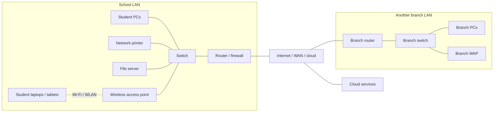
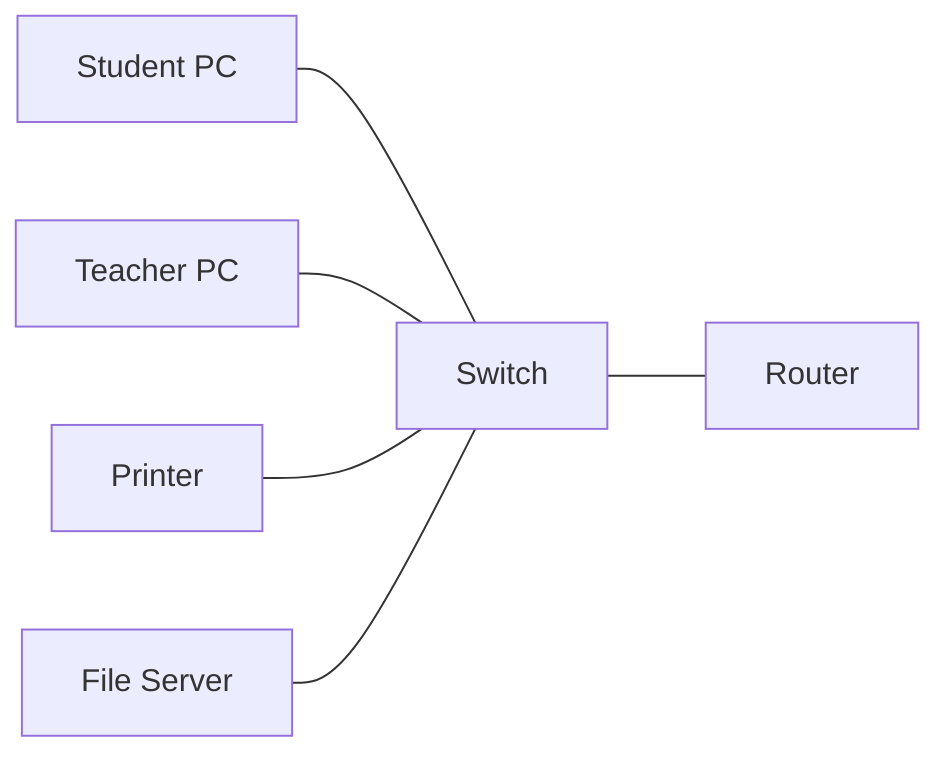
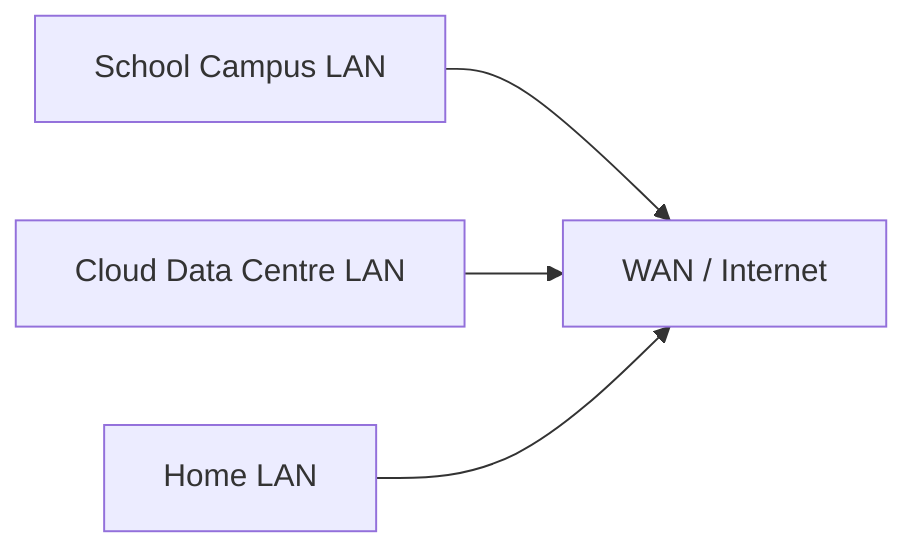

# LAN and WAN

## Page map

- [Lesson goals](#1-lesson-goals)
- [Syllabus mapping](#2-syllabus-mapping)
- [Core checklist](#core-checklist)
- [Key terms and detailed lesson](#3-key-terms)

---

## 1. Lesson Goals

By the end of this lesson, students should be able to:

- define LAN and WAN
- distinguish LAN and WAN by geographical coverage
- explain common characteristics of LANs
- explain common characteristics of WANs
- describe examples of LANs and WANs
- explain the internet as a WAN / network of networks
- compare ownership, speed, cost, security, and reliability of LANs and WANs
- explain why organizations use LANs and WANs
- apply LAN/WAN concepts to school, home, business, and cloud scenarios
- avoid common misconceptions about LANs and WANs
- answer exam-style questions about LAN and WAN

---

## 2. Syllabus Mapping

| Item | Detail |
|---|---|
| Unit | A2 Networks |
| Label | SL Core |
| Main skill | Understanding different network scales and their uses |
| Connected topics | Network fundamentals, network devices, routers, switches, internet, client-server, cloud computing, network security |
| Practical focus | Classifying and comparing networks by coverage, ownership, and purpose |
| Exam relevance | Definitions, comparisons, scenario identification, advantages and disadvantages |

::: tip Learning Focus
LAN and WAN are mainly distinguished by scale and coverage. A LAN covers a small local area, while a WAN covers a large geographical area and often connects multiple LANs.
:::

---

## Start here: choose the network type by scenario

For exams, do not only say "LAN is small and WAN is big". Use technical details from the scenario.

- **LAN (Local Area Network)** connects devices in a limited geographical area, such as a home, school, office, hospital, or campus.
- **WAN (Wide Area Network)** connects networks over a large geographical area, such as cities, countries, or continents.
- **WLAN (Wireless Local Area Network)** is a wireless form of LAN that uses wireless access points and wireless-enabled devices.
- A strong answer should mention coverage, ownership/control, speed, latency, cost, devices, and a scenario example.

中文提示：先判断 **coverage（覆盖范围）**。同一个学校、办公室、医院或家里通常是 **LAN**；跨城市、国家或多个分校通常是 **WAN**；如果本地 LAN 用 Wi-Fi 接入，就是 **WLAN**。

---

## Core checklist

By the end of this page, you should be able to:

- define LAN, WAN, and WLAN
- explain that a LAN covers a limited local area
- explain that a WAN covers a large geographical area and often connects LANs
- compare LAN and WAN using coverage, ownership, speed, latency, cost, and devices
- explain how WLAN provides wireless access to a LAN
- identify common WLAN advantages and security risks
- explain how VPN can support secure remote access to a private LAN
- choose LAN, WAN, or WLAN for a scenario and justify the choice

---

## LAN vs WAN comparison table

| Comparison point | LAN | WAN |
|---|---|---|
| Coverage area | Limited geographical area such as a room, building, school, office, hospital, home, or campus | Large geographical area such as a city, country, continent, or global network |
| Ownership/control | Often owned and managed by one person or organization | Often uses ISP, telecom, cloud, or other external infrastructure |
| Speed/latency | Usually high data transfer rate and low latency | Usually lower data transfer rate and higher latency than LAN, depending on links |
| Cost | Lower for a local site, but still needs devices and maintenance | Higher because long-distance links and provider services are needed |
| Typical hardware/devices | Switches, wireless access points, wireless routers, NICs, local servers, network printers | Routers, modems, leased lines, fibre-optic links, satellite links, VPN gateways, ISP infrastructure |
| Example | School computers sharing printers and files on one campus | A company connecting branch LANs in different countries |
| Common exam phrasing | "A LAN connects devices within a limited geographical area..." | "A WAN connects networks over a large geographical area..." |

---

## Scenario answer pattern

When answering a LAN/WAN/WLAN question, use this order:

1. Identify the area covered by the network.
2. State whether it is LAN, WAN, or WLAN.
3. Mention the typical devices or links involved.
4. Compare speed, latency, ownership, or cost if asked.
5. Link the answer to the scenario, not only to a definition.
6. Mention security if wireless access, remote access, or public networks are involved.

---

## School network diagram



The switch and wireless access point are inside the school LAN. The router connects the LAN to the internet/WAN. The internet/WAN can connect the school LAN to cloud services or another branch LAN.

---

## Exam focus

| Command term | What to do | What gains marks |
|---|---|---|
| State | Give a brief correct answer | Name LAN, WAN, WLAN, or a relevant device/link |
| Outline | Give the main idea with one detail | Mention coverage or purpose with a short example |
| Describe | Give key characteristics | Include area covered, devices, ownership/control, or speed/latency |
| Explain | Link cause and effect | Explain why LAN/WAN/WLAN fits the scenario |
| Compare and contrast | Give similarities and differences | Compare coverage, ownership, latency, speed, cost, and examples |

Avoid vague answers such as:

```text
LAN is small and WAN is big.
```

Improve it with technical detail:

```text
A LAN connects devices within a limited geographical area, such as a school campus, and usually has high data transfer rate and low latency because devices are close together and under local control.
```

---

## Reusable mark-scheme phrases

- "A LAN connects devices within a limited geographical area, such as a school, office, hospital, home, or campus."
- "A WAN connects networks over a large geographical area, such as cities, countries, or continents."
- "A WLAN provides wireless access to a LAN using access points and wireless-enabled devices."
- "A VPN creates an encrypted tunnel over a public network, allowing authenticated remote users to access private network resources."

---

## Common mistakes table

| Mistake | Why it is wrong | Better answer |
|---|---|---|
| Confusing LAN with WLAN | WLAN is a wireless form of LAN, not a separate wide-area network | Explain WLAN as wireless access inside a local network |
| Saying WAN is always wireless | WAN means wide area, not wireless | WANs may use fibre, leased lines, satellite, public internet, or VPN |
| Saying the internet and WAN are exactly the same thing | The internet is a public global WAN, but private WANs also exist | Say the internet is an example of a WAN / network of networks |
| Forgetting latency and speed | LAN/WAN comparison is not only about size | Mention LAN often has higher speed and lower latency |
| Forgetting WLAN security risks | Wireless signals can be intercepted or accessed by unauthorized users | Mention encryption, authentication, and access control |
| Treating VPN as a full network type here | VPN is a secure remote access method, not the main focus of LAN/WAN classification | Explain VPN as a related way to access a private LAN over the internet |

---

## 3. Key Terms

| English Term | 中文解释 | Exam-style meaning |
|---|---|---|
| LAN | 局域网 | Local Area Network; network covering a small geographical area |
| WAN | 广域网 | Wide Area Network; network covering a large geographical area |
| WLAN | 无线局域网 | Wireless Local Area Network; wireless access to a LAN |
| Local area | 本地区域 | Small area such as home, classroom, office, or school building |
| Wide area | 广域区域 | Large area such as city, country, or global network |
| Network | 网络 | Connected devices that can communicate |
| Router | 路由器 | Device that forwards data between networks |
| Switch | 交换机 | Device that connects devices inside a LAN |
| Wireless access point | 无线接入点 | Device that lets wireless devices connect to a LAN |
| Wireless NIC / adaptor | 无线网卡 / 适配器 | Hardware that allows a device to connect to a WLAN |
| VPN | 虚拟专用网络 | Secure encrypted tunnel over a public network |
| ISP | Internet Service Provider | Organization that provides internet access |
| Internet | 互联网 | Global network of connected networks |
| Intranet | 内联网 | Private internal network used by an organization |
| Extranet | 外联网 | Private network access extended to selected external users |
| Bandwidth | 带宽 | Maximum data transfer capacity |
| Latency | 延迟 | Delay in data transmission |
| Ownership | 所有权 | Who owns or controls the network infrastructure |
| Infrastructure | 基础设施 | Physical and logical systems that support a network |
| Geographical coverage | 地理覆盖范围 | Physical area covered by the network |

---

## 4. Concept Explanation

<LangBlock>
<template #cn>

### 中文讲解

网络可以按照覆盖范围分成不同类型。  
最常见的是：

```text
LAN = Local Area Network
WAN = Wide Area Network
```

**LAN（局域网）** 覆盖较小的地理范围，例如：

```text
home
classroom
school building
office
computer lab
```

LAN 通常由个人、学校或公司自己管理。  
例如学校里的电脑、打印机、服务器和 Wi-Fi 连接在一起，就是一个 LAN。

**WAN（广域网）** 覆盖较大的地理范围，例如：

```text
city
country
multiple countries
global network
```

WAN 通常连接多个 LAN。  
最典型的 WAN 是：

```text
the internet
```

简单来说：

```text
LAN = small local network
WAN = large network connecting distant places
```

例如：

```text
school computers connected inside one campus = LAN
school campus connected to cloud services through internet = WAN communication
```

</template>

<template #en>

### English Explanation

Networks can be classified by the area they cover.  
The most common types are:

```text
LAN = Local Area Network
WAN = Wide Area Network
```

A **LAN** covers a small geographical area, such as:

```text
home
classroom
school building
office
computer lab
```

A LAN is often owned and managed by an individual, school, or company.  
For example, school computers, printers, servers, and Wi-Fi connected together inside one campus form a LAN.

A **WAN** covers a much larger geographical area, such as:

```text
city
country
multiple countries
global network
```

A WAN often connects multiple LANs.  
The most common example of a WAN is:

```text
the internet
```

In simple terms:

```text
LAN = small local network
WAN = large network connecting distant places
```

For example:

```text
school computers connected inside one campus = LAN
school campus connected to cloud services through the internet = WAN communication
```

</template>
</LangBlock>

---

## 5. What Is a LAN?

A **LAN**, or **Local Area Network**, connects devices in a limited local area.

Examples of local areas:

```text
home
classroom
school building
office floor
computer lab
small company building
hospital department
campus
library
```

Common LAN characteristics:

```text
short geographical area
often high data transfer rate
often low latency
can share files, printers, software, and internet access
can be wired, wireless, or mixed
```

### LAN Devices

A LAN may include:

```text
desktop computers
laptops
phones
printers
servers
switches
routers
wireless access points
network storage
```

### LAN Diagram



::: tip Exam Phrase
A LAN is a network that connects devices within a small geographical area such as a home, school, or office.
:::

---

## WLAN: Wireless Local Area Network

A **WLAN**, or **Wireless Local Area Network**, is a wireless form of LAN.

It still covers a limited local area, but devices connect using wireless communication instead of only cables.

### WLAN Components

| Component | Role |
|---|---|
| Wireless access point (WAP) | Allows wireless devices to connect to the LAN |
| Wireless router | Often combines routing, Wi-Fi access, and internet connection in a home/small office |
| Wireless NIC / adaptor | Allows a computer or device to connect wirelessly |
| Wireless-enabled devices | Laptops, phones, tablets, printers, sensors, and other devices using Wi-Fi |

### WLAN Advantages

```text
mobility for users and devices
easier installation where cables are difficult
flexible connection for laptops, phones, and tablets
useful for classrooms, offices, hospitals, homes, and campuses
```

### WLAN Limitations and Security Risks

```text
wireless signals can be intercepted
unauthorized users may try to connect
signal range is limited
walls and interference can reduce performance
shared wireless bandwidth can slow connections
```

::: tip Exam Phrase
A WLAN provides wireless access to a LAN using wireless access points and wireless-enabled devices.
:::

---

## 6. What Is a WAN?

A **WAN**, or **Wide Area Network**, connects devices or networks over a large geographical area.

Examples:

```text
a bank network connecting branches across a country
a company network connecting offices in different cities
a school group network connecting multiple campuses
the internet
```

Common WAN characteristics:

```text
covers large geographical areas such as cities, countries, or continents
connects smaller networks such as LANs
usually has lower data transfer rate and higher latency than a LAN
often relies on provider or public network infrastructure
```

WANs may use:

```text
leased lines
fibre-optic links
satellite links
public internet connections
VPN connections
telecommunication provider infrastructure
```

A WAN usually has lower data transfer rate and higher latency than a LAN because data often travels over longer distances and through more networks.

### WAN Often Connects LANs

A WAN can connect multiple LANs together.



::: tip Exam Phrase
A WAN is a network that covers a large geographical area and may connect multiple LANs together.
:::

---

## 7. LAN vs WAN Core Comparison

| Feature | LAN | WAN |
|---|---|---|
| Full name | Local Area Network | Wide Area Network |
| Coverage | small local area | large geographical area |
| Example | school network | internet |
| Ownership | often privately owned/managed | often uses ISP/telecom infrastructure |
| Speed | often high | may be lower or more variable |
| Latency | usually lower | usually higher |
| Cost | lower for small area | higher due to long-distance links |
| Security control | easier to control locally | harder because traffic crosses external networks |
| Typical devices | switches, access points, local router | routers, ISP links, leased lines, internet infrastructure |

---

## 8. Geographical Coverage

The main difference between LAN and WAN is coverage.

### LAN Coverage

```text
one room
one building
one school campus
one office
one home
```

### WAN Coverage

```text
multiple buildings far apart
multiple cities
multiple countries
global internet
```

### Important

The number of devices alone does not decide LAN or WAN.

A LAN can have many devices if they are in a local area.  
A WAN can connect fewer sites but across a large distance.

---

## 9. Ownership and Management

### LAN Ownership

A LAN is usually owned or managed by the organization or individual using it.

Examples:

```text
home owner manages home Wi-Fi
school IT department manages school LAN
company manages office LAN
```

### WAN Ownership

A WAN often uses infrastructure owned by different organizations.

Examples:

```text
ISP cables
telecommunication providers
leased lines
internet backbone providers
cloud provider networks
```

### Why This Matters

Ownership affects:

```text
cost
control
security
maintenance
troubleshooting
reliability
```

---

## 10. Speed and Latency

### LAN Performance

A LAN is often faster and has lower latency because:

```text
distance is short
devices are under local control
wired Ethernet can be very fast
there may be less routing across external networks
```

### WAN Performance

A WAN may have higher latency because:

```text
data travels longer distances
data passes through many routers/networks
traffic may cross ISP infrastructure
network congestion may occur
```

### Example

Accessing a file from a local school server may be faster than downloading a file from a server in another country.

---

## 11. Cost

### LAN Cost

LAN costs may include:

```text
switches
routers
access points
cables
servers
network cards
IT maintenance
```

For a small local area, LAN setup can be relatively affordable.

### WAN Cost

WAN costs may include:

```text
ISP service
leased lines
long-distance infrastructure
cloud networking fees
VPN setup
security equipment
maintenance contracts
```

WANs are usually more expensive to build and maintain because they cover larger distances and rely on wider infrastructure.

---

## 12. Security

### LAN Security

A LAN may be easier to secure because the organization has more direct control over:

```text
devices
user accounts
permissions
Wi-Fi passwords
firewalls
local servers
physical access
```

### WAN Security

WAN communication can be riskier because data may travel through external networks.

Security methods include:

```text
encryption
VPN
firewalls
authentication
secure protocols
access control
monitoring
```

### Important

LAN is not automatically secure.  
Weak passwords, poor permissions, or infected devices can still create risk.

---

## VPN as a Related Idea

A **VPN (Virtual Private Network)** can allow remote users to access a private LAN securely over the internet.

It is related to LAN/WAN questions because the user may be outside the local site but still needs access to internal resources.

| VPN idea | Simple meaning |
|---|---|
| Tunnelling | data is sent through a protected path over a public network |
| Encryption | data is scrambled so outsiders cannot easily read it |
| Authentication | the user must prove they are allowed to connect |
| Internal resource access | the user may access private files, systems, or services as if connected to the organization network |

::: warning Scope Control
VPN is linked to LAN/WAN remote access, but this page is not a full network security page. Focus on how VPN supports secure access to private network resources over the internet.
:::

---

## 13. Examples of LANs

### Home LAN

```text
phones
laptops
smart TV
printer
router
Wi-Fi access point
```

Used for:

```text
sharing internet
streaming
printing
smart home devices
gaming
```

### School LAN

```text
student computers
teacher laptops
printers
file server
switches
Wi-Fi access points
router/firewall
```

Used for:

```text
shared files
controlled internet access
printing
student accounts
lesson resources
local services
```

### Office LAN

```text
employee PCs
shared printers
NAS storage
internal server
VoIP phones
access points
```

Used for:

```text
collaboration
shared storage
internal systems
communication
```

---

## 14. Examples of WANs

### Internet

The internet connects networks around the world.

It supports:

```text
websites
email
cloud services
video calls
online games
streaming
remote access
```

### Bank WAN

A bank may connect:

```text
branch offices
ATMs
data centres
head office
online banking servers
```

### Company WAN

A company may connect:

```text
offices in different cities
remote workers
cloud services
data centres
```

---

## 15. Internet as a WAN

The internet is the largest and most familiar WAN.

It is a global network of networks.

```text
home LAN
school LAN
company LAN
mobile networks
data centre networks
ISP networks
```

all connect through internet infrastructure.

### Important

The internet is public and global.  
A private WAN may be built for one organization, but the internet is shared by many organizations and users.

---

## 16. LAN, WAN, Internet, Intranet, Extranet

| Term | Meaning | Example |
|---|---|---|
| LAN | local area network | school building network |
| WAN | wide area network | internet or company branch network |
| Internet | global public network of networks | websites and cloud services |
| Intranet | private internal network | school staff portal only inside school |
| Extranet | private network access for selected outsiders | supplier access to company system |

### Intranet

An intranet is private and internal to an organization.

Example:

```text
school staff notices and internal resources
```

### Extranet

An extranet gives limited access to selected external users.

Example:

```text
parents access a school portal
suppliers access company order system
```

---

## 17. LAN and WAN in a School Scenario

A school may have:

```text
classroom computers
staff laptops
printers
file server
Wi-Fi access points
router
internet connection
cloud learning platform
```

### LAN Part

```text
classroom computers connected to school server and printer
```

### WAN Part

```text
school network connected to internet and cloud learning platform
```

### Example

When a student prints to a school printer:

```text
mostly LAN communication
```

When a student opens an online learning platform hosted in another city:

```text
WAN / internet communication
```

---

## 18. LAN and WAN in Cloud Computing

Cloud services are usually accessed through WAN/internet communication.

Example:

```text
student laptop on school LAN
→ school router
→ ISP
→ internet
→ cloud data centre
```

The student may feel like the file is in a local folder, but the data may be stored on remote servers.

### Key Link

Cloud computing depends heavily on:

```text
WAN connectivity
internet access
remote servers
network security
```

---

## 19. LAN and WAN in Online Gaming

### LAN Gaming

Devices are connected in the same local network.

Possible advantages:

```text
low latency
stable connection
no internet required for local match
```

### Online WAN Gaming

Players connect across the internet.

Possible issues:

```text
higher latency
packet loss
server distance
network congestion
ISP problems
```

### Example

A game played with friends in the same computer lab may use LAN.  
A ranked online match with players in other countries uses WAN/internet.

---

## 20. Choosing LAN or WAN

Use LAN when:

```text
devices are close together
local sharing is needed
low latency is important
organization wants local control
```

Use WAN when:

```text
sites are far apart
remote users need access
branches need to communicate
cloud services are needed
internet access is needed
```

### Scenario Table

| Scenario | LAN or WAN? | Reason |
|---|---|---|
| computers in one classroom share printer | LAN | same local area |
| company connects offices in Tokyo and Sydney | WAN | large geographical distance |
| phone connects to home Wi-Fi | LAN | local home network |
| user accesses cloud storage abroad | WAN | remote server over internet |
| school connects labs in same building | LAN | local campus/building |
| bank connects ATMs across country | WAN | distributed locations |

---

## 21. Advantages of LAN

| Advantage | Explanation |
|---|---|
| Resource sharing | devices can share printers/files/storage |
| High speed | local connections can be fast |
| Low latency | short distance reduces delay |
| Local control | organization manages users and devices |
| Cost-effective locally | fewer duplicated resources needed |
| Easier maintenance | IT can manage local infrastructure |
| Central storage | files can be saved on local server |
| Security control | access can be controlled within organization |

---

## 22. Disadvantages of LAN

| Disadvantage | Explanation |
|---|---|
| Limited coverage | only covers a small local area |
| Setup cost | switches, cables, access points may be needed |
| Maintenance needed | requires network management |
| Security risk | malware can spread locally |
| Dependency | local server failure may affect users |
| Physical limits | cables and Wi-Fi range limit layout |
| Unauthorized access | weak Wi-Fi/security can expose LAN |

---

## 23. Advantages of WAN

| Advantage | Explanation |
|---|---|
| Large coverage | connects distant locations |
| Remote access | users can access resources from different places |
| Organization-wide communication | branches can share data |
| Cloud access | supports remote services |
| Centralized systems | shared databases/services across sites |
| Internet connectivity | access to global services |
| Business continuity | data/services can be distributed across locations |

---

## 24. Disadvantages of WAN

| Disadvantage | Explanation |
|---|---|
| Higher cost | long-distance links and services can be expensive |
| Higher latency | data travels longer distances |
| More complex | harder to manage and troubleshoot |
| Security risk | data crosses external networks |
| Dependence on providers | ISP/cloud outages can affect service |
| Variable performance | congestion and routing changes affect speed |
| Legal/privacy issues | data may cross regions/countries |

---

## 25. LAN/WAN and Network Devices

### LAN Devices

Common LAN devices:

```text
switch
wireless access point
local server
network printer
router
NIC
Ethernet cable
```

### WAN Devices / Infrastructure

Common WAN-related components:

```text
router
modem
ISP equipment
leased line
fibre backbone
data centre routers
VPN gateway
```

### Key Device Idea

```text
switch = connects devices inside a LAN
router = connects different networks, including LAN to WAN/internet
```

Network devices are covered in more detail in the next page.

---

## 26. Worked Example: Home Network

A home has:

```text
laptop
phone
smart TV
printer
router
internet connection
```

### LAN

Inside the home:

```text
laptop, phone, TV, and printer connect to home router
```

This is a LAN.

### WAN

When the laptop opens YouTube:

```text
home router connects to ISP
ISP connects to internet
YouTube server sends video data
```

This uses WAN/internet.

---

## 27. Worked Example: School Network

A school has:

```text
student computers
staff laptops
printers
file server
learning platform
internet
```

### LAN Activities

```text
printing to school printer
accessing local file server
logging into school computer
using shared classroom resources
```

### WAN Activities

```text
accessing cloud LMS
opening external websites
video calling another school
downloading software updates
```

---

## 28. Worked Example: Company Branches

A company has offices in:

```text
Melbourne
Sydney
Tokyo
Singapore
```

Each office has a LAN.

The company uses a WAN or VPN over the internet to connect them.

### Benefits

```text
shared company systems
central database access
communication between branches
remote file access
```

### Risks

```text
network latency
security threats
ISP dependence
higher management complexity
```

---

## 29. Detailed common mistakes table

| Mistake | Why it is wrong | Better understanding |
|---|---|---|
| LAN means small number of devices | LAN means small geographical area | A LAN can have many devices |
| WAN means wireless network | WAN means wide area network | It is about coverage, not wireless |
| Internet and LAN are the same | Internet is global WAN/network of networks | LAN is local |
| Wi-Fi always means WAN | Wi-Fi can be used inside a LAN | Wireless home network is LAN |
| Router and WAN are the same | Router is a device; WAN is a network type | Router can connect LAN to WAN |
| WAN is always public internet | Some WANs are private | Companies may use private WANs |
| LAN is always secure | LAN can still be attacked | Security controls are needed |
| WAN is always slower | Often higher latency, but speed depends on technology | Fibre WAN can be fast |
| Intranet means internet | Intranet is private internal network | Internet is public/global |
| Cloud is local because folder appears on PC | Cloud files may be remote | Access usually uses WAN/internet |

---

## 30. Guided Practice

### Practice 1: LAN or WAN?

A school connects computers in one computer lab. LAN or WAN?

<details>
<summary>Suggested Answer</summary>

LAN, because the devices are connected in a small local area.

</details>

---

### Practice 2: LAN or WAN?

A company connects offices in three countries. LAN or WAN?

<details>
<summary>Suggested Answer</summary>

WAN, because it covers a large geographical area and connects distant sites.

</details>

---

### Practice 3: Internet

Why is the internet considered a WAN?

<details>
<summary>Suggested Answer</summary>

The internet connects networks across the world, so it covers a very large geographical area.

</details>

---

### Practice 4: Device Role

Which device usually connects a LAN to the internet?

<details>
<summary>Suggested Answer</summary>

A router usually connects a LAN to another network such as the internet.

</details>

---

### Practice 5: Misconception

A student says, “WAN means wireless area network.” Correct this.

<details>
<summary>Suggested Answer</summary>

WAN means Wide Area Network. It describes a network covering a large geographical area. It does not mean wireless.

</details>

---

## Quick-check questions with short answers

| Question | Short answer |
|---|---|
| What does LAN stand for? | Local Area Network |
| What does WAN stand for? | Wide Area Network |
| What does WLAN stand for? | Wireless Local Area Network |
| What is the main coverage difference between LAN and WAN? | LAN covers a limited local area; WAN covers a large geographical area |
| Is WLAN a type of WAN? | No, it is a wireless form of LAN |
| Name one device commonly used inside a LAN. | Switch, wireless access point, router, printer, or server |
| What device usually connects a LAN to the internet/WAN? | Router |
| Why may a WAN have higher latency than a LAN? | Data travels longer distances and through more networks |
| Give one WLAN security risk. | Interception, unauthorized access, or weak authentication |
| What does a VPN help remote users do? | Access private network resources securely over the internet |

---

## 31. Independent Practice

### Question 1

Define LAN.

### Question 2

Define WAN.

### Question 3

Give three examples of LANs.

### Question 4

Give three examples of WANs.

### Question 5

Explain why the internet is considered a WAN.

### Question 6

Compare LAN and WAN in terms of coverage, ownership, speed, and security.

### Question 7

A school has a local file server and printers. Explain how a LAN helps.

### Question 8

A bank connects ATMs and branches across a country. Explain why this is a WAN.

### Question 9

Explain why Wi-Fi does not automatically mean WAN.

### Question 10

Explain two advantages and two disadvantages of using a WAN for a company.

---

## 32. Exam-style Questions

### Question 1 [4 marks]

Define LAN and give one example.

<details>
<summary>Mark Scheme Style Answer</summary>

A LAN, or Local Area Network, is a network that connects devices within a small geographical area, such as a home, classroom, school building, or office. An example is a school computer lab where computers and printers are connected together.

</details>

---

### Question 2 [4 marks]

Define WAN and give one example.

<details>
<summary>Mark Scheme Style Answer</summary>

A WAN, or Wide Area Network, is a network that covers a large geographical area and may connect multiple LANs together. An example is the internet, or a company network connecting offices in different cities or countries.

</details>

---

### Question 3 [6 marks]

Compare LAN and WAN.

<details>
<summary>Mark Scheme Style Answer</summary>

A LAN covers a small local area such as a school or office, while a WAN covers a large geographical area such as a country or the world. A LAN is often owned and managed by one organization, while a WAN may use ISP or telecommunications infrastructure. LANs often have lower latency and can be easier to control, while WANs allow distant sites to communicate but can be more expensive, complex, and exposed to external security risks.

</details>

---

### Question 4 [6 marks]

A school has computers, printers, local servers, Wi-Fi access points, and internet access. Identify which activities use LAN and which use WAN.

<details>
<summary>Mark Scheme Style Answer</summary>

Printing from a classroom computer to a school printer and accessing a local school file server mainly use the LAN because the devices are within the school network. Accessing an external website, cloud learning platform, or video call with another school uses a WAN or the internet because data travels outside the local network to remote systems.

</details>

---

### Question 5 [6 marks]

Explain two advantages and one disadvantage of using a WAN for a company with offices in different cities.

<details>
<summary>Mark Scheme Style Answer</summary>

One advantage is that the company can share data and services between distant offices, such as central databases or file systems. Another advantage is improved communication and remote access for staff. A disadvantage is that WANs can be expensive and complex to maintain, and data may travel across external networks, creating security and reliability concerns.

</details>

---

### Question 6 [6 marks]

Compare and contrast a LAN and a WAN for a school with one main campus and another branch campus in a different city.

<details>
<summary>Mark Scheme Style Answer</summary>

A LAN connects devices within a limited geographical area, so computers, printers, servers, switches, and wireless access points inside the main campus can form a LAN. A WAN connects networks over a large geographical area, so the link between the main campus LAN and the branch campus LAN would be a WAN. A LAN is usually under local school control and often has high data transfer rate and low latency. A WAN may use ISP infrastructure, fibre links, public internet, leased lines, or VPN, and may have higher latency, greater cost, and more security concerns.

</details>

---

### Question 7 [6 marks]

A school wants students to connect laptops and tablets to the school network without using cables. Explain two advantages and two security risks of using a WLAN.

<details>
<summary>Mark Scheme Style Answer</summary>

A WLAN provides wireless access to a LAN using wireless access points and wireless-enabled devices. One advantage is mobility, because students can move around classrooms while staying connected. Another advantage is easier installation, because fewer cables are needed. One security risk is interception, because wireless signals can be detected outside the room or building. Another risk is unauthorized access if authentication, passwords, or encryption are weak. Suitable safeguards include strong authentication, encryption, access control, and monitoring.

</details>

---

### Question 8 [6 marks]

A teacher is working from home and needs access to files stored on the school's private LAN. Explain how a VPN could support this remote access.

<details>
<summary>Mark Scheme Style Answer</summary>

A VPN can allow the teacher to access private school network resources over the internet. It creates an encrypted tunnel over the public network, helping protect data as it travels between the teacher's device and the school network. Authentication checks that the teacher is allowed to connect. Once connected, the teacher may access internal resources such as file servers or school systems. The school should still manage permissions and security because the connection is reaching private LAN resources remotely.

</details>

---

## 33. Practice task
### Activity 1: LAN or WAN Sorting

Students classify scenarios:

```text
home Wi-Fi
school computer lab
company offices in different countries
internet
printer shared in classroom
bank ATMs across a country
cloud storage access
```

---

### Activity 2: School Network Map

Students draw a school network and label:

```text
LAN components
WAN/internet connection
router
switch
printer
server
wireless access point
```

---

### Activity 3: Scenario Debate

Prompt:

```text
Should a school keep files on a local LAN server or use cloud services over WAN?
```

Students discuss:

```text
speed
control
security
remote access
cost
reliability
maintenance
```

---

## 34. Independent practice
### Independent practice part A: Concept Explanation

In 5-6 sentences, explain the difference between LAN and WAN using a school example.

---

### Independent practice part B: Comparison Table

Create a table comparing LAN and WAN using:

```text
coverage
ownership
speed
latency
cost
security
examples
```

---

### Independent practice part C: Scenario Analysis

A company has one office in Melbourne, one in Tokyo, and one in London.

Explain:

```text
1. what type of network connects computers within each office
2. what type of network connects the offices together
3. two benefits of this setup
4. two risks or challenges
```

---

### Independent practice part D: Misconception Correction

Correct these statements:

```text
WAN means wireless area network.
A LAN cannot have many devices.
The internet is a LAN.
Wi-Fi always means WAN.
A LAN is always secure.
```

---

## 35. One-page Revision Summary

| Point | Summary |
|---|---|
| LAN | Local Area Network |
| WAN | Wide Area Network |
| LAN coverage | small geographical area |
| WAN coverage | large geographical area |
| LAN example | home, school, office network |
| WAN example | internet, company branch network |
| LAN ownership | often privately owned/managed |
| WAN ownership | often uses ISP/telecom infrastructure |
| LAN performance | often lower latency and high speed |
| WAN performance | can have higher latency and variable speed |
| Switch | connects devices inside LAN |
| Router | connects networks, such as LAN to WAN |
| Internet | global network of networks / WAN |
| Intranet | private internal network |
| Extranet | limited external access to private network |
| Exam phrase | A LAN covers a small local area, while a WAN covers a large geographical area and can connect multiple LANs |

---

## 36. Quick Self-test

Before moving on, students should be able to answer these:

1. What does LAN stand for?
2. What does WAN stand for?
3. What is the main difference between LAN and WAN?
4. Give one LAN example.
5. Give one WAN example.
6. Why is the internet a WAN?
7. What device usually connects a LAN to a WAN?
8. Why is Wi-Fi not the same as WAN?
9. Give one advantage of LAN.
10. Give one advantage of WAN.
