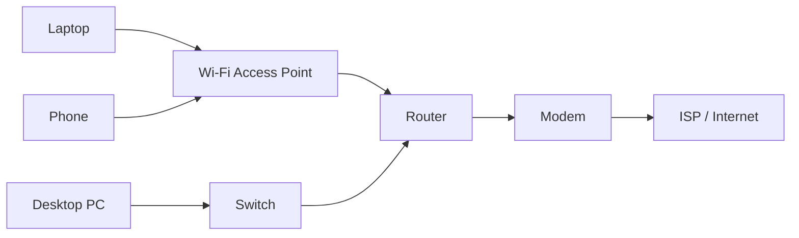
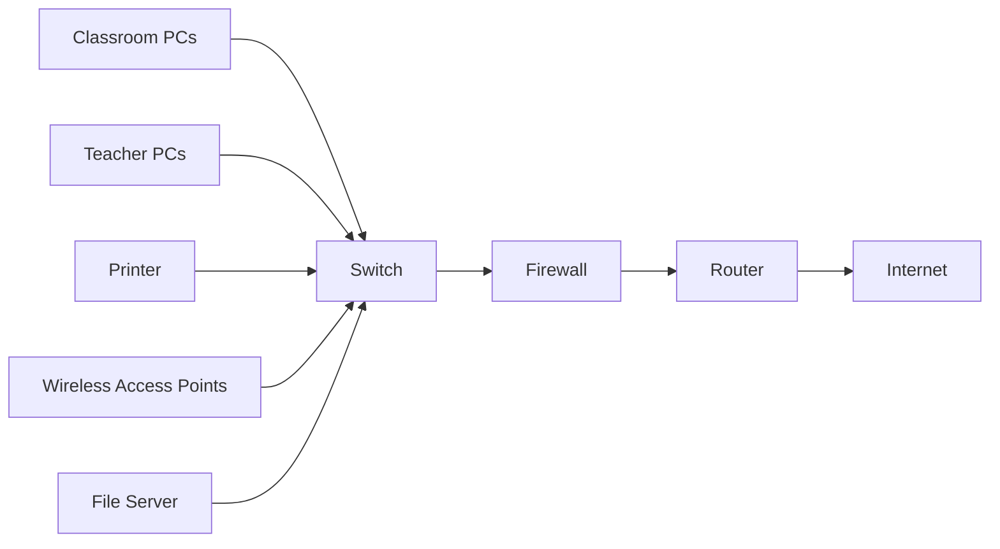
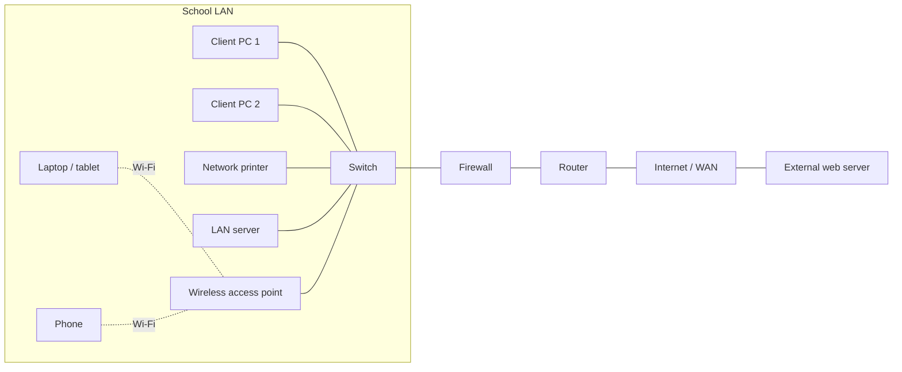

# Network Devices

## Page map

- [Lesson goals](#1-lesson-goals)
- [Syllabus mapping](#2-syllabus-mapping)
- [Core checklist](#core-checklist)
- [Key terms and detailed lesson](#3-key-terms)

---

## 1. Lesson Goals

By the end of this lesson, students should be able to:

- identify common network devices
- explain the role of a network interface card
- explain the role of a switch
- explain the role of a router
- explain the role of a wireless access point
- explain the role of a modem
- explain the role of a firewall
- distinguish switch, router, modem, and access point
- explain how network devices work together in home and school networks
- choose suitable network devices for different scenarios
- avoid common misconceptions about network devices
- answer exam-style questions about network devices

---

## 2. Syllabus Mapping

| Item | Detail |
|---|---|
| Unit | A2 Networks |
| Label | SL Core |
| Main skill | Understanding how devices connect, forward, and protect network communication |
| Connected topics | Network fundamentals, LAN/WAN, TCP/IP, packet switching, DNS, web access, network security |
| Practical focus | Explaining network device roles in home, school, and business networks |
| Exam relevance | Definitions, device role explanation, comparison, scenario selection |

::: tip Learning Focus
Students often mix up routers, switches, modems, and wireless access points. The key is to explain what each device does in the path of network communication.
:::

---

## Start here: each device has a network job

Network devices move, direct, connect, or protect data in a network.

Students should learn what problem each device solves. In exam answers, the key skill is matching the device role to the scenario.

Do not just name a device; explain why it is needed.

---

## Network device role table

| Device | Main role | Address used, if relevant | Works mainly | Common exam phrase |
|---|---|---|---|---|
| Switch | connects devices within a LAN and forwards data to the correct device | MAC address | inside a LAN | A switch forwards data within a LAN using MAC addresses. |
| Router | connects different networks and forwards packets between them | IP address and routing table | between networks | A router connects different networks and forwards packets using IP addresses. |
| Wireless access point / WAP | allows wireless devices to connect to a wired LAN | MAC address for local wireless clients | inside a LAN / WLAN | A WAP provides wireless access to a LAN. |
| Modem | connects a local network to an ISP service line | not usually the key exam address point | between home/school network and ISP service | A modem connects a local network to an internet service line. |
| NIC | allows an end device to connect to a network | MAC address | inside the device | A NIC allows a device to send and receive network data. |
| Firewall | filters traffic based on security rules | IP address, port, protocol, or application rules | at network boundary or on a device | A firewall monitors and filters network traffic according to rules. |
| Server | provides services or resources to clients | IP address / service name | inside LAN or on the internet | A server provides services such as files, web pages, DNS, DHCP, or authentication. |
| Hub | older device that broadcasts data to all ports | no intelligent MAC forwarding | inside older LANs | A hub is less efficient than a switch because it broadcasts data to all connected devices. |

---

## Device detail table

| Device | Simple Chinese explanation | English keyword definition | What it connects | How it forwards or controls data | School / hospital / office example | Common exam wording |
|---|---|---|---|---|---|---|
| Router | 连接不同网络，例如 LAN 和 internet | Connects different networks and routes packets | LAN to WAN/internet, branch networks, cloud networks | Uses IP addresses and routing tables to choose where packets go next | A school router connects the school LAN to the internet | Router connects different networks and forwards packets using IP addresses |
| Switch | 连接同一个 LAN 内的设备 | Connects devices inside a LAN | PCs, printers, servers, WAPs inside one LAN | Uses MAC addresses to forward frames to the correct port | A computer lab switch connects 30 PCs and a printer | Switch forwards data within a LAN using MAC addresses |
| Wireless access point / WAP | 让无线设备接入 LAN | Provides wireless access to a LAN | Laptops, tablets, phones, wireless NICs to the wired LAN | Receives wireless traffic and passes it to the LAN; sends LAN traffic back wirelessly | Hospital tablets connect to the hospital LAN through WAPs | WAP allows wireless devices to connect to a LAN |
| Modem | 连接 ISP 线路 | Connects to an ISP service line | Local router/network to DSL, cable, fibre terminal, or mobile broadband service | Converts or handles signals needed for the ISP connection | An office modem connects the office router to the ISP service | Modem links the local network to an internet service provider line |
| NIC | 让设备能够加入网络 | Network interface hardware in a device | Computer/phone/server to wired Ethernet or Wi-Fi | Sends and receives signals and has a MAC address | A desktop PC uses an Ethernet NIC to join the office LAN | NIC allows a device to connect to a network |
| Firewall | 按规则过滤网络流量 | Filters incoming and outgoing traffic according to rules | Internal LAN and external network, or software on one device | Allows or blocks traffic by rules such as IP address, port, protocol, or application | A school firewall blocks unauthorized access from the internet | Firewall monitors and filters traffic according to rules |
| Server | 向客户端提供服务或资源 | Provides network services to client devices | Client devices to shared files, web pages, DNS, DHCP, or login services | Responds to client requests and provides the requested service | A school file server stores shared class folders | Server provides services or resources to client devices |
| Hub | 旧式设备，效率低于 switch | Older basic LAN device that broadcasts traffic | Wired devices in a simple LAN | Sends incoming data to every connected port instead of the correct one | Rare in modern schools; replaced by switches | Hub broadcasts to all devices and is less efficient than a switch |

---

## Troubleshooting workflow

When solving a network device scenario, use this order:

1. Identify what the network needs to do.
2. Decide whether devices are communicating inside one LAN or between networks.
3. Check whether the issue is wired connection, wireless access, internet connection, or security.
4. Match the issue to a likely device.
5. Explain the role of that device in the scenario.
6. If asked to recommend a device, justify the choice using the scenario details.

---

## Core checklist

By the end of this page, you should be able to:

- explain the purpose of a switch
- explain the purpose of a router
- explain the purpose of a modem
- explain the purpose of a wireless access point
- explain the purpose of a firewall
- distinguish LAN communication from communication between networks
- choose a suitable device for a scenario
- explain why a device is needed rather than only naming it

---

## Scenario answer pattern

When answering a network device question, use this order:

1. Identify the problem or network need in the scenario.
2. Name the most suitable device.
3. State the device's main role.
4. Explain how that role solves the scenario problem.
5. If comparing devices, explain why one device is more suitable than another.
6. Use precise terms such as LAN, network, packet, traffic, wireless access, firewall rules, and internet connection when relevant.

---

## Exam focus

| Command term | What to write | Mark strategy |
|---|---|---|
| State | Name the device or role briefly | For 2 marks, give the device and one precise role |
| Outline | Give the main role plus one detail | For 3 marks, add where it works, such as inside LAN or between networks |
| Describe | Give several connected details | For 4 marks, mention role, address used if relevant, and scenario link |
| Explain | Link the device to why it solves a problem | For 6 marks, give device role, data/address detail, scenario benefit, and one limitation/security point if relevant |
| Compare | Give clear differences and similarities | Compare role, address used, location in network, and example |

Avoid vague answers such as:

```text
router gives internet
```

Improve it:

```text
A router connects different networks, such as a school LAN and the internet, and forwards packets using IP addresses and routing tables.
```

---

## Reusable mark-scheme phrases

- "A switch forwards data within a LAN using MAC addresses."
- "A router connects different networks and forwards packets using IP addresses."
- "A firewall monitors and filters network traffic according to rules."
- "NAT translates private IP addresses to a public IP address."
- "A DNS server resolves domain names into IP addresses."
- "A WAP provides wireless access to a LAN."
- "A NIC allows a device to connect to a network and has a MAC address."

---

## Common mistakes table

| Mistake | Why it is wrong | Better answer |
|---|---|---|
| Confusing router and switch | A switch works mainly inside a LAN; a router connects different networks | Switch = LAN/MAC; router = between networks/IP |
| Saying switch uses IP address instead of MAC address | Switches mainly use MAC addresses to forward frames inside a LAN | Mention MAC address and correct switch port |
| Saying router only provides Wi-Fi | A home router box may include Wi-Fi, but routing means connecting networks | Router forwards packets between networks using IP addresses |
| Saying firewall removes viruses | A firewall filters traffic; it does not remove all malware from files/devices | Say it blocks or allows traffic based on rules |
| Confusing WAP with router | A WAP provides wireless access; a router connects networks | In home devices these roles may be combined |
| Forgetting server is a role, not only a physical box | A server can be dedicated hardware, a virtual machine, or software/service | Explain what service it provides |
| Naming a device without explaining its role | Marks often require function and scenario link | State what it connects and how it handles data |
| Treating hub as modern best choice | Hubs broadcast to all ports and are less efficient | A switch is normally preferred in modern LANs |

---

## 3. Key Terms

| English Term | 中文解释 | Exam-style meaning |
|---|---|---|
| Network device | 网络设备 | Hardware used to connect, forward, control, or protect network communication |
| NIC | 网络接口卡 | Hardware that allows a device to connect to a network |
| Switch | 交换机 | Device that connects devices within a LAN |
| Router | 路由器 | Device that forwards data between different networks |
| Wireless access point | 无线接入点 | Device that allows wireless devices to connect to a wired network |
| Modem | 调制解调器 | Device that connects a local network to an ISP service |
| Firewall | 防火墙 | Hardware/software that filters network traffic based on rules |
| Server | 服务器 | Computer or service that provides resources to client devices |
| Hub | 集线器 | Basic device that broadcasts data to all connected devices |
| Repeater | 中继器 | Device that regenerates or extends signals |
| Bridge | 网桥 | Device that connects network segments |
| Gateway | 网关 | Device that connects different networks or protocol environments |
| NAT | 网络地址转换 | Translates private internal IP addresses to a public IP address |
| DNS server | DNS 服务器 | Server that resolves domain names into IP addresses |
| DHCP server | DHCP 服务器 | Server that automatically gives IP configuration to devices |
| Packet | 数据包 | Small unit of data sent across a network |
| Frame | 帧 | Data unit used on local network links |
| MAC address | MAC 地址 | Hardware address used for local network delivery |
| IP address | IP 地址 | Logical address used for network routing |
| Port | 端口 | Physical connector or logical communication endpoint |
| Network topology | 网络拓扑 | Arrangement of devices and connections in a network |

---

## 4. Concept Explanation

<LangBlock>
<template #cn>

### 中文讲解

网络中的设备需要通过不同的 **network devices（网络设备）** 连接起来。  
这些设备的作用不是完全一样的。

例如：

```text
NIC 让电脑可以连接网络
switch 连接同一个 LAN 里的多个设备
router 连接不同网络，例如 home LAN 和 internet
wireless access point 让无线设备接入网络
modem 连接 ISP 提供的互联网线路
firewall 根据规则过滤流量
```

很多家庭路由器看起来只有一个盒子，但它其实可能同时包含：

```text
router
switch
wireless access point
firewall
sometimes modem
```

所以学习时不要只看设备外观，而要看它的功能。

例如学校网络中：

```text
student computers connect to switches
wireless devices connect to access points
switches connect to router/firewall
router connects school LAN to internet
firewall controls allowed and blocked traffic
```

简单来说：

```text
switch = connects devices inside a LAN
router = connects different networks
access point = provides Wi-Fi connection
modem = connects to ISP line
firewall = filters traffic for security
NIC = lets a device join the network
```

</template>

<template #en>

### English Explanation

Devices in a network are connected using different **network devices**.  
These devices do not all do the same job.

For example:

```text
NIC allows a computer to connect to a network
switch connects multiple devices inside the same LAN
router connects different networks, such as home LAN and internet
wireless access point allows wireless devices to join a network
modem connects to the internet service provided by an ISP
firewall filters traffic based on rules
```

Many home routers look like one single box, but they may actually combine several functions:

```text
router
switch
wireless access point
firewall
sometimes modem
```

So when learning, do not only look at the physical box. Look at the function.

For example, in a school network:

```text
student computers connect to switches
wireless devices connect to access points
switches connect to router/firewall
router connects school LAN to internet
firewall controls allowed and blocked traffic
```

In simple terms:

```text
switch = connects devices inside a LAN
router = connects different networks
access point = provides Wi-Fi connection
modem = connects to ISP line
firewall = filters traffic for security
NIC = lets a device join the network
```

</template>
</LangBlock>

---

## 5. Big Picture: Devices in a Network

A small network may include:

```text
end-user devices
network interface cards
switches
wireless access points
routers
modems
firewalls
servers
printers
```

### Simple Home Network



### Simple School Network



### Exam network diagram



In this diagram, client devices and the server are inside the LAN. The WAP lets wireless devices join the LAN. The switch connects LAN devices. The firewall filters traffic between the LAN and the internet. The router connects the LAN to the internet/WAN.

---

## 6. Network Interface Card: NIC

A **Network Interface Card**, or **NIC**, allows a device to connect to a network.

It may support:

```text
wired Ethernet
Wi-Fi
Bluetooth
mobile network
```

### Role

A NIC:

```text
connects a device to a network
sends and receives network signals
has a MAC address
converts data into signals and signals back into data
```

### Examples

```text
Ethernet port in desktop computer
Wi-Fi adapter in laptop
network chip in phone
USB Ethernet adapter
```

::: tip Exam Phrase
A NIC is hardware that allows a device to connect to a network and send or receive data.
:::

---

## 7. MAC Address

A NIC usually has a MAC address.

A MAC address is a hardware address used to identify a network interface on a local network.

Example format:

```text
A4:5E:60:12:9F:22
```

### Why It Matters

On a LAN, devices need to know which local device should receive a frame.

A switch can use MAC addresses to forward data to the correct port.

### MAC vs IP Preview

| MAC Address | IP Address |
|---|---|
| hardware address | logical/network address |
| used mainly on local network | used for routing between networks |
| linked to network interface | assigned by network configuration |
| usually fixed | can change |

---

## 8. Switch

A switch connects devices within a LAN.

### Role

A switch:

```text
connects multiple wired devices
receives frames
uses MAC addresses to decide where to forward data
reduces unnecessary traffic compared with a hub
helps build a LAN
```

### Switch example

In a school computer lab:

```text
30 computers connect to a switch
printer connects to the switch
server connects to the switch
```

The switch forwards data between devices in the same local network.

::: tip Exam Phrase
A switch connects devices within a LAN and forwards data to the correct device using MAC addresses.
:::

---

## 9. Switch vs Hub

A hub is an older/basic device.

### Hub

A hub broadcasts data to all connected devices.

```text
data comes in
hub sends it out to every port
```

### Switch

A switch forwards data only to the correct destination port where possible.

```text
data comes in
switch checks destination MAC address
switch sends it to the correct port
```

### Comparison

| Hub | Switch |
|---|---|
| broadcasts to all devices | forwards to intended device |
| less efficient | more efficient |
| more collisions in older Ethernet | reduces unnecessary traffic |
| simple/older | common in modern LANs |

---

## 10. Router

A router connects different networks together.

### Role

A router:

```text
connects LAN to WAN/internet
forwards packets between networks
uses IP addresses
chooses routes for data
may perform NAT in home networks
may include firewall functions
```

### Router example

A home router connects:

```text
home LAN
to
internet through ISP
```

A school router connects:

```text
school LAN
to
internet or wider school group network
```

::: tip Exam Phrase
A router forwards data between different networks using IP addresses.
:::

---

## 11. Switch vs Router

| Feature | Switch | Router |
|---|---|---|
| Main role | connects devices within a LAN | connects different networks |
| Address mainly used | MAC address | IP address |
| Typical location | inside LAN | boundary between networks |
| Example | connects PCs to school LAN | connects school LAN to internet |
| Data unit idea | frame | packet |

### Quick Memory

```text
switch = inside LAN
router = between networks
```

---

## 12. Wireless Access Point

A wireless access point, or WAP/AP, allows wireless devices to connect to a wired network.

### Role

A wireless access point:

```text
provides Wi-Fi signal
connects wireless devices to LAN
communicates with wireless clients
passes traffic to wired network
```

### Wireless access point example

In a school:

```text
phones, tablets, and laptops connect to Wi-Fi access points
access points connect to switches
switches connect to the rest of the school network
```

### Important

A wireless access point is not always the same as a router.

In many homes, one physical box includes both:

```text
router function
wireless access point function
```

But in larger networks, access points and routers are often separate devices.

---

## 13. Modem

A modem connects a local network to an internet service line.

The word originally means:

```text
modulator-demodulator
```

Modern modems connect to ISP technologies such as:

```text
DSL
cable
fibre terminal / ONT in some setups
mobile broadband
```

### Role

A modem:

```text
connects to the ISP line
converts signals where needed
allows local router/network to access ISP service
```

### Modem example: Home Example

```text
laptop → router → modem → ISP → internet
```

### Important

Some home devices combine:

```text
modem + router + switch + Wi-Fi access point
```

in one box.

---

## 14. Router vs Modem

| Feature | Router | Modem |
|---|---|---|
| Main role | connects networks and routes packets | connects to ISP service line |
| Common use | links LAN to WAN/internet | provides internet service connection |
| Address/routing | uses IP routing | handles ISP signal connection |
| Home setup | may share internet to many devices | connects home to ISP |
| Combined device? | often combined in home gateway | often combined in home gateway |

### Quick Memory

```text
modem = connects to ISP line
router = shares/routes connection between networks
```

---

## 15. Firewall

A firewall filters network traffic based on rules.

It can be:

```text
hardware
software
or both
```

### Role

A firewall can:

```text
monitor incoming and outgoing traffic
block unauthorized traffic
allow permitted traffic
filter by IP address, port, protocol, or application
protect internal network
log suspicious activity
```

It applies rules to decide whether traffic should be allowed or blocked. It can be linked to:

```text
NAT
access control
network security
traffic logging
```

### Firewall example

A school firewall may block:

```text
malicious websites
unauthorized external access
some gaming or streaming sites
unknown inbound traffic
```

It may allow:

```text
school learning platforms
email
approved websites
secure web traffic
```

::: tip Exam Phrase
A firewall monitors and filters incoming and outgoing network traffic based on security rules.
:::

---

## 16. Hardware Firewall vs Software Firewall

| Hardware Firewall | Software Firewall |
|---|---|
| separate device or network appliance | installed on a computer/device |
| protects network or network segment | protects individual device |
| often used in schools/companies | common on laptops/desktops |
| managed by IT/network admin | managed by user or OS |

### Firewall example

A school may use a hardware firewall at the network boundary.  
A student laptop may also have a software firewall in the operating system.

---

## 17. NAT: Network Address Translation

NAT translates private internal IP addresses to a public IP address.

In many home or school networks, many devices use private addresses inside the LAN, such as:

```text
192.168.x.x
10.x.x.x
```

When these devices access the internet, NAT allows them to share one public IP address.

### Why NAT Is Used

```text
allows many LAN devices to share one public IP address
helps hide internal private addresses from external networks
is often performed by a router or firewall
supports normal internet access from private networks
```

::: tip Exam Phrase
NAT translates private IP addresses used inside a LAN to a public IP address used on the internet.
:::

---

## 18. Servers in a Network

A server provides a service or resource to client devices.

| Server type | Role |
|---|---|
| File server | Stores and shares files for users on the network |
| Web server | Hosts web pages or web applications |
| DNS server | Resolves domain names into IP addresses |
| DHCP server | Automatically assigns IP addresses and network settings to devices |
| Authentication server | Checks user login details and controls access to network resources |

::: tip Exam Phrase
A server is a role: it provides a service to client devices. It may be a physical computer, a virtual machine, or a software service.
:::

---

## 19. Repeater

A repeater regenerates or boosts a signal so it can travel further.

### Role

A repeater:

```text
receives weakened signal
regenerates signal
forwards it onward
```

### Example

A Wi-Fi range extender is a type of repeater-like device that extends wireless coverage.

### Limitation

Repeaters can extend range, but they do not necessarily improve bandwidth or reduce congestion.

---

## 20. Bridge

A bridge connects two network segments.

It can reduce traffic by separating parts of a LAN and forwarding traffic only when needed.

### Simple Example

```text
Segment A ---- Bridge ---- Segment B
```

In modern networks, switches have largely replaced many traditional bridge functions.

---

## 21. Gateway

A gateway connects networks or systems that may use different protocols or environments.

### Example Uses

```text
connecting local network to external network
translating between protocols
connecting IoT network to internet
connecting internal system to cloud service
```

### Simple Understanding

A gateway is a connection point between different network systems.

::: info Level Control
Gateway can mean different things depending on context. In many home networks, the router acts as the default gateway.
:::

---

## 22. Network Devices in a Home Network

A home network may use one physical box that combines many roles.

### Home Gateway May Include

```text
router
switch
wireless access point
firewall
sometimes modem
```

### Troubleshooting example: Example Path

When a phone opens a website:

```text
phone Wi-Fi NIC
→ wireless access point
→ router
→ modem
→ ISP
→ internet
→ web server
```

### Why This Confuses Students

Because the box is often called "the router", but it may perform several functions.

---

## 23. Network Devices in a School Network

A school network usually separates roles more clearly.

### Possible Devices

```text
switches in classrooms
wireless access points in corridors
central router
firewall
servers
internet connection equipment
network printers
```

### Example

When a student accesses a local file server:

```text
student PC
→ switch
→ server
```

When a student opens a website:

```text
student PC
→ switch
→ firewall
→ router
→ ISP
→ internet
```

---

## 24. Network Devices in Cloud Access

When a user accesses cloud storage:

```text
laptop
→ Wi-Fi access point
→ switch
→ router/firewall
→ ISP
→ internet routers
→ cloud data centre
→ cloud server
```

This involves:

```text
local LAN devices
WAN infrastructure
cloud provider network devices
servers
security systems
```

---

## 25. Choosing Network Devices

### Scenario Table

| Scenario | Suitable Device | Reason |
|---|---|---|
| connect many PCs in one classroom | switch | connects devices in LAN |
| connect school LAN to internet | router | forwards data between networks |
| provide Wi-Fi in library | wireless access point | allows wireless connection |
| connect home to ISP line | modem | connects to ISP service |
| block unauthorized traffic | firewall | filters traffic by rules |
| extend weak signal | repeater / extender | regenerates or extends signal |
| allow laptop to join Ethernet | NIC / adapter | network interface |

---

## 26. Performance Considerations

Network device choice can affect performance.

Factors include:

```text
number of ports
supported speed
wireless standard
signal range
processing capacity
firewall throughput
number of connected users
cable quality
placement of access points
```

### Example

A slow switch or overloaded access point can reduce network performance even if the internet connection is fast.

---

## 27. Security Considerations

Network devices can improve or weaken security.

### Good Practices

```text
change default admin passwords
update firmware
use strong Wi-Fi encryption
configure firewall rules
disable unused services
separate guest network
monitor unusual traffic
physically secure network equipment
```

### Example

If a school leaves a router with default password, attackers may change settings or access the network.

---

## 28. Troubleshooting example: Using Device Roles

Understanding device roles helps identify problems.

| Problem | Possible Device/Area |
|---|---|
| one PC cannot connect | NIC, cable, device settings |
| all classroom PCs cannot connect | switch, uplink cable |
| Wi-Fi works poorly in one area | access point placement/range |
| LAN works but internet does not | router, modem, ISP |
| website blocked | firewall rule |
| slow cloud access | router, ISP, WAN, server, congestion |

---

## 29. Detailed common mistakes table

| Mistake | Why it is wrong | Better understanding |
|---|---|---|
| Router and switch are the same | Router connects networks; switch connects LAN devices | Different roles |
| Modem and router are always the same | They can be combined but have different roles | Modem connects ISP line; router routes |
| Access point is always a router | AP provides Wi-Fi access | Router connects networks |
| Firewall is only hardware | Firewall can be hardware or software | It filters traffic |
| Switch sends data to everyone like a hub | Switch forwards using MAC addresses | Hub broadcasts |
| NIC is software | NIC is hardware | It allows network connection |
| Wi-Fi means no network devices | Wi-Fi uses access points and NICs | Wireless still needs infrastructure |
| More access points always improves Wi-Fi | Poor placement/interference can hurt | Plan coverage and channels |
| Firewall stops all attacks | It reduces risk but is not complete security | Also need updates, passwords, monitoring |
| Home router is only a router | It often combines router, switch, AP, firewall, modem | One box can have many functions |

---

## 30. Guided Practice

### Practice 1: Device Role

Which device connects multiple computers inside a LAN?

<details>
<summary>Suggested Answer</summary>

A switch connects multiple devices inside a LAN.

</details>

---

### Practice 2: Router or Switch?

Which device connects a LAN to the internet?

<details>
<summary>Suggested Answer</summary>

A router connects different networks, such as a LAN to the internet.

</details>

---

### Practice 3: Access Point

What is the role of a wireless access point?

<details>
<summary>Suggested Answer</summary>

A wireless access point allows wireless devices to connect to a wired network or LAN using Wi-Fi.

</details>

---

### Practice 4: Firewall

What does a firewall do?

<details>
<summary>Suggested Answer</summary>

A firewall monitors and filters incoming and outgoing network traffic based on rules.

</details>

---

### Practice 5: Home Network Box

A home device includes Wi-Fi, Ethernet ports, firewall settings, and internet connection sharing. Why might calling it only a router be incomplete?

<details>
<summary>Suggested Answer</summary>

Because it may combine several functions, such as router, switch, wireless access point, firewall, and sometimes modem.

</details>

---

## 31. Quick-check questions with short answers

| Question | Short answer |
|---|---|
| What address does a switch mainly use inside a LAN? | MAC address |
| What address does a router mainly use to forward packets? | IP address |
| Which device connects different networks? | Router |
| Which device connects devices inside a LAN? | Switch |
| Why is a hub less efficient than a switch? | A hub broadcasts to all ports; a switch forwards to the correct port where possible |
| What does a WAP do? | Provides wireless access to a LAN |
| What does a NIC do? | Allows a device to connect to a network |
| What does a firewall do? | Monitors and filters traffic according to rules |
| What does NAT do? | Translates private internal IP addresses to a public IP address |
| What does a DNS server do? | Resolves domain names into IP addresses |

---

## 32. Independent Practice

### Question 1

Define network interface card.

### Question 2

Explain the role of a switch.

### Question 3

Explain the role of a router.

### Question 4

Explain the difference between a router and a modem.

### Question 5

Explain the role of a wireless access point.

### Question 6

Explain the role of a firewall.

### Question 7

Compare a hub and a switch.

### Question 8

A school wants to connect 40 computers in a computer lab. Which network device is suitable and why?

### Question 9

A school wants Wi-Fi across a large campus. Which devices are needed and what should be considered?

### Question 10

Describe the path data may take when a student laptop accesses a website from school Wi-Fi.

---

## 33. Exam-style Questions

### Question 1 [4 marks]

Define switch and state its role in a LAN.

<details>
<summary>Mark Scheme Style Answer</summary>

A switch is a network device that connects devices within a LAN. It receives frames and forwards them to the correct device or port using MAC addresses, reducing unnecessary traffic compared with a hub.

</details>

---

### Question 2 [4 marks]

Define router and state its role.

<details>
<summary>Mark Scheme Style Answer</summary>

A router is a network device that connects different networks and forwards packets between them using IP addresses. It is commonly used to connect a LAN to a WAN or the internet.

</details>

---

### Question 3 [5 marks]

Distinguish between a switch and a router.

<details>
<summary>Mark Scheme Style Answer</summary>

A switch connects devices within the same LAN and mainly forwards data using MAC addresses. A router connects different networks, such as a LAN and the internet, and forwards packets using IP addresses. A switch is usually used inside a local network, while a router is used between networks.

</details>

---

### Question 4 [6 marks]

Explain how a firewall and NAT may be used in a school network connected to the internet.

<details>
<summary>Mark Scheme Style Answer</summary>

A firewall monitors and filters incoming and outgoing network traffic based on security rules. In a school network, it can block unauthorized external access, restrict access to harmful or inappropriate websites, and allow approved traffic. NAT translates private internal IP addresses used by school devices into a public IP address for internet communication. This allows many devices in the LAN to share one public IP address and helps hide internal addresses from external networks.

</details>

---

### Question 5 [6 marks]

A school wants to provide wired and wireless network access for classrooms. Identify three network devices needed and explain their roles.

<details>
<summary>Mark Scheme Style Answer</summary>

A switch can connect wired classroom computers and printers within the LAN. Wireless access points can allow laptops, tablets, and phones to connect using Wi-Fi. A router can connect the school LAN to another network such as the internet. A firewall may also be used to filter traffic and protect the school network.

</details>

---

## 34. Independent practice
### Independent practice part A: Concept Explanation

In 5-6 sentences, explain the difference between switch, router, modem, and wireless access point.

---

### Independent practice part B: Device Table

Create a table for:

```text
NIC
switch
router
wireless access point
modem
firewall
```

Include:

```text
main role
where it is used
one example
```

---

### Independent practice part C: Network Diagram

Draw a simple home or school network and label:

```text
clients
switch
router
wireless access point
modem
firewall
internet
server or printer
```

---

### Independent practice part D: Written Answer

Explain why a firewall is useful but is not enough by itself to fully secure a network.

---

## 35. One-page Revision Summary

| Device | Main Role |
|---|---|
| NIC | lets a device connect to a network |
| Switch | connects devices within a LAN |
| Router | connects different networks |
| Wireless access point | allows wireless devices to join LAN |
| Modem | connects to ISP service line |
| Firewall | filters traffic based on rules |
| Server | provides services or resources to clients |
| DNS server | resolves domain names into IP addresses |
| DHCP server | assigns IP addresses and network settings automatically |
| NAT | translates private IP addresses to a public IP address |
| Hub | broadcasts to all connected devices |
| Repeater | regenerates/extends signal |
| Bridge | connects network segments |
| Gateway | connects different networks/systems |
| MAC address | local hardware address |
| IP address | logical address used for routing |
| Exam phrase | Switches connect LAN devices using MAC addresses, routers connect networks using IP addresses, access points provide Wi-Fi, modems connect to ISP service, and firewalls filter traffic |

---

## 36. Quick Self-test

Before moving on, students should be able to answer these:

1. What does a NIC do?
2. What does a switch do?
3. What does a router do?
4. What does a wireless access point do?
5. What does a modem do?
6. What does a firewall do?
7. What is the difference between a switch and a hub?
8. What is the difference between a router and a modem?
9. Why can one home box have many network functions?
10. Which device usually connects devices inside a LAN?
