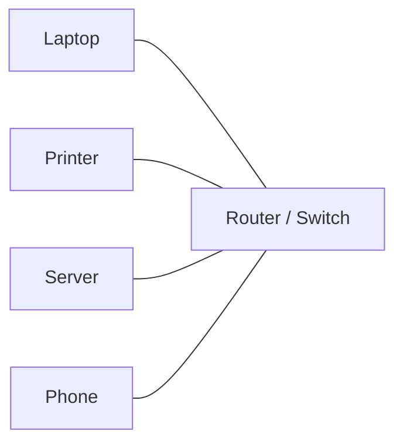
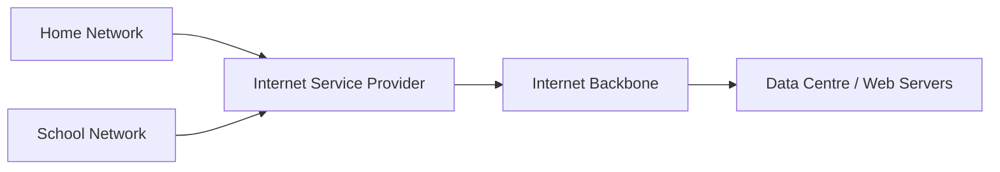

# Network Fundamentals

## 1. Lesson Goals

By the end of this lesson, students should be able to:

- define computer network
- explain why computers are connected in networks
- identify common network components
- distinguish client, server, host, node, and device
- explain the difference between data, signal, and transmission at a basic level
- explain the purpose of protocols
- describe common benefits and risks of networking
- explain bandwidth, latency, and throughput at a basic level
- distinguish wired and wireless communication at an introductory level
- explain how data can be shared across a network
- connect network fundamentals to LAN, WAN, packet switching, TCP/IP, DNS, web access, and network security
- answer exam-style questions about basic networking concepts

---

## 2. Syllabus Mapping

| Item | Detail |
|---|---|
| Unit | A2 Networks |
| Label | SL Core |
| Main skill | Understanding why networks exist and how devices communicate |
| Connected topics | LAN/WAN, network devices, client-server, peer-to-peer, TCP/IP, packet switching, DNS, network security |
| Practical focus | Explaining network concepts using school, home, and web access examples |
| Exam relevance | Definitions, scenario explanation, advantages/disadvantages, basic network terminology |

::: tip Learning Focus
A network is not just “the internet”. A network is any set of connected devices that can communicate and share data or resources.
:::

---

## 3. Key Terms

| English Term | 中文解释 | Exam-style meaning |
|---|---|---|
| Network | 网络 | Two or more devices connected so they can communicate |
| Computer network | 计算机网络 | Connected computers/devices that exchange data and share resources |
| Node | 节点 | Any device connected to a network |
| Host | 主机 | Device on a network that can send or receive data |
| Client | 客户端 | Device or program that requests services or resources |
| Server | 服务器 | Computer or program that provides services or resources |
| Resource sharing | 资源共享 | Sharing files, printers, storage, or internet access |
| Communication | 通信 | Sending and receiving data between devices |
| Data transmission | 数据传输 | Movement of data from one device to another |
| Signal | 信号 | Electrical, light, or radio representation of data |
| Protocol | 协议 | Set of rules for communication |
| Bandwidth | 带宽 | Maximum data transfer capacity of a connection |
| Throughput | 吞吐量 | Actual data transfer rate achieved |
| Latency | 延迟 | Time delay before data starts or arrives |
| Wired network | 有线网络 | Network using physical cables |
| Wireless network | 无线网络 | Network using radio signals |
| IP address | IP 地址 | Address used to identify a device on a network |
| MAC address | MAC 地址 | Hardware address of a network interface |
| Packet | 数据包 | Small unit of data sent across a network |
| Internet | 互联网 | Global network of connected networks |

---

## 4. Concept Explanation

<LangBlock>
<template #cn>

### 中文讲解

**Network（网络）** 是由两个或更多设备连接起来形成的系统。  
这些设备可以互相发送数据、共享资源或访问服务。

例如：

```text
学校电脑连接到打印机
手机连接到 Wi-Fi
电脑访问网站
学生在云端共享文档
游戏客户端连接到服务器
```

网络的核心目的包括：

```text
communication
resource sharing
data sharing
centralized services
internet access
collaboration
```

但是网络也会带来风险：

```text
unauthorized access
malware spreading
data interception
privacy issues
service failure
dependency on network connection
```

学习 A2 时，要先建立一个整体图景：

```text
device sends data
network devices forward data
rules / protocols control communication
data may be split into packets
destination receives and reassembles data
security protects the communication
```

简单来说：

```text
network = connected devices communicating and sharing resources
```

</template>

<template #en>

### English Explanation

A **network** is a system formed by connecting two or more devices.  
These devices can send data to each other, share resources, or access services.

Examples include:

```text
school computers connected to a printer
phone connected to Wi-Fi
computer accessing a website
students sharing documents through cloud services
game client connected to a server
```

The main purposes of networks include:

```text
communication
resource sharing
data sharing
centralized services
internet access
collaboration
```

However, networks also create risks:

```text
unauthorized access
malware spreading
data interception
privacy issues
service failure
dependency on network connection
```

When studying A2, students should first build the big picture:

```text
device sends data
network devices forward data
rules / protocols control communication
data may be split into packets
destination receives and reassembles data
security protects the communication
```

In simple terms:

```text
network = connected devices communicating and sharing resources
```

</template>
</LangBlock>

---

## 5. What Is a Computer Network?

A computer network is a group of connected devices that can communicate and share data or resources.

### Examples

```text
home Wi-Fi network
school computer network
office network
mobile phone network
internet
online game network
bank ATM network
cloud service network
```

### Minimum Requirement

A basic network needs:

```text
at least two devices
a way to connect them
rules for communication
```

### Simple Diagram



---

## 6. Why Networks Are Used

Networks are used because they allow devices and users to share and communicate.

| Purpose | Example |
|---|---|
| Share files | students access shared lesson resources |
| Share hardware | many computers use one printer |
| Share internet access | multiple devices use one router |
| Communication | email, messaging, video calls |
| Centralized storage | school server stores student files |
| Centralized management | school manages accounts and permissions |
| Collaboration | multiple users edit one cloud document |
| Remote access | user accesses files from home |
| Online services | websites, databases, games, streaming |

::: tip Exam Phrase
Networks allow communication and resource sharing between devices, such as sharing files, printers, internet access, and centralized services.
:::

---

## 7. Basic Network Components

A network may include:

```text
clients
servers
routers
switches
access points
network interface cards
transmission media
cables
modems
firewalls
```

### Overview Table

| Component | Basic Role |
|---|---|
| Client | requests services/resources |
| Server | provides services/resources |
| Switch | connects devices in a LAN |
| Router | forwards data between networks |
| Wireless access point | allows wireless devices to join network |
| NIC | hardware allowing device to connect to network |
| Cable | wired transmission medium |
| Modem | connects local network to internet service |
| Firewall | filters network traffic for security |

Detailed network devices will be covered in the **Network Devices** page.

---

## 8. Node, Host, Client, and Server

These terms are related but not identical.

| Term | Meaning | Example |
|---|---|---|
| Node | any device connected to network | laptop, printer, router |
| Host | device that can send/receive network data | laptop, server |
| Client | requests services/resources | web browser requesting webpage |
| Server | provides services/resources | web server sending webpage |

### Example: Opening a Website

```text
client = user's browser/laptop
server = web server hosting the website
```

The client sends a request.  
The server sends a response.

---

## 9. Data Transmission

Data transmission means sending data from one device to another.

### Basic Process

```text
1. Sender prepares data.
2. Data is converted into signals.
3. Signals travel through a medium.
4. Receiver detects signals.
5. Signals are interpreted back into data.
```

### Signal Types

| Medium | Signal Type |
|---|---|
| copper cable | electrical signal |
| fibre optic cable | light signal |
| Wi-Fi | radio signal |
| Bluetooth | radio signal |

### Key Idea

Data is abstract information.  
Signals are the physical way data travels.

---

## 10. Wired and Wireless Connections

Networks may use wired or wireless communication.

### Wired

Examples:

```text
Ethernet cable
fibre optic cable
```

Advantages:

```text
stable connection
often faster
less affected by interference
better security in some situations
```

Disadvantages:

```text
less mobile
requires cables
installation can be harder
```

### Wireless

Examples:

```text
Wi-Fi
Bluetooth
mobile data
```

Advantages:

```text
mobility
convenient
easier for portable devices
less cabling
```

Disadvantages:

```text
interference
range limits
security risks
speed may vary
```

Detailed wired and wireless transmission is covered later.

---

## 11. Protocols

A protocol is a set of rules for communication.

Devices need protocols because they must agree on:

```text
how data is formatted
how data is addressed
how errors are handled
how connections are started/ended
how data is routed
how security is applied
```

### Real-life Analogy

When people communicate, they need shared rules:

```text
language
turn-taking
addressing the listener
format of message
```

Computers also need shared rules. These rules are protocols.

### Examples

```text
TCP
IP
HTTP
HTTPS
DNS
SMTP
FTP
Wi-Fi standards
```

::: tip Exam Phrase
A protocol is a set of rules that defines how data is transmitted and received across a network.
:::

---

## 12. The Internet Is a Network of Networks

The internet is not one single computer or one single cable.

It is a global system of connected networks.

```text
home network
school network
company network
mobile network
data centre network
internet service provider network
```

These networks are connected together.

### Simple Diagram



### Key Idea

A local network connects devices in a small area.  
The internet connects many networks across the world.

---

## 13. IP Address and MAC Address Preview

Devices need addresses so data can be sent to the correct place.

### IP Address

An IP address is used to identify a device on a network and route data between networks.

Example:

```text
192.168.1.25
```

### MAC Address

A MAC address is a hardware address for a network interface.

Example format:

```text
A4:5E:60:12:9F:22
```

### Simple Difference

| IP Address | MAC Address |
|---|---|
| logical/network address | hardware address |
| can change depending on network | usually fixed to network interface |
| used for routing between networks | used for local network communication |

More detail appears in later network pages.

---

## 14. Packets Preview

Data sent over networks is often split into packets.

A packet is a small unit of data.

A packet may contain:

```text
part of the data
source address
destination address
sequence information
error checking information
```

### Why Use Packets?

Packet switching can help:

```text
share network capacity
route data flexibly
recover from lost packets
send large data in smaller parts
```

Detailed packet switching is covered later.

---

## 15. Bandwidth, Throughput, and Latency

These terms describe network performance.

### Bandwidth

Bandwidth is the maximum data transfer capacity of a connection.

Example:

```text
100 Mbps
1 Gbps
```

### Throughput

Throughput is the actual data transfer rate achieved.

It may be lower than bandwidth because of:

```text
network congestion
interference
server limits
device limits
protocol overhead
```

### Latency

Latency is delay.

It is the time taken for data to begin travelling or for a response to be received.

Example:

```text
High latency causes delay in online games or video calls.
```

### Comparison

| Term | Meaning | Simple Analogy |
|---|---|---|
| Bandwidth | maximum capacity | width of road |
| Throughput | actual achieved transfer rate | actual traffic flow |
| Latency | delay | time waiting before movement/response |

---

## 16. Network Speed Is Not Only Bandwidth

A student may think:

```text
Higher bandwidth always means everything feels faster.
```

This is not always true.

Performance also depends on:

```text
latency
server speed
Wi-Fi signal strength
number of users
network congestion
device performance
packet loss
distance
```

### Example

For downloading a large file:

```text
bandwidth matters a lot
```

For online gaming:

```text
latency matters a lot
```

For video calls:

```text
bandwidth, latency, jitter, and packet loss all matter
```

---

## 17. Benefits of Networks

| Benefit | Explanation |
|---|---|
| Resource sharing | users share printers, files, storage, internet |
| Communication | email, chat, video calls |
| Collaboration | shared documents and projects |
| Centralized management | user accounts, permissions, updates |
| Centralized storage | data stored on server/cloud |
| Remote access | access resources from different locations |
| Cost efficiency | fewer duplicated devices may be needed |
| Backup | centralized or cloud backup can be easier |

---

## 18. Risks and Disadvantages of Networks

| Risk / Disadvantage | Explanation |
|---|---|
| Security risk | attackers may access data or systems |
| Malware spread | infection can move between connected devices |
| Privacy risk | data can be intercepted or misused |
| Dependency | if network fails, services may be unavailable |
| Cost | hardware, software, maintenance, staff |
| Complexity | setup and troubleshooting can be difficult |
| Performance issues | congestion or weak signal can slow communication |
| Unauthorized access | weak passwords or poor permissions can expose data |

### Balanced View

Networks are useful, but they must be managed and secured properly.

---

## 19. Network Security Preview

Basic security methods include:

```text
passwords
user accounts
access permissions
firewalls
encryption
secure protocols
anti-malware
updates
VPN
network monitoring
```

### Example

A school network should prevent students from:

```text
accessing admin files
changing system settings
viewing other students' private work
installing unauthorized software
```

Network security is covered in more depth later.

---

## 20. Worked Example: Home Network

A home network may include:

```text
router
Wi-Fi access point
laptop
phone
smart TV
printer
game console
internet connection
```

### What Happens?

```text
devices connect to router
router connects local network to internet
devices can share internet access
devices may communicate with each other
```

### Example Use

A laptop sends a print job to a wireless printer.

```text
laptop = sender/client
printer = receiver/output device
router/access point = forwards wireless traffic
```

---

## 21. Worked Example: School Network

A school network may include:

```text
student computers
teacher laptops
servers
printers
switches
routers
wireless access points
firewall
internet connection
```

### Benefits

```text
students access shared resources
teachers share lesson materials
school manages user accounts
printers are shared
internet access is controlled
files can be backed up centrally
```

### Risks

```text
unauthorized access
student data privacy
malware
network downtime
misconfigured permissions
```

---

## 22. Worked Example: Accessing a Website

When a student opens a website:

```text
1. Student enters URL.
2. Browser acts as client.
3. DNS helps find the server address.
4. Request travels through networks.
5. Web server receives request.
6. Server sends webpage data back.
7. Browser displays webpage.
```

This involves:

```text
client-server model
DNS
protocols
packet transmission
routers
web server
browser
```

These topics are developed in later A2 pages.

---

## 23. Worked Example: Online Game

An online game may use a network to send:

```text
player movement
actions
chat messages
matchmaking data
server updates
game state
```

Important performance factors:

```text
latency
packet loss
server location
bandwidth
network stability
```

### Why Latency Matters

If latency is high:

```text
player actions feel delayed
game state may appear out of sync
competitive gameplay becomes harder
```

---

## 24. Network Fundamentals and Later A2 Topics

This page is the foundation for the rest of A2.

| Later Topic | Connection |
|---|---|
| LAN and WAN | different network sizes and coverage |
| Network Devices | hardware that forwards and manages traffic |
| Client-Server and Peer-to-Peer | network organization models |
| TCP/IP Model | layered protocols for communication |
| Packet Switching | splitting and routing data packets |
| DNS and Web Access | how URLs become server access |
| Wired and Wireless Transmission | how signals travel |
| Network Security | protecting data and devices |
| Encryption, VPN and NAT | privacy, secure access, and address translation |

---

## 25. Common Mistakes

| Mistake | Why it is wrong | Better understanding |
|---|---|---|
| Network means internet only | Internet is one network of networks | Networks can be local or global |
| Router and switch are the same | They have different roles | Switch connects LAN devices; router connects networks |
| Server must be huge | Server can be hardware or software providing services | A small computer can act as server |
| Client means user | Client is a device/program requesting service | User uses a client |
| Wireless always faster | Wired is often faster and more stable | Depends on technology and conditions |
| Bandwidth and latency are the same | Bandwidth is capacity; latency is delay | Both affect performance |
| Cloud storage is not networking | Cloud access depends on networks | Data travels to remote servers |
| Protocol means hardware | Protocol is a rule set | Hardware follows protocol rules |
| IP and MAC address are identical | IP is logical; MAC is hardware address | Different addressing roles |
| Networks are only beneficial | Networks also create risks | Security and management are needed |

---

## 26. Guided Practice

### Practice 1: Define Network

Give a one-sentence definition of a computer network.

<details>
<summary>Suggested Answer</summary>

A computer network is a group of connected devices that can communicate and share data or resources.

</details>

---

### Practice 2: Identify Components

In a school network, classify these:

```text
student laptop
school file server
printer
router
switch
```

<details>
<summary>Suggested Answer</summary>

| Item | Role |
|---|---|
| student laptop | client / host / node |
| school file server | server |
| printer | shared resource / node |
| router | connects networks |
| switch | connects devices in LAN |

</details>

---

### Practice 3: Protocol

Why are protocols needed?

<details>
<summary>Suggested Answer</summary>

Protocols are needed so devices agree on rules for formatting, sending, receiving, addressing, and interpreting data.

</details>

---

### Practice 4: Bandwidth or Latency?

Which is more about delay: bandwidth or latency?

<details>
<summary>Suggested Answer</summary>

Latency is about delay. Bandwidth is about maximum data transfer capacity.

</details>

---

### Practice 5: Benefit and Risk

Give one benefit and one risk of a school network.

<details>
<summary>Suggested Answer</summary>

Benefit: students can access shared files or printers.  
Risk: unauthorized users may access private data if security is weak.

</details>

---

## 27. Independent Practice

### Question 1

Define computer network.

### Question 2

Give four reasons why networks are used.

### Question 3

Explain the difference between client and server.

### Question 4

Explain why protocols are needed in network communication.

### Question 5

Distinguish between bandwidth and latency.

### Question 6

Give two advantages and two disadvantages of wireless networking.

### Question 7

Explain why a school network needs security.

### Question 8

Describe what happens when a user accesses a website at a simple level.

### Question 9

Explain how a home network can share internet access.

### Question 10

Explain why the internet is described as a network of networks.

---

## 28. Exam-style Questions

### Question 1 [4 marks]

Define computer network and give two examples of resources that can be shared on a network.

<details>
<summary>Mark Scheme Style Answer</summary>

A computer network is two or more devices connected so they can communicate and share data or resources. Shared resources may include files, printers, storage, internet access, servers, databases, and applications.

</details>

---

### Question 2 [5 marks]

Explain two benefits of using a network in a school.

<details>
<summary>Mark Scheme Style Answer</summary>

A network allows resource sharing, so students and teachers can share printers, files, internet access, or storage. It also supports centralized management, allowing the school to manage user accounts, permissions, software updates, and backups more easily. It can also improve communication and collaboration through shared documents or learning platforms.

</details>

---

### Question 3 [5 marks]

Distinguish between a client and a server.

<details>
<summary>Mark Scheme Style Answer</summary>

A client is a device or program that requests a service or resource from another system, such as a web browser requesting a webpage. A server provides services or resources to clients, such as a web server sending webpage data or a file server providing files.

</details>

---

### Question 4 [6 marks]

Explain bandwidth, throughput, and latency.

<details>
<summary>Mark Scheme Style Answer</summary>

Bandwidth is the maximum data transfer capacity of a network connection. Throughput is the actual data transfer rate achieved, which may be lower than bandwidth due to congestion, interference, or device limits. Latency is the delay before data arrives or before a response is received. High latency can affect real-time applications such as online games and video calls.

</details>

---

### Question 5 [6 marks]

A school connects student computers, servers, printers, and internet access in a network. Explain two risks and one way to reduce one of the risks.

<details>
<summary>Mark Scheme Style Answer</summary>

One risk is unauthorized access to student or staff data if permissions are weak. Another risk is malware spreading between connected devices. To reduce unauthorized access, the school can use user accounts, strong passwords, access permissions, and firewalls. To reduce malware risk, it can use anti-malware software, updates, and restricted installation permissions.

</details>

---

## 29. Classroom Activity

### Activity 1: Network Map

Students draw a simple home or school network with:

```text
clients
server
printer
router
switch
wireless access point
internet
```

They label the role of each component.

---

### Activity 2: Benefit vs Risk Sort

Students sort cards into:

```text
benefit
risk
both / depends
```

Cards:

```text
file sharing
centralized storage
internet access
malware spread
remote access
communication
unauthorized access
network downtime
```

---

### Activity 3: Website Access Story

Students create a step-by-step story for opening a website using these words:

```text
browser
client
server
DNS
router
packets
protocol
response
```

---

## 30. Homework

### Homework Part A: Concept Explanation

In 5-6 sentences, explain what a computer network is and why networks are useful.

---

### Homework Part B: Scenario Analysis

A school wants to connect 30 classroom computers, 3 printers, a file server, and internet access.

Explain:

```text
1. why a network is useful
2. what resources can be shared
3. what risks the school should consider
4. one security measure the school should use
```

---

### Homework Part C: Vocabulary Table

Create a table for:

```text
client
server
node
protocol
bandwidth
latency
packet
router
switch
```

Include:

```text
meaning
one example
```

---

### Homework Part D: Written Answer

Explain why high bandwidth does not always mean a network will feel fast for online gaming.

---

## 31. One-page Revision Summary

| Point | Summary |
|---|---|
| Network | Connected devices that communicate/share resources |
| Node | Any device on a network |
| Client | Requests services/resources |
| Server | Provides services/resources |
| Protocol | Rules for communication |
| Wired | Uses physical cables |
| Wireless | Uses radio signals |
| Bandwidth | Maximum transfer capacity |
| Throughput | Actual transfer rate |
| Latency | Delay |
| Packet | Small unit of network data |
| Internet | Global network of networks |
| Main benefits | sharing, communication, collaboration, central management |
| Main risks | security, malware, privacy, downtime |
| Exam phrase | Networks allow devices to communicate and share resources, but require protocols and security controls |

---

## 32. Quick Self-test

Before moving on, students should be able to answer these:

1. What is a computer network?
2. What is a node?
3. What is a client?
4. What is a server?
5. Why are protocols needed?
6. What is bandwidth?
7. What is latency?
8. Give one benefit of networking.
9. Give one risk of networking.
10. Why is the internet called a network of networks?
