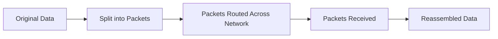
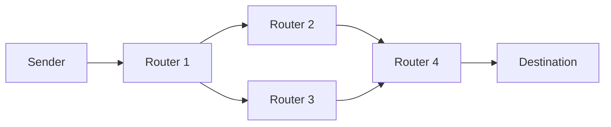

# Packet Switching

## 1. Lesson Goals

By the end of this lesson, students should be able to:

- define packet switching
- explain why data is split into packets
- describe the structure of a packet at a basic level
- explain packet headers and payloads
- explain how packets are routed across a network
- explain that packets may take different routes
- explain how packets are reassembled at the destination
- explain packet sequence numbers and error checking at a basic level
- distinguish packet switching from circuit switching at an introductory level
- explain advantages and disadvantages of packet switching
- connect packet switching to TCP/IP, routers, web access, and network security
- answer exam-style questions about packet switching

---

## 2. Syllabus Mapping

| Item | Detail |
|---|---|
| Unit | A2 Networks |
| Label | SL Core |
| Main skill | Understanding how data is divided, routed, and reassembled across networks |
| Connected topics | TCP/IP model, routers, IP addresses, DNS and web access, network security, encryption |
| Practical focus | Explaining what happens when a file, webpage, or message is sent over a network |
| Exam relevance | Definitions, process explanation, packet fields, advantages/disadvantages, scenario questions |

::: tip Learning Focus
Packet switching is a key idea behind internet communication. Data is split into small packets, each packet is routed across the network, and the destination reassembles the packets into the original data.
:::

---

## 3. Key Terms

| English Term | 中文解释 | Exam-style meaning |
|---|---|---|
| Packet | 数据包 | Small unit of data sent across a network |
| Packet switching | 分组交换 | Method of sending data by splitting it into packets |
| Payload | 有效载荷 | The actual user data carried inside a packet |
| Header | 首部 | Control information added to a packet |
| Source address | 源地址 | Address of the sending device |
| Destination address | 目标地址 | Address of the receiving device |
| Sequence number | 序列号 | Number used to put packets back in correct order |
| Error checking | 错误检测 | Method used to detect whether data was corrupted |
| Routing | 路由 | Choosing paths for packets across networks |
| Router | 路由器 | Device that forwards packets between networks |
| Reassembly | 重组 | Putting received packets back into original data |
| Packet loss | 丢包 | Packet fails to reach the destination |
| Retransmission | 重传 | Sending missing or damaged data again |
| Latency | 延迟 | Delay in data transmission |
| Bandwidth | 带宽 | Maximum data transfer capacity |
| Network congestion | 网络拥塞 | Too much traffic causing delay or packet loss |
| Circuit switching | 电路交换 | Communication method using a dedicated path for a session |

---

## 4. Concept Explanation

<LangBlock>
<template #cn>

### 中文讲解

在网络中传输数据时，通常不会把一个完整的大文件一次性直接发送出去。  
相反，数据会被拆分成很多小块，这些小块叫做：

```text
packets
```

这种传输方式叫做：

```text
packet switching
```

例如你下载一个网页、发送一张图片、看视频、或者发消息时，数据可能会被拆成多个 packets。

每个 packet 通常包含：

```text
header
payload
```

其中：

```text
payload = 真正要传输的数据的一部分
header = 控制信息，例如源地址、目标地址、序列号、错误检测信息
```

Packets 在网络中可能走不同路线。  
路由器会根据目标地址把 packets 转发到下一跳。

到达目的地后，接收设备会：

```text
check packets
put packets back in order
reassemble original data
request retransmission if needed
```

简单来说：

```text
large data → split into packets → route packets → receive packets → reassemble data
```

</template>

<template #en>

### English Explanation

When data is sent across a network, a large file is usually not sent as one complete piece.  
Instead, the data is divided into many small units called:

```text
packets
```

This method is called:

```text
packet switching
```

For example, when you download a webpage, send an image, watch a video, or send a message, the data may be split into many packets.

Each packet usually contains:

```text
header
payload
```

where:

```text
payload = part of the actual data being sent
header = control information, such as source address, destination address, sequence number, and error checking information
```

Packets may take different routes across the network.  
Routers forward packets based on the destination address.

At the destination, the receiving device will:

```text
check packets
put packets back in order
reassemble original data
request retransmission if needed
```

In simple terms:

```text
large data → split into packets → route packets → receive packets → reassemble data
```

</template>
</LangBlock>

---

## 5. What Is Packet Switching?

Packet switching is a method of transmitting data across a network by splitting it into packets.

### Basic Process

```text
1. Data is divided into packets.
2. Each packet is given control information.
3. Packets are sent across the network.
4. Routers forward packets toward the destination.
5. Packets may take different routes.
6. Destination receives packets.
7. Packets are checked, ordered, and reassembled.
```

### Diagram



::: tip Exam Phrase
Packet switching splits data into packets that are routed independently across a network and reassembled at the destination.
:::

---

## 6. Why Split Data into Packets?

Large data is split into packets because packet switching makes network communication more flexible and efficient.

### Reasons

| Reason | Explanation |
|---|---|
| Efficient sharing | many users can share the same network links |
| Flexible routing | packets can take different routes |
| Error recovery | only missing/damaged packets may need retransmission |
| Reduced delay for others | one large message does not block the network |
| Better use of capacity | routers can forward packets as links become available |
| Resilience | packets can avoid failed or congested routes |

### Example

If a 50 MB video is sent as one huge block and an error occurs, the whole block may need to be resent.  
If it is split into packets, only the missing or damaged packets may need to be resent.

---

## 7. Packet Structure

A packet usually contains:

```text
header
payload
sometimes trailer
```

### Simple Packet Diagram

```text
+----------------------+----------------------+----------------------+
| Header               | Payload              | Trailer / Check      |
+----------------------+----------------------+----------------------+
```

### Packet Parts

| Part | Purpose |
|---|---|
| Header | control information for delivery and handling |
| Payload | actual data being carried |
| Trailer / check | error checking information in some systems |

### Important

The exact packet structure depends on the protocol and layer.  
For exam-style understanding, focus on the idea that a packet contains data plus control information.

---

## 8. Packet Header

The packet header contains information needed for delivery and management.

It may include:

```text
source address
destination address
sequence number
packet length
protocol information
time-to-live / hop limit
error checking information
```

### Header Purpose

| Header Field | Why It Is Useful |
|---|---|
| source address | receiver can identify sender and send reply |
| destination address | routers know where packet should go |
| sequence number | receiver can reorder packets |
| protocol information | tells how packet should be handled |
| error check | helps detect corrupted data |
| time-to-live | prevents packets looping forever |

---

## 9. Payload

The payload is the actual data carried by the packet.

Examples:

```text
part of an image
part of a webpage
part of a video stream
part of an email
part of a file download
part of a game update
```

### Important

The payload is only part of the full original data.

Example:

```text
Packet 1 payload = first part of image
Packet 2 payload = second part of image
Packet 3 payload = third part of image
```

The destination puts all payloads back together to recreate the original data.

---

## 10. Sequence Numbers

Packets may not arrive in the same order they were sent.

Sequence numbers help the receiver put packets back in correct order.

### Example

Packets are sent:

```text
1, 2, 3, 4
```

They may arrive:

```text
1, 3, 4, 2
```

The receiver uses sequence numbers to reorder them:

```text
1, 2, 3, 4
```

### Why Order Can Change

Packets may travel through:

```text
different routes
different routers
congested links
delayed paths
```

---

## 11. Routing Packets

Routing means choosing paths for packets across networks.

Routers use destination addresses and routing information to forward packets.

### Simplified Process

```text
1. Router receives packet.
2. Router checks destination IP address.
3. Router decides next hop.
4. Router forwards packet.
5. Next router repeats the process.
```

### Diagram



### Key Idea

Routers do not need to know the whole message.  
They forward packets toward their destination.

---

## 12. Packets May Take Different Routes

In packet switching, packets from the same message may take different routes.

### Example

```text
Packet 1: Sender → Router A → Router B → Destination
Packet 2: Sender → Router C → Router D → Destination
Packet 3: Sender → Router A → Router E → Destination
```

### Why This Helps

Different routes can help when:

```text
one route is busy
one router fails
network congestion changes
a better route is available
```

### But

Different routes can also mean:

```text
packets arrive out of order
some packets arrive later
some packets may be lost
```

The destination and protocols must handle this.

---

## 13. Reassembly

Reassembly means putting packets back together to recreate the original data.

At the destination:

```text
packets are received
packets are checked for errors
sequence numbers are used
missing packets may be requested again
payloads are combined
original data is rebuilt
```

### Example

A message is split into:

```text
Packet 1: Hel
Packet 2: lo 
Packet 3: World
```

After reassembly:

```text
Hello World
```

---

## 14. Error Checking

Error checking helps detect whether packet data was corrupted during transmission.

### Why Errors Happen

Errors can be caused by:

```text
interference
weak signals
damaged cables
network congestion
hardware faults
noise
```

### What Happens If Error Is Detected?

Depending on the protocol:

```text
packet may be discarded
sender may retransmit the packet
application may tolerate the loss
```

### TCP Example

TCP can detect missing data and request retransmission, helping reliable delivery.

---

## 15. Packet Loss and Retransmission

Packet loss means a packet does not reach the destination.

### Causes

```text
network congestion
router overload
wireless interference
faulty hardware
routing problems
timeout
```

### Retransmission

Retransmission means sending missing or damaged data again.

This is useful for:

```text
file downloads
webpages
email
banking
database communication
```

because accuracy matters.

### Real-time Applications

For video calls or games, retransmitting old packets may not always be useful because the data may arrive too late.

---

## 16. Packet Switching and TCP/IP

Packet switching works closely with the TCP/IP model.

| TCP/IP Layer | Packet Switching Connection |
|---|---|
| Application | creates the data to send |
| Transport | may split data, number segments, manage reliability |
| Internet | adds IP addresses and routes packets |
| Network Access | sends frames over local media |

### Key Point

Packet switching is not separate from TCP/IP.  
It is part of how data is transmitted using layered network protocols.

---

## 17. Packet Switching and Routers

Routers are essential in packet switching.

A router:

```text
receives packets
checks destination IP address
uses routing table
selects next hop
forwards packet
```

### Example

When accessing a website, packets may pass through:

```text
home router
ISP router
internet backbone routers
data centre router
web server network
```

Each router moves packets closer to the destination.

---

## 18. Packet Switching and Web Access

When a user opens a webpage:

```text
1. Browser requests webpage.
2. Request data is split into packets.
3. Packets travel to the web server.
4. Server sends webpage data back in packets.
5. Browser receives packets.
6. Browser reassembles data and displays page.
```

### Page Resources

A webpage may include:

```text
HTML
CSS
JavaScript
images
fonts
videos
```

Each resource may be sent using packets.

---

## 19. Packet Switching and Streaming

Streaming video/audio also uses packets.

### Streaming Characteristics

```text
continuous flow of packets
some buffering
low delay is important
some packet loss may be tolerated
```

### Example

If a few video packets are lost:

```text
video quality may drop briefly
frame may freeze
audio may glitch
```

But retransmitting every missing packet may cause too much delay for live streaming.

---

## 20. Packet Switching and Online Games

Online games send packets for:

```text
player position
movement
actions
chat
server updates
match state
```

### Important Factors

```text
latency
packet loss
jitter
server location
routing path
network congestion
```

### Why Packet Loss Matters

Packet loss can cause:

```text
lag
rubber-banding
delayed actions
missing updates
disconnection
```

---

## 21. Circuit Switching Preview

Circuit switching is a different communication method.

In circuit switching, a dedicated path is established before communication begins.

### Simple Example

Traditional telephone networks used circuit switching.

```text
call starts
dedicated circuit/path is reserved
conversation uses that path
call ends
path is released
```

### Packet Switching vs Circuit Switching

| Packet Switching | Circuit Switching |
|---|---|
| data split into packets | dedicated path reserved |
| packets may take different routes | same path used during session |
| efficient sharing of network | reserved capacity may be wasted |
| good for internet data | historically used for telephone calls |
| packets may be delayed/lost | stable path once circuit established |

::: info Level Control
For this course, focus mainly on packet switching. Circuit switching is included only as a contrast.
:::

---

## 22. Advantages of Packet Switching

| Advantage | Explanation |
|---|---|
| Efficient use of network | many users share network links |
| Flexible routing | packets can take different paths |
| Fault tolerance | packets may avoid failed routes |
| Error recovery | only missing/damaged packets may be resent |
| Suitable for internet | supports many types of data and users |
| Scalable | many networks can interconnect |
| No dedicated path needed | resources used when packets are sent |

---

## 23. Disadvantages of Packet Switching

| Disadvantage | Explanation |
|---|---|
| Packets may be lost | congestion or errors can drop packets |
| Packets may arrive out of order | different routes can cause different arrival times |
| Variable delay | congestion can increase latency |
| Header overhead | each packet needs control information |
| Reassembly needed | destination must reorder and rebuild data |
| Security risk | packets may travel through shared networks |
| Real-time issues | delay/jitter can affect calls/games |

---

## 24. Security Considerations

Packets may travel through shared or external networks.

Risks include:

```text
packet interception
traffic analysis
spoofed packets
man-in-the-middle attacks
packet sniffing
denial of service
```

Security methods include:

```text
encryption
HTTPS
VPN
firewalls
secure protocols
authentication
network monitoring
```

### Key Idea

Packet switching itself does not automatically make communication private.  
Security controls are needed to protect data.

---

## 25. Worked Example: Sending a Photo

A student sends a photo to a friend.

```text
1. Photo is too large to send as one piece.
2. Device splits photo data into packets.
3. Each packet gets header information.
4. Packets are sent through routers.
5. Packets may take different routes.
6. Friend's device receives packets.
7. Missing packets may be retransmitted.
8. Packets are reassembled into the photo.
```

### Important

The friend does not see random packet fragments.  
The application displays the reassembled photo.

---

## 26. Worked Example: Downloading a File

A student downloads a PDF.

```text
1. Browser requests file from server.
2. Server sends file data as packets.
3. Packets travel through networks.
4. TCP helps check order and missing data.
5. Missing packets may be requested again.
6. Browser combines packet data.
7. PDF file is saved or opened.
```

### Why Reliability Matters

If part of the PDF is missing or corrupted, the file may not open correctly.  
So reliable delivery is important.

---

## 27. Worked Example: Video Call

A video call uses packets for audio and video.

```text
camera captures video
microphone captures sound
data is encoded
data is sent in packets
other device receives packets
audio/video is played
```

### Challenge

For live communication:

```text
low latency is important
some loss may be tolerated
late packets may be useless
```

This is why some real-time applications prefer lower delay over perfect retransmission.

---

## 28. Common Mistakes

| Mistake | Why it is wrong | Better understanding |
|---|---|---|
| Packet means whole file | Packet is a small part of data | Many packets form a file/message |
| Packets always follow same route | They may take different routes | Routing can change dynamically |
| Packet switching needs a dedicated path | No dedicated path is required | Circuit switching reserves a path |
| Payload means header | Payload is actual data | Header is control information |
| Header is useless extra data | Header enables addressing, ordering, checking | It is necessary overhead |
| Packets always arrive in order | They can arrive out of order | Sequence numbers help reorder |
| Packet loss means whole internet fails | Missing packets can be retransmitted | Depends on protocol/application |
| Routers reassemble the whole message | Destination reassembles data | Routers forward packets |
| TCP and packet switching are identical | TCP is a transport protocol | Packet switching is transmission method |
| Encryption is automatic for all packets | Not always | Use HTTPS/VPN/secure protocols |

---

## 29. Guided Practice

### Practice 1: Define Packet

What is a packet?

<details>
<summary>Suggested Answer</summary>

A packet is a small unit of data sent across a network. It contains part of the data and control information such as addressing.

</details>

---

### Practice 2: Header or Payload?

Which part contains the actual user data?

<details>
<summary>Suggested Answer</summary>

The payload contains the actual user data.

</details>

---

### Practice 3: Sequence Number

Why does a packet need a sequence number?

<details>
<summary>Suggested Answer</summary>

A sequence number helps the destination put packets back into the correct order during reassembly.

</details>

---

### Practice 4: Router Role

What does a router do with packets?

<details>
<summary>Suggested Answer</summary>

A router checks the destination address and forwards each packet toward its destination.

</details>

---

### Practice 5: Different Routes

Why might packets from the same message arrive out of order?

<details>
<summary>Suggested Answer</summary>

They may take different routes or experience different delays due to congestion or routing decisions.

</details>

---

## 30. Independent Practice

### Question 1

Define packet switching.

### Question 2

Explain why data is split into packets.

### Question 3

Describe three pieces of information that may be found in a packet header.

### Question 4

Explain the difference between header and payload.

### Question 5

Explain how routers handle packets.

### Question 6

Explain why packets may take different routes.

### Question 7

Explain how packets are reassembled at the destination.

### Question 8

Explain two advantages of packet switching.

### Question 9

Explain two disadvantages of packet switching.

### Question 10

Explain why packet switching is suitable for internet communication.

---

## 31. Exam-style Questions

### Question 1 [4 marks]

Define packet switching.

<details>
<summary>Mark Scheme Style Answer</summary>

Packet switching is a method of transmitting data across a network by splitting the data into small packets. Each packet contains part of the data and control information such as source and destination addresses. Packets are routed across the network and reassembled at the destination.

</details>

---

### Question 2 [5 marks]

Describe the information that may be included in a packet.

<details>
<summary>Mark Scheme Style Answer</summary>

A packet contains a payload, which is the actual data being carried. It also contains header information such as source address, destination address, sequence number, protocol information, and error checking information. The sequence number helps packets be reassembled in the correct order.

</details>

---

### Question 3 [6 marks]

Explain how packet switching sends a file from one device to another.

<details>
<summary>Mark Scheme Style Answer</summary>

The file is split into packets. Each packet is given control information such as destination address and sequence number. Routers forward packets across the network, and packets may take different routes. At the destination, packets are checked, put back into the correct order using sequence numbers, and reassembled to recreate the original file. Missing or damaged packets may be retransmitted depending on the protocol.

</details>

---

### Question 4 [6 marks]

Explain two advantages and one disadvantage of packet switching.

<details>
<summary>Mark Scheme Style Answer</summary>

One advantage is efficient network use because many users can share the same network links rather than reserving a dedicated path. Another advantage is flexible routing because packets can take different routes and may avoid congestion or failed links. One disadvantage is that packets may arrive out of order, be delayed, or be lost, so reassembly and error handling are needed.

</details>

---

### Question 5 [5 marks]

A student says, “All packets from a message must travel along the same route.” Explain why this is incorrect.

<details>
<summary>Mark Scheme Style Answer</summary>

This is incorrect because packet switching allows packets to be routed independently. Routers can forward each packet based on current routing information and network conditions. Packets from the same message may take different routes and may arrive out of order. The destination uses sequence information to reorder and reassemble the packets.

</details>

---

## 32. Classroom Activity

### Activity 1: Human Packet Switching

Students act as:

```text
sender
packets
routers
destination
```

Each packet carries:

```text
source
destination
sequence number
payload
```

Routers choose different paths, and the destination reorders packets.

---

### Activity 2: Packet Header Design

Students design a simple packet for sending the message:

```text
HELLO
```

They decide what should go in:

```text
header
payload
error check
```

---

### Activity 3: Packet Switching Debate

Prompt:

```text
Why does the internet use packet switching instead of sending each file as one giant block?
```

Students discuss:

```text
efficiency
sharing
error recovery
routing
congestion
reassembly
```

---

## 33. Homework

### Homework Part A: Concept Explanation

In 5-6 sentences, explain packet switching using the example of sending a photo.

---

### Homework Part B: Packet Table

Create a table explaining:

```text
header
payload
source address
destination address
sequence number
error checking
```

For each, include:

```text
meaning
why it is needed
```

---

### Homework Part C: Scenario Question

A video call is experiencing delay and occasional frozen frames.

Explain how packet loss, latency, and retransmission choices may affect the call.

---

### Homework Part D: Misconception Correction

Correct these statements:

```text
A packet is always a complete file.
Routers rebuild the original message.
All packets must follow the same route.
The header contains only the user data.
Packet switching reserves one fixed path for the whole session.
```

---

## 34. One-page Revision Summary

| Point | Summary |
|---|---|
| Packet | Small unit of network data |
| Packet switching | Splits data into packets for transmission |
| Header | Control information |
| Payload | Actual data being carried |
| Source address | Address of sender |
| Destination address | Address of receiver |
| Sequence number | Used to reorder packets |
| Error checking | Detects corrupted data |
| Router | Forwards packets toward destination |
| Different routes | Packets may travel independently |
| Reassembly | Destination rebuilds original data |
| Packet loss | Packet does not arrive |
| Retransmission | Missing/damaged packet sent again |
| Advantage | Efficient and flexible use of network |
| Disadvantage | Delay, loss, overhead, reassembly needed |
| Exam phrase | Packet switching divides data into packets that are independently routed and reassembled at the destination |

---

## 35. Quick Self-test

Before moving on, students should be able to answer these:

1. What is packet switching?
2. What is a packet?
3. What is a packet header?
4. What is a payload?
5. Why are sequence numbers useful?
6. What does a router do with packets?
7. Why might packets take different routes?
8. What is reassembly?
9. Give one advantage of packet switching.
10. Give one disadvantage of packet switching.
