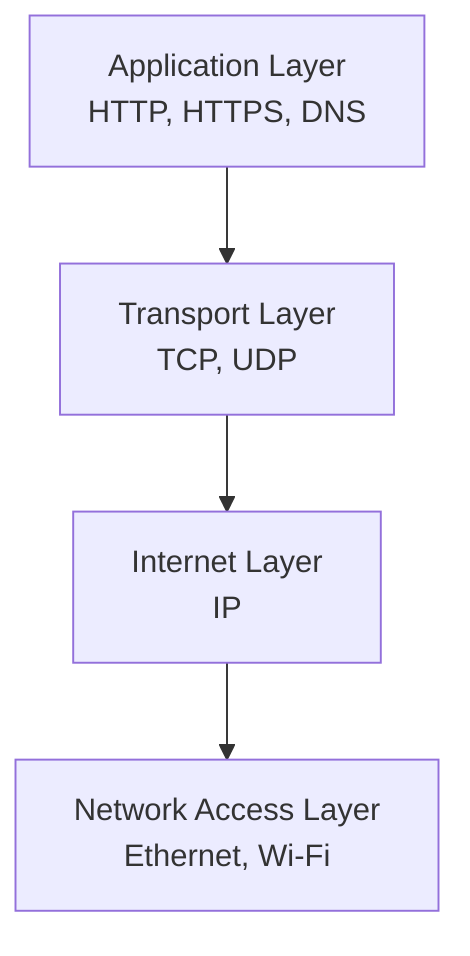
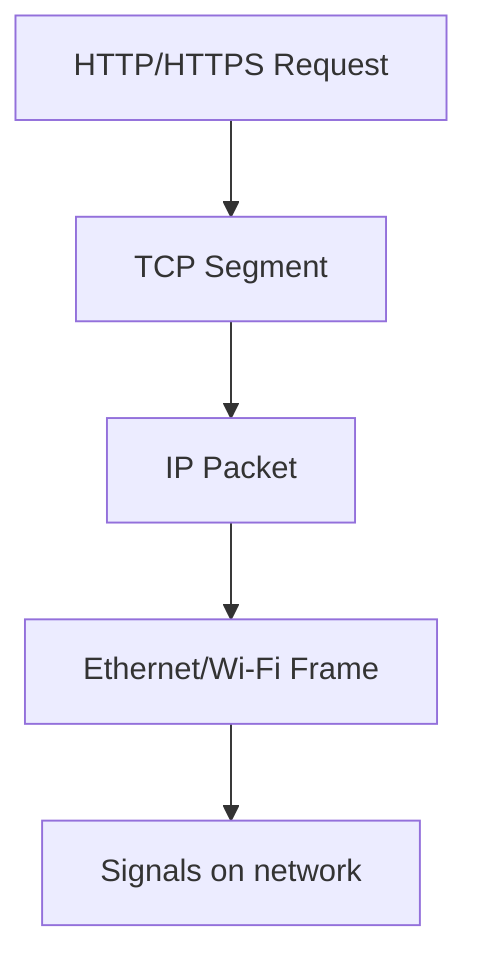

# TCP/IP Model

## 1. Lesson Goals

By the end of this lesson, students should be able to:

- explain why network communication is divided into layers
- define the TCP/IP model
- identify the main layers of the TCP/IP model
- explain the role of the application layer
- explain the role of the transport layer
- explain the role of the internet layer
- explain the role of the network access layer
- describe how data moves down the layers when sending
- describe how data moves up the layers when receiving
- explain the basic roles of TCP, UDP, IP, HTTP, HTTPS, DNS, Ethernet, and Wi-Fi
- explain encapsulation at a simple level
- connect the TCP/IP model to web access, packet switching, DNS, and network security
- answer exam-style questions about the TCP/IP model

---

## 2. Syllabus Mapping

| Item | Detail |
|---|---|
| Unit | A2 Networks |
| Label | SL Core |
| Main skill | Understanding layered network communication |
| Connected topics | Network fundamentals, client-server, packet switching, DNS, web access, wired/wireless transmission, network security |
| Practical focus | Explaining what happens when a browser accesses a website |
| Exam relevance | Layer roles, protocol examples, process explanation, scenario questions |

::: tip Learning Focus
The TCP/IP model helps explain how data is prepared, addressed, transmitted, and interpreted across networks. Students should focus on the purpose of each layer, not memorizing unnecessary low-level detail.
:::

---

## 3. Key Terms

| English Term | 中文解释 | Exam-style meaning |
|---|---|---|
| TCP/IP model | TCP/IP 模型 | Layered model used to describe internet/network communication |
| Layer | 层 | A level with a specific communication role |
| Protocol | 协议 | Set of rules for communication |
| Application layer | 应用层 | Provides network services to applications |
| Transport layer | 传输层 | Manages end-to-end communication between applications |
| Internet layer | 网际层 | Handles logical addressing and routing using IP |
| Network access layer | 网络接入层 | Handles physical/local network transmission |
| TCP | Transmission Control Protocol | Reliable transport protocol that manages ordered delivery |
| UDP | User Datagram Protocol | Faster, connectionless transport protocol with less reliability |
| IP | Internet Protocol | Handles addressing and routing of packets |
| HTTP | Hypertext Transfer Protocol | Protocol for transferring webpages |
| HTTPS | Secure HTTP | HTTP with encryption/security |
| DNS | Domain Name System | Resolves domain names to IP addresses |
| Ethernet | 以太网 | Common wired LAN technology |
| Wi-Fi | 无线网络技术 | Wireless LAN technology |
| Encapsulation | 封装 | Adding layer-specific information to data |
| Packet | 数据包 | Data unit sent across a network |
| Header | 首部 | Extra control information added to data |
| Port number | 端口号 | Identifies an application/service on a device |
| IP address | IP 地址 | Logical address used for routing between networks |

---

## 4. Concept Explanation

<LangBlock>
<template #cn>

### 中文讲解

网络通信很复杂。  
当你打开一个网站时，电脑并不是简单地“直接拿到网页”。背后会发生很多步骤：

```text
browser sends a request
DNS finds the server IP address
data is split into packets
packets are addressed and routed
packets travel through cables / Wi-Fi / routers
server sends data back
browser rebuilds and displays webpage
```

为了让这些复杂工作更容易理解，网络通信被分成不同的 **layers（层）**。

**TCP/IP model** 是描述互联网通信的常用模型。  
常见的四层结构是：

```text
Application layer
Transport layer
Internet layer
Network access layer
```

可以简单理解为：

```text
Application layer = what service/application wants to do
Transport layer = how data is delivered between programs
Internet layer = how data is addressed and routed between networks
Network access layer = how data physically travels on local network media
```

例如打开网站时：

```text
HTTP/HTTPS 处理网页请求
TCP 负责可靠传输
IP 负责寻址和路由
Ethernet/Wi-Fi 负责实际传输
```

核心思想：

```text
each layer has a job
each layer uses protocols
data is passed down layers when sending
data is passed up layers when receiving
```

</template>

<template #en>

### English Explanation

Network communication is complex.  
When you open a website, the computer does not simply “get the webpage” directly. Many things happen:

```text
browser sends a request
DNS finds the server IP address
data is split into packets
packets are addressed and routed
packets travel through cables / Wi-Fi / routers
server sends data back
browser rebuilds and displays webpage
```

To make this complex communication easier to understand, network communication is divided into **layers**.

The **TCP/IP model** is a common model used to describe internet communication.  
A common four-layer version is:

```text
Application layer
Transport layer
Internet layer
Network access layer
```

A simple understanding is:

```text
Application layer = what service/application wants to do
Transport layer = how data is delivered between programs
Internet layer = how data is addressed and routed between networks
Network access layer = how data physically travels on local network media
```

For example, when opening a website:

```text
HTTP/HTTPS handles webpage requests
TCP handles reliable delivery
IP handles addressing and routing
Ethernet/Wi-Fi handles actual transmission
```

Core idea:

```text
each layer has a job
each layer uses protocols
data is passed down layers when sending
data is passed up layers when receiving
```

</template>
</LangBlock>

---

## 5. Why Use Layers?

Layering makes network communication easier to design, understand, and troubleshoot.

| Benefit | Explanation |
|---|---|
| Reduces complexity | each layer focuses on one part of communication |
| Standardization | different devices/software can follow shared rules |
| Easier troubleshooting | problems can be located by layer |
| Independent development | one layer can change without rewriting everything |
| Interoperability | devices from different manufacturers can communicate |
| Reusability | applications can use the same lower-layer services |

### Example

A browser does not need to know the exact electrical signals used by Ethernet or Wi-Fi.  
It uses application protocols, while lower layers handle transport, routing, and transmission.

---

## 6. TCP/IP Model Overview

A common TCP/IP model has four layers.

| Layer | Main Role | Example Protocols / Technologies |
|---|---|---|
| Application | network services used by applications | HTTP, HTTPS, DNS, SMTP, FTP |
| Transport | end-to-end communication between applications | TCP, UDP |
| Internet | addressing and routing between networks | IP |
| Network Access | local network transmission and physical access | Ethernet, Wi-Fi |



### Quick Memory

```text
Application = service
Transport = delivery between programs
Internet = addressing and routing
Network access = local transmission
```

---

## 7. Application Layer

The application layer provides network services to applications.  
It is closest to the user and the application software.

### What It Does

The application layer handles:

```text
web access
email
file transfer
domain name lookup
remote login
cloud services
```

### Examples of Application Layer Protocols

| Protocol | Purpose |
|---|---|
| HTTP | transfers webpages |
| HTTPS | transfers webpages securely |
| DNS | resolves domain names to IP addresses |
| SMTP | sends email |
| IMAP/POP3 | retrieves email |
| FTP/SFTP | transfers files |
| SSH | secure remote login |

---

## 8. Transport Layer

The transport layer manages communication between applications on different devices.

### What It Does

The transport layer can:

```text
split data into segments
identify applications using port numbers
manage reliable delivery
control order of data
detect missing data
support retransmission where needed
```

### Main Protocols

```text
TCP
UDP
```

### Port Numbers

Port numbers identify applications/services on a device.

| Service | Common Port |
|---|---:|
| HTTP | 80 |
| HTTPS | 443 |
| DNS | 53 |
| SMTP | 25 |

::: tip Exam Phrase
The transport layer manages end-to-end communication between applications, using protocols such as TCP or UDP.
:::

---

## 9. TCP

TCP stands for Transmission Control Protocol.

TCP focuses on reliable delivery.

### TCP Can Provide

```text
connection setup
ordered delivery
error checking
retransmission of missing data
flow control
delivery to correct application using ports
```

### Example Uses

TCP is suitable for:

```text
web browsing
email
file downloads
online banking
database communication
```

because missing or out-of-order data could cause problems.

---

## 10. UDP

UDP stands for User Datagram Protocol.

UDP is simpler and often faster, but does not provide the same reliability as TCP.

### UDP Characteristics

```text
connectionless
less overhead
no guaranteed delivery
no guaranteed order
no automatic retransmission
```

### Example Uses

UDP may be used for:

```text
live streaming
online games
voice/video calls
DNS queries
```

where speed and low delay may be more important than perfect retransmission.

### TCP vs UDP

| TCP | UDP |
|---|---|
| reliable | less reliable |
| connection-oriented | connectionless |
| ordered delivery | no guaranteed order |
| retransmits missing data | no automatic retransmission |
| more overhead | lower overhead |
| good for files/web/email | good for real-time audio/video/games |

---

## 11. Internet Layer

The internet layer handles logical addressing and routing.

### Main Protocol

```text
IP = Internet Protocol
```

### What It Does

The internet layer:

```text
adds source and destination IP addresses
chooses routes between networks
helps packets travel across routers
supports communication across different networks
```

::: tip Exam Phrase
The internet layer uses IP addresses to route packets between networks.
:::

---

## 12. IP Address

An IP address identifies a device on a network for routing.

Example IPv4 address:

```text
192.168.1.25
```

Packets usually include:

```text
source IP address
destination IP address
```

This allows routers to forward data toward the correct destination and allows replies to return.

---

## 13. Network Access Layer

The network access layer handles communication on the local network link.

It deals with:

```text
physical transmission
local addressing
frames
network hardware
wired/wireless media
```

### Examples

```text
Ethernet
Wi-Fi
network interface card
switches
cables
radio signals
```

### What It Does

The network access layer may handle:

```text
converting data to signals
sending frames on local network
using MAC addresses for local delivery
detecting local transmission errors
```

---

## 14. Encapsulation

Encapsulation means each layer adds its own control information to the data.

This extra information is often called a header.

### Sending Data

When sending data, it moves down the layers:

```text
Application data
→ Transport header added
→ IP header added
→ Network access header/trailer added
→ transmitted as signals
```

### Simple Diagram

```text
[Application Data]
[TCP Header][Application Data]
[IP Header][TCP Header][Application Data]
[Frame Header][IP Header][TCP Header][Application Data][Frame Trailer]
```

### Why Encapsulation Matters

Each layer adds information needed for its job.

Examples:

```text
transport layer may add port numbers
internet layer adds IP addresses
network access layer adds MAC addresses
```

---

## 15. Decapsulation

Decapsulation happens at the receiving device.

The data moves up the layers:

```text
signals received
→ frame processed
→ IP packet processed
→ TCP/UDP segment processed
→ application data delivered
```

Each layer removes and uses its own header information.

### Simple Meaning

```text
sending = add headers as data moves down
receiving = remove headers as data moves up
```

---

## 16. Sending Data Through TCP/IP

When a browser sends a web request:

```text
1. Application layer creates HTTP/HTTPS request.
2. Transport layer uses TCP and adds port information.
3. Internet layer uses IP and adds source/destination IP addresses.
4. Network access layer sends frames using Ethernet or Wi-Fi.
5. Signals travel across the network.
```



---

## 17. Receiving Data Through TCP/IP

When the response reaches the device:

```text
1. Network access layer receives the frame.
2. Internet layer checks IP information.
3. Transport layer uses TCP/UDP and port information.
4. Application layer receives the webpage data.
5. Browser displays the page.
```

### Key Idea

The sender and receiver use the same layered model in opposite directions.

---

## 18. Worked Example: Opening a Website

A student opens:

```text
https://example.com
```

| Layer | What Happens |
|---|---|
| Application | DNS may resolve the domain; browser uses HTTPS |
| Transport | TCP provides reliable connection; port 443 is used |
| Internet | IP addresses are used to route packets |
| Network Access | Wi-Fi or Ethernet transmits frames locally |

### Result

The server response returns through the layers and the browser displays the webpage.

---

## 19. Worked Example: Sending an Email

When sending an email:

| Layer | Example |
|---|---|
| Application | SMTP sends the message |
| Transport | TCP provides reliable delivery |
| Internet | IP routes packets to mail server |
| Network Access | Ethernet/Wi-Fi sends frames locally |

### Why TCP?

Email should arrive correctly and completely, so reliable delivery is important.

---

## 20. Worked Example: Online Game

An online game may use UDP for real-time movement updates.

| Layer | Example |
|---|---|
| Application | game protocol sends player movement/action data |
| Transport | UDP may be used for low latency |
| Internet | IP routes packets between player and game server |
| Network Access | Wi-Fi/Ethernet transmits frames |

### Why UDP?

For fast-paced games, late data may be less useful than new data.  
Low latency may be more important than retransmitting every missing packet.

---

## 21. TCP/IP and Packet Switching

The TCP/IP model connects closely to packet switching.

```text
Application data is prepared by application protocols.
Transport layer may split data into segments.
Internet layer packages data for routing.
Network access layer sends frames locally.
Packets may travel different routes.
Receiving device reassembles and processes them.
```

Packet switching is covered in the next page.

---

## 22. TCP/IP and DNS

DNS works at the application layer.

Its job is to convert a domain name into an IP address.

Example:

```text
example.com → 93.184.216.34
```

### Why DNS Is Needed

Humans prefer domain names.  
Networks route using IP addresses.  
DNS helps applications find the IP address needed for communication.

---

## 23. TCP/IP and Security

Security can appear at different layers.

| Layer | Example Security |
|---|---|
| Application | HTTPS, secure login, authentication |
| Transport | TLS over TCP for secure sessions |
| Internet | IP filtering, VPN tunnelling |
| Network Access | Wi-Fi encryption, MAC filtering |

### HTTPS

HTTPS protects web communication by encrypting data between browser and server.

### VPN

A VPN can create an encrypted tunnel across a network.

---

## 24. TCP/IP vs OSI Model

You may see another model called the OSI model.

| Model | Common Layers |
|---|---|
| TCP/IP | Application, Transport, Internet, Network Access |
| OSI | Application, Presentation, Session, Transport, Network, Data Link, Physical |

### For This Course

Focus on the TCP/IP model unless the syllabus or teacher specifically asks for OSI.  
The important skill is understanding layered communication and layer roles.

---

## 25. Common Protocols by Layer

| Layer | Protocol / Technology | Purpose |
|---|---|---|
| Application | HTTP | webpage transfer |
| Application | HTTPS | secure webpage transfer |
| Application | DNS | domain name resolution |
| Application | SMTP | sending email |
| Application | FTP/SFTP | file transfer |
| Transport | TCP | reliable delivery |
| Transport | UDP | fast connectionless delivery |
| Internet | IP | addressing and routing |
| Network Access | Ethernet | wired LAN communication |
| Network Access | Wi-Fi | wireless LAN communication |

---

## 26. Troubleshooting by Layer

Layering helps troubleshooting.

| Problem | Possible Layer |
|---|---|
| Wi-Fi not connected | network access |
| wrong IP address | internet |
| firewall blocks port | transport / security |
| website name not resolving | application / DNS |
| webpage loads slowly | transport, internet, or application |
| online game has delay | transport / internet / network access |
| HTTPS certificate warning | application / security |

### Example

If an IP address works but the domain name does not, DNS may be the problem.

---

## 27. Common Mistakes

| Mistake | Why it is wrong | Better understanding |
|---|---|---|
| TCP/IP is only one protocol | It is a suite/model of protocols | TCP and IP are two important protocols |
| TCP and IP do the same thing | TCP handles transport reliability; IP handles addressing/routing | Different layers |
| HTTP is transport layer | HTTP is application layer | It uses TCP below |
| IP guarantees delivery | IP routes packets but does not guarantee reliable delivery by itself | TCP adds reliability |
| Ethernet and Wi-Fi are application protocols | They are network access technologies | They handle local transmission |
| DNS sends webpages | DNS resolves names to IP addresses | HTTP/HTTPS transfers webpages |
| Layers are physical boxes | Layers are conceptual roles | Same device uses multiple layers |
| UDP is always bad | UDP is useful for low-latency applications | It trades reliability for speed |
| HTTPS means no network risks | HTTPS encrypts web traffic but does not stop all attacks | Security needs multiple controls |
| Network access layer means internet access only | It means local link/physical access | Ethernet/Wi-Fi are examples |

---

## 28. Guided Practice

### Practice 1: Layer Role

Which layer is responsible for routing using IP addresses?

<details>
<summary>Suggested Answer</summary>

The internet layer.

</details>

---

### Practice 2: Protocol Layer

HTTP belongs to which layer?

<details>
<summary>Suggested Answer</summary>

The application layer.

</details>

---

### Practice 3: TCP or IP?

Which protocol is responsible for reliable delivery and ordering?

<details>
<summary>Suggested Answer</summary>

TCP.

</details>

---

### Practice 4: Ethernet or DNS?

Which one is used for local wired network transmission?

<details>
<summary>Suggested Answer</summary>

Ethernet.

</details>

---

### Practice 5: Encapsulation

What does encapsulation mean?

<details>
<summary>Suggested Answer</summary>

Encapsulation means each layer adds its own control information, such as headers, to the data as it passes down the layers for transmission.

</details>

---

## 29. Independent Practice

### Question 1

Define TCP/IP model.

### Question 2

Name the four layers of the TCP/IP model.

### Question 3

Explain the role of the application layer.

### Question 4

Explain the role of the transport layer.

### Question 5

Explain the role of the internet layer.

### Question 6

Explain the role of the network access layer.

### Question 7

Compare TCP and UDP.

### Question 8

Explain encapsulation using a web request example.

### Question 9

Explain how DNS and IP work together when accessing a website.

### Question 10

Explain why layered models are useful for network communication.

---

## 30. Exam-style Questions

### Question 1 [4 marks]

Define the TCP/IP model and state why it is useful.

<details>
<summary>Mark Scheme Style Answer</summary>

The TCP/IP model is a layered model used to describe how data is communicated across networks such as the internet. It is useful because each layer has a specific role, such as application services, transport, addressing/routing, and local transmission. This reduces complexity and allows different systems to communicate using standard protocols.

</details>

---

### Question 2 [6 marks]

Describe the roles of the four TCP/IP layers.

<details>
<summary>Mark Scheme Style Answer</summary>

The application layer provides network services to applications, such as HTTP, HTTPS, and DNS. The transport layer manages end-to-end communication between applications using TCP or UDP. The internet layer handles logical addressing and routing using IP addresses. The network access layer handles local network transmission using technologies such as Ethernet or Wi-Fi.

</details>

---

### Question 3 [5 marks]

Distinguish between TCP and IP.

<details>
<summary>Mark Scheme Style Answer</summary>

TCP is a transport layer protocol that provides reliable delivery, ordering, and retransmission of missing data between applications. IP is an internet layer protocol that provides logical addressing and routing of packets between networks. TCP helps ensure data arrives correctly, while IP helps packets reach the correct destination network/device.

</details>

---

### Question 4 [6 marks]

Explain what happens when a browser requests a webpage using the TCP/IP model.

<details>
<summary>Mark Scheme Style Answer</summary>

At the application layer, the browser uses HTTP or HTTPS to request the webpage, and DNS may be used to find the server IP address. At the transport layer, TCP provides reliable communication and uses port numbers such as 443 for HTTPS. At the internet layer, IP addresses are added so packets can be routed to the web server. At the network access layer, frames are transmitted through Ethernet or Wi-Fi on the local network.

</details>

---

### Question 5 [5 marks]

Explain encapsulation in network communication.

<details>
<summary>Mark Scheme Style Answer</summary>

Encapsulation is the process where each layer adds its own control information, such as a header, to the data before it is transmitted. For example, the transport layer may add port information, the internet layer adds IP addresses, and the network access layer adds local delivery information such as MAC addresses. The receiving device removes and uses this information as the data moves up the layers.

</details>

---

## 31. Classroom Activity

### Activity 1: Layer Card Sort

Students sort these into TCP/IP layers:

```text
HTTP
HTTPS
DNS
TCP
UDP
IP
Ethernet
Wi-Fi
port number
IP address
MAC address
```

---

### Activity 2: Human Encapsulation

Students act as layers.

Each layer adds a paper header:

```text
Application data
TCP header
IP header
Frame header
```

Then the receiving side removes them in reverse order.

---

### Activity 3: Website Access Story

Students explain opening a website using:

```text
browser
DNS
HTTPS
TCP
IP
Ethernet/Wi-Fi
router
server
response
```

---

## 32. Homework

### Homework Part A: Concept Explanation

In 5-6 sentences, explain why the TCP/IP model uses layers.

---

### Homework Part B: Layer Table

Create a table for the four TCP/IP layers.

For each layer, include:

```text
main role
two example protocols/technologies if possible
one example from web access
```

---

### Homework Part C: Scenario Explanation

A student opens an HTTPS website on school Wi-Fi.

Explain what happens at:

```text
application layer
transport layer
internet layer
network access layer
```

---

### Homework Part D: Misconception Correction

Correct these statements:

```text
TCP and IP do exactly the same job.
HTTP is a transport layer protocol.
DNS sends webpage files.
Ethernet is an application layer protocol.
IP guarantees that all packets arrive in order.
```

---

## 33. One-page Revision Summary

| Point | Summary |
|---|---|
| TCP/IP model | Layered model for network communication |
| Application layer | Network services for applications |
| Transport layer | End-to-end delivery between applications |
| Internet layer | IP addressing and routing |
| Network access layer | Local network transmission |
| HTTP/HTTPS | Web communication |
| DNS | Domain name to IP address |
| TCP | Reliable ordered delivery |
| UDP | Faster connectionless delivery |
| IP | Routing and addressing |
| Ethernet/Wi-Fi | Local transmission technologies |
| Encapsulation | Adding layer headers as data moves down |
| Decapsulation | Removing headers as data moves up |
| Exam phrase | TCP/IP divides communication into layers so each layer handles a specific part of sending and receiving data |

---

## 34. Quick Self-test

Before moving on, students should be able to answer these:

1. What is the TCP/IP model?
2. Why are layers useful?
3. Name the four TCP/IP layers.
4. What does the application layer do?
5. What does the transport layer do?
6. What does the internet layer do?
7. What does the network access layer do?
8. What is the difference between TCP and IP?
9. What does DNS do?
10. What is encapsulation?
