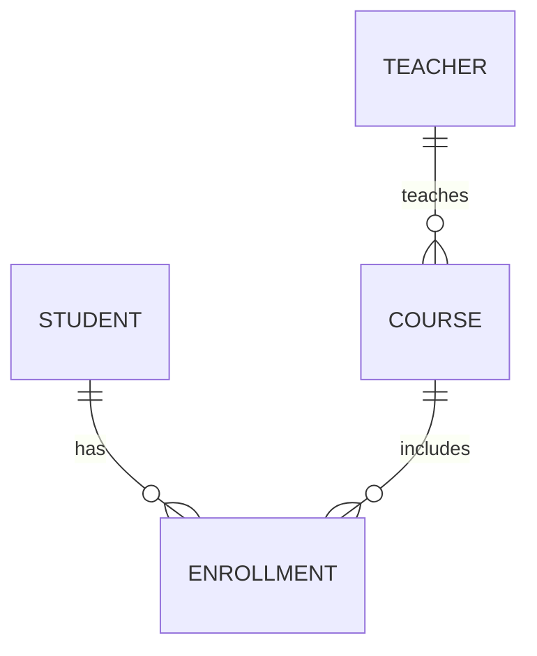
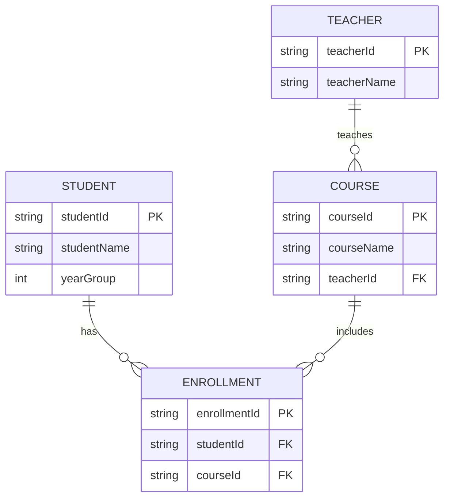

# ERD Basics

## 1. Lesson Goals

By the end of this lesson, students should be able to:

- explain what an ERD is
- explain why ERDs are used in database design
- identify entities, attributes, and relationships in a scenario
- distinguish entities from attributes
- identify primary keys and foreign keys in an ERD
- interpret one-to-one, one-to-many, and many-to-many relationships
- explain cardinality at a basic level
- convert a simple scenario into an ERD-style design
- convert an ERD into table structures
- avoid common ERD design mistakes
- answer exam-style questions about ERDs and relational database design

---

## 2. Syllabus Mapping

| Item | Detail |
|---|---|
| Unit | A3 Databases |
| Label | SL Core |
| Main skill | Modelling database structure before building tables |
| Connected topics | Tables, records, fields, primary keys, foreign keys, relationships, normalization |
| Practical focus | Scenario → entities → attributes → relationships → tables |
| Exam relevance | Database design, relationship interpretation, key identification, scenario modelling |

::: tip Learning Focus
An ERD is a planning tool. It helps students design tables and relationships before writing SQL or creating a database.
:::

---

## 3. Key Terms

| English Term | 中文解释 | Exam-style meaning |
|---|---|---|
| ERD | 实体关系图 | Entity Relationship Diagram; a diagram showing entities and relationships |
| Entity | 实体 | A real-world object or concept stored in a database |
| Attribute | 属性 | A property or data item that describes an entity |
| Relationship | 关系 | A connection between entities |
| Primary key | 主键 | Attribute that uniquely identifies each record of an entity |
| Foreign key | 外键 | Attribute used to link to another entity/table |
| Cardinality | 基数 | How many records in one entity can relate to records in another |
| One-to-one | 一对一 | One record relates to one record |
| One-to-many | 一对多 | One record relates to many records |
| Many-to-many | 多对多 | Many records relate to many records |
| Linking entity | 连接实体 | Entity used to resolve a many-to-many relationship |
| Optional relationship | 可选关系 | A relationship where a record may not have a related record |
| Mandatory relationship | 必选关系 | A relationship where a related record is required |
| Database schema | 数据库结构 | The structure of tables, fields, keys, and relationships |

---

## 4. Concept Explanation

<LangBlock>
<template #cn>

### 中文讲解

**ERD** 的全称是 **Entity Relationship Diagram（实体关系图）**。  
它是一种数据库设计图，用来表示：

```text
有哪些 entities
每个 entity 有哪些 attributes
entities 之间有什么 relationships
哪些 attribute 是 primary key
哪些 attribute 是 foreign key
```

例如学校数据库中可能有：

```text
Student
Course
Teacher
Enrollment
```

这些是 entities。  
每个 entity 有自己的 attributes：

```text
Student: studentId, studentName, yearGroup
Course: courseId, courseName
Teacher: teacherId, teacherName
Enrollment: enrollmentId, studentId, courseId
```

ERD 的价值是：在真正创建 tables 之前，先把数据库结构想清楚。  
这样可以减少重复数据，避免错误关系，也能帮助后面写 SQL。

简单来说：

```text
ERD = database design map
```

它帮助我们从 scenario 中找出：

```text
nouns → possible entities
details about nouns → possible attributes
verbs / connections → possible relationships
```

</template>

<template #en>

### English Explanation

**ERD** stands for **Entity Relationship Diagram**.  
It is a database design diagram used to show:

```text
what entities exist
what attributes each entity has
what relationships exist between entities
which attributes are primary keys
which attributes are foreign keys
```

For example, in a school database, possible entities are:

```text
Student
Course
Teacher
Enrollment
```

Each entity has its own attributes:

```text
Student: studentId, studentName, yearGroup
Course: courseId, courseName
Teacher: teacherId, teacherName
Enrollment: enrollmentId, studentId, courseId
```

The value of an ERD is that it helps us plan the database structure before creating tables.  
This reduces repeated data, avoids relationship errors, and supports later SQL writing.

In simple terms:

```text
ERD = database design map
```

It helps us identify from a scenario:

```text
nouns → possible entities
details about nouns → possible attributes
verbs / connections → possible relationships
```

</template>
</LangBlock>

---

## 5. Why ERDs Are Used

ERDs are used before building the database.

| Benefit | Explanation |
|---|---|
| Planning | Helps design structure before implementation |
| Communication | Shows database design clearly to others |
| Reduces mistakes | Helps identify missing entities or relationships |
| Supports normalization | Encourages separating data into suitable tables |
| Clarifies keys | Shows primary keys and foreign keys |
| Supports SQL later | Relationships help with joins |
| Improves maintainability | Better design is easier to update later |

### Simple Workflow

```text
Scenario
→ identify entities
→ identify attributes
→ identify relationships
→ add keys
→ create tables
→ write queries
```

---

## 6. Entity

An **entity** is a real-world thing or concept that the database needs to store data about.

Examples:

```text
Student
Course
Teacher
Book
Borrower
Loan
Customer
Order
Product
Player
Match
```

### Entity Rule

An entity is usually a noun.

Example scenario:

```text
A library stores books and borrowers. Borrowers can borrow many books.
```

Possible entities:

```text
Book
Borrower
Loan
```

::: tip Exam Phrase
An entity is something about which data is stored in a database.
:::

---

## 7. Attribute

An **attribute** is a property of an entity.

### Student Entity

Possible attributes:

```text
studentId
studentName
yearGroup
email
dateOfBirth
```

### Book Entity

Possible attributes:

```text
bookId
title
author
publicationYear
available
```

### Entity vs Attribute

| Entity | Attributes |
|---|---|
| Student | studentId, studentName, yearGroup |
| Course | courseId, courseName |
| Teacher | teacherId, teacherName |
| Product | productId, productName, price |

### Common Mistake

Do not treat every noun as an entity.

Example:

```text
Student has studentName.
```

`Student` is an entity.  
`studentName` is an attribute, not a separate entity.

---

## 8. Relationship

A **relationship** connects entities.

Example:

```text
Teacher teaches Course
Student enrolls in Course
Customer places Order
Borrower borrows Book
Player plays Match
```

Relationships are often found from verbs in a scenario.

| Scenario Phrase | Possible Relationship |
|---|---|
| Teacher teaches Course | Teacher — Course |
| Customer places Order | Customer — Order |
| Student enrolls in Course | Student — Course |
| Borrower borrows Book | Borrower — Book |
| Order contains Product | Order — Product |

---

## 9. Cardinality

**Cardinality** describes how many records in one entity can relate to records in another entity.

Common types:

```text
one-to-one
one-to-many
many-to-many
```

### One-to-One

```text
Person 1 -------- 1 Passport
```

One person has one passport record.  
One passport belongs to one person.

### One-to-Many

```text
Teacher 1 -------- * Course
```

One teacher can teach many courses.  
Each course has one teacher.

### Many-to-Many

```text
Student * -------- * Course
```

Many students can take many courses.  
This usually needs a linking entity, such as Enrollment.

---

## 10. ERD Notation Used in This Course

There are many ERD styles. For this website, we will use a simple text-based style and Mermaid diagrams.

### Simple Text Style

```text
Student
------------------------
PK studentId
studentName
yearGroup
```

### Relationship Style

```text
Teacher 1 -------- * Course
Student 1 -------- * Enrollment
Course 1 -------- * Enrollment
```

### Mermaid Style



### Symbol Meaning

| Symbol / Text | Meaning |
|---|---|
| `PK` | Primary key |
| `FK` | Foreign key |
| `1` | One |
| `*` | Many |
| `||--o{` | One-to-many in Mermaid ERD style |

::: warning Consistency
Different textbooks may use different ERD symbols. Always explain what your symbols mean.
:::

---

## 11. Primary Keys in ERDs

A primary key uniquely identifies each record of an entity.

### Student Entity

```text
Student
------------------------
PK studentId
studentName
yearGroup
```

Here:

```text
studentId
```

is the primary key.

### Why Not studentName?

```text
studentName may repeat
studentName may change
studentId is designed to be unique
```

---

## 12. Foreign Keys in ERDs

A foreign key links one entity to another.

### Teacher and Course

```text
Teacher
------------------------
PK teacherId
teacherName
```

```text
Course
------------------------
PK courseId
courseName
FK teacherId
```

Here:

```text
Course.teacherId
```

is a foreign key referencing:

```text
Teacher.teacherId
```

Relationship:

```text
Teacher 1 -------- * Course
```

Meaning:

```text
One teacher can teach many courses.
Each course references one teacher.
```

---

## 13. Worked Example 1: School Course ERD

### Scenario

A school stores data about students, teachers, and courses.  
A teacher can teach many courses.  
A student can take many courses, and each course can have many students.

### Step 1: Identify Entities

```text
Student
Teacher
Course
Enrollment
```

Why Enrollment?

```text
Student and Course have a many-to-many relationship.
Enrollment links them.
```

### Step 2: Identify Attributes

```text
Student(studentId, studentName, yearGroup)
Teacher(teacherId, teacherName)
Course(courseId, courseName, teacherId)
Enrollment(enrollmentId, studentId, courseId)
```

### Step 3: Identify Keys

| Entity | Primary Key | Foreign Keys |
|---|---|---|
| Student | studentId | none |
| Teacher | teacherId | none |
| Course | courseId | teacherId |
| Enrollment | enrollmentId | studentId, courseId |

---

## 14. School ERD Text Diagram

```text
Student
------------------------
PK studentId
studentName
yearGroup

Teacher
------------------------
PK teacherId
teacherName

Course
------------------------
PK courseId
courseName
FK teacherId

Enrollment
------------------------
PK enrollmentId
FK studentId
FK courseId
```

Relationships:

```text
Teacher 1 -------- * Course
Student 1 -------- * Enrollment
Course 1 -------- * Enrollment
```

Meaning:

```text
one teacher teaches many courses
one student can have many enrollments
one course can have many enrollments
Enrollment links students and courses
```

---

## 15. School ERD Mermaid Diagram



::: info Mermaid Note
If Mermaid rendering is enabled in VitePress, this diagram will render visually. If not, the code block still works as readable documentation.
:::

---

## 16. Many-to-Many and Linking Entity

A many-to-many relationship should usually be resolved using a linking entity.

### Direct Many-to-Many

```text
Student * -------- * Course
```

This is conceptually true, but it is not ideal as direct tables.

### Better Design

```text
Student 1 -------- * Enrollment
Course 1 -------- * Enrollment
```

The linking entity stores pairs:

| enrollmentId | studentId | courseId |
|---|---|---|
| E001 | S001 | C001 |
| E002 | S001 | C002 |
| E003 | S002 | C001 |

### Why This Is Better

| Reason | Explanation |
|---|---|
| Flexible | A student can take any number of courses |
| Searchable | Easy to find all courses for a student |
| Normalized | Avoids course1, course2, course3 fields |
| Extensible | Enrollment can store extra data such as enrollmentDate |

---

## 17. Converting ERD to Tables

ERD:

```text
Teacher 1 -------- * Course
```

Entities:

```text
Teacher(PK teacherId, teacherName)
Course(PK courseId, courseName, FK teacherId)
```

### Tables

Teacher:

| teacherId | teacherName |
|---|---|
| T01 | Mr Smith |
| T02 | Ms Green |

Course:

| courseId | courseName | teacherId |
|---|---|---|
| C001 | Computer Science | T01 |
| C002 | Mathematics | T02 |
| C003 | Programming | T01 |

### Rule

For a one-to-many relationship:

```text
foreign key is usually placed on the many side
```

Here, Course is the many side, so Course stores `teacherId`.

---

## 18. Converting Scenario to ERD

### Scenario

An online shop stores customers, orders, and products.  
A customer can place many orders.  
An order can contain many products, and one product can appear in many orders.

### Step 1: Entities

```text
Customer
Order
Product
OrderItem
```

Why OrderItem?

```text
Order and Product have a many-to-many relationship.
```

### Step 2: Attributes

```text
Customer(customerId, customerName, email)
Order(orderId, customerId, orderDate)
Product(productId, productName, price)
OrderItem(orderItemId, orderId, productId, quantity)
```

### Step 3: Relationships

```text
Customer 1 -------- * Order
Order 1 -------- * OrderItem
Product 1 -------- * OrderItem
```

---

## 19. Online Shop ERD Text Diagram

```text
Customer
------------------------
PK customerId
customerName
email

Order
------------------------
PK orderId
FK customerId
orderDate

Product
------------------------
PK productId
productName
price

OrderItem
------------------------
PK orderItemId
FK orderId
FK productId
quantity
```

Relationships:

```text
Customer 1 -------- * Order
Order 1 -------- * OrderItem
Product 1 -------- * OrderItem
```

### Interpretation

```text
One customer can place many orders.
One order can have many order items.
One product can appear in many order items.
OrderItem links orders and products.
```

---

## 20. Optional and Mandatory Relationships

Some relationships are optional, and some are mandatory.

### Example

A customer may place zero or many orders.

```text
Customer 1 -------- 0..* Order
```

This means:

```text
A customer can exist without placing an order.
```

A course may require one teacher.

```text
Teacher 1 -------- * Course
```

Depending on school rules, each course may need exactly one teacher.

### Level Control

For this course, students mainly need:

```text
one
many
optional idea when useful
```

Do not overcomplicate notation unless exam questions require it.

---

## 21. ERD Design Method

Use this method for scenario questions:

```text
1. Read the scenario carefully.
2. Circle important nouns.
3. Choose entities from the main nouns.
4. List attributes for each entity.
5. Choose primary keys.
6. Identify relationships.
7. Decide cardinality.
8. Add foreign keys.
9. Add linking entities for many-to-many relationships.
10. Check for repeated data or missing keys.
```

### Useful Questions

```text
What things need to be stored?
What details describe each thing?
Can one record relate to many records?
Is there a many-to-many relationship?
Which field uniquely identifies each entity?
Where should the foreign key go?
```

---

## 22. Common ERD Mistakes

| Mistake | Why it is wrong | Better understanding |
|---|---|---|
| Treating attributes as entities | Diagram becomes too complex | Entity is a major thing; attribute describes it |
| Missing primary keys | Records cannot be uniquely identified | Add ID fields |
| Missing foreign keys | Tables cannot be linked clearly | Add FK on the correct side |
| Direct many-to-many relationship with no linking table | Hard to implement relationally | Use linking entity |
| Using names as keys | Names may repeat or change | Use stable IDs |
| Putting foreign key on wrong side | Relationship may be unclear | Usually put FK on many side |
| Mixing entities in one table | Causes redundancy | Separate entity tables |
| Ignoring cardinality | Relationship meaning is unclear | Show one/many clearly |
| Too many unnecessary entities | Design becomes confusing | Keep entities meaningful |
| Forgetting relationship labels | Diagram is harder to interpret | Use verbs like teaches, places, contains |

---

## 23. Guided Practice

### Practice 1: Entity or Attribute?

Classify each item.

```text
Student
studentName
Course
courseId
Teacher
teacherEmail
```

<details>
<summary>Suggested Answer</summary>

| Item | Type |
|---|---|
| Student | Entity |
| studentName | Attribute |
| Course | Entity |
| courseId | Attribute, likely primary key |
| Teacher | Entity |
| teacherEmail | Attribute |

</details>

---

### Practice 2: Identify Relationship Type

One customer can place many orders. Each order belongs to one customer.

<details>
<summary>Suggested Answer</summary>

This is a one-to-many relationship:

```text
Customer 1 -------- * Order
```

The foreign key `customerId` should be in the Order table.

</details>

---

### Practice 3: Need a Linking Entity?

A student can join many clubs. A club can have many students. Is a linking entity needed?

<details>
<summary>Suggested Answer</summary>

Yes. This is a many-to-many relationship. A linking entity such as Membership should be used.

Example:

```text
Student 1 -------- * Membership
Club 1 -------- * Membership
```

</details>

---

### Practice 4: Choose Foreign Key

Teacher:

```text
Teacher(PK teacherId, teacherName)
```

Course:

```text
Course(PK courseId, courseName, ?)
```

What foreign key should Course include?

<details>
<summary>Suggested Answer</summary>

Course should include:

```text
teacherId
```

as a foreign key referencing Teacher.teacherId.

</details>

---

### Practice 5: Convert to Tables

ERD:

```text
Borrower 1 -------- * Loan
Book 1 -------- * Loan
```

Suggest table structures.

<details>
<summary>Suggested Answer</summary>

```text
Borrower(borrowerId, borrowerName, email)
Book(bookId, title, author)
Loan(loanId, borrowerId, bookId, loanDate)
```

`borrowerId` and `bookId` in Loan are foreign keys.

</details>

---

## 24. Independent Practice

### Question 1

Define ERD.

### Question 2

Explain the difference between entity and attribute.

### Question 3

For a library system, identify suitable entities and attributes.

### Question 4

Draw a text-based ERD for:

```text
Borrower
Book
Loan
```

### Question 5

Explain why a many-to-many relationship needs a linking entity.

### Question 6

For a music app, identify entities for:

```text
Users create playlists. Playlists contain many songs. Songs can appear in many playlists.
```

### Question 7

Design an ERD-style structure for the music app in Question 6.

### Question 8

Convert this relationship into table structures:

```text
Customer 1 -------- * Order
```

### Question 9

Identify the primary and foreign keys in:

```text
Order(orderId, customerId, orderDate)
Customer(customerId, customerName)
```

### Question 10

Explain two common mistakes students make when drawing ERDs.

---

## 25. Exam-style Questions

### Question 1 [4 marks]

Define ERD and state one reason why it is used.

<details>
<summary>Mark Scheme Style Answer</summary>

An ERD, or Entity Relationship Diagram, is a diagram used to model entities, attributes, and relationships in a database. It is used to plan the database structure before implementation, helping designers identify tables, keys, and relationships.

</details>

---

### Question 2 [5 marks]

Distinguish between entity and attribute using an example.

<details>
<summary>Mark Scheme Style Answer</summary>

An entity is a real-world object or concept that the database stores data about, such as Student. An attribute is a property of that entity, such as studentId, studentName, or yearGroup. In a table, the entity often becomes the table name, while attributes become fields.

</details>

---

### Question 3 [6 marks]

A school stores students and courses. A student can take many courses and a course can have many students. Explain how this should be shown in an ERD.

<details>
<summary>Mark Scheme Style Answer</summary>

This is a many-to-many relationship between Student and Course. It should be resolved using a linking entity such as Enrollment. Student has a one-to-many relationship with Enrollment, and Course also has a one-to-many relationship with Enrollment. Enrollment should contain foreign keys such as studentId and courseId, referring to the primary keys in Student and Course.

</details>

---

### Question 4 [6 marks]

Convert this ERD-style design into table structures.

```text
Customer 1 -------- * Order
Order 1 -------- * OrderItem
Product 1 -------- * OrderItem
```

<details>
<summary>Mark Scheme Style Answer</summary>

Possible table structures:

```text
Customer(customerId, customerName, email)
Order(orderId, customerId, orderDate)
Product(productId, productName, price)
OrderItem(orderItemId, orderId, productId, quantity)
```

`customerId` in Order is a foreign key referencing Customer. `orderId` and `productId` in OrderItem are foreign keys referencing Order and Product.

</details>

---

### Question 5 [6 marks]

Explain why using `course1`, `course2`, and `course3` fields in a Student table is poor design, and suggest an ERD-based improvement.

<details>
<summary>Mark Scheme Style Answer</summary>

Using `course1`, `course2`, and `course3` creates repeated fields and limits the number of courses a student can take. It also makes searching and updating more difficult. A better ERD-based design is to create Student and Course entities and use a linking entity such as Enrollment. Enrollment stores studentId and courseId as foreign keys, allowing any number of student-course relationships.

</details>

---

## 26. Classroom Activity

### Activity 1: Scenario Highlighter

Give students a short scenario. They highlight:

```text
nouns = possible entities
describing details = possible attributes
verbs = possible relationships
```

Then they build a text ERD.

---

### Activity 2: Human ERD

Students hold cards for:

```text
Student
Course
Enrollment
studentId
courseId
teacherId
```

They arrange themselves into entities, attributes, and relationship lines.

---

### Activity 3: ERD Repair

Give students a flawed ERD with:

```text
missing primary keys
direct many-to-many relationship
foreign key on wrong side
attribute shown as entity
```

Groups identify and fix the errors.

---

## 27. Homework

### Homework Part A: Concept Explanation

In 5-6 sentences, explain what an ERD is and why database designers use it.

---

### Homework Part B: Library ERD

Design a text-based ERD for a library system with:

```text
Book
Borrower
Loan
```

Include:

```text
attributes
primary keys
foreign keys
relationship types
```

---

### Homework Part C: Online Shop ERD

Design an ERD-style structure for:

```text
Customer
Order
Product
OrderItem
```

Explain why `OrderItem` is needed.

---

### Homework Part D: Mistake Explanation

Explain why this design is weak:

```text
Student(studentId, studentName, course1, course2, course3)
```

Then suggest an ERD-based improvement.

---

## 28. One-page Revision Summary

| Point | Summary |
|---|---|
| ERD | Diagram showing entities, attributes, and relationships |
| Entity | Thing stored in database |
| Attribute | Detail describing an entity |
| Relationship | Link between entities |
| Primary key | Uniquely identifies records |
| Foreign key | Links to another entity/table |
| Cardinality | Number of related records |
| One-to-one | One record links to one record |
| One-to-many | One record links to many records |
| Many-to-many | Many records link to many records |
| Linking entity | Resolves many-to-many relationships |
| Common ERD process | Scenario → entities → attributes → relationships → keys |
| Exam phrase | ERDs help plan database structure by showing entities, their attributes, and relationships between them |

---

## 29. Quick Self-test

Before moving on, students should be able to answer these:

1. What does ERD stand for?
2. What is an entity?
3. What is an attribute?
4. What is a relationship?
5. What is cardinality?
6. What is a one-to-many relationship?
7. Why does many-to-many usually need a linking entity?
8. What is a primary key in an ERD?
9. What is a foreign key in an ERD?
10. How can an ERD be converted into tables?
