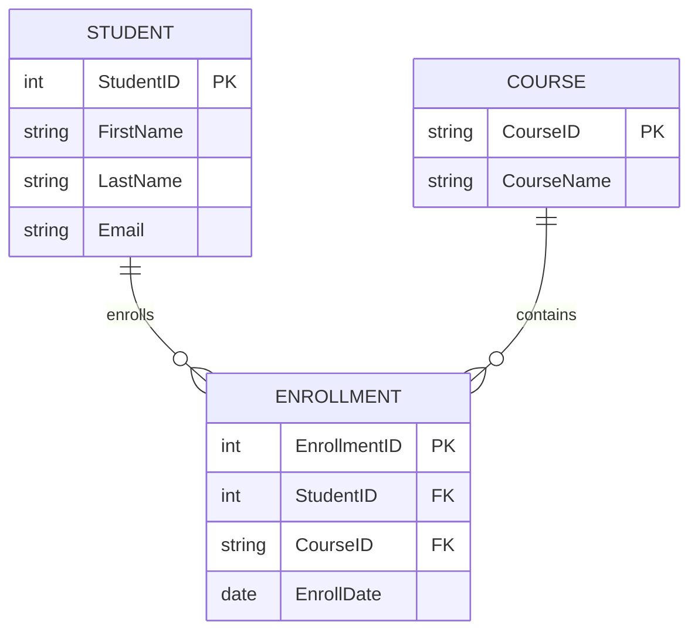
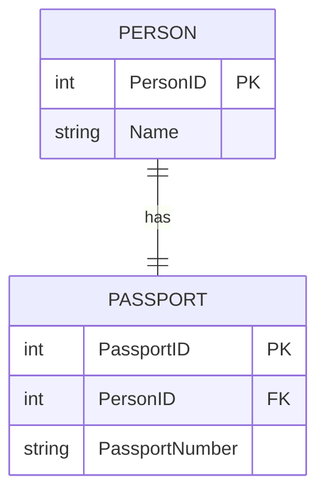
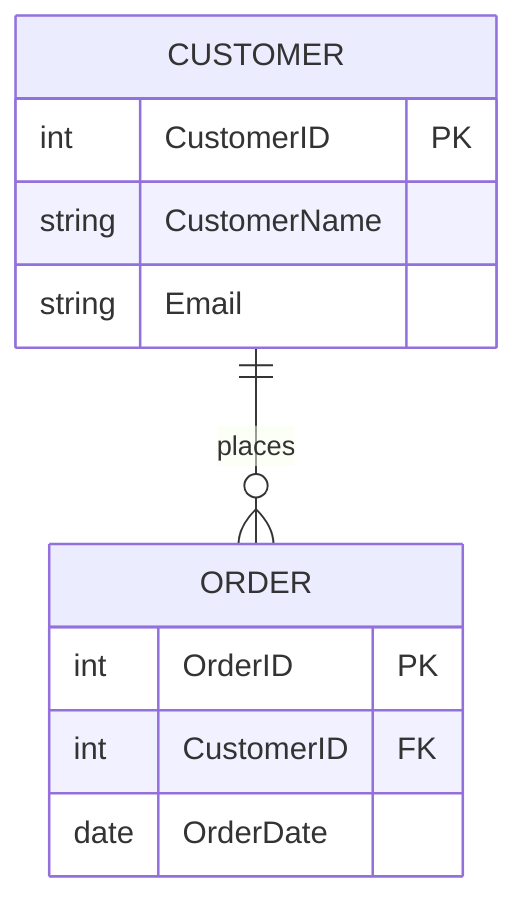
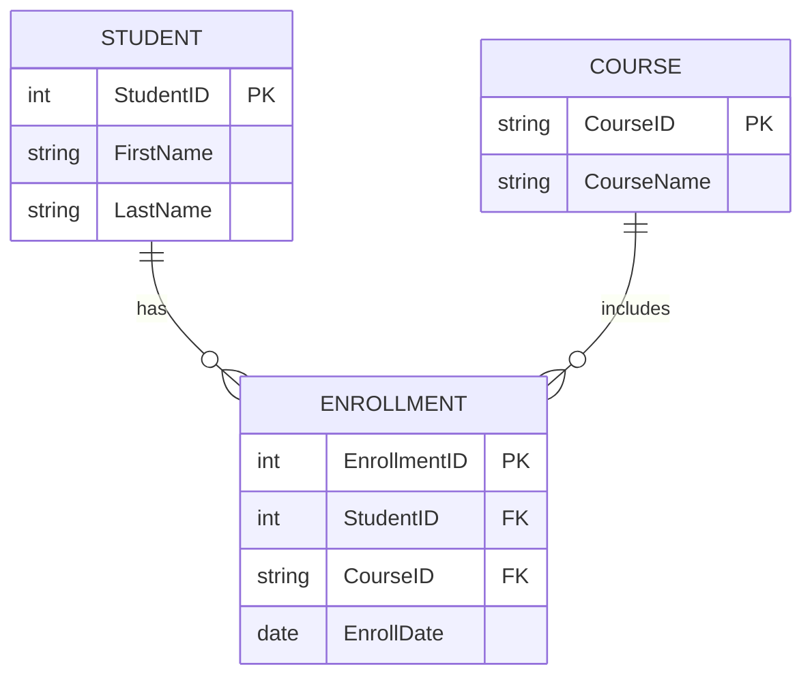
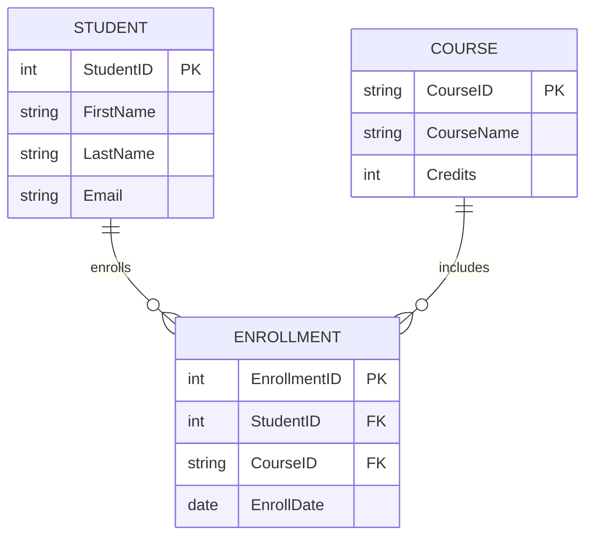
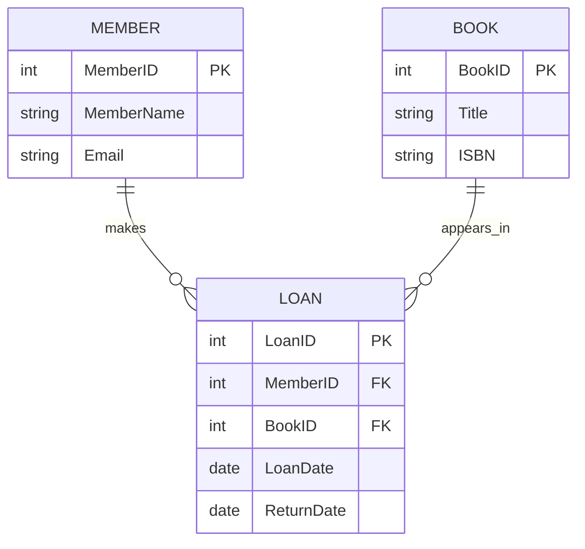
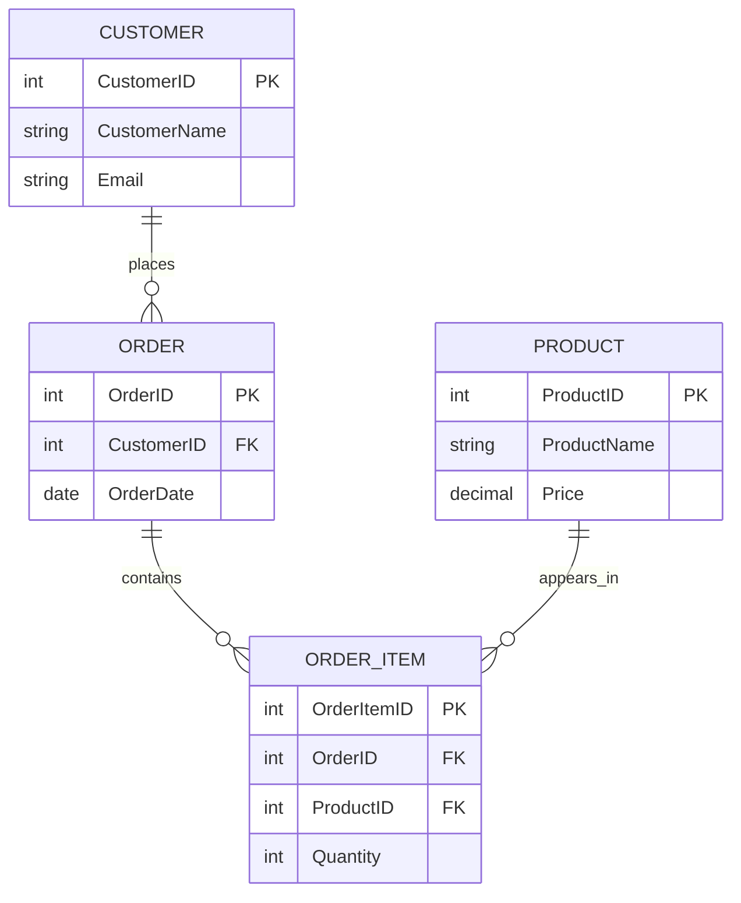
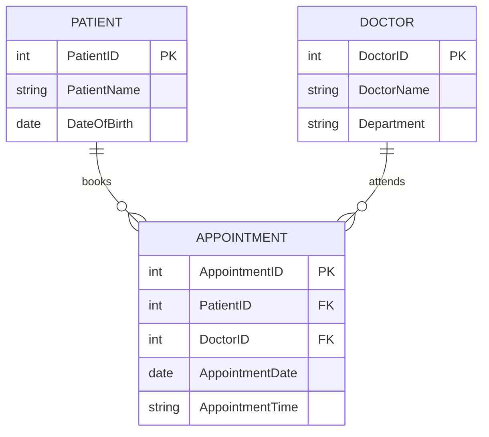
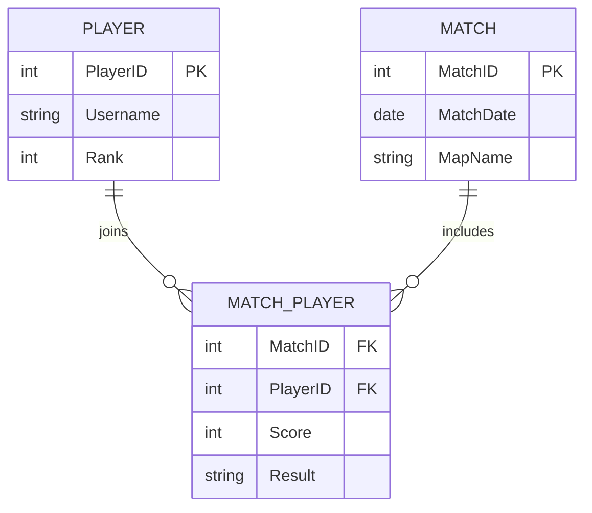

# ERD Basics

## 1. Lesson Goals

By the end of this lesson, students should be able to:

- explain what an ERD is
- explain why ERDs are used in database design
- identify entities, attributes, primary keys, foreign keys, and relationships in an ERD
- distinguish entity, attribute, and relationship
- explain cardinality at a basic level
- identify one-to-one, one-to-many, and many-to-many relationships from an ERD
- convert a simple scenario into entities and relationships
- convert a simple ERD idea into relational tables
- explain why many-to-many relationships need a linking table
- identify common ERD design mistakes
- apply ERD design to school, library, shop, hospital, and game scenarios
- answer exam-style questions about ERD basics

---

## 2. Syllabus Mapping

| Item | Detail |
|---|---|
| Unit | A3 Databases |
| Label | SL Core |
| Main skill | Modelling database structure before implementation |
| Connected topics | Database fundamentals, tables/records/fields, primary/foreign keys, relationships, normalization, SQL |
| Practical focus | Designing clear relational database structures from scenarios |
| Exam relevance | Entity identification, attribute selection, relationship/cardinality explanation, table conversion |

::: tip Learning Focus
An ERD is a planning diagram for a database. It shows entities, their attributes, and the relationships between entities before tables are built.
:::

---

## Start here: from scenario to ERD

When an ERD question gives you a written scenario, turn the words into a database design step by step:

1. Read the scenario carefully.
2. Underline important nouns.
3. Choose the main entities.
4. Add key attributes for each entity.
5. Identify relationships between entities.
6. Decide the cardinality, such as one-to-one, one-to-many, or many-to-many.
7. Check whether the ERD matches the original scenario.

Keep the focus on database structure: tables, fields, keys, and relationships. An ERD is not a flowchart and not a UML class diagram.

---

## Core checklist

After studying this page, you should be able to:

- identify entities from a scenario
- identify attributes that describe each entity
- choose a suitable primary key
- identify relationships between entities
- decide basic cardinality
- recognize when a link table may be needed
- explain why an ERD helps database design

---

## ERD answer pattern

When you meet an ERD question, use this order:

1. Identify the main things being stored.
2. Turn those things into entities.
3. Add useful attributes.
4. Mark primary keys.
5. Connect related entities.
6. Add cardinality.
7. Check for many-to-many relationships.

Short example:

```text
Scenario:
A school stores data about students and the courses they take.

Entities:
Student, Course

Attributes:
StudentID, StudentName
CourseID, CourseName

Relationship:
Student takes Course

Cardinality:
Many-to-many, because one student can take many courses and one course can have many students.
A link table such as Enrollment may be needed.
```

---

## 3. Key Terms

| English Term | 中文解释 | Exam-style meaning |
|---|---|---|
| ERD | 实体关系图 | Entity Relationship Diagram; visual model of database entities and relationships |
| Entity | 实体 | Real-world object or concept stored about |
| Attribute | 属性 | Property or detail of an entity |
| Relationship | 关系 | Connection between entities |
| Primary key | 主键 | Attribute that uniquely identifies each entity instance |
| Foreign key | 外键 | Attribute that links to a primary key in another table |
| Cardinality | 基数 | Number of possible related records |
| One-to-one | 一对一 | One entity instance relates to one other instance |
| One-to-many | 一对多 | One entity instance relates to many other instances |
| Many-to-many | 多对多 | Many instances relate to many instances |
| Linking table | 连接表 | Table used to resolve many-to-many relationship |
| Junction table | 连接表 | Another name for linking table |
| Optional relationship | 可选关系 | Relationship may not exist for every entity instance |
| Mandatory relationship | 必须关系 | Relationship must exist for each relevant entity instance |
| Entity instance | 实体实例 | One specific example of an entity |
| Schema | 数据库结构 | Overall structure of database tables and relationships |
| Crow's foot notation | 鸟爪表示法 | ERD notation showing cardinality with line symbols |

---

## 4. Concept Explanation

<LangBlock>
<template #cn>

### 中文讲解

**ERD** 全称是：

```text
Entity Relationship Diagram
```

中文可以理解为：

```text
实体关系图
```

ERD 用来在真正创建 database tables 之前，先画出数据库结构。

一个 ERD 通常展示三类核心内容：

```text
entities
attributes
relationships
```

例如学校数据库中：

```text
Student
Course
Teacher
Enrollment
```

这些可以是 entities。

每个 entity 有自己的 attributes：

```text
Student: StudentID, FirstName, LastName, Email
Course: CourseID, CourseName
Teacher: TeacherID, TeacherName
```

Entities 之间有 relationships：

```text
Teacher teaches Course
Student enrolls in Course
Student receives Grade
```

ERD 的作用是帮助我们看清：

```text
what data needs to be stored
which tables are needed
what fields each table needs
how tables should be linked
where primary keys and foreign keys should be placed
whether a linking table is needed
```

简单来说：

```text
ERD = database design map
entity = thing we store data about
attribute = detail of that thing
relationship = link between things
```

</template>

<template #en>

### English Explanation

**ERD** stands for:

```text
Entity Relationship Diagram
```

An ERD is used to plan the database structure before actual database tables are created.

An ERD usually shows three core things:

```text
entities
attributes
relationships
```

For example, in a school database:

```text
Student
Course
Teacher
Enrollment
```

can be entities.

Each entity has its own attributes:

```text
Student: StudentID, FirstName, LastName, Email
Course: CourseID, CourseName
Teacher: TeacherID, TeacherName
```

Entities have relationships:

```text
Teacher teaches Course
Student enrolls in Course
Student receives Grade
```

An ERD helps us understand:

```text
what data needs to be stored
which tables are needed
what fields each table needs
how tables should be linked
where primary keys and foreign keys should be placed
whether a linking table is needed
```

In simple terms:

```text
ERD = database design map
entity = thing we store data about
attribute = detail of that thing
relationship = link between things
```

</template>
</LangBlock>

---

## 5. What Is an ERD?

An **Entity Relationship Diagram** is a visual model of a database.

It shows:

```text
entities
attributes
relationships
cardinality
keys
```

### Example

A simple library ERD may show:

```text
Member borrows Book
```

But in a real relational design, this may become:

```text
Member --- Loan --- Book
```

because one member can borrow many books, and one book can be borrowed many times over time.

::: tip Exam Phrase
An ERD is a diagram used to model the entities, attributes, and relationships in a database before the database is implemented.
:::

---

## 6. Why ERDs Are Used

ERDs are used because they help design a database clearly before implementation.

### Benefits

| Benefit | Explanation |
|---|---|
| Planning | shows what data must be stored |
| Clear structure | identifies entities and attributes |
| Relationship design | shows how tables should connect |
| Reduces errors | finds design problems early |
| Reduces redundancy | encourages separate related tables |
| Communication | helps developers and users discuss design |
| Documentation | records database structure |
| Supports normalization | helps identify poor table design |

### Example

Before creating a school database, an ERD can help decide whether `Course1`, `Course2`, and `Course3` should be fields in Student table or whether an Enrollment table is needed.

---

## 7. Basic entity example: entity

An entity is a real-world object, person, place, event, or concept that data is stored about.

### Examples

```text
Student
Teacher
Course
Book
Member
Loan
Customer
Order
Product
Patient
Doctor
Appointment
Player
Match
```

### Entity to Table

In a relational database, an entity usually becomes a table.

Example:

```text
Entity: Student
Table: Student(StudentID, FirstName, LastName, Email)
```

### Entity Instance

An entity instance is one specific example of an entity.

```text
Entity = Student
Entity instance = Amy Chen
```

---

## 8. Attribute example: attribute

An attribute is a property or detail of an entity.

### Example: Student Entity

Attributes:

```text
StudentID
FirstName
LastName
DateOfBirth
Email
GradeLevel
```

### Example: Book Entity

Attributes:

```text
BookID
Title
ISBN
PublicationYear
Category
```

### Attribute to Field

In a table, attributes usually become fields/columns.

```text
Entity attribute = table field
```

### Good Attribute Choice

Attributes should describe the entity directly.

For `Student`, good attributes include:

```text
StudentID
FirstName
LastName
Email
```

Poor attributes inside Student may include:

```text
Course1
Course2
TeacherName
ParentPaymentAmount
```

These probably belong in related tables.

---

## 9. Relationship example: relationship

A relationship is a connection between entities.

### Examples

```text
Student enrolls in Course
Customer places Order
Member borrows Book
Doctor sees Patient
Player joins Match
Teacher teaches Course
```

### Relationship to Foreign Key

In relational tables, relationships are often implemented using foreign keys.

Example:

```text
Customer(CustomerID, CustomerName)
Order(OrderID, CustomerID, OrderDate)
```

Relationship:

```text
Customer places Order
```

Foreign key:

```text
Order.CustomerID → Customer.CustomerID
```

---

## 10. ERD Core Pattern

A simple ERD idea follows this pattern:

```text
Entity A
    attributes
Relationship
Entity B
    attributes
Cardinality
```

### Example

```text
Customer places Order
```

can be shown as:

```text
Customer 1 ─── many Order
```

Then converted to tables:

```text
Customer(CustomerID, CustomerName)
Order(OrderID, CustomerID, OrderDate)
```

---

## 11. ERD Notation Preview

Different teachers and textbooks may use slightly different ERD notation.

A common simple style:

```text
EntityName(PK Attribute, Attribute, Attribute)
```

Example:

```text
Student(PK StudentID, FirstName, LastName, Email)
Course(PK CourseID, CourseName)
Enrollment(PK EnrollmentID, FK StudentID, FK CourseID, EnrollDate)
```

### Mermaid Example



::: info Note
ERD symbols may vary. Focus on understanding entities, attributes, keys, and cardinality.
:::

---

## 12. Cardinality example: cardinality

Cardinality describes how many instances of one entity can relate to instances of another entity.

### Common Types

```text
one-to-one
one-to-many
many-to-many
```

### Examples

| Scenario | Cardinality |
|---|---|
| one person has one passport | one-to-one |
| one customer places many orders | one-to-many |
| one teacher teaches many courses | one-to-many |
| students take many courses | many-to-many |
| products appear in many orders | many-to-many |

### Exam Phrase

Cardinality shows the number of records in one table that can be associated with records in another table.

---

## 13. One-to-One in ERD

A one-to-one relationship means one instance of Entity A relates to one instance of Entity B.

### Example

```text
Person has Passport
```



### Explanation

One person has one passport.  
One passport belongs to one person.

### Use Cases

One-to-one may be used to:

```text
separate sensitive details
separate optional details
split a large table
control access to certain data
```

---

## 14. One-to-Many in ERD

A one-to-many relationship means one instance of Entity A can relate to many instances of Entity B.

### Example

```text
Customer places Order
```



### Explanation

One customer can place many orders.  
Each order belongs to one customer.

### Foreign Key Placement

For one-to-many:

```text
foreign key goes in the many-side table
```

Here:

```text
Order.CustomerID
```

is the foreign key.

---

## 15. Many-to-Many in ERD

A many-to-many relationship means many instances of Entity A can relate to many instances of Entity B.

### Example

```text
Student takes Course
```

Direct M:N relationship:

```text
Student many ─── many Course
```

In relational database design, this is resolved using a linking table:

```text
Student 1 ─── many Enrollment many ─── 1 Course
```



---

## 16. Link table example: linking table in ERD

A linking table resolves a many-to-many relationship.

### Linking Table Contains

```text
its own primary key OR composite key
foreign key to first table
foreign key to second table
optional relationship attributes
```

### Example

```text
Enrollment(EnrollmentID, StudentID, CourseID, EnrollDate, Status)
```

Here:

```text
StudentID = FK to Student
CourseID = FK to Course
EnrollDate and Status = details about this enrollment
```

### Other Examples

| Many-to-Many | Linking Table |
|---|---|
| Student - Course | Enrollment |
| Order - Product | OrderItem |
| Player - Match | MatchPlayer |
| Doctor - Patient | Appointment |
| Member - Book | Loan |

---

## 17. Primary Keys in ERDs

Primary keys are usually shown in the entity box.

Example:

```text
Student
---------
PK StudentID
FirstName
LastName
Email
```

### Why Show Primary Keys?

Primary keys show:

```text
how each record is identified
how other tables can refer to this table
which field should be unique and not null
```

### Good Primary Key Examples

```text
StudentID
CustomerID
OrderID
ProductID
BookID
PatientID
AppointmentID
```

---

## 18. Foreign Keys in ERDs

Foreign keys show how one entity/table links to another.

Example:

```text
Order
---------
PK OrderID
FK CustomerID
OrderDate
```

### What This Means

`CustomerID` in Order links to:

```text
Customer.CustomerID
```

### Why Show Foreign Keys?

Foreign keys show:

```text
which table is referenced
how relationships are implemented
where the link is stored
how referential integrity can be enforced
```

---

## 19. From ERD to Tables

A simple rule:

```text
entity → table
attribute → field
primary key → primary key field
relationship → foreign key or linking table
```

### Example ERD Idea

```text
Customer places Order
```

### Tables

```text
Customer(CustomerID, CustomerName, Email)
Order(OrderID, CustomerID, OrderDate)
```

### Explanation

Because this is one-to-many, `CustomerID` appears as a foreign key in Order.

---

## 20. From Scenario to ERD

When given a scenario, follow this process:

```text
1. Read the nouns to find possible entities.
2. Read the verbs to find possible relationships.
3. Choose attributes for each entity.
4. Choose primary keys.
5. Decide cardinality.
6. Add foreign keys or linking tables.
7. Check for redundancy and repeating groups.
```

### Example Scenario

```text
A library stores books and members. Members can borrow many books. Each loan stores loan date and return date.
```

Possible entities:

```text
Book
Member
Loan
```

Relationships:

```text
Member makes Loan
Book appears in Loan
```

---

## 21. Worked Example: School Courses

### Scenario

A school stores students and courses.  
Students can take many courses, and each course can have many students.

### Entities

```text
Student
Course
Enrollment
```

### ERD



### Explanation

Student and Course have a many-to-many relationship, so Enrollment is used as a linking table.

---

## 22. Worked Example: Library Loans

### Scenario

A library has members and books.  
A member can borrow many books.  
A book can be borrowed many times over time.

### Entities

```text
Member
Book
Loan
```

### ERD



### Explanation

Loan links Member and Book and stores details about borrowing.

---

## 23. Worked Example: Online Shop

### Scenario

A customer places orders.  
An order can contain many products.  
A product can appear in many orders.

### Entities

```text
Customer
Order
Product
OrderItem
```

### ERD



### Explanation

OrderItem resolves the many-to-many relationship between Order and Product.

---

## 24. Worked Example: Hospital Appointments

### Scenario

Patients make appointments with doctors.  
A patient can have many appointments.  
A doctor can have many appointments.

### Entities

```text
Patient
Doctor
Appointment
```

### ERD



### Explanation

Appointment links a patient and a doctor and stores the date/time details.

---

## 25. Worked Example: Game Matches

### Scenario

Players join matches.  
Each match contains many players.  
Each player can join many matches.

### Entities

```text
Player
Match
MatchPlayer
```

### ERD



### Explanation

MatchPlayer links Player and Match and can store score/result for that player's performance in that match.

---

## 26. Good ERD Design Checklist

A good ERD should:

```text
use clear entity names
include important attributes
show primary keys
show foreign keys or relationship lines
show cardinality
avoid repeated groups
avoid storing many unrelated things in one entity
resolve many-to-many relationships
support the scenario requirements
avoid unnecessary duplicated data
```

### Question to Ask

```text
Can this design answer the scenario questions?
```

If not, the ERD may be missing an entity, attribute, or relationship.

---

## 27. Common ERD Design Mistakes

### Mistake 1: Using Repeating Attributes

Poor:

```text
Student(StudentID, Name, Course1, Course2, Course3)
```

Better:

```text
Student
Course
Enrollment
```

### Mistake 2: Missing Linking Table

Poor:

```text
Student many-to-many Course directly as one table
```

Better:

```text
Student --- Enrollment --- Course
```

### Mistake 3: Storing Data in Wrong Entity

Poor:

```text
Student(StudentID, Name, TeacherName)
```

if students can have many teachers through courses.

Better:

```text
Student
Teacher
Course
Enrollment
```

### Mistake 4: Missing Primary Key

Every main entity table should normally have a primary key.

### Mistake 5: Wrong Cardinality

Example:

```text
Customer 1 ─── 1 Order
```

is usually wrong because one customer can place many orders.

---

## 28. ERD and Normalization Preview

ERDs support good database design, but normalization checks the design more formally.

Normalization helps reduce:

```text
redundancy
update anomalies
insert anomalies
delete anomalies
inconsistency
```

### Example

If customer details are repeated in every order record, normalization suggests separating:

```text
Customer
Order
```

into related tables.

Normalization is covered in the next A3 page.

---

## 29. ERD and SQL Preview

SQL queries depend on ERD relationships.

Example:

```sql
SELECT Customer.CustomerName, Order.OrderDate
FROM Customer
JOIN Order
ON Customer.CustomerID = Order.CustomerID;
```

This works because the ERD shows:

```text
Customer 1 ─── many Order
```

and `Order.CustomerID` is a foreign key.

### Key Idea

A good ERD makes SQL queries easier and clearer.

---

## 30. ERD Scenario Answer Bank

### If Asked: “Identify entities”

Use this structure:

```text
The main entities are [A], [B], and [C] because the system needs to store data about these objects or concepts.
```

### If Asked: “Identify attributes”

Use this structure:

```text
For the [Entity] entity, suitable attributes include [ID], [name], [date/status/other details]. [ID] can be used as the primary key.
```

### If Asked: “Explain relationship”

Use this structure:

```text
The relationship between [A] and [B] is [one-to-many / many-to-many / one-to-one] because one [A] can relate to [number] [B], and one [B] can relate to [number] [A].
```

### If Asked: “Explain linking table”

Use this structure:

```text
A linking table is needed because the relationship is many-to-many. It stores foreign keys from both entities and may store attributes about the relationship itself.
```

---

## 31. Common Mistakes

| Mistake | Why it is wrong | Better understanding |
|---|---|---|
| ERD is the same as SQL code | ERD is a design diagram | SQL implements/queries database |
| Entity means one record | Entity is a type; instance is one record | Student is entity, Amy is instance |
| Attribute means table | Attribute is a property/field | StudentID is attribute |
| Relationship means same attribute name | Relationship is a meaningful link | Usually implemented by PK/FK |
| Many-to-many needs no extra table | Relational design needs linking table | Use junction table |
| Foreign key goes randomly | FK placement depends on relationship | Usually many-side table |
| Cardinality is data type | Cardinality is relationship number | 1:1, 1:M, M:N |
| ERD should store all details in one entity | Causes redundancy | Separate entities |
| Primary keys are optional | Tables need identifiers | PK supports relationships |
| Course1/Course2 are good ERD attributes | Repeating groups are poor design | Use Enrollment table |

---

## 32. Guided Practice

### Practice 1: Entity or Attribute?

In a school database, is `Student` an entity or an attribute?

<details>
<summary>Suggested Answer</summary>

`Student` is an entity because it is something the database stores data about.

</details>

---

### Practice 2: Attribute

Give two attributes for a `Book` entity.

<details>
<summary>Suggested Answer</summary>

Possible attributes include `BookID`, `Title`, `ISBN`, `PublicationYear`, and `Category`.

</details>

---

### Practice 3: Cardinality

One customer can place many orders. Each order belongs to one customer. What is the cardinality?

<details>
<summary>Suggested Answer</summary>

One-to-many.

</details>

---

### Practice 4: Linking Table

Students can take many courses, and courses can have many students. What linking table could be used?

<details>
<summary>Suggested Answer</summary>

`Enrollment`.

</details>

---

### Practice 5: Foreign Key

In `Order(OrderID, CustomerID, OrderDate)`, what is likely to be the foreign key?

<details>
<summary>Suggested Answer</summary>

`CustomerID`, because it links Order to Customer.

</details>

---

## 33. Independent Practice

### Question 1

Define ERD.

### Question 2

Define entity, attribute, and relationship.

### Question 3

Explain why ERDs are useful before creating database tables.

### Question 4

Identify three possible entities in a school database and three attributes for each.

### Question 5

Explain cardinality and give one example of one-to-many.

### Question 6

Explain why a many-to-many relationship needs a linking table.

### Question 7

Convert this scenario into entities and relationships: customers place orders, and orders contain products.

### Question 8

Draw or describe an ERD for a library loan system.

### Question 9

Explain two common ERD design mistakes.

### Question 10

Explain how an ERD can help reduce data redundancy.

---

## 34. Exam-style Questions

### Question 1 [4 marks]

Define ERD and state its purpose.

<details>
<summary>Mark Scheme Style Answer</summary>

An ERD, or Entity Relationship Diagram, is a diagram used to model the entities, attributes, and relationships in a database. It is used during database design to show what data needs to be stored, how entities are related, and how tables may be structured before implementation.

</details>

---

### Question 2 [5 marks]

Distinguish between entity, attribute, and relationship using a school example.

<details>
<summary>Mark Scheme Style Answer</summary>

An entity is something the database stores data about, such as Student or Course. An attribute is a property of an entity, such as StudentID, FirstName, or CourseName. A relationship links entities, such as a Student enrolls in a Course.

</details>

---

### Question 3 [6 marks]

A school stores students and courses. A student can take many courses, and a course can have many students. Explain how this should be represented in an ERD.

<details>
<summary>Mark Scheme Style Answer</summary>

This is a many-to-many relationship because one student can take many courses and one course can have many students. The ERD should include Student and Course entities and a linking entity/table such as Enrollment. Student has `StudentID` as a primary key, Course has `CourseID` as a primary key, and Enrollment stores `StudentID` and `CourseID` as foreign keys. Enrollment may also store relationship attributes such as enrollment date or status.

</details>

---

### Question 4 [6 marks]

Explain how a one-to-many relationship is converted into relational tables.

<details>
<summary>Mark Scheme Style Answer</summary>

In a one-to-many relationship, the entity on the one side becomes a table with a primary key. The entity on the many side also becomes a table with its own primary key, and it stores the primary key from the one-side table as a foreign key. For example, one Customer can place many Orders, so `Customer(CustomerID, CustomerName)` and `Order(OrderID, CustomerID, OrderDate)` can be used, where `Order.CustomerID` is the foreign key.

</details>

---

### Question 5 [6 marks]

A database designer creates this entity:

```text
Student(StudentID, Name, Course1, Course2, Course3)
```

Explain why this is poor ERD/table design and suggest an improvement.

<details>
<summary>Mark Scheme Style Answer</summary>

This design uses repeating attributes `Course1`, `Course2`, and `Course3`, which limits the number of courses and makes searching or updating course enrollment difficult. It also mixes student data with course enrollment data. A better design is to use separate Student and Course entities and a linking table such as Enrollment with `StudentID` and `CourseID` as foreign keys. This supports any number of courses and reduces redundancy.

</details>

---

## 35. Independent practice
### Independent practice part A: Concept Explanation

In 6-8 sentences, explain what an ERD is and how it helps database design.

---

### Independent practice part B: Scenario ERD

For a library system, identify:

```text
entities
attributes
primary keys
relationships
foreign keys
```

Use at least:

```text
Book
Member
Loan
```

---

### Independent practice part C: Relationship Analysis

For each scenario, identify the cardinality and whether a linking table is needed:

```text
1. customer places orders
2. student takes courses
3. person has passport
4. order contains products
5. player joins matches
```

---

### Independent practice part D: Misconception Correction

Correct these statements:

```text
An ERD is the same as SQL code.
An entity is one single record only.
A many-to-many relationship does not need an extra table.
Cardinality means data type.
Course1, Course2, Course3 is a flexible way to store student courses.
```

---

## 36. One-page Revision Summary

| Point | Summary |
|---|---|
| ERD | Entity Relationship Diagram |
| Purpose | Plan database structure before implementation |
| Entity | Thing/concept stored about |
| Attribute | Property/detail of entity |
| Relationship | Link between entities |
| Primary key | Unique identifier |
| Foreign key | Link to another table |
| Cardinality | Number relationship between entities |
| One-to-one | One A relates to one B |
| One-to-many | One A relates to many B |
| Many-to-many | Many A relate to many B |
| Linking table | Resolves many-to-many |
| Entity to table | Entity usually becomes table |
| Attribute to field | Attribute usually becomes field |
| Relationship to FK | Relationship implemented by FK/linking table |
| Good ERD | clear entities, keys, cardinality, no repeating groups |
| Exam phrase | An ERD models entities, attributes, and relationships so a database can be designed with suitable tables, keys, and links |

---

## 37. Quick Self-test

Before moving on, students should be able to answer these:

1. What does ERD stand for?
2. What is an entity?
3. What is an attribute?
4. What is a relationship?
5. What is cardinality?
6. Give one example of one-to-many.
7. Give one example of many-to-many.
8. Why is a linking table needed?
9. How does an entity become a table?
10. Why are repeating attributes poor design?

