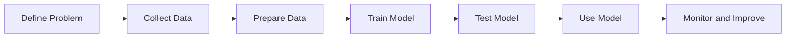

# Machine Learning Fundamentals

## 1. Lesson Goals

By the end of this lesson, students should be able to:

- explain what machine learning is
- distinguish artificial intelligence and machine learning at a basic level
- explain why machine learning is used
- describe the basic machine learning process
- explain the roles of data, features, labels, model, training, and prediction
- distinguish training and using a trained model
- explain supervised and unsupervised learning at a preview level
- identify common machine learning applications
- explain common limitations of machine learning systems
- explain why data quality affects model quality
- explain why machine learning predictions may be wrong
- connect machine learning to databases, privacy, bias, ethics, and real-world decision-making
- answer exam-style questions about machine learning fundamentals

---

## 2. Syllabus Mapping

| Item | Detail |
|---|---|
| Unit | A4 Machine Learning |
| Label | SL Core |
| Main skill | Understanding how machine learning systems use data to train models and make predictions |
| Connected topics | Data, features and labels; supervised learning; unsupervised learning; training/testing/validation; model evaluation; bias, ethics and privacy |
| Practical focus | Explaining ML using realistic scenarios rather than only memorizing definitions |
| Exam relevance | Definitions, process explanation, scenario identification, advantages/limitations, ethical awareness |

::: tip Learning Focus
Machine learning is about systems learning patterns from data. A model is trained using data, then used to make predictions or decisions on new data.
:::

---

## 3. Key Terms

| English Term | 中文解释 | Exam-style meaning |
|---|---|---|
| Artificial intelligence | 人工智能 | Field of computing that aims to create systems that perform tasks needing human-like intelligence |
| Machine learning | 机器学习 | A method where systems learn patterns from data to make predictions or decisions |
| Algorithm | 算法 | Step-by-step method used to solve a problem or train a model |
| Model | 模型 | Trained system that uses learned patterns to make predictions |
| Data | 数据 | Examples used to train, test, or use a model |
| Dataset | 数据集 | Collection of data examples |
| Feature | 特征 | Input variable used by a model |
| Label | 标签 | Correct output or target value in supervised learning |
| Training | 训练 | Process of using data to build or improve a model |
| Prediction | 预测 | Output produced by a trained model |
| Classification | 分类 | Predicting a category/class |
| Regression | 回归 | Predicting a numerical value |
| Supervised learning | 监督学习 | Learning from labelled examples |
| Unsupervised learning | 无监督学习 | Finding patterns in unlabelled data |
| Training data | 训练数据 | Data used to train a model |
| Testing data | 测试数据 | Data used to evaluate a trained model |
| Validation data | 验证数据 | Data used to tune or choose a model |
| Accuracy | 准确率 | Measure of how often predictions are correct |
| Bias | 偏差 / 偏见 | Systematic unfairness or error in data/model/output |
| Overfitting | 过拟合 | Model learns training data too specifically and performs poorly on new data |
| Underfitting | 欠拟合 | Model is too simple and fails to learn useful patterns |
| Generalization | 泛化能力 | Ability to perform well on new unseen data |

---

## 4. Concept Explanation

<LangBlock>
<template #cn>

### 中文讲解

**Machine learning（机器学习）** 是一种让计算机从 data 中学习 patterns 的方法。  
传统程序通常是人写好 rules，然后 computer 按规则执行。

例如传统程序：

```text
if score >= 50:
    result = "pass"
else:
    result = "fail"
```

规则是人明确写出来的。

Machine learning 的思路不完全一样。  
我们给系统很多 examples，让它从 examples 中学习规律。

例如：

```text
many house examples
features: size, location, number of rooms
label: price
```

模型通过这些 data 学习 house features 和 price 之间的关系。  
训练完成后，它可以对新房子预测价格。

Machine learning 的基本过程是：

```text
collect data
prepare data
choose model / algorithm
train model
test model
use model to make predictions
evaluate and improve model
```

简单来说：

```text
machine learning = learn patterns from data
model = trained system
features = inputs
label = correct output
prediction = model's output
```

</template>

<template #en>

### English Explanation

**Machine learning** is a way for computers to learn patterns from data.  
In a traditional program, humans usually write clear rules and the computer follows them.

Example of a traditional program:

```text
if score >= 50:
    result = "pass"
else:
    result = "fail"
```

The rules are written directly by a human.

Machine learning works differently.  
We give the system many examples, and it learns patterns from those examples.

Example:

```text
many house examples
features: size, location, number of rooms
label: price
```

The model learns the relationship between house features and price.  
After training, it can predict the price of a new house.

The basic machine learning process is:

```text
collect data
prepare data
choose model / algorithm
train model
test model
use model to make predictions
evaluate and improve model
```

In simple terms:

```text
machine learning = learn patterns from data
model = trained system
features = inputs
label = correct output
prediction = model's output
```

</template>
</LangBlock>

---

## 5. What Is Machine Learning?

Machine learning is a method where a computer system learns patterns from data and uses those patterns to make predictions, classifications, recommendations, or decisions.

### Simple Definition

```text
Machine learning allows a system to improve its performance on a task by learning from data.
```

### Example

A spam filter can learn from many examples of emails.

```text
input data = email text, sender, links, attachments
label = spam or not spam
model learns patterns
new email is classified as spam or not spam
```

### Important

Machine learning does not mean the computer understands like a human.  
It means the system uses statistical or mathematical patterns learned from data.

::: tip Exam Phrase
Machine learning is a technique where a system learns patterns from data and uses a trained model to make predictions or decisions on new data.
:::

---

## 6. Artificial Intelligence vs Machine Learning

Artificial intelligence and machine learning are related but not identical.

| Concept | Meaning | Example |
|---|---|---|
| Artificial intelligence | broad field of systems performing tasks requiring human-like intelligence | planning, reasoning, natural language, vision |
| Machine learning | part of AI where systems learn from data | spam filter, image classifier, recommendation model |

### Relationship

```text
Machine learning is a part of artificial intelligence.
```

### Simple Analogy

```text
AI = whole field
ML = one important method inside AI
```

### Common Mistake

Do not say:

```text
AI and machine learning are exactly the same.
```

Better:

```text
Machine learning is one approach used to build AI systems.
```

---

## 7. Traditional Programming vs Machine Learning

### Traditional Programming

Humans write the rules.

```text
rules + data → output
```

Example:

```text
if temperature > 38:
    alert = "fever"
```

### Machine Learning

The system learns patterns from examples.

```text
data + labels + algorithm → model
model + new data → prediction
```

### Comparison

| Traditional Programming | Machine Learning |
|---|---|
| rules written by programmers | patterns learned from data |
| good when rules are clear | useful when rules are complex or hidden |
| easier to explain in simple cases | may be harder to interpret |
| output follows explicit logic | output depends on training data and model |

### Example

Recognizing cats in images is hard to program with simple rules.  
Machine learning can learn patterns from many labelled images.

---

## 8. Why Machine Learning Is Used

Machine learning is useful when:

```text
rules are too complex to write manually
large amounts of data are available
patterns are hidden in data
predictions are needed
classification is needed
recommendations are needed
systems need to adapt over time
```

### Examples

```text
spam detection
fraud detection
face recognition
speech recognition
medical image support
product recommendations
movie recommendations
traffic prediction
translation
game matchmaking
customer support chatbots
```

### Key Idea

Machine learning is not always needed.  
If rules are simple and clear, traditional programming may be better.

---

## 9. Basic Machine Learning Process

A simple ML process can be shown as:

```text
1. Define the problem.
2. Collect data.
3. Prepare and clean data.
4. Choose features and labels.
5. Choose a model/algorithm.
6. Train the model.
7. Test/evaluate the model.
8. Use the model for prediction.
9. Monitor and improve the model.
```

### Diagram



### Example

For spam detection:

```text
problem = classify emails as spam or not spam
data = past emails
features = words, sender, links
label = spam/not spam
model = trained classifier
prediction = new email category
```

---

## 10. Data

Data is the examples used by the machine learning system.

### Examples of Data

| Application | Data Examples |
|---|---|
| spam filter | emails |
| image recognition | images |
| house price prediction | house size, location, price |
| music recommendation | listening history |
| fraud detection | transaction records |
| medical diagnosis support | symptoms, scans, test results |
| game matchmaking | player skill, win rate, role preference |

### Data Quality Matters

Poor data can produce poor models.

Problems include:

```text
missing values
wrong labels
outdated data
biased data
too little data
irrelevant features
duplicate data
unbalanced categories
privacy-sensitive data
```

### Exam Phrase

The quality and representativeness of training data strongly affects the performance and fairness of the model.

---

## 11. Dataset

A dataset is a collection of data examples.

### Example: Student Performance Dataset

| StudyHours | AttendanceRate | PreviousScore | FinalResult |
|---:|---:|---:|---|
| 8 | 95 | 82 | Pass |
| 2 | 60 | 45 | Fail |
| 5 | 80 | 70 | Pass |

In this dataset:

```text
each row = one example
features = StudyHours, AttendanceRate, PreviousScore
label = FinalResult
```

### Dataset Use

A dataset may be split into:

```text
training data
validation data
testing data
```

These are covered in more detail later.

---

## 12. Features

Features are the input variables used by a model.

### Example: House Price Prediction

Features might include:

```text
size
number of bedrooms
location
distance to city centre
age of building
nearby school rating
```

### Example: Email Spam Detection

Features might include:

```text
sender address
number of links
words in subject
attachment presence
message length
suspicious phrases
```

### Good Features

Good features should be:

```text
relevant to the task
measurable
available at prediction time
not unnecessarily privacy-invasive
not strongly biased in harmful ways
```

---

## 13. Labels

A label is the correct output used in supervised learning.

### Examples

| Task | Label |
|---|---|
| spam detection | spam / not spam |
| image classification | cat / dog / car |
| house price prediction | price |
| medical risk prediction | low / medium / high risk |
| exam result prediction | pass / fail |
| sentiment analysis | positive / negative |

### Labelled Data

Labelled data means each example includes the correct answer.

Example:

| EmailText | Label |
|---|---|
| "Win money now!" | Spam |
| "Meeting at 3pm" | Not spam |

### Key Idea

Supervised learning needs labelled examples.

---

## 14. Model

A model is the trained system that uses patterns learned from data.

### Before Training

```text
algorithm + data = not yet useful model
```

### After Training

```text
trained model can make predictions on new data
```

### Example

A trained spam model can take a new email and output:

```text
Spam
```

or:

```text
Not spam
```

### Model Is Not the Dataset

The dataset is the examples.  
The model is the learned pattern or system created from those examples.

---

## 15. Algorithm

An algorithm is a method or procedure used to train or use a model.

### Examples of ML Algorithms

```text
decision tree
k-nearest neighbours
linear regression
logistic regression
neural network
clustering algorithm
```

### Student-Level Understanding

You do not need to deeply calculate these algorithms here.  
You should understand:

```text
algorithm = method used for learning
model = result after training
```

### Common Mistake

Do not say:

```text
model and algorithm are always the same.
```

Better:

```text
An algorithm is used to train a model; the trained model is then used for prediction.
```

---

## 16. Training

Training is the process of using data to build or improve a model.

### During Training

The system looks for patterns between:

```text
features
and labels
```

in supervised learning.

### Example

Training a house price model:

```text
input features = size, location, rooms
label = actual sale price
model learns relationship
```

### Result

After training, the model can predict the price of a new house based on its features.

---

## 17. Prediction

A prediction is the output produced by a trained model when it receives new input data.

### Example: Spam Detection

Input:

```text
new email
```

Model output:

```text
Spam
```

### Example: House Price

Input:

```text
size = 120 square metres
rooms = 3
location = near city
```

Model output:

```text
predicted price = 800000
```

### Important

A prediction may be wrong.  
Machine learning usually gives likely outputs, not guaranteed truth.

---

## 18. Training vs Using a Model

These are different stages.

| Stage | What Happens |
|---|---|
| Training | model learns patterns from training data |
| Using/inference | trained model makes predictions on new data |

### Example

Spam filter:

```text
training = learn from many labelled emails
using = classify one new incoming email
```

### Simple Pattern

```text
training data → training process → trained model
new data → trained model → prediction
```

---

## 19. Supervised Learning Preview

Supervised learning uses labelled data.

### Pattern

```text
features + label → train model
new features → prediction
```

### Examples

```text
email → spam/not spam
image → cat/dog
house features → house price
student data → pass/fail prediction
transaction data → fraud/not fraud
```

### Two Common Types

```text
classification = predict category
regression = predict number
```

These are covered in more detail in later pages.

---

## 20. Unsupervised Learning Preview

Unsupervised learning uses unlabelled data.

### Pattern

```text
data without labels → find patterns/groups
```

### Examples

```text
group customers by shopping behaviour
cluster news articles by topic
find unusual network behaviour
group students by learning pattern
detect unusual transactions
```

### Key Difference

Supervised learning has correct labels.  
Unsupervised learning does not have given correct answers.

---

## 21. Classification and Regression Preview

### Classification

Classification predicts a category.

Examples:

```text
spam or not spam
cat or dog
pass or fail
low/medium/high risk
fraud or not fraud
```

### Regression

Regression predicts a number.

Examples:

```text
house price
temperature tomorrow
delivery time
exam score
stock demand
```

### Quick Memory

```text
classification = category
regression = number
```

---

## 22. Training, Testing and Validation Preview

A dataset is often split into different parts.

### Training Data

Used to train the model.

### Validation Data

Used to tune or choose model settings.

### Testing Data

Used to evaluate the final model on unseen data.

### Why Split Data?

If a model is only tested on data it already saw during training, the result may be misleading.

More detail is covered in the training/testing/validation page.

---

## 23. Model Evaluation Preview

A model must be evaluated to check how well it performs.

### Possible Measures

```text
accuracy
precision
recall
F1 score
mean absolute error
confusion matrix
```

### Student-Level Idea

Evaluation asks:

```text
How good are the predictions?
What kinds of mistakes does the model make?
Is it good enough for this use?
Is it fair and safe?
```

### Important

High accuracy does not always mean the model is safe or fair.

---

## 24. Overfitting and Underfitting Preview

### Overfitting

The model learns the training data too specifically.

Problem:

```text
good on training data
poor on new data
```

### Underfitting

The model is too simple to learn useful patterns.

Problem:

```text
poor on training data
poor on new data
```

### Goal

A good model should generalize well to new unseen data.

---

## 25. ML Applications

Machine learning is used in many areas.

| Area | Application |
|---|---|
| Email | spam filtering |
| Shopping | product recommendations |
| Banking | fraud detection |
| Education | learning analytics |
| Healthcare | image analysis support |
| Transport | traffic prediction |
| Entertainment | movie/music recommendations |
| Security | anomaly detection |
| Games | matchmaking and NPC behaviour |
| Language | translation and speech recognition |

### Important

ML can support decisions, but in high-risk areas humans may still need to review results.

---

## 26. ML Limitations

Machine learning has limitations.

### Common Limitations

```text
needs suitable data
may learn bias from data
may be wrong on new situations
may be hard to explain
may overfit or underfit
may fail if data changes over time
may require privacy-sensitive data
may be expensive to train or run
may be misused
```

### Example

A model trained on old customer data may perform poorly if customer behaviour changes.

### Key Exam Phrase

Machine learning models depend heavily on training data, so biased, incomplete, or unrepresentative data can lead to poor or unfair predictions.

---

## 27. Data Quality and Bias

Machine learning models learn from data.

If the data is biased, the model may learn biased patterns.

### Data Problems

```text
some groups underrepresented
labels are incorrect
historical decisions were unfair
data is outdated
important features are missing
data was collected from only one context
```

### Example

If a hiring model is trained on past hiring data that favored one group, the model may repeat that unfair pattern.

### Protection

```text
check data sources
test model on different groups
remove or review harmful features
use human oversight
monitor outcomes
follow ethical guidelines
```

---

## 28. Privacy and ML

ML often needs large amounts of data, which may include personal data.

### Privacy Risks

```text
collecting too much data
using data without consent
re-identifying people from data
leaking training data
using sensitive attributes unfairly
keeping data too long
```

### Privacy Controls

```text
data minimization
consent where needed
anonymization or pseudonymization
access control
encryption
retention limits
privacy impact assessment
```

### Connection to A3

Database privacy and ML privacy are connected because ML datasets are often stored and managed in databases.

---

## 29. Human Oversight

Machine learning predictions may affect people.

Examples:

```text
loan approval
medical screening
school risk prediction
job application filtering
policing risk prediction
insurance pricing
```

### Why Human Oversight Matters

Humans may need to:

```text
review high-risk decisions
check unfair outcomes
handle unusual cases
explain decisions to users
correct errors
take responsibility
```

### Key Idea

ML should not automatically replace human judgment in high-stakes contexts.

---

## 30. Worked Example: Spam Filter

### Problem

Classify emails as spam or not spam.

### Data

```text
past emails
```

### Features

```text
sender
subject words
links
attachments
message length
suspicious phrases
```

### Label

```text
spam
not spam
```

### Model Output

```text
new email → spam or not spam
```

### Possible Issue

Some normal emails may be incorrectly classified as spam.

---

## 31. Worked Example: House Price Prediction

### Problem

Predict house price.

### Features

```text
size
number of bedrooms
location
age of property
distance to city
```

### Label

```text
actual sale price
```

### Model Output

```text
predicted price
```

### Type

This is regression because the output is numerical.

---

## 32. Worked Example: Product Recommendation

### Problem

Recommend products to customers.

### Data

```text
purchase history
browsing history
ratings
similar users' behaviour
product categories
```

### Output

```text
recommended products
```

### Possible Issue

Recommendations may trap users in a narrow range of content or products.

---

## 33. Worked Example: Medical Image Support

### Problem

Support doctors by identifying possible disease signs in images.

### Data

```text
medical images
doctor-provided labels
patient metadata if appropriate
```

### Output

```text
possible risk / classification
```

### Important Limitation

The model may be wrong and should be reviewed by qualified medical professionals, especially in high-risk decisions.

---

## 34. Worked Example: Game Matchmaking

### Problem

Match players into fair games.

### Features

```text
player rank
recent win rate
role preference
latency
party size
past performance
```

### Output

```text
match assignment
```

### Possible Issue

If the model or rules use poor features, matches may feel unfair.

---

## 35. Scenario Answer Bank

### If Asked: “Define machine learning”

Use this structure:

```text
Machine learning is a technique where a system learns patterns from data and uses a trained model to make predictions or decisions on new data.
```

### If Asked: “Explain the ML process”

Use this structure:

```text
Data is collected and prepared. Features and labels are identified. A model is trained using training data. The model is tested or evaluated using unseen data. After training, the model can make predictions on new data.
```

### If Asked: “Explain features and labels”

Use this structure:

```text
Features are input variables used by the model. A label is the correct output or target value used in supervised learning.
```

### If Asked: “Explain a limitation”

Use this structure:

```text
A limitation is that the model depends on training data. If the data is biased, incomplete, outdated, or unrepresentative, the model may make inaccurate or unfair predictions.
```

---

## 36. Common Misconceptions

| Mistake | Why it is wrong | Better understanding |
|---|---|---|
| ML and AI are exactly the same | ML is part of AI | AI is broader |
| ML means computer thinks like a human | ML learns statistical patterns | It does not necessarily understand |
| More data always means better model | poor data can harm model | quality matters |
| Training accuracy proves model is good | may overfit | test on unseen data |
| Model predictions are always correct | predictions can be wrong | evaluate and monitor |
| Unsupervised learning has labels | it uses unlabelled data | finds patterns/groups |
| Classification predicts numbers | classification predicts categories | regression predicts numbers |
| Model and dataset are the same | dataset is examples; model is learned system | different roles |
| Bias only comes from code | bias can come from data and use context | check full system |
| ML can replace humans in all decisions | high-risk decisions need oversight | humans may need review |

---

## 37. Guided Practice

### Practice 1: ML or Traditional Programming?

A program uses this rule:

```text
if score >= 50 then pass
```

Is this machine learning or traditional programming?

<details>
<summary>Suggested Answer</summary>

Traditional programming, because the rule is explicitly written by a programmer.

</details>

---

### Practice 2: Feature or Label?

In house price prediction, `number of bedrooms` is feature or label?

<details>
<summary>Suggested Answer</summary>

Feature, because it is an input used to predict the price.

</details>

---

### Practice 3: Classification or Regression?

Predicting whether an email is spam or not spam is classification or regression?

<details>
<summary>Suggested Answer</summary>

Classification, because the output is a category.

</details>

---

### Practice 4: Regression

Predicting tomorrow's temperature is classification or regression?

<details>
<summary>Suggested Answer</summary>

Regression, because the output is a number.

</details>

---

### Practice 5: Data Quality

Why can biased training data be a problem?

<details>
<summary>Suggested Answer</summary>

The model may learn biased patterns from the data and make unfair or inaccurate predictions for some groups.

</details>

---

## 38. Independent Practice

### Question 1

Define machine learning.

### Question 2

Explain the difference between artificial intelligence and machine learning.

### Question 3

Explain the difference between traditional programming and machine learning.

### Question 4

Define data, feature, label, model, training, and prediction.

### Question 5

Give one example of supervised learning and identify the features and label.

### Question 6

Give one example of unsupervised learning.

### Question 7

Explain the difference between classification and regression.

### Question 8

Explain why data quality affects model performance.

### Question 9

Give two limitations of machine learning.

### Question 10

Explain why human oversight may be important for high-risk ML decisions.

---

## 39. Exam-style Questions

### Question 1 [4 marks]

Define machine learning and explain the role of data.

<details>
<summary>Mark Scheme Style Answer</summary>

Machine learning is a technique where a system learns patterns from data and uses a trained model to make predictions or decisions on new data. Data provides the examples used to train and evaluate the model, so the model's performance depends strongly on the quality and representativeness of the data.

</details>

---

### Question 2 [5 marks]

Distinguish between artificial intelligence and machine learning.

<details>
<summary>Mark Scheme Style Answer</summary>

Artificial intelligence is the broader field of creating computer systems that can perform tasks requiring human-like intelligence, such as reasoning, perception, or language processing. Machine learning is a part of AI where systems learn patterns from data instead of relying only on explicitly programmed rules.

</details>

---

### Question 3 [6 marks]

Explain the basic machine learning process.

<details>
<summary>Mark Scheme Style Answer</summary>

The problem is first defined and relevant data is collected. The data is prepared and useful features are selected. In supervised learning, labels are provided as correct outputs. A model is trained using training data, then tested or evaluated using unseen data. If performance is acceptable, the trained model can be used to make predictions on new data, and its performance should be monitored and improved.

</details>

---

### Question 4 [6 marks]

A system predicts house prices using size, location, number of bedrooms, and previous sale prices. Identify the features, label, and likely type of learning.

<details>
<summary>Mark Scheme Style Answer</summary>

The features include size, location, and number of bedrooms because these are input variables used by the model. The label is the previous sale price because it is the correct target value used during training. This is supervised learning because labelled examples are used. It is regression because the output is a numerical value, the predicted house price.

</details>

---

### Question 5 [6 marks]

Explain two limitations or risks of using machine learning in decision-making.

<details>
<summary>Mark Scheme Style Answer</summary>

One limitation is that the model depends on training data. If the data is biased, incomplete, outdated, or unrepresentative, the model may make inaccurate or unfair predictions. Another risk is that some models are difficult to explain, so users may not understand why a decision was made. ML predictions can also be wrong, so high-risk decisions may need human oversight, monitoring, and ethical review.

</details>

---

## 40. Classroom Activity

### Activity 1: Is It ML?

Students classify examples as traditional programming or machine learning:

```text
if score >= 50 then pass
spam filter trained on emails
calculator adding two numbers
recommendation system using watch history
traffic light timer using fixed schedule
image classifier trained on labelled images
```

---

### Activity 2: Feature and Label Cards

Give students scenario cards:

```text
house price prediction
email spam detection
student pass/fail prediction
movie recommendation
fraud detection
game matchmaking
```

Students identify:

```text
possible features
possible label
prediction output
classification or regression
```

---

### Activity 3: Data Quality Discussion

Give students a poor dataset scenario:

```text
A face recognition model is trained mostly on one age group and one skin tone group.
```

Students discuss:

```text
what may go wrong
who may be harmed
how to improve the data or testing
why human oversight matters
```

---

## 41. Homework

### Homework Part A: Concept Explanation

In 6-8 sentences, explain what machine learning is and how it differs from traditional programming.

---

### Homework Part B: Scenario Table

Choose three ML applications.

For each one, create a table with:

```text
application
input data
features
label if supervised
prediction output
possible limitation or risk
```

---

### Homework Part C: Classification or Regression

Classify each as classification or regression and explain why:

```text
1. predicting house price
2. detecting spam email
3. predicting exam score
4. classifying images as cat or dog
5. predicting delivery time
```

---

### Homework Part D: Misconception Correction

Correct these statements:

```text
Machine learning and AI mean exactly the same thing.
A model is the same as the dataset.
Machine learning predictions are always correct.
More data is always better, even if it is biased.
Classification predicts a number.
```

---

## 42. One-page Revision Summary

| Point | Summary |
|---|---|
| AI | Broad field of human-like intelligent systems |
| ML | Part of AI that learns from data |
| Traditional programming | human writes explicit rules |
| Machine learning | model learns patterns from examples |
| Data | examples used by ML system |
| Dataset | collection of examples |
| Feature | input variable |
| Label | correct output in supervised learning |
| Model | trained system used for prediction |
| Algorithm | method used to train/use model |
| Training | learning from data |
| Prediction | output for new data |
| Supervised learning | uses labelled data |
| Unsupervised learning | finds patterns in unlabelled data |
| Classification | predicts category |
| Regression | predicts number |
| Data quality | strongly affects model quality |
| Limitation | model can be biased, wrong, hard to explain, or poor on new data |
| Exam phrase | Machine learning uses data to train a model that learns patterns and makes predictions or decisions on new data |

---

## 43. Quick Self-test

Before moving on, students should be able to answer these:

1. What is machine learning?
2. How is machine learning related to AI?
3. What is a model?
4. What is a feature?
5. What is a label?
6. What is training?
7. What is prediction?
8. What is supervised learning?
9. What is unsupervised learning?
10. Why can poor training data cause poor model results?
