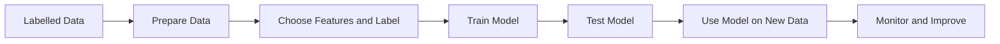

# Supervised Learning

## 1. Lesson Goals

By the end of this lesson, students should be able to:

- define supervised learning
- explain how labelled data is used in supervised learning
- distinguish features and labels in supervised learning tasks
- describe the basic supervised learning process
- explain the difference between training and prediction/inference
- identify classification and regression as common supervised learning tasks
- choose whether a scenario is classification or regression
- explain why training data quality affects supervised learning
- explain why a supervised model may make incorrect predictions
- identify common supervised learning applications
- explain limitations and risks of supervised learning
- connect supervised learning to bias, privacy, evaluation, overfitting, and real-world decision-making
- answer exam-style questions about supervised learning

---

## 2. Syllabus Mapping

| Item | Detail |
|---|---|
| Unit | A4 Machine Learning |
| Label | SL Core |
| Main skill | Understanding how labelled examples are used to train models for prediction |
| Connected topics | ML fundamentals, data/features/labels, classification/regression, training/testing/validation, model evaluation, overfitting/underfitting, bias/ethics/privacy |
| Practical focus | Explaining supervised learning using realistic examples |
| Exam relevance | Definitions, labelled data, features/labels, classification vs regression, advantages/limitations, scenario explanation |

::: tip Learning Focus
Supervised learning uses labelled examples. The model learns the relationship between input features and known labels, then uses this learned pattern to predict labels for new data.
:::

---

## 3. Key Terms

| English Term | 中文解释 | Exam-style meaning |
|---|---|---|
| Supervised learning | 监督学习 | Machine learning using labelled data to learn a mapping from features to labels |
| Labelled data | 有标签数据 | Data examples that include correct outputs |
| Feature | 特征 | Input variable used by a model |
| Label | 标签 | Correct output or target value |
| Target | 目标值 | Value the model learns to predict |
| Training data | 训练数据 | Labelled data used to train the model |
| Model | 模型 | Trained system used to make predictions |
| Training | 训练 | Process of learning from labelled examples |
| Prediction | 预测 | Output generated by a trained model |
| Inference | 推理 / 使用模型 | Using a trained model to make predictions on new data |
| Classification | 分类 | Supervised task that predicts a category/class |
| Regression | 回归 | Supervised task that predicts a numerical value |
| Accuracy | 准确率 | Proportion of correct predictions |
| Error | 错误 | Difference between prediction and correct label |
| Generalization | 泛化 | Ability to perform well on new unseen data |
| Overfitting | 过拟合 | Model learns training data too specifically and performs poorly on new data |
| Underfitting | 欠拟合 | Model is too simple to learn useful patterns |
| Training set | 训练集 | Data used to train model |
| Test set | 测试集 | Data used to evaluate final model |
| Validation set | 验证集 | Data used to tune/select model |
| Bias | 偏差 / 偏见 | Systematic unfairness or error in data/model |
| Human oversight | 人工监督 | Human review of model outputs, especially for important decisions |

---

## 4. Concept Explanation

<LangBlock>
<template #cn>

### 中文讲解

**Supervised learning（监督学习）** 是 machine learning 中很常见的一类方法。

它的核心是：

```text
learn from labelled examples
```

也就是说，每个 training example 不只有 input，还包含 correct answer。

例如 spam detection：

| EmailFeature | Label |
|---|---|
| many suspicious links | Spam |
| normal meeting message | NotSpam |
| urgent money message | Spam |

这里：

```text
features = email characteristics
label = Spam / NotSpam
```

模型通过很多 labelled examples 学习：

```text
what kind of email is likely to be spam
what kind of email is likely to be normal
```

训练完成后，给它一个 new email，它就可以预测：

```text
Spam
```

或：

```text
NotSpam
```

Supervised learning 常见任务有两类：

```text
classification = predict category
regression = predict number
```

例如：

```text
spam / not spam = classification
house price = regression
```

简单来说：

```text
supervised learning = features + labels → train model
trained model + new features → prediction
```

</template>

<template #en>

### English Explanation

**Supervised learning** is one of the most common types of machine learning.

Its core idea is:

```text
learn from labelled examples
```

This means each training example includes both input data and the correct answer.

Example: spam detection:

| EmailFeature | Label |
|---|---|
| many suspicious links | Spam |
| normal meeting message | NotSpam |
| urgent money message | Spam |

Here:

```text
features = email characteristics
label = Spam / NotSpam
```

The model learns from many labelled examples:

```text
what kind of email is likely to be spam
what kind of email is likely to be normal
```

After training, when it receives a new email, it can predict:

```text
Spam
```

or:

```text
NotSpam
```

Two common supervised learning tasks are:

```text
classification = predict category
regression = predict number
```

For example:

```text
spam / not spam = classification
house price = regression
```

In simple terms:

```text
supervised learning = features + labels → train model
trained model + new features → prediction
```

</template>
</LangBlock>

---

## 5. What Is Supervised Learning?

Supervised learning is a type of machine learning where a model is trained using labelled examples.

Each example contains:

```text
features = inputs
label = correct output
```

The model learns a relationship between the features and the label.

### Example

A model predicts whether a student will pass.

| AttendanceRate | PreviousScore | StudyTaskRate | Label |
|---:|---:|---:|---|
| 95 | 82 | 90 | Pass |
| 60 | 45 | 40 | Fail |
| 80 | 70 | 75 | Pass |

Features:

```text
AttendanceRate
PreviousScore
StudyTaskRate
```

Label:

```text
Pass / Fail
```

::: tip Exam Phrase
Supervised learning trains a model using labelled data, where each example has input features and a known correct output called a label.
:::

---

## 6. Why It Is Called “Supervised”

It is called supervised because the training data includes correct answers.

The model can compare its prediction with the known label and improve.

### Simple Idea

```text
model predicts
known label shows correct answer
model adjusts to reduce error
```

### Analogy

It is like a teacher giving practice questions with answers.

```text
question = features
answer = label
student learning = model training
```

The model is not supervised by a human during every future prediction.  
It is supervised during training because labelled examples guide learning.

---

## 7. Labelled Data

Labelled data is data with correct outputs.

### Example: Image Classification

| Image | Label |
|---|---|
| image of cat | Cat |
| image of dog | Dog |
| image of car | Car |

### Example: House Price

| Size | Bedrooms | LocationScore | Label |
|---:|---:|---:|---:|
| 120 | 3 | 8 | 800000 |
| 80 | 2 | 6 | 520000 |

The label is the actual sale price.

### Why Labels Matter

Without labels, supervised learning cannot know what output it should learn to predict.

---

## 8. Features and Labels in Supervised Learning

### Features

Features are input variables.

### Labels

Labels are correct outputs.

### Example: Fraud Detection

| TransactionAmount | LocationRisk | NewDevice | Label |
|---:|---:|---|---|
| 20 | 1 | false | NotFraud |
| 5000 | 8 | true | Fraud |

Features:

```text
TransactionAmount
LocationRisk
NewDevice
```

Label:

```text
Fraud / NotFraud
```

### Memory

```text
features = what the model sees
label = what the model should predict
```

---

## 9. Basic Supervised Learning Process

The process is:

```text
1. Collect labelled data.
2. Prepare and clean data.
3. Choose features and labels.
4. Split data into training/testing/validation sets.
5. Train model using training data.
6. Evaluate model using unseen data.
7. Use trained model for prediction.
8. Monitor and improve model.
```

### Diagram



---

## 10. Training Stage

During training, the model learns patterns from labelled examples.

### Example

For spam detection:

```text
training data = labelled emails
features = words, links, sender, attachments
label = spam / not spam
```

The model learns which feature patterns are associated with spam.

### Training Output

The result of training is:

```text
trained model
```

The trained model can then be used on new examples.

---

## 11. Prediction / Inference Stage

Prediction, also called inference, happens after the model is trained.

### Example

A new email arrives.

The trained model receives features:

```text
sender unknown
number of links = 5
contains urgent words = true
```

It predicts:

```text
Spam
```

### Important

For new data, the true label may not be known yet.  
The model gives its predicted output.

---

## 12. Training vs Prediction

| Stage | Input | Output | Purpose |
|---|---|---|---|
| Training | labelled examples | trained model | learn patterns |
| Prediction / inference | new features | predicted label/value | use learned pattern |

### Example

House price model:

```text
training = learn from houses with known sale prices
prediction = estimate price for a house not yet sold
```

---

## 13. Classification

Classification is supervised learning where the label is a category.

### Examples

```text
spam / not spam
cat / dog / car
pass / fail
fraud / not fraud
low / medium / high risk
positive / neutral / negative
```

### Output

The output is a class/category.

### Exam Phrase

Classification predicts a discrete class or category.

---

## 14. Binary Classification

Binary classification has two possible classes.

### Examples

```text
spam / not spam
fraud / not fraud
pass / fail
disease / no disease
approved / rejected
```

### Example Dataset

| PreviousScore | AttendanceRate | Label |
|---:|---:|---|
| 80 | 90 | Pass |
| 42 | 55 | Fail |

### Key Idea

Two possible labels.

---

## 15. Multi-class Classification

Multi-class classification has more than two possible classes.

### Examples

```text
image class = cat / dog / car / bird
risk level = low / medium / high
movie genre = comedy / action / drama / horror
support ticket type = billing / technical / account / delivery
```

### Key Idea

The model predicts one category from several possible categories.

---

## 16. Regression

Regression is supervised learning where the label is a number.

### Examples

```text
house price
delivery time
temperature
exam score
sales amount
stock demand
electricity usage
```

### Output

The output is a numerical value.

### Exam Phrase

Regression predicts a continuous or numerical value.

---

## 17. Classification vs Regression

| Feature | Classification | Regression |
|---|---|---|
| Output type | category/class | number |
| Example output | Spam | 800000 |
| Example task | detect spam email | predict house price |
| Question form | Which class? | How much/how many? |

### Quick Memory

```text
classification = category
regression = number
```

---

## 18. Supervised Learning Examples

| Scenario | Features | Label | Type |
|---|---|---|---|
| Spam detection | sender, links, words | spam/not spam | classification |
| House price | size, rooms, location | price | regression |
| Student result | attendance, previous score | pass/fail | classification |
| Delivery time | distance, traffic, weather | minutes | regression |
| Fraud detection | amount, location, device | fraud/not fraud | classification |
| Medical risk | symptoms, test values | risk category | classification |
| Game matchmaking | rank, win rate, latency | match outcome/skill | classification or regression |

---

## 19. Choosing Features

Good features should be relevant to the prediction.

### Useful Features

For predicting house price:

```text
size
location
number of bedrooms
age of property
nearby transport
```

### Poor Features

```text
owner's favourite colour
random ID number
irrelevant text note
```

### Risky Features

Some features may cause privacy or fairness problems.

Examples:

```text
ethnicity
health status
home address
family income
nationality
```

Such features require careful ethical and legal consideration.

---

## 20. Choosing Labels

The label should match the prediction goal.

### Bad Goal

```text
help students
```

This is too vague.

### Better Goal

```text
predict whether a student is at risk of failing
```

Label:

```text
at risk / not at risk
```

### Another Example

Goal:

```text
predict house sale price
```

Label:

```text
actual sale price
```

### Key Idea

If the label is unclear or poorly chosen, the model may learn the wrong task.

---

## 21. Data Quality in Supervised Learning

Supervised learning depends strongly on data quality.

### Problems

```text
missing values
wrong feature values
incorrect labels
biased examples
unrepresentative data
outdated data
duplicates
outliers
unbalanced classes
data leakage
```

### Effect

Poor data may lead to:

```text
low accuracy
unfair predictions
poor generalization
wrong decisions
misleading evaluation
```

---

## 22. Incorrect Labels

Incorrect labels are especially harmful in supervised learning.

### Example

A normal email is labelled as spam.

| Email | Label |
|---|---|
| "Meeting today at 3 pm" | Spam |

The model may learn wrong patterns.

### Why It Matters

The label is the answer used during training.  
If the answer is wrong, the model is trained with bad guidance.

### Protection

```text
review labels
use reliable sources
check unusual examples
collect labels from experts when needed
measure label quality
```

---

## 23. Unbalanced Classes

Unbalanced classes occur when one label appears much more often than another.

### Example: Fraud Detection

| Label | Count |
|---|---:|
| NotFraud | 99000 |
| Fraud | 1000 |

A model may predict `NotFraud` most of the time and still appear accurate.

### Problem

Overall accuracy may hide poor performance on the important minority class.

### Better Evaluation

For some tasks, use:

```text
precision
recall
F1 score
confusion matrix
```

These are covered in model evaluation.

---

## 24. Data Leakage

Data leakage happens when the model trains using information that would not be available in real prediction.

### Example

Task:

```text
predict whether student will pass final exam
```

Bad feature:

```text
FinalExamScore
```

This reveals the answer and would not be available before the exam.

### Problem

The model may look very accurate during testing but fail in real use.

---

## 25. Training, Validation and Testing Preview

Supervised learning usually splits labelled data.

| Split | Purpose |
|---|---|
| Training data | used to train model |
| Validation data | used to tune/select model |
| Testing data | used to evaluate final model |

### Why Not Test on Training Data?

Because the model may simply perform well on examples it has already seen.

To check generalization, test on unseen data.

---

## 26. Generalization

Generalization means the model performs well on new unseen data.

### Good Generalization

```text
model works well on training data
model also works well on new data
```

### Poor Generalization

```text
model works well on training data
model fails on new data
```

This often happens with overfitting.

### Key Idea

The goal is not just memorizing training examples.  
The goal is learning patterns that transfer to new cases.

---

## 27. Overfitting Preview

Overfitting happens when the model learns the training data too specifically.

### Symptoms

```text
very good training performance
poor testing/new data performance
```

### Example

A model memorizes training emails instead of learning general spam patterns.

### Cause

```text
model too complex
too little training data
noisy data
training too long
data leakage
```

---

## 28. Underfitting Preview

Underfitting happens when the model is too simple to learn useful patterns.

### Symptoms

```text
poor training performance
poor testing performance
```

### Example

A house price model uses only one feature, such as number of doors, and ignores size and location.

### Cause

```text
model too simple
not enough useful features
poor training
wrong algorithm
```

---

## 29. Model Evaluation Preview

A supervised model must be evaluated.

### Classification Evaluation

Possible measures:

```text
accuracy
precision
recall
F1 score
confusion matrix
```

### Regression Evaluation

Possible measures:

```text
mean absolute error
mean squared error
root mean squared error
```

### Student-Level Idea

Evaluation asks:

```text
How often is the model correct?
How large are the errors?
Which types of mistakes happen?
Is the model fair enough and safe enough for the context?
```

---

## 30. Advantages of Supervised Learning

| Advantage | Explanation |
|---|---|
| Clear learning target | labels provide correct answers |
| Useful for prediction | can predict categories or numbers |
| Easy to evaluate | predictions can be compared with labels |
| Wide applications | spam, fraud, prices, medical support, recommendations |
| Can handle complex patterns | useful when rules are hard to write manually |
| Can improve with better data | better labelled data may improve model |

---

## 31. Limitations of Supervised Learning

| Limitation | Explanation |
|---|---|
| Requires labelled data | labels can be expensive or slow to obtain |
| Label quality matters | wrong labels teach wrong patterns |
| Bias risk | biased data can cause unfair predictions |
| Poor generalization | may fail on new or different data |
| Overfitting | may memorize training data |
| Privacy issues | data may contain personal/sensitive information |
| Explainability issues | some models are hard to interpret |
| Not always appropriate | simple rule-based tasks may not need ML |
| Maintenance needed | model may become outdated as data changes |

---

## 32. Supervised Learning and Bias

Supervised models can learn bias from labelled data.

### Bias Sources

```text
biased historical decisions
underrepresented groups
incorrect labels
features acting as proxies for sensitive attributes
old or narrow data
unequal data collection
```

### Example

If a hiring model is trained on past hiring decisions that were unfair, it may repeat those unfair patterns.

### Mitigation

```text
review data sources
test performance across groups
remove or carefully handle sensitive/proxy features
use human oversight
monitor model outcomes
collect more representative data
```

---

## 33. Supervised Learning and Privacy

Supervised learning may require personal data.

### Risks

```text
collecting more data than needed
using data without consent
exposing sensitive data
storing labels that reveal private information
re-identification
data breach
```

### Controls

```text
data minimization
access control
encryption
anonymization or pseudonymization
retention limits
privacy review
clear purpose
```

### Example

A student risk model should avoid unnecessary sensitive features and protect student data carefully.

---

## 34. Human Oversight

Supervised learning predictions may affect real people.

### High-risk Examples

```text
medical diagnosis support
loan approval
student risk prediction
job screening
insurance pricing
criminal risk prediction
```

### Why Human Oversight Matters

Humans can:

```text
review unusual cases
notice unfair patterns
correct errors
explain decisions
consider context not in data
take responsibility
```

### Key Idea

In important decisions, supervised learning should often support humans rather than fully replace them.

---

## 35. Worked Example: Spam Detection

### Task

Classify emails as spam or not spam.

### Features

```text
sender known
number of links
contains urgent words
message length
attachment present
```

### Label

```text
Spam / NotSpam
```

### Learning Type

```text
supervised learning
classification
```

### Possible Error

A normal school email may be incorrectly classified as spam.

---

## 36. Worked Example: House Price Prediction

### Task

Predict house price.

### Features

```text
size
location
number of bedrooms
age of property
distance to transport
```

### Label

```text
actual sale price
```

### Learning Type

```text
supervised learning
regression
```

### Possible Error

The model may predict poorly if trained only on old market data or one suburb.

---

## 37. Worked Example: Student Pass/Fail Prediction

### Task

Predict whether a student will pass.

### Features

```text
attendance rate
previous scores
study task completion
LMS activity
late submissions
```

### Label

```text
Pass / Fail
```

### Learning Type

```text
supervised learning
classification
```

### Ethical Note

Predictions should be used to support students, not to unfairly label or punish them.

---

## 38. Worked Example: Delivery Time Prediction

### Task

Predict delivery time in minutes.

### Features

```text
distance
traffic level
weather
driver availability
order size
time of day
```

### Label

```text
actual delivery time
```

### Learning Type

```text
supervised learning
regression
```

---

## 39. Worked Example: Fraud Detection

### Task

Predict whether a transaction is fraudulent.

### Features

```text
transaction amount
location
time
device
merchant type
previous user behaviour
```

### Label

```text
Fraud / NotFraud
```

### Learning Type

```text
supervised learning
classification
```

### Warning

Fraud data is often unbalanced, so accuracy alone may be misleading.

---

## 40. Scenario Answer Bank

### If Asked: “Define supervised learning”

Use this structure:

```text
Supervised learning is machine learning that trains a model using labelled data. Each example has input features and a correct output label, so the model can learn patterns and make predictions on new data.
```

### If Asked: “Identify features and label”

Use this structure:

```text
The features are [input variables] because they are used by the model to make the prediction. The label is [target] because it is the correct output the model learns to predict.
```

### If Asked: “Classification or regression?”

Use this structure:

```text
This is [classification/regression] because the output is a [category/number].
```

### If Asked: “Explain limitation”

Use this structure:

```text
One limitation is that supervised learning needs labelled data. If labels are incorrect, biased, incomplete, or unrepresentative, the model may learn poor patterns and make inaccurate or unfair predictions.
```

---

## 41. Common Misconceptions

| Mistake | Why it is wrong | Better understanding |
|---|---|---|
| Supervised learning means a human watches every prediction | supervision is labelled training data | labels guide training |
| Features and labels are the same | features are inputs; labels are outputs | different roles |
| Labels are not needed | supervised learning needs labels | unsupervised learning does not |
| Classification predicts numbers | classification predicts categories | regression predicts numbers |
| Regression means going backwards | in ML, regression predicts numerical values | not about direction |
| High training accuracy proves model is good | may overfit | test on unseen data |
| More labelled data is always better | poor labels can hurt | quality and representativeness matter |
| Model predictions are always correct | predictions can be wrong | evaluate and monitor |
| Bias only comes from algorithm | bias can come from data/labels | check full system |
| Supervised learning is always better than rules | simple rule-based tasks may not need ML | choose method based on problem |

---

## 42. Guided Practice

### Practice 1: Supervised or Not?

A model is trained with emails labelled `Spam` or `NotSpam`. Is this supervised learning?

<details>
<summary>Suggested Answer</summary>

Yes. It uses labelled examples, so it is supervised learning.

</details>

---

### Practice 2: Feature or Label?

In house price prediction, `actual sale price` is a feature or label?

<details>
<summary>Suggested Answer</summary>

Label, because it is the correct target value the model learns to predict.

</details>

---

### Practice 3: Classification or Regression?

Predicting whether a transaction is fraud or not fraud is classification or regression?

<details>
<summary>Suggested Answer</summary>

Classification, because the output is a category.

</details>

---

### Practice 4: Regression

Predicting delivery time in minutes is classification or regression?

<details>
<summary>Suggested Answer</summary>

Regression, because the output is a numerical value.

</details>

---

### Practice 5: Incorrect Labels

Why are incorrect labels a problem in supervised learning?

<details>
<summary>Suggested Answer</summary>

The model learns from labels as correct answers. Incorrect labels can teach the model wrong patterns and reduce accuracy or fairness.

</details>

---

## 43. Independent Practice

### Question 1

Define supervised learning.

### Question 2

Explain why labelled data is needed in supervised learning.

### Question 3

Explain the difference between feature and label.

### Question 4

Explain the difference between training and prediction.

### Question 5

For spam detection, identify possible features and the label.

### Question 6

For house price prediction, identify possible features and the label.

### Question 7

Explain the difference between classification and regression.

### Question 8

Give three examples of classification tasks.

### Question 9

Give three examples of regression tasks.

### Question 10

Explain two limitations or risks of supervised learning.

---

## 44. Exam-style Questions

### Question 1 [4 marks]

Define supervised learning and explain the role of labelled data.

<details>
<summary>Mark Scheme Style Answer</summary>

Supervised learning is a type of machine learning where a model is trained using labelled data. Each training example includes input features and a known correct output label. The model learns patterns between the features and labels so it can predict labels for new data.

</details>

---

### Question 2 [5 marks]

A model predicts whether an email is spam using the sender, number of links, and subject words. Identify the features, label, and task type.

<details>
<summary>Mark Scheme Style Answer</summary>

The features are sender, number of links, and subject words because they are input variables used by the model. The label is spam or not spam because it is the correct output the model learns to predict. The task is classification because the output is a category.

</details>

---

### Question 3 [6 marks]

Explain the difference between classification and regression, giving one example of each.

<details>
<summary>Mark Scheme Style Answer</summary>

Classification predicts a category or class, such as whether an email is spam or not spam. Regression predicts a numerical value, such as the price of a house or the delivery time in minutes. Both are supervised learning tasks when trained using labelled examples.

</details>

---

### Question 4 [6 marks]

A model predicts house prices using size, location, number of bedrooms, and building age. Explain why this is supervised learning and identify the label.

<details>
<summary>Mark Scheme Style Answer</summary>

This is supervised learning because the model is trained using examples where the correct output is known. The input features include size, location, number of bedrooms, and building age. The label is the actual sale price of each house. The model learns from these labelled examples to predict the price of a new house.

</details>

---

### Question 5 [6 marks]

Explain two limitations of supervised learning.

<details>
<summary>Mark Scheme Style Answer</summary>

One limitation is that supervised learning requires labelled data, which may be expensive, slow, or difficult to collect. If labels are wrong or inconsistent, the model may learn incorrect patterns. Another limitation is bias: if the training data is biased or unrepresentative, the model may make unfair or inaccurate predictions for some groups. Models may also overfit training data and perform poorly on new data.

</details>

---

## 45. Practice task
### Activity 1: Scenario Sorting

Students classify scenarios as classification or regression:

```text
predict house price
detect spam email
predict exam score
classify image as cat/dog
predict delivery time
detect fraud
predict whether a student will pass
predict electricity usage
```

---

### Activity 2: Feature and Label Design

Groups choose one scenario:

```text
spam detection
student risk prediction
online shop recommendation
house price prediction
game matchmaking
medical risk classification
```

They identify:

```text
features
label
task type
possible data quality issue
possible ethical/privacy issue
```

---

### Activity 3: Bad Label Discussion

Give students a dataset with incorrect labels.

Students discuss:

```text
how wrong labels affect training
how to detect possible wrong labels
who should review labels
how this affects real users
```

---

## 46. Independent practice
### Independent practice part A: Concept Explanation

In 6-8 sentences, explain how supervised learning works and why labelled data is important.

---

### Independent practice part B: Scenario Table

Complete a table for five supervised learning scenarios:

```text
scenario
features
label
classification or regression
possible limitation
```

---

### Independent practice part C: Classification or Regression

For each task, state whether it is classification or regression and explain why:

```text
1. predicting house price
2. detecting spam email
3. predicting exam score
4. predicting whether a patient has a disease
5. predicting delivery time in minutes
```

---

### Independent practice part D: Misconception Correction

Correct these statements:

```text
Supervised learning does not need labels.
Classification predicts numerical values.
Regression means the model is bad.
High training accuracy always means the model works well on new data.
Incorrect labels do not affect model training.
```

---

## 47. One-page Revision Summary

| Point | Summary |
|---|---|
| Supervised learning | ML trained using labelled data |
| Labelled data | examples include correct outputs |
| Feature | input variable |
| Label | correct output/target |
| Training | model learns from labelled examples |
| Prediction/inference | trained model predicts output for new data |
| Classification | predicts category |
| Regression | predicts number |
| Binary classification | two classes |
| Multi-class classification | more than two classes |
| Training data | used to train model |
| Test data | used to evaluate model |
| Generalization | performance on unseen data |
| Overfitting | too specific to training data |
| Underfitting | too simple to learn patterns |
| Data quality | labels/features must be accurate and representative |
| Risk | bias, privacy issues, wrong predictions |
| Exam phrase | Supervised learning uses labelled examples to train a model to map features to labels and predict outputs for new data |

---

## 48. Quick Self-test

Before moving on, students should be able to answer these:

1. What is supervised learning?
2. What is labelled data?
3. What is a feature?
4. What is a label?
5. What is the difference between training and prediction?
6. What is classification?
7. What is regression?
8. Why can incorrect labels damage model performance?
9. What is overfitting?
10. Why should supervised models be tested on unseen data?

