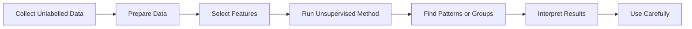

# Unsupervised Learning

## Page map

- [Lesson goals](#1-lesson-goals)
- [Syllabus mapping](#2-syllabus-mapping)
- [Core checklist](#core-checklist)
- [Key terms and detailed lesson](#3-key-terms)

---

## 1. Lesson Goals

By the end of this lesson, students should be able to:

- define unsupervised learning
- explain how unsupervised learning differs from supervised learning
- explain what unlabelled data is
- describe how unsupervised learning finds patterns, groups, or structures in data
- explain clustering at a basic level
- explain anomaly detection at a basic level
- identify when unsupervised learning may be suitable
- distinguish clustering and classification
- identify common applications of unsupervised learning
- explain common limitations and risks of unsupervised learning
- explain why interpreting unsupervised learning results needs care
- connect unsupervised learning to bias, privacy, data quality, and human judgement
- answer exam-style questions about unsupervised learning

---

## 2. Syllabus Mapping

| Item | Detail |
|---|---|
| Unit | A4 Machine Learning |
| Label | SL Core |
| Main skill | Understanding how ML can discover patterns in data without given labels |
| Connected topics | ML fundamentals, data/features/labels, supervised learning, model evaluation, bias/ethics/privacy, applications and limitations |
| Practical focus | Explaining clustering, grouping, and anomaly detection using real scenarios |
| Exam relevance | Definitions, supervised vs unsupervised distinction, clustering examples, limitations, scenario explanation |

::: tip Learning Focus
Unsupervised learning uses unlabelled data. The model is not given the correct answer. Instead, it tries to find patterns, groups, structures, or unusual examples in the data.
:::

---

## Start here: find patterns without given labels

Unsupervised learning uses **unlabelled data**. It may group similar records, find unusual cases, or reveal structure, but it is not given a correct output for each training example.

Do not confuse clustering with classification: classification predicts a known label, while clustering discovers groups that still need interpretation.

## Core checklist

After studying this page, you should be able to:

- distinguish labelled and unlabelled data
- distinguish supervised from unsupervised learning
- explain clustering and anomaly detection at a basic level
- distinguish clustering from classification
- explain why human judgement is needed to interpret discovered groups
- identify data-quality, bias, and privacy risks in a scenario

---

## Common mistakes

| Mistake | Better understanding |
|---|---|
| Saying unsupervised learning has no input data | It has input features, but no given target label for each example |
| Treating a cluster as an objectively correct class | A cluster is a discovered grouping that needs interpretation |
| Confusing clustering with classification | Clustering discovers groups; classification predicts known classes |
| Assuming unusual means harmful | An anomaly is unusual and must be investigated in context |

---

## 3. Key Terms

| English Term | 中文解释 | Exam-style meaning |
|---|---|---|
| Unsupervised learning | 无监督学习 | Machine learning that finds patterns in data without labelled outputs |
| Unlabelled data | 无标签数据 | Data examples without correct answer labels |
| Feature | 特征 | Input variable used by a model |
| Pattern | 模式 | Regular structure or relationship found in data |
| Cluster | 簇 / 群组 | Group of similar data examples |
| Clustering | 聚类 | Grouping similar examples without pre-given labels |
| Anomaly | 异常 | Data point that is unusual compared with most data |
| Anomaly detection | 异常检测 | Finding unusual data points or behaviours |
| Dimensionality reduction | 降维 | Reducing number of features while keeping important information |
| Association | 关联 | Relationship between items or behaviours |
| Segmentation | 分群 | Dividing data into meaningful groups |
| Similarity | 相似度 | Measure of how close or alike examples are |
| Distance | 距离 | Measure used by some algorithms to judge similarity |
| Interpretability | 可解释性 | How easy it is to understand the model or result |
| Data quality | 数据质量 | Accuracy, completeness, and relevance of data |
| Bias | 偏差 / 偏见 | Systematic distortion or unfairness in data/results |
| Human judgement | 人类判断 | Human review needed to interpret results correctly |
| Outlier | 离群值 | A value very different from most others |
| Feature scaling | 特征缩放 | Adjusting numeric features so they are comparable |
| Evaluation | 评估 | Checking whether discovered patterns are useful or meaningful |

---

## 4. Concept Explanation

<LangBlock>
<template #cn>

### 中文讲解

**Unsupervised learning（无监督学习）** 和 supervised learning 最大的区别是：

```text
supervised learning uses labelled data
unsupervised learning uses unlabelled data
```

在 supervised learning 中，training data 里有 correct answer。

例如：

```text
email features → Spam / NotSpam
house features → actual price
```

但是在 unsupervised learning 中，data 没有给出 label。  
模型不知道“正确答案”是什么。它要自己在 data 中找 patterns。

例如一个 online shop 有很多 customer data：

```text
purchase history
viewed products
average spending
shopping frequency
product categories
```

但没有提前告诉模型：

```text
customer type = budget buyer / luxury buyer / frequent buyer
```

Unsupervised learning 可以尝试把 customers 分成几个 groups。  
这些 groups 叫做 clusters。

简单来说：

```text
unsupervised learning = find hidden patterns in unlabelled data
clustering = group similar examples
anomaly detection = find unusual examples
```

</template>

<template #en>

### English Explanation

The biggest difference between **unsupervised learning** and supervised learning is:

```text
supervised learning uses labelled data
unsupervised learning uses unlabelled data
```

In supervised learning, the training data includes correct answers.

For example:

```text
email features → Spam / NotSpam
house features → actual price
```

But in unsupervised learning, the data does not include labels.  
The model is not told the “correct answer”. It tries to find patterns in the data by itself.

For example, an online shop may have customer data:

```text
purchase history
viewed products
average spending
shopping frequency
product categories
```

But it is not given labels such as:

```text
customer type = budget buyer / luxury buyer / frequent buyer
```

Unsupervised learning can try to group customers into clusters.  
These groups are called clusters.

In simple terms:

```text
unsupervised learning = find hidden patterns in unlabelled data
clustering = group similar examples
anomaly detection = find unusual examples
```

</template>
</LangBlock>

---

## 5. What Is Unsupervised Learning?

Unsupervised learning is a type of machine learning where the model is trained on data without labels.

The model tries to discover:

```text
patterns
groups
structures
similarities
unusual examples
relationships
```

### Simple Definition

```text
Unsupervised learning finds patterns in unlabelled data.
```

### Example

A streaming platform has user watch histories.

It does not already know the exact user types.  
Unsupervised learning can group users with similar viewing patterns.

Possible clusters:

```text
action movie fans
documentary watchers
anime watchers
family content viewers
mixed viewers
```

::: tip Exam Phrase
Unsupervised learning uses unlabelled data to discover patterns, groups, or structures without being given correct output labels.
:::

---

## 6. Unlabelled Data

Unlabelled data means the examples do not include correct output labels.

### Example: Customer Data

| CustomerID | AverageSpend | VisitsPerMonth | ElectronicsRatio |
|---:|---:|---:|---:|
| 1 | 25 | 2 | 0.1 |
| 2 | 400 | 10 | 0.8 |
| 3 | 80 | 5 | 0.3 |

There is no column such as:

```text
CustomerType
```

The model may try to find groups based on the available features.

### Supervised Version

A supervised dataset might have:

| AverageSpend | VisitsPerMonth | ElectronicsRatio | CustomerType |
|---:|---:|---:|---|
| 25 | 2 | 0.1 | Budget |
| 400 | 10 | 0.8 | HighValue |

The label `CustomerType` makes it supervised.

---

## 7. Supervised vs Unsupervised Learning

| Feature | Supervised Learning | Unsupervised Learning |
|---|---|---|
| Data | labelled data | unlabelled data |
| Correct answer | given during training | not given |
| Goal | predict labels for new data | find patterns/groups/structure |
| Common tasks | classification, regression | clustering, anomaly detection |
| Example | spam/not spam prediction | customer segmentation |
| Evaluation | compare prediction with correct label | harder; needs interpretation |

### Quick Memory

```text
supervised = learns from answers
unsupervised = finds patterns without answers
```

---

## 8. Why Use Unsupervised Learning?

Unsupervised learning is useful when:

```text
labels are not available
labels are expensive to create
we want to explore unknown patterns
we want to group similar examples
we want to find unusual behaviour
we want to reduce data complexity
we want to understand data before building another model
```

### Example

A company may not know its customer types in advance.

Unsupervised learning can group customers first.  
Then humans can interpret the groups and decide what they mean.

---

## 9. Basic Unsupervised Learning Process

A simple process is:

```text
1. Define the exploration goal.
2. Collect data.
3. Select useful features.
4. Clean and prepare data.
5. Choose an unsupervised method.
6. Find patterns, clusters, or anomalies.
7. Interpret the results.
8. Validate usefulness with human judgement or business context.
9. Monitor and update if data changes.
```

### Diagram



### Key Difference

There is no known label to directly compare against during training.

---

## 10. Clustering

Clustering is a common unsupervised learning task.

It groups similar examples together.

### Basic Idea

```text
examples in same cluster are similar
examples in different clusters are less similar
```

### Example: Customer Segmentation

Features:

```text
average spend
purchase frequency
product category preference
discount use
```

Possible clusters:

```text
frequent low-spend customers
rare high-spend customers
discount-focused customers
electronics-focused customers
```

::: tip Exam Phrase
Clustering groups similar data examples together without using pre-defined class labels.
:::

---

## 11. Cluster

A cluster is a group of similar data points.

### Example

A game company groups players by behaviour.

Possible clusters:

```text
competitive ranked players
casual players
social players
new players
high-spending players
```

### Important

The model may find groups, but humans need to interpret what the groups mean.

A cluster does not automatically have a meaningful name until someone analyses it.

---

## 12. Similarity

Unsupervised learning often depends on similarity.

### Example

Two customers may be similar if they have:

```text
similar spending
similar purchase categories
similar visit frequency
similar browsing behaviour
```

### Feature Choice Matters

If you choose poor features, clusters may be meaningless.

Example:

```text
CustomerID number
```

is usually not a meaningful feature for customer grouping.

### Scaling Matters

If one feature has a much larger numeric range, it may dominate distance-based clustering.

---

## 13. Clustering vs Classification

Students often confuse clustering and classification.

| Concept | Clustering | Classification |
|---|---|---|
| Learning type | unsupervised | supervised |
| Data | unlabelled | labelled |
| Output | discovered groups | predicted known class |
| Example | group customers by behaviour | predict spam/not spam |
| Labels during training | not given | given |

### Simple Memory

```text
classification = predict known categories
clustering = discover groups
```

### Example

If the model predicts `Spam` or `NotSpam` using labelled emails, that is classification.  
If it groups emails by similarity without labels, that is clustering.

---

## 14. Anomaly Detection

Anomaly detection finds unusual examples or behaviours.

### Example: Fraud

Most transactions may follow normal patterns.

An unusual transaction might have:

```text
very large amount
unusual location
new device
strange time
unusual merchant type
```

The system may flag it as an anomaly.

### Other Examples

```text
network intrusion detection
machine fault detection
unusual medical test result
unexpected login behaviour
abnormal game cheating behaviour
rare sensor reading
```

::: tip Exam Phrase
Anomaly detection identifies data points or behaviours that are unusual compared with normal patterns in the data.
:::

---

## 15. Anomaly Does Not Always Mean Bad

An anomaly is unusual, but it is not always harmful or wrong.

### Examples

| Anomaly | Could Mean |
|---|---|
| unusual bank transaction | fraud or legitimate travel purchase |
| unusual medical result | disease or measurement error |
| unusual network traffic | cyberattack or software update |
| unusual game behaviour | cheating or highly skilled player |
| unusual shop purchase | fraud or special event |

### Key Idea

Anomaly detection should usually trigger review, not automatic punishment.

---

## 16. Association Patterns Preview

Unsupervised learning can also find associations.

### Example: Market Basket Analysis

A shop may find:

```text
customers who buy bread often buy butter
customers who buy laptops often buy mouse/keyboard
customers who buy game consoles often buy controllers
```

### Use

Associations can support:

```text
recommendations
store layout
bundles
marketing
inventory planning
```

### Level Control

Association is useful to know, but clustering and anomaly detection are usually the most important introductory unsupervised tasks.

---

## 17. Dimensionality Reduction Preview

Dimensionality reduction reduces the number of features while trying to keep important information.

### Why Useful?

Datasets may have many features.

Too many features can make data:

```text
hard to visualize
hard to process
noisy
slower to use
more difficult to interpret
```

### Example

A dataset with 100 features may be reduced to 2 or 3 main components for visualization.

### Level Control

Students do not need the mathematics here.  
Just know it can simplify data while trying to preserve important patterns.

---

## 18. Feature Selection in Unsupervised Learning

Choosing features is very important.

### Example: Customer Clustering

Useful features:

```text
average spending
purchase frequency
preferred categories
discount use
return rate
```

Less useful features:

```text
customer ID
random account number
database row number
```

Risky features:

```text
sensitive personal data
home address
health information
unnecessary demographic data
```

### Key Idea

Unsupervised learning may find groups based on whatever features are given, even if those features are irrelevant or unfair.

---

## 19. Data Preparation for Unsupervised Learning

Data usually needs preparation.

### Common Steps

```text
remove duplicates
handle missing values
standardize formats
scale numeric features
remove irrelevant features
check outliers
protect personal data
reduce noise
check representativeness
```

### Why Scaling Matters

If one feature has values from 0 to 1 and another has values from 0 to 1,000,000, some algorithms may give too much importance to the larger-scale feature.

### Example

For customer clustering:

```text
AnnualSpend = 0 to 100000
VisitFrequency = 0 to 20
```

Scaling may be needed so both features can contribute fairly.

---

## 20. Interpreting Clusters

Unsupervised learning can find clusters, but it does not automatically explain them.

### Example

A model finds:

```text
Cluster 1
Cluster 2
Cluster 3
```

Humans need to inspect the cluster features.

Possible interpretation:

```text
Cluster 1 = frequent low-spend customers
Cluster 2 = rare high-spend customers
Cluster 3 = discount-focused customers
```

### Warning

Cluster names are human interpretations.  
They may be wrong or oversimplified.

---

## 21. Evaluating Unsupervised Learning

Evaluation is harder than supervised learning because there may be no correct labels.

### Possible Questions

```text
Are the clusters meaningful?
Are they stable if data changes?
Do they help solve the original problem?
Are the results fair?
Are the results explainable enough?
Do domain experts agree?
```

### Example

Customer clusters are useful if they help the shop understand behaviour and improve service without unfair treatment.

### Key Idea

Unsupervised learning results often need human interpretation and validation.

---

## 22. Advantages of Unsupervised Learning

| Advantage | Explanation |
|---|---|
| Does not require labels | useful when labelled data is unavailable |
| Finds hidden patterns | can reveal unknown structure |
| Useful for exploration | helps understand data |
| Supports segmentation | groups customers/users/items |
| Can detect anomalies | finds unusual behaviour |
| Can prepare data for other ML | may support feature engineering or visualization |
| Can reduce complexity | dimensionality reduction can simplify data |

---

## 23. Limitations of Unsupervised Learning

| Limitation | Explanation |
|---|---|
| Harder to evaluate | no correct label for direct comparison |
| Results may be hard to interpret | clusters may not have clear meaning |
| Feature choice strongly affects results | poor features lead to poor groups |
| May find meaningless patterns | not all patterns are useful |
| Sensitive to data quality | missing/outlier/noisy data can distort results |
| Bias risk | groups may reflect unfair or harmful patterns |
| Privacy risk | data may contain personal information |
| Human judgement needed | results require careful interpretation |

---

## 24. Unsupervised Learning and Bias

Unsupervised learning can still create biased or unfair results.

### How Bias Can Occur

```text
data underrepresents some groups
features include sensitive or proxy variables
historical behaviour reflects unfair conditions
clusters are interpreted in a harmful way
outliers are treated as suspicious without context
```

### Example

A customer clustering system may group people by spending patterns that strongly correlate with income or location.  
If used unfairly, this may lead to unequal service or pricing.

### Protection

```text
review features
test results across groups
avoid unnecessary sensitive data
use human oversight
document assumptions
monitor real-world impact
```

---

## 25. Unsupervised Learning and Privacy

Unsupervised learning may use large datasets.

### Privacy Risks

```text
personal data used without clear purpose
too much data collected
clusters reveal sensitive traits
re-identification risk
anomalies expose private behaviour
data breach
```

### Controls

```text
data minimization
anonymization or pseudonymization
access control
encryption
retention limits
privacy impact review
clear purpose and consent where needed
```

### Key Idea

Even if data has no labels, it may still contain personal or sensitive information.

---

## 26. Human Oversight

Human oversight is important because unsupervised learning results are not automatically correct or meaningful.

### Humans Need To Check

```text
what clusters mean
whether anomalies are real problems
whether features are fair
whether privacy is protected
whether the result should affect people
whether the model is used responsibly
```

### Example

If a school groups students by learning behaviour, teachers should use the groups to provide support, not to label students unfairly.

---

## 27. Worked Example: Customer Segmentation

### Task

Group customers by shopping behaviour.

### Data

```text
average spending
visit frequency
preferred categories
discount use
return rate
```

### Learning Type

```text
unsupervised learning
clustering
```

### Possible Clusters

```text
frequent budget shoppers
high-value customers
electronics-focused customers
discount-focused customers
rare shoppers
```

### Use

The shop may personalize recommendations or understand customer needs.

### Risk

Clusters may be used unfairly for pricing or targeting.

---

## 28. Worked Example: News Article Grouping

### Task

Group news articles by topic.

### Data

```text
article text
keywords
word frequency
source
publication time
```

### Learning Type

```text
unsupervised learning
clustering
```

### Possible Clusters

```text
sports articles
technology articles
politics articles
entertainment articles
finance articles
```

### Limitation

The model may group articles by style or source instead of topic if features are poorly chosen.

---

## 29. Worked Example: Network Anomaly Detection

### Task

Find unusual network activity.

### Data

```text
packet volume
login attempts
IP address patterns
connection times
data transfer amount
failed access attempts
```

### Learning Type

```text
unsupervised learning
anomaly detection
```

### Possible Output

```text
flag unusual traffic for investigation
```

### Important

An anomaly may be a cyberattack, but it could also be a normal software update or unusual legitimate activity.

---

## 30. Worked Example: Game Behaviour Analysis

### Task

Group players by behaviour.

### Data

```text
play time
match frequency
win rate
role preference
spending pattern
team communication
leaving rate
```

### Learning Type

```text
unsupervised learning
clustering
```

### Possible Clusters

```text
competitive players
casual players
social players
new players
highly active players
```

### Use

Game designers may improve matchmaking, tutorials, or game balance.

### Risk

Players may be unfairly labelled if clusters are interpreted too strongly.

---

## 31. Worked Example: Medical Pattern Discovery

### Task

Explore patient data to find possible subgroups.

### Data

```text
symptoms
test results
scan features
age group
treatment response
```

### Learning Type

```text
unsupervised learning
clustering
```

### Use

Researchers may discover patient subgroups that respond differently to treatments.

### Important

Medical experts must interpret and validate the findings.  
The model should not make unsupported medical conclusions by itself.

---

## 32. Worked Example: Fraud Anomaly Detection

### Task

Find unusual transactions.

### Data

```text
transaction amount
location
time
merchant type
device
previous behaviour
```

### Learning Type

```text
unsupervised learning
anomaly detection
```

### Output

```text
flag transaction for review
```

### Risk

Unusual does not always mean fraudulent.  
A user travelling overseas may make unusual but legitimate purchases.

---

## 33. When to Use Supervised vs Unsupervised Learning

| Situation | Better Fit |
|---|---|
| You have labelled examples and want to predict categories | supervised classification |
| You have labelled examples and want to predict numbers | supervised regression |
| You do not have labels and want to find groups | unsupervised clustering |
| You do not have labels and want to find unusual behaviour | unsupervised anomaly detection |
| You want to explore unknown patterns | unsupervised learning |
| You have clear rules and no need for learning | traditional programming may be enough |

### Example

If emails are labelled as spam/not spam, use supervised classification.  
If emails are not labelled and you want to group similar emails, use unsupervised clustering.

---

## 34. Scenario Answer Bank

### If Asked: “Define unsupervised learning”

Use this structure:

```text
Unsupervised learning is a type of machine learning that uses unlabelled data to find patterns, groups, or structures without being given correct output labels.
```

### If Asked: “Compare with supervised learning”

Use this structure:

```text
Supervised learning uses labelled examples with correct outputs, while unsupervised learning uses unlabelled data and tries to discover patterns or groups without given answers.
```

### If Asked: “Explain clustering”

Use this structure:

```text
Clustering is an unsupervised learning task that groups similar examples together based on their features. The groups are not given in advance and must be interpreted after they are found.
```

### If Asked: “Explain limitation”

Use this structure:

```text
A limitation is that unsupervised learning results can be hard to evaluate because there are no correct labels. The discovered clusters may not be meaningful and require human interpretation.
```

---

## 35. Common Misconceptions

| Mistake | Why it is wrong | Better understanding |
|---|---|---|
| Unsupervised learning means no data is used | It uses data without labels | Data is still required |
| Unsupervised learning has correct answers | It does not use given labels | It finds patterns |
| Clustering is the same as classification | clustering finds groups; classification predicts known labels | different learning types |
| Any cluster is automatically meaningful | clusters need interpretation | human review needed |
| Anomaly always means attack/fraud | anomaly means unusual | may be legitimate |
| Unlabelled data has no privacy risk | data may still identify people | protect personal data |
| More clusters always means better result | too many clusters may be confusing | choose based on usefulness |
| Feature choice does not matter | features strongly affect patterns | choose carefully |
| Unsupervised learning is always objective | data and interpretation can be biased | review fairness |
| It is easy to evaluate | no labels make evaluation harder | use context and expert judgement |

---

## 36. Guided Practice

### Practice 1: Supervised or Unsupervised?

A model groups customers based on shopping behaviour without customer type labels. What type of learning is this?

<details>
<summary>Suggested Answer</summary>

Unsupervised learning, because the data is unlabelled and the model is finding groups.

</details>

---

### Practice 2: Clustering or Classification?

A model predicts whether an email is spam using labelled examples. Is this clustering or classification?

<details>
<summary>Suggested Answer</summary>

Classification, because it predicts a known category using labelled data.

</details>

---

### Practice 3: Cluster Meaning

A model finds three customer clusters. Does the model automatically know what the clusters mean?

<details>
<summary>Suggested Answer</summary>

No. Humans need to inspect and interpret the clusters based on their features and context.

</details>

---

### Practice 4: Anomaly

A bank flags an unusual transaction. Does unusual always mean fraud?

<details>
<summary>Suggested Answer</summary>

No. It may be fraud, but it could also be a legitimate unusual transaction, such as travel spending.

</details>

---

### Practice 5: Privacy

Why can unlabelled data still create privacy risk?

<details>
<summary>Suggested Answer</summary>

Because it may still contain personal or sensitive information, such as location, purchase history, health data, or account behaviour.

</details>

---

## 37. Independent Practice

### Question 1

Define unsupervised learning.

### Question 2

Explain the difference between supervised and unsupervised learning.

### Question 3

Define unlabelled data.

### Question 4

Explain clustering using an example.

### Question 5

Explain anomaly detection using an example.

### Question 6

Give three applications of unsupervised learning.

### Question 7

Explain why clustering is not the same as classification.

### Question 8

Explain why feature selection matters in unsupervised learning.

### Question 9

Explain two limitations of unsupervised learning.

### Question 10

Explain one privacy or ethical concern in unsupervised learning.

---

## 38. Exam-style Questions

### Question 1 [4 marks]

Define unsupervised learning and explain how it differs from supervised learning.

<details>
<summary>Mark Scheme Style Answer</summary>

Unsupervised learning is a type of machine learning that uses unlabelled data to find patterns, groups, or structures without being given correct output labels. Supervised learning uses labelled examples with known correct outputs, while unsupervised learning does not have those labels during training.

</details>

---

### Question 2 [5 marks]

Explain clustering and give one example.

<details>
<summary>Mark Scheme Style Answer</summary>

Clustering is an unsupervised learning task that groups similar data examples together based on their features. The groups are not given in advance. For example, an online shop may cluster customers based on spending, purchase frequency, and product preferences to identify groups such as frequent shoppers or discount-focused customers.

</details>

---

### Question 3 [6 marks]

A company has customer data including purchase frequency, average spending, and product categories, but no customer type labels. Explain how unsupervised learning could be used.

<details>
<summary>Mark Scheme Style Answer</summary>

The company could use unsupervised learning, such as clustering, because the data has no customer type labels. The model could group customers with similar behaviour based on features such as purchase frequency, average spending, and product categories. Humans could then interpret the clusters, for example as high-value customers, budget shoppers, or category-focused shoppers. The company should also consider privacy and avoid unfair use of the groups.

</details>

---

### Question 4 [6 marks]

Explain two limitations of unsupervised learning.

<details>
<summary>Mark Scheme Style Answer</summary>

One limitation is that results can be difficult to evaluate because there are no correct labels to compare against. A cluster may appear mathematically valid but may not be meaningful in the real-world context. Another limitation is that feature choice and data quality strongly affect the result; poor, biased, or unrepresentative data can lead to misleading clusters or unfair interpretations. Human judgement is often needed to interpret results.

</details>

---

### Question 5 [6 marks]

A bank uses unsupervised learning to detect unusual transactions. Explain why flagged transactions should usually be reviewed before action is taken.

<details>
<summary>Mark Scheme Style Answer</summary>

Unsupervised anomaly detection identifies transactions that are unusual compared with normal patterns, but unusual does not always mean fraudulent. A legitimate customer may make an unusual transaction while travelling or buying an expensive item. If the bank automatically blocks or punishes users based only on anomaly detection, it may cause unfair or incorrect outcomes. Human review or additional checks can reduce false positives and consider context.

</details>

---

## 39. Practice task
### Activity 1: Supervised or Unsupervised Sort

Students classify scenarios:

```text
predict house price using known sale prices
group customers without customer type labels
detect unusual network traffic
classify emails using spam labels
group students by learning behaviour
predict delivery time using past delivery data
```

---

### Activity 2: Cluster Interpretation

Give students a small table of customer data.

Students create possible clusters manually and name them.

They discuss:

```text
what features they used
whether the clusters are meaningful
what risks exist if the company uses these groups
```

---

### Activity 3: Anomaly Review

Give students examples of unusual events:

```text
large bank transaction
late-night login
very high game score
unusual medical test result
large product return
```

Students decide:

```text
possible harmless explanation
possible risky explanation
what extra information is needed
```

---

## 40. Independent practice
### Independent practice part A: Concept Explanation

In 6-8 sentences, explain what unsupervised learning is and how it differs from supervised learning.

---

### Independent practice part B: Scenario Table

Complete a table for four unsupervised learning scenarios:

```text
scenario
data/features
possible unsupervised task
possible use
one limitation or risk
```

---

### Independent practice part C: Clustering vs Classification

Explain why each example is clustering or classification:

```text
1. grouping customers by shopping behaviour without labels
2. predicting whether an email is spam using labelled emails
3. grouping news articles by topic without topic labels
4. classifying images as cat/dog using labelled images
```

---

### Independent practice part D: Misconception Correction

Correct these statements:

```text
Unsupervised learning does not need data.
Clustering and classification are the same thing.
An anomaly always means fraud or attack.
Unlabelled data has no privacy risk.
Clusters are always meaningful and correct.
```

---

## 41. One-page Revision Summary

| Point | Summary |
|---|---|
| Unsupervised learning | Finds patterns in unlabelled data |
| Unlabelled data | Data without correct output labels |
| Cluster | Group of similar examples |
| Clustering | Grouping similar examples without labels |
| Anomaly | Unusual data point or behaviour |
| Anomaly detection | Finding unusual examples |
| Association | Finding related items/behaviours |
| Dimensionality reduction | Reducing feature count while keeping useful information |
| Supervised vs unsupervised | labels vs no labels |
| Clustering vs classification | discover groups vs predict known classes |
| Data preparation | clean, scale, select useful features |
| Interpretation | humans must explain cluster meaning |
| Evaluation difficulty | no correct labels to compare |
| Bias risk | data/features/interpretation may be unfair |
| Privacy risk | unlabelled data can still be personal |
| Exam phrase | Unsupervised learning uses unlabelled data to find hidden patterns, clusters, or anomalies, but results need careful interpretation |

---

## 42. Quick Self-test

Before moving on, students should be able to answer these:

1. What is unsupervised learning?
2. What is unlabelled data?
3. What is clustering?
4. What is a cluster?
5. What is anomaly detection?
6. How is clustering different from classification?
7. Why is unsupervised learning harder to evaluate?
8. Why does feature selection matter?
9. Why can anomaly detection create false alarms?
10. Why can unlabelled data still have privacy risk?
