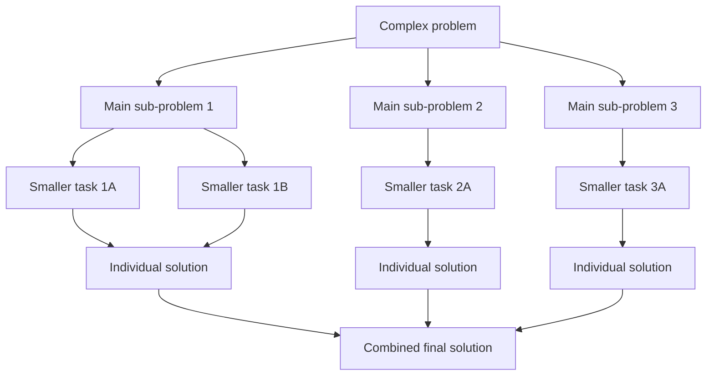

# Decomposition

## Start here

**Decomposition** means breaking a complex problem into smaller, manageable **sub-problems**. Instead of trying to solve the whole problem at once, you identify the main **tasks**, solve each part, and then combine the parts into a full solution.

本页重点是：看到一个场景时，能说清楚这个大问题可以拆成哪些 sub-problems，以及这样做为什么有助于 algorithm design、testing、debugging、modular design 和 maintainability。

Core keywords for this page:

```text
decomposition, sub-problem, module, task, algorithm, computational thinking, modular design
```

::: tip Core idea
Do not only write "split the problem". A strong answer explains what the sub-problems are and why solving or testing them separately helps.
:::

---

## Core checklist

By the end of this page, you should be able to:

- define **decomposition**
- identify sensible **sub-problems** in a scenario
- explain why decomposition makes a complex problem easier to solve
- apply decomposition to programming and non-programming scenarios
- link decomposition to modular programming, subprograms, testing, debugging, and maintainability
- avoid vague answers such as "split the problem" without explaining how or why

---

## Key terms for decomposition

| Term | Simple Chinese explanation | English mark-scheme style phrase | Small example |
|---|---|---|---|
| Decomposition | 分解；把复杂问题拆成更小、更容易处理的部分。 | Decomposition breaks a complex problem into smaller sub-problems. | Split a quiz app into loading questions, checking answers, and updating score. |
| Complex problem | 复杂问题；一次性解决会太大或太难的问题。 | A complex problem has several parts, tasks, or decisions that must work together. | A school library system has books, students, loans, returns, and fines. |
| Sub-problem | 子问题；主问题中的一个较小任务。 | A sub-problem is a smaller part of the overall problem that can be solved separately. | Calculate overdue fine. |
| Module | 模块；系统或程序中相对独立的一部分。 | A module is a separate part of a system that performs a specific role. | A login module checks username and password. |
| Task | 任务；需要完成的具体工作。 | A task is a specific action needed to solve part of the problem. | Validate a book ID before recording a loan. |
| Modular design | 模块化设计；把系统设计成清楚的模块。 | Modular design organizes a solution into separate modules that can be developed and maintained more easily. | Separate modules for search, loan, return, and reports. |
| Top-down design | 自顶向下设计；先看整体，再逐层拆分。 | Top-down design starts with the whole problem and breaks it into smaller levels of detail. | Start with "library system", then split into book records, loans, returns, and reports. |
| Abstraction | 抽象；相关概念，只关注重要信息，忽略无关细节。 | Abstraction focuses on essential details and ignores unnecessary details. | In a route app, use road distance but ignore building colour. |
| Algorithm | 算法；相关概念，用步骤解决问题。 | An algorithm is a step-by-step method for solving a problem or sub-problem. | Steps for checking whether a book is available. |

---

## Step-by-step decomposition method

Use this method when an exam question gives you a scenario:

1. Understand the overall problem.
2. Identify the main tasks.
3. Split each task into smaller sub-tasks.
4. Decide the inputs and outputs for each part.
5. Solve or test each part separately.
6. Combine the parts into the full solution.

| Step | Question to ask | Example for a library system |
|---|---|---|
| Understand problem | What must the system achieve? | Manage book loans and returns. |
| Main tasks | What major jobs are needed? | Search books, record loans, record returns. |
| Smaller sub-tasks | Can a task be split further? | For returns: check due date, calculate fine, update book status. |
| Inputs/outputs | What data enters and leaves this part? | Input: book ID, student ID. Output: loan confirmation. |
| Test separately | Can this part be checked alone? | Test fine calculation with different overdue days. |
| Combine | How do parts form the full solution? | Search, loan, return, and report modules work together. |

---

## Scenario example: school library system

Original problem:

```text
Create a system that allows students to borrow and return books in a school library.
```

Decomposed sub-problems:

| Sub-problem | Possible inputs | Possible outputs | Why this helps |
|---|---|---|---|
| Store book records | book ID, title, author, availability | updated book list | Book data can be checked separately from loans. |
| Store student records | student ID, name, year group | student profile | Student details can be validated before borrowing. |
| Search for a book | title, author, book ID | matching books, availability | Search can be tested with existing and missing books. |
| Record a loan | student ID, book ID, loan date | loan confirmation, updated availability | Loan logic can be tested without testing the whole system. |
| Record a return | book ID, return date | return confirmation, updated availability | Return handling is a separate task. |
| Calculate overdue fine | due date, return date | fine amount | Fine calculation can be tested using boundary cases. |
| Generate report | date range, class/year group | list of loans or overdue books | Reports can be built after core data is working. |

This helps implementation because each sub-problem can become a separate module or procedure. It helps testing because errors can be located in one smaller part, such as fine calculation or book search, instead of searching through the whole system.

---

## Without decomposition vs with decomposition

| Aspect | Without decomposition | With decomposition |
|---|---|---|
| Complexity | One large problem is hard to understand. | Smaller sub-problems are easier to manage. |
| Readability | Design or code may become long and confusing. | Each part has a clearer purpose. |
| Testing | The whole system may need to be tested at once. | Each module or sub-problem can be tested separately. |
| Debugging | Errors are harder to locate. | Bugs can be narrowed down to one part. |
| Teamwork | People may duplicate work or interfere with each other. | Different team members can work on different parts. |
| Maintenance | Changing one feature may affect many parts. | A module can often be changed with less impact on other parts. |
| Common exam phrase | The problem is harder to solve because all tasks are mixed together. | Decomposition reduces complexity by allowing sub-problems to be solved, tested, and maintained separately. |

---

## Decomposition and programming

In programming, sub-problems often become **subprograms**, **functions**, **procedures**, or **modules**.

Example:

```text
Quiz app
├─ loadQuestions()
├─ displayQuestion()
├─ getUserAnswer()
├─ checkAnswer()
├─ updateScore()
└─ showResult()
```

This supports modular programming because:

- each module has a clear purpose
- each module can be tested separately
- changes to one module may be easier to manage
- useful modules can be reused
- the full program is easier to read and maintain

Keep the explanation SL-friendly: decomposition is not about advanced software engineering. It is about making a complex problem easier to design, code, test, debug, and maintain.

---

## Decomposition workflow



---

## Exam focus

Command terms you may see:

| Command term | What to write |
|---|---|
| State | Give a short definition of decomposition. |
| Identify | Name suitable sub-problems in a scenario. |
| Outline | Give sub-problems and one brief reason why they help. |
| Describe | Explain how a problem can be broken into smaller tasks. |
| Explain | Link decomposition to solving, testing, debugging, maintainability, or teamwork. |
| Apply | Use decomposition on a new scenario and justify your sub-problems. |

How much detail is usually needed:

| Marks | What a strong answer includes |
|---:|---|
| 1 mark | A correct definition, such as breaking a complex problem into sub-problems. |
| 2 marks | Definition plus one benefit, such as easier testing. |
| 3 marks | Several sensible sub-problems from a scenario. |
| 4 marks | Sub-problems plus explanation of how they can be solved or tested separately. |
| 6 marks | Scenario-based decomposition with links to modules, testing, debugging, teamwork, or maintenance. |

Avoid vague answers such as:

- "decomposition means splitting"
- "it makes coding easier"

Better answers mention smaller sub-problems, separate solutions, separate testing, easier debugging, modular programming, or maintainability.

---

## Common exam mistakes

| Mistake | Why it loses marks | Better answer habit |
|---|---|---|
| Giving only the definition with no scenario link | It does not show application. | Name sub-problems from the given scenario. |
| Confusing decomposition with abstraction | They are related but different CT ideas. | Decomposition splits; abstraction ignores unnecessary detail. |
| Listing random features instead of sub-problems | The parts may not help solve the problem. | Choose tasks that can be designed or tested. |
| Not explaining how sub-problems are solved separately | The benefit is unclear. | Say each part can be developed, tested, or debugged separately. |
| Forgetting testing/debugging benefits | Many exam answers need a practical benefit. | Link decomposition to locating errors in smaller parts. |
| Saying decomposition always reduces the total amount of work | The work still exists; it is organized better. | Say it reduces complexity, not necessarily total work. |
| Not linking decomposition to modular programming | Programming benefits may be missed. | Explain that sub-problems can become functions/procedures/modules. |
| Using examples that are too broad | "Make app" is not a useful sub-problem. | Use specific tasks such as input details, validate data, calculate total, output result. |

---

## Reusable mark-scheme style phrases

- **Decomposition breaks a complex problem into smaller sub-problems.**
- **Each sub-problem can be solved, tested, or debugged separately.**
- **Decomposition can make the solution easier to understand and maintain.**
- **Sub-problems can be implemented as separate modules, procedures, or functions.**
- **This helps teams divide work because different parts can be developed independently.**
- **Decomposition reduces complexity because the programmer can focus on one manageable part at a time.**
- **A good sub-problem should be clear, specific, manageable, and testable.**

---

## Quick-check questions

1. What is decomposition?
2. What is a sub-problem?
3. Why does decomposition help with complex problems?
4. How can decomposition help testing?
5. How can decomposition help debugging?
6. How is decomposition linked to modular programming?
7. What is the difference between decomposition and abstraction?
8. Why is "make the app" a poor sub-problem?
9. Give two sub-problems for a quiz app.
10. Why does decomposition help maintainability?

<details>
<summary>Short answers</summary>

1. Breaking a complex problem into smaller, manageable sub-problems.
2. A smaller part of the main problem that can be solved separately.
3. It reduces complexity and lets you focus on one part at a time.
4. Each part can be tested separately.
5. Errors can be located in a smaller part of the solution.
6. Sub-problems can become modules, procedures, or functions.
7. Decomposition splits a problem into parts; abstraction ignores unnecessary details.
8. It is too broad and cannot be designed or tested clearly.
9. Examples: load questions, check answers, update score, show result.
10. A change can often be made to one module without rewriting the whole solution.

</details>

---

## Exam-style practice: decomposition

### Question A [4 marks]

Define decomposition and explain why it is useful when designing a solution.

<details>
<summary>Mark scheme</summary>

Decomposition is breaking a complex problem into smaller, manageable sub-problems. It is useful because each sub-problem can be understood, solved, tested, and debugged separately. This reduces complexity and can make the final solution easier to maintain.

</details>

### Question B [6 marks]

A hospital appointment system allows patients to book, cancel, and view appointments. Decompose this system into suitable sub-problems.

<details>
<summary>Mark scheme</summary>

Possible sub-problems include:

- store patient records
- store doctor availability
- search for available appointment times
- book an appointment
- cancel an appointment
- send confirmation or error message
- display upcoming appointments

Award credit for sensible scenario-specific sub-problems. Strong answers explain that these parts can be designed and tested separately, for example testing appointment search without testing cancellation.

</details>

### Question C [6 marks]

Explain how decomposition improves testing, debugging, and maintenance in a software project.

<details>
<summary>Mark scheme</summary>

Decomposition divides the project into smaller modules or sub-problems. Each part can be tested separately, so the programmer can check whether one module works before combining it with the rest of the system. Debugging is easier because an error can be narrowed down to a smaller section of code. Maintenance is easier because changes can often be made to one module without rewriting the whole program.

</details>

---

## 1. Lesson Goals

By the end of this lesson, students should be able to:

- define decomposition
- explain why decomposition is useful in computational thinking
- break a complex problem into smaller sub-problems
- identify sensible sub-problems from a real-world scenario
- explain how decomposition makes problems easier to understand, design, test, and maintain
- connect decomposition to algorithms, flowcharts, functions, modules, and teamwork
- distinguish decomposition from abstraction
- apply decomposition to school, shop, game, library, login, and calculator examples
- write exam-style answers about decomposition

---

## 2. Syllabus Mapping

| Item | Detail |
|---|---|
| Unit | B1 Computational Thinking |
| Label | SL Core |
| Main skill | Breaking a problem into smaller, manageable parts before designing a solution |
| Connected topics | Abstraction, algorithms, flowcharts, trace tables, programming functions/modules |
| Practical focus | Scenario analysis and sub-problem identification |
| Exam relevance | Definition, benefits, scenario decomposition, algorithm design explanation |

::: tip Learning Focus
Decomposition means breaking a complex problem into smaller sub-problems. Each smaller part can be understood, designed, tested, and improved more easily.
:::

---

## 3. Key Terms

| English Term | 中文解释 | Exam-style meaning |
|---|---|---|
| Decomposition | 分解 | Breaking a complex problem into smaller sub-problems |
| Problem | 问题 | A task that needs to be solved |
| Sub-problem | 子问题 | Smaller part of the main problem |
| Module | 模块 | Separate section of a system or program |
| Function | 函数 | Reusable block of code that performs a specific task |
| Procedure | 过程 | Named set of steps that performs a task |
| Algorithm | 算法 | Step-by-step method for solving a problem |
| Input | 输入 | Data entering a system or algorithm |
| Output | 输出 | Result produced by a system or algorithm |
| Process | 处理 | Steps performed on input to produce output |
| Complexity | 复杂度 | How difficult a problem/system is to understand or manage |
| Testing | 测试 | Checking whether a part or whole solution works |
| Maintenance | 维护 | Updating or fixing a system after it is built |
| Teamwork | 团队合作 | Different people work on different sub-problems |
| Dependency | 依赖关系 | When one part relies on another part |
| Interface | 接口 | How parts of a system communicate or connect |

---

## 4. Concept Explanation

<LangBlock>
<template #cn>

### 中文讲解

**Decomposition（分解）** 是 computational thinking 中非常重要的一步。  
它的意思是：

```text
把一个大问题拆成几个小问题
```

例如要设计一个 online shop system，如果直接想整个系统，会很复杂。  
我们可以先拆成：

```text
user login
product search
shopping cart
payment
delivery tracking
order history
```

每一个小部分都可以单独分析、设计、测试。

Decomposition 的好处是：

```text
problem becomes easier to understand
each part can be solved separately
different people can work on different parts
each part can be tested separately
code is easier to maintain
```

比如写一个 grade calculator：

```text
input marks
validate marks
calculate total
calculate average
decide grade
output result
```

这些就是 sub-problems。

注意：decomposition 不是删除内容。  
它是把复杂问题拆成更小、更清楚的 parts。

简单来说：

```text
decomposition = break down a big problem into smaller manageable parts
```

</template>

<template #en>

### English Explanation

**Decomposition** is an important part of computational thinking.  
It means:

```text
breaking a large problem into smaller problems
```

For example, designing an online shop system can be complex if we think about everything at once.  
We can decompose it into:

```text
user login
product search
shopping cart
payment
delivery tracking
order history
```

Each smaller part can be analysed, designed, and tested separately.

Benefits of decomposition include:

```text
problem becomes easier to understand
each part can be solved separately
different people can work on different parts
each part can be tested separately
code is easier to maintain
```

For example, a grade calculator can be decomposed into:

```text
input marks
validate marks
calculate total
calculate average
decide grade
output result
```

These are sub-problems.

Important: decomposition does not mean deleting parts.  
It means breaking a complex problem into smaller, clearer parts.

In simple terms:

```text
decomposition = break down a big problem into smaller manageable parts
```

</template>
</LangBlock>

---

## 5. What Is Decomposition?

Decomposition is the process of breaking a complex problem into smaller, more manageable sub-problems.

### Simple Definition

```text
Decomposition breaks a large problem into smaller parts that are easier to solve.
```

### Example

Problem:

```text
Create a school attendance system.
```

Possible sub-problems:

```text
store student details
record attendance
check absent students
generate attendance report
send notification to parents
allow teachers to edit records
```

::: tip Exam Phrase
Decomposition is breaking a complex problem into smaller sub-problems so that each part can be solved, tested, and maintained more easily.
:::

---

## 6. Why Decomposition Is Useful

Decomposition reduces complexity.

### Benefits

| Benefit | Explanation |
|---|---|
| Easier to understand | small parts are easier than one large problem |
| Easier to solve | each sub-problem can be solved separately |
| Easier to test | each part can be checked independently |
| Easier to debug | errors can be located in a smaller part |
| Easier to maintain | one part can be changed without rewriting everything |
| Better teamwork | different people can work on different parts |
| Reuse | some parts can be reused in other systems |
| Clear design | system structure becomes more organized |

### Key Idea

A large problem becomes less scary when it is divided into smaller parts.

---

## 7. Decomposition and Sub-problems

A sub-problem is a smaller part of the main problem.

### Good Sub-problems Should Be

```text
clear
specific
manageable
related to the main problem
possible to test
possible to combine with other parts
```

### Example: Quiz App

Main problem:

```text
Create a quiz app.
```

Sub-problems:

```text
load questions
display each question
get user answer
check answer
update score
show final result
```

### Poor Decomposition

```text
make app
do quiz
finish everything
```

These are too vague.

---

## 8. Decomposition vs Abstraction

Students often confuse decomposition and abstraction.

| Concept | Meaning | Main Question |
|---|---|---|
| Decomposition | break problem into smaller parts | What smaller parts make up the problem? |
| Abstraction | focus on important details and ignore unnecessary ones | What details are important? |

### Example: Map App

Decomposition:

```text
get start location
get destination
find possible routes
calculate distance/time
display best route
```

Abstraction:

```text
keep roads, traffic, distance
ignore building colour and tree shape
```

### Quick Memory

```text
decomposition = split into parts
abstraction = remove unnecessary details
```

---

## 9. Decomposition and Algorithms

Decomposition helps design algorithms.

Instead of writing one huge algorithm, we can design smaller algorithms for each sub-problem.

### Example: Login System

Sub-problems:

```text
input username and password
check username
check password
display access result
```

Algorithm:

```text
INPUT username
INPUT password

IF username = storedUsername AND password = storedPassword THEN
    OUTPUT "Access granted"
ELSE
    OUTPUT "Access denied"
ENDIF
```

### Key Idea

Each sub-problem can become part of the final algorithm.

---

## 10. Decomposition and Functions

In programming, decomposition often leads to functions or procedures.

### Example

A program for a calculator can be decomposed into:

```text
add numbers
subtract numbers
multiply numbers
divide numbers
display menu
get user choice
```

These can become functions:

```text
add()
subtract()
multiply()
divide()
displayMenu()
getChoice()
```

### Why Useful?

Functions make code:

```text
organized
reusable
easier to test
easier to debug
easier to maintain
```

### Exam Link

Even if the question is not asking for code, decomposition supports good program design.

---

## 11. Decomposition and Teamwork

Large systems are often built by teams.

Decomposition allows different people to work on different parts.

### Example: Game Project

A game can be decomposed into:

```text
player movement
enemy AI
scoring system
level design
sound effects
save/load system
menu system
```

Team members can work on different sub-problems.

### Important

The parts must still work together.  
Teams need clear interfaces and communication.

---

## 12. Decomposition and Testing

A decomposed problem is easier to test.

### Example: Shopping Cart

Sub-problems:

```text
add item to cart
remove item from cart
calculate total price
apply discount
process payment
```

Each part can be tested separately.

### Benefit

If the total price is wrong, we can test:

```text
item prices
cart quantity
discount logic
tax calculation
```

instead of searching through the whole system at once.

### Exam Phrase

Decomposition makes testing and debugging easier because each sub-problem can be checked separately.

---

## 13. How to Decompose a Problem

A practical method:

```text
1. Read the problem carefully.
2. Identify the main goal.
3. Identify inputs and outputs.
4. Identify major tasks.
5. Break each major task into smaller steps.
6. Check if each sub-problem is clear and testable.
7. Combine the sub-problems into a full solution.
```

### Helpful Questions

```text
What must the system do first?
What data is needed?
What decisions are needed?
What repeats?
What output is needed?
Can this part be solved separately?
Can this part be tested separately?
```

---

## 14. Input-Process-Output Decomposition

Many problems can be decomposed using IPO:

```text
Input → Process → Output
```

### Example: Calculate Area

Problem:

```text
Calculate the area of a rectangle.
```

Decomposition:

```text
input length
input width
calculate area
output area
```

IPO:

| Part | Details |
|---|---|
| Input | length, width |
| Process | area = length * width |
| Output | area |

---

## 15. Sequence-Based Decomposition

Some problems can be decomposed by the order of actions.

### Example: Make Tea

```text
boil water
put tea bag in cup
pour water
wait
remove tea bag
add milk/sugar if needed
serve tea
```

### Programming Example: User Registration

```text
input user details
validate details
check if username exists
create account
send confirmation
display success message
```

### Key Idea

Think about what happens first, next, and last.

---

## 16. Feature-Based Decomposition

A system can be decomposed by features.

### Example: School Management System

Features:

```text
student records
teacher records
attendance
grades
timetable
reports
notifications
login permissions
```

Each feature can be treated as a sub-problem.

### Why Useful?

Feature-based decomposition is useful for large systems because each feature can be developed and tested separately.

---

## 17. Data-Based Decomposition

A problem can also be decomposed by data.

### Example: Library System

Data groups:

```text
books
members
loans
returns
fines
reservations
```

Sub-problems:

```text
store book data
store member data
record loan data
update return data
calculate fine
```

### Key Idea

If a system manages different types of data, those data groups often suggest sub-problems.

---

## 18. Decision-Based Decomposition

Some problems involve decisions.

### Example: Discount Calculator

Rules:

```text
if customer is member, apply 10% discount
if total is over 100, apply extra 5% discount
otherwise, no extra discount
```

Sub-problems:

```text
input total
check membership
check total threshold
calculate discount
calculate final price
output final price
```

### Key Idea

Each decision can become a smaller part of the algorithm.

---

## 19. Loop-Based Decomposition

Some problems involve repetition.

### Example: Calculate Average Score

Sub-problems:

```text
input number of scores
repeat input for each score
add score to total
count scores
calculate average
output average
```

### Loop Part

```text
FOR each score
    input score
    add to total
ENDFOR
```

### Key Idea

If a problem repeats the same action many times, isolate the repeated part.

---

## 20. Worked Example: Login System

### Problem

Allow a user to log in with a username and password.

### Decomposition

```text
get username
get password
compare username with stored username
compare password with stored password
decide whether access is allowed
display result
```

### Inputs

```text
username
password
```

### Output

```text
Access granted / Access denied
```

### Algorithm Structure

```text
input
selection
output
```

### Useful Explanation

The login problem is decomposed into input, validation, decision, and output so each part can be designed and tested separately.

---

## 21. Worked Example: Grade Calculator

### Problem

Input three test marks and output the average and grade.

### Decomposition

```text
input mark1
input mark2
input mark3
calculate total
calculate average
choose grade
output average and grade
```

### Possible Grade Decision

```text
average >= 80 → A
average >= 60 → B
average >= 50 → C
else → Fail
```

### Why Decomposition Helps

If the grade is wrong, we can check:

```text
input values
total calculation
average calculation
grade boundary logic
```

---

## 22. Worked Example: Online Shop

### Problem

Create an online shopping system.

### High-Level Decomposition

```text
user account
product catalogue
search/filter products
shopping cart
checkout
payment
delivery tracking
order history
customer support
```

### More Detailed Cart Decomposition

```text
add item
remove item
update quantity
calculate subtotal
apply discount
calculate final total
```

### Key Point

Large systems often need multiple levels of decomposition.

---

## 23. Worked Example: Library Loan System

### Problem

Students borrow and return books.

### Decomposition

```text
store book records
store student records
check book availability
record loan
update book status
record return
calculate overdue fine
generate report
```

### Inputs

```text
student ID
book ID
borrow date
return date
```

### Outputs

```text
loan confirmation
return confirmation
fine amount
availability status
```

---

## 24. Worked Example: Simple Game

### Problem

Create a simple score-based game.

### Decomposition

```text
display start menu
initialize player
load level
handle player movement
detect collisions
update score
check win/lose condition
display final score
restart or exit
```

### Why Useful?

Game logic can become complex.  
Decomposition makes it easier to design and test each part.

### Example Testing

```text
test movement separately
test collision separately
test scoring separately
test game over separately
```

---

## 25. Worked Example: Password Strength Checker

### Problem

Input a password and decide whether it is strong.

### Decomposition

```text
input password
check length
check uppercase letter
check lowercase letter
check digit
check special character
count passed rules
output strength result
```

### Possible Output

```text
Weak
Medium
Strong
```

### CT Link

Each rule is a smaller sub-problem.

---

## 26. Multi-Level Decomposition

Some sub-problems can be decomposed further.

### Example: Payment System

High-level sub-problem:

```text
process payment
```

Can be decomposed into:

```text
input card details
validate card format
check payment amount
send request to payment provider
receive response
confirm or reject payment
record transaction
```

### Key Idea

Decomposition can happen at different levels of detail.

---

## 27. Good vs Poor Decomposition

### Good Decomposition

```text
input scores
validate scores
calculate average
assign grade
output result
```

This is clear and testable.

### Poor Decomposition

```text
do input stuff
do math stuff
do output stuff
```

This is too vague.

### Another Poor Example

```text
make everything work
```

This is not useful.

### Rule

Sub-problems should be specific enough to design and test.

---

## 28. Decomposition in Exam Answers

When asked to decompose a problem, do not only write one word.

### Weak Answer

```text
make login
make payment
make delivery
```

### Stronger Answer

```text
The online shop can be decomposed into user login, product search, shopping cart management, payment processing, delivery tracking, and order history. Each part can be designed and tested separately.
```

### Even Better

Add benefit:

```text
This reduces complexity and makes testing/debugging easier because errors can be located within one sub-problem.
```

---

## 29. Scenario Answer Bank

### If Asked: “Define decomposition”

```text
Decomposition is breaking a complex problem into smaller, more manageable sub-problems.
```

### If Asked: “Why is decomposition useful?”

```text
Decomposition reduces complexity because each sub-problem can be understood, solved, tested, and maintained separately.
```

### If Asked: “How does decomposition help teamwork?”

```text
Different team members can work on different sub-problems at the same time, as long as the parts are clearly defined and can be combined later.
```

### If Asked: “How does decomposition help testing?”

```text
Each sub-problem can be tested separately, making it easier to find and fix errors before combining the full solution.
```

### If Asked: “Decompose a system”

Use this pattern:

```text
The system can be decomposed into [part 1], [part 2], [part 3], and [part 4]. These parts separate the main tasks of the system and make the problem easier to design and test.
```

---

## 30. Common Misconceptions

| Mistake | Why it is wrong | Better understanding |
|---|---|---|
| Decomposition means deleting details | That is closer to abstraction | Decomposition splits into smaller parts |
| Decomposition and abstraction are the same | They are related but different | split vs simplify |
| Sub-problems can be vague | Vague parts are not useful | make them clear and testable |
| Decomposition is only for programming | It applies to problem solving generally | systems, algorithms, projects |
| Decomposition makes the problem disappear | It makes it manageable | parts still need solving |
| Only one correct decomposition exists | Different sensible decompositions are possible | justify your choices |
| Decomposition is done after coding | It should happen before design/coding | plan first |
| Teamwork does not need decomposition | Without clear parts, work overlaps/conflicts | divide work clearly |
| Testing only happens after full system | parts can be tested separately | easier debugging |
| More parts always means better | too many tiny parts can be confusing | choose sensible level |

---

## 31. Guided Practice

### Practice 1: Define

What is decomposition?

<details>
<summary>Suggested Answer</summary>

Decomposition is breaking a complex problem into smaller, more manageable sub-problems.

</details>

---

### Practice 2: Identify Sub-problems

A quiz app asks questions, checks answers, and gives a score. Name three sub-problems.

<details>
<summary>Suggested Answer</summary>

Possible sub-problems: load questions, display question, get user answer, check answer, update score, display final score.

</details>

---

### Practice 3: Benefit

Why does decomposition make testing easier?

<details>
<summary>Suggested Answer</summary>

Each sub-problem can be tested separately, so errors can be found and fixed in a smaller part of the system.

</details>

---

### Practice 4: Decomposition or Abstraction?

Ignoring the colour of a button when designing a login algorithm is decomposition or abstraction?

<details>
<summary>Suggested Answer</summary>

Abstraction, because unnecessary details are being ignored.

</details>

---

### Practice 5: Good or Poor Decomposition?

Is `make the whole game` a useful sub-problem?

<details>
<summary>Suggested Answer</summary>

No. It is too vague. Better sub-problems include player movement, scoring, collision detection, level loading, and game over logic.

</details>

---

## 32. Independent Practice

### Question 1

Define decomposition.

### Question 2

Explain two benefits of decomposition.

### Question 3

Decompose a school attendance system into at least five sub-problems.

### Question 4

Decompose a shopping discount calculator into smaller steps.

### Question 5

Explain the difference between decomposition and abstraction.

### Question 6

A library system records loans and returns. Identify at least five sub-problems.

### Question 7

Explain how decomposition supports teamwork.

### Question 8

Explain how decomposition supports testing and debugging.

### Question 9

Give an example of poor decomposition and improve it.

### Question 10

Explain how decomposition can lead to functions in a program.

---

## 33. Exam-style Questions

### Question 1 [4 marks]

Define decomposition and explain why it is useful in computational thinking.

<details>
<summary>Mark Scheme Style Answer</summary>

Decomposition is breaking a complex problem into smaller, more manageable sub-problems. It is useful because each smaller part can be understood, solved, tested, and maintained separately, reducing the complexity of the overall problem.

</details>

---

### Question 2 [5 marks]

A school wants to create an attendance system. Decompose this system into suitable sub-problems.

<details>
<summary>Mark Scheme Style Answer</summary>

The attendance system can be decomposed into storing student records, recording attendance, checking absent students, generating attendance reports, allowing teachers to edit records, and sending notifications to parents. These parts separate the main tasks of the system and make it easier to design and test.

</details>

---

### Question 3 [6 marks]

Explain how decomposition can help a team develop a large software system.

<details>
<summary>Mark Scheme Style Answer</summary>

Decomposition breaks the large system into smaller sub-problems or modules. Different team members can work on different modules, such as login, payment, search, or reports. This reduces complexity and allows work to happen in parallel. Each module can be tested separately before being combined with the rest of the system, making debugging and maintenance easier.

</details>

---

### Question 4 [6 marks]

A game includes player movement, enemies, scoring, levels, and a menu. Explain how decomposition helps design and test the game.

<details>
<summary>Mark Scheme Style Answer</summary>

The game can be decomposed into sub-problems such as player movement, enemy behaviour, scoring, level loading, collision detection, and menu control. Each part can be designed separately, which makes the overall game easier to understand. Each sub-problem can also be tested separately, for example checking collision detection without testing the whole game. This makes errors easier to locate and fix.

</details>

---

### Question 5 [6 marks]

Distinguish between decomposition and abstraction using an example.

<details>
<summary>Mark Scheme Style Answer</summary>

Decomposition means breaking a problem into smaller sub-problems, while abstraction means focusing on important details and ignoring unnecessary ones. For example, when designing a login system, decomposition breaks the problem into input username, input password, check details, and display result. Abstraction ignores details such as button colour or font size because they are not needed for the login logic.

</details>

---

## 34. Practice task
### Activity 1: System Breakdown

Choose one system:

```text
library system
online shop
quiz app
school attendance system
game score tracker
ATM menu
```

Produce:

```text
main problem
at least six sub-problems
one reason why decomposition helps
```

---

### Activity 2: Decomposition vs Abstraction Sort

Sort each example into decomposition or abstraction.

Examples:

```text
break game into scoring and movement
ignore colour of login button
split shop into cart and payment
ignore background image
split quiz into question loading and scoring
ignore font style in algorithm logic
```

---

### Activity 3: Test Each Part

Choose a system with sub-problems.
Write one test idea for each part.

Example:

```text
shopping cart: add item, remove item, update quantity, calculate total
```

---

## 35. Independent practice
### Independent practice part A: Concept Explanation

In 6-8 sentences, explain what decomposition is and why it is useful.

---

### Independent practice part B: Scenario Decomposition

Choose one system and decompose it into at least six sub-problems:

```text
online shop
school attendance system
library loan system
password checker
simple game
restaurant ordering system
```

For each sub-problem, write one sentence explaining what it does.

---

### Independent practice part C: Testing Link

Choose three sub-problems from your system.  
For each one, describe how it could be tested separately.

---

### Independent practice part D: Misconception Correction

Correct these statements:

```text
Decomposition means deleting unnecessary details.
Decomposition and abstraction are exactly the same.
A sub-problem can be vague as long as it sounds related.
Decomposition is only useful after coding.
Testing can only happen when the full system is complete.
```

---

## 36. One-page Revision Summary

| Point | Summary |
|---|---|
| Decomposition | Breaking a complex problem into smaller sub-problems |
| Sub-problem | Smaller task within main problem |
| Main benefit | Reduces complexity |
| Understanding | Smaller parts are easier to understand |
| Solving | Each part can be solved separately |
| Testing | Each part can be tested separately |
| Debugging | Errors are easier to locate |
| Maintenance | Parts can be updated more easily |
| Teamwork | Different people can work on different parts |
| Reuse | Some parts/functions can be reused |
| IPO | Input, Process, Output can guide decomposition |
| Function link | Sub-problems may become functions/procedures |
| Decomposition vs abstraction | split problem vs remove detail |
| Good sub-problem | clear, specific, manageable, testable |
| Exam phrase | Decomposition reduces complexity by breaking a large problem into smaller parts that can be solved and tested separately |

---

## 37. Quick Self-test

Before moving on, students should be able to answer these:

1. What is decomposition?
2. What is a sub-problem?
3. Why does decomposition reduce complexity?
4. How does decomposition help testing?
5. How does decomposition help teamwork?
6. How is decomposition different from abstraction?
7. Give three sub-problems in a login system.
8. Give three sub-problems in an online shop.
9. What makes a sub-problem useful?
10. How can decomposition lead to functions in code?

