# Flowcharts

## Start here

A **flowchart** is a diagram that visually represents the steps and decisions in an **algorithm**. It uses standard symbols to show **sequence**, **selection**, **iteration**, input/output, processing, decisions, and the direction of control flow.

本页重点是：能读懂 flowchart 的符号和箭头，按顺序 trace 每一步，并能在 pseudocode 和 flowchart 之间转换。

Core keywords for this page:

```text
flowchart, algorithm, sequence, selection, iteration, process, decision, input/output, terminator, flowline
```

::: tip Core idea
Do not guess the next step from the position of a symbol. Always follow the flowline/arrow and evaluate decisions as true or false.
:::

---

## Core checklist

By the end of this page, you should be able to:

- identify common flowchart symbols
- trace a flowchart step by step
- convert simple pseudocode into a flowchart
- convert a flowchart into pseudocode
- recognise sequence, selection, and iteration in a flowchart
- explain what a decision symbol does
- answer Paper 1 style flowchart tracing questions

---

## Common flowchart symbols at SL

| Symbol name | Simple Chinese explanation | English mark-scheme style phrase | Small example |
|---|---|---|---|
| Terminator / Start-End | 终止符；表示算法开始或结束。 | A terminator symbol shows where the algorithm starts or ends. | `Start`, `End` |
| Process | 处理框；表示计算、赋值或更新变量。 | A process symbol represents a calculation or assignment. | `total = total + score` |
| Input/Output | 输入/输出框；表示数据进入或离开算法。 | Input/output symbols show data entering or leaving the algorithm. | `Input mark`, `Output "Pass"` |
| Decision | 判断框；表示一个 true/false 或 yes/no 条件。 | A decision symbol represents a condition with different branches. | `mark >= 50?` |
| Flowline / Arrow | 流程线；表示步骤执行方向。 | Flowlines show the order in which steps are followed. | Arrow from input to decision |
| Connector | 连接符；在较大流程图中连接分开的部分。 | A connector joins separated parts of a flowchart. | Link to another section of a large diagram |

---

## Flowchart symbol comparison

| Symbol name | Purpose | Typical text inside | Example | Common exam mistake |
|---|---|---|---|---|
| Terminator | Shows start or end | `Start`, `End` | Start of algorithm | Forgetting Start or End |
| Process | Shows calculation, assignment, or update | `count = count + 1` | Update a loop counter | Putting input text in a process box |
| Input/Output | Shows input or displayed output | `Input score`, `Output total` | User enters a mark | Confusing output with a calculation |
| Decision | Shows a condition and branches | `score >= 50?` | Pass/fail branch | Putting assignment such as `score = 50` in a diamond |
| Flowline / Arrow | Shows control flow direction | Usually no text, except branch labels | `Yes`, `No` branches | Drawing unclear arrow direction |
| Connector | Connects separated chart parts | label or letter | `A` | Using connectors when arrows would be clearer |

---

## Sequence, selection, and iteration

| Structure | What it means | How it appears in a flowchart | Simple example |
|---|---|---|---|
| Sequence | Steps happen in order. | Arrows move from one step to the next. | Input length, input width, calculate area, output area. |
| Selection | A decision chooses one branch. | A diamond has true/false or yes/no branches. | If `mark >= 50`, output `Pass`; otherwise output `Retry`. |
| Iteration | Steps repeat while or until a condition changes. | An arrow returns to an earlier decision or step. | Repeat input until a valid password is entered. |

In exams, say **iteration is shown when arrows return to an earlier step**, not just "there is a loop".

---

## Step-by-step tracing method

Use this method for Paper 1 flowchart tracing questions:

1. Start at the terminator.
2. Follow arrows in order.
3. Use the given input values when an input symbol is reached.
4. Update variable values after each process symbol.
5. Evaluate each decision as true or false.
6. Follow the correct branch only.
7. Repeat loop steps until the condition changes.
8. Record output exactly, including labels, spaces, and order.

::: warning Trace carefully
Do not trace both branches of a decision at the same time. Only the branch matching the condition is followed.
:::

---

## Worked example: pass or retry flowchart

This small flowchart includes input, a decision, output, and an end point.

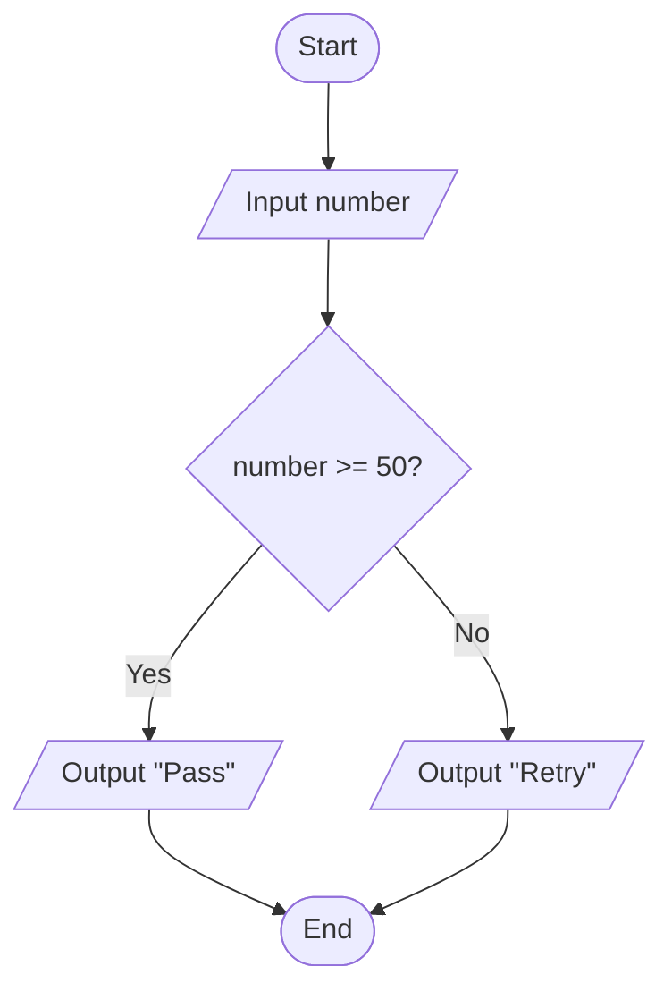

Trace example:

| Given input | Decision `number >= 50?` | Branch followed | Output |
|---:|---|---|---|
| `72` | true | Yes | `Pass` |
| `35` | false | No | `Retry` |

Short explanation: start at `Start`, input the number, test the condition in the decision diamond, follow only the correct branch, output the message, then reach `End`.

---

## Exam focus

Command terms you may see:

| Command term | What to write or draw |
|---|---|
| State | Give a short definition or symbol purpose. |
| Identify | Name a symbol, structure, branch, input, output, or decision. |
| Outline | Give the purpose of a symbol or structure with a brief example. |
| Describe | Explain how a flowchart represents an algorithm step by step. |
| Explain | Link symbols, arrows, decisions, branches, loops, and output to algorithm behaviour. |
| Trace | Follow the flowchart using given inputs and record exact outputs. |
| Construct | Draw or describe a valid flowchart using correct symbols and flowlines. |

How much detail is usually needed:

| Marks | What a strong answer includes |
|---:|---|
| 1 mark | Correct symbol name or purpose, such as "diamond = decision". |
| 2 marks | Symbol name plus technical purpose, such as condition with true/false branches. |
| 3 marks | Short explanation of sequence, selection, or iteration in a given chart. |
| 4 marks | Correct trace or conversion with key variables and output. |
| 6 marks | Complete flowchart or explanation with correct symbols, branch labels, loop arrows, and exact output. |

Avoid vague answers such as:

- "diamond means question"
- "arrow shows direction"

Better answers use technical wording: a decision symbol contains a condition with branches, and flowlines show the order in which algorithm steps are followed.

---

## Common exam mistakes

| Mistake | Why it loses marks | Better answer habit |
|---|---|---|
| Confusing process and input/output symbols | Calculations and displayed output have different meanings. | Use process for assignments; input/output for entering or displaying data. |
| Forgetting Start/End | The algorithm boundary is unclear. | Include terminator symbols. |
| Drawing arrows in unclear directions | The control flow cannot be followed. | Use clear arrowheads and avoid unnecessary crossing. |
| Putting assignment statements inside decision diamonds | A decision should contain a condition. | Put assignments in process rectangles. |
| Not labelling true/false branches | The reader cannot tell which path matches the condition. | Label branches `Yes/No` or `True/False`. |
| Tracing both branches of a decision at the same time | Only one branch is followed for one set of input values. | Evaluate the condition, then choose one branch. |
| Forgetting to update variables in loops | The trace or loop condition becomes wrong. | Update counters/accumulators after each process. |
| Missing exact output text | Trace answers may lose marks for wrong labels or order. | Copy output messages exactly. |

---

## Reusable mark-scheme style phrases

- **A flowchart is a diagram that represents the steps of an algorithm.**
- **A process symbol represents a calculation or assignment.**
- **A decision symbol represents a condition with different branches.**
- **Input/output symbols show data entering or leaving the algorithm.**
- **Flowlines show the order in which steps are followed.**
- **Iteration is shown when arrows return to an earlier step.**
- **A selection structure is shown using a decision symbol with labelled branches.**
- **When tracing a flowchart, variables must be updated after each process step.**

---

## Quick-check questions

1. What is a flowchart?
2. Which symbol shows Start or End?
3. Which symbol shows a process?
4. Which symbol shows input or output?
5. Which symbol shows a decision?
6. What does a flowline show?
7. How is selection shown in a flowchart?
8. How is iteration shown in a flowchart?
9. Why should true/false branches be labelled?
10. Why must output be recorded exactly in trace questions?

<details>
<summary>Short answers</summary>

1. A diagram that represents the steps of an algorithm.
2. Terminator / oval.
3. Process / rectangle.
4. Input/output / parallelogram.
5. Decision / diamond.
6. The order or direction of control flow.
7. Using a decision symbol with branches.
8. With an arrow returning to an earlier step or decision.
9. So the correct path can be followed after evaluating the condition.
10. Because labels, spaces, and order may affect the expected answer.

</details>

---

## Exam-style practice: flowcharts

### Question A [5 marks]

Identify the purpose of these flowchart symbols: terminator, process, input/output, decision, and flowline.

<details>
<summary>Mark scheme</summary>

- Terminator: shows Start or End
- Process: shows a calculation, assignment, or variable update
- Input/output: shows data entering or leaving the algorithm
- Decision: shows a condition with different branches
- Flowline: shows the order in which steps are followed

</details>

### Question B [6 marks]

Trace the flowchart from the worked example when the input number is `48`.

<details>
<summary>Mark scheme</summary>

The algorithm starts, inputs `number = 48`, then checks `number >= 50?`. The condition is false, so the No branch is followed. The output is:

```text
Retry
```

The algorithm then reaches End. The `Pass` branch is not followed for this input.

</details>

### Question C [6 marks]

Explain how this pseudocode could be represented as a flowchart.

```text
count = 1
WHILE count <= 3
    OUTPUT count
    count = count + 1
ENDWHILE
```

<details>
<summary>Mark scheme</summary>

The flowchart should start with a terminator, then use a process symbol for `count = 1`. A decision symbol should check `count <= 3?`. The Yes branch should go to an input/output symbol that outputs `count`, then a process symbol updates `count = count + 1`, then a flowline returns to the decision. The No branch should go to End. This loop is iteration because the arrow returns to an earlier decision while the condition remains true.

</details>

---

## 1. Lesson Goals

By the end of this lesson, students should be able to:

- define flowchart
- explain why flowcharts are useful in computational thinking
- recognize common flowchart symbols
- use start/end, process, input/output, decision, and arrows correctly
- represent sequence, selection, and iteration using flowcharts
- convert simple algorithms into flowcharts
- convert simple flowcharts into algorithms or pseudocode
- follow a flowchart step by step
- predict the output of a flowchart
- identify logic errors in flowcharts
- explain how flowcharts support algorithm design and communication
- answer exam-style questions about flowcharts

---

## 2. Syllabus Mapping

| Item | Detail |
|---|---|
| Unit | B1 Computational Thinking |
| Label | SL Core |
| Main skill | Representing algorithm logic visually using standard flowchart symbols |
| Connected topics | Algorithms, sequence, selection, iteration, trace tables, pseudocode |
| Practical focus | Reading, completing, drawing, and explaining flowcharts |
| Exam relevance | Symbol recognition, control flow, decisions, loops, output prediction, algorithm conversion |

::: tip Learning Focus
A flowchart is a graphical representation of an algorithm. It uses standard symbols and arrows to show the order of steps, decisions, and loops.
:::

---

## 3. Key Terms

| English Term | 中文解释 | Exam-style meaning |
|---|---|---|
| Flowchart | 流程图 | Diagram that represents an algorithm using symbols and arrows |
| Algorithm | 算法 | Step-by-step method for solving a problem |
| Flowline / Arrow | 流程线 / 箭头 | Shows the direction of control flow |
| Start/End | 开始/结束 | Terminator symbol showing beginning or end |
| Process | 处理 | Operation or calculation step |
| Input/Output | 输入/输出 | Data entering or leaving the algorithm |
| Decision | 判断 | Condition with different paths, usually Yes/No |
| Sequence | 顺序结构 | Steps happen in order |
| Selection | 选择结构 | Different path chosen based on condition |
| Iteration | 迭代 / 循环 | Repeated steps |
| Condition | 条件 | True/false expression used in decision |
| Connector | 连接符 | Symbol used to join flowchart parts |
| Trace | 跟踪 | Follow the flowchart step by step |
| Dry run | 手动运行 | Manually run an algorithm or flowchart |
| Logic error | 逻辑错误 | Flowchart runs but gives wrong result |
| Control flow | 控制流 | Order in which steps are followed |
| Loop body | 循环体 | Steps repeated inside a loop |
| Branch | 分支 | One path after a decision |

---

## 4. Concept Explanation

<LangBlock>
<template #cn>

### 中文讲解

**Flowchart（流程图）** 是一种用图形表示 algorithm 的方式。  
它不是 code，但是它可以清楚展示 algorithm 的执行顺序。

Flowchart 常用 symbols：

```text
Oval = Start / End
Rectangle = Process
Parallelogram = Input / Output
Diamond = Decision
Arrow = direction of flow
```

例如判断一个学生是否 pass：

```text
Start
Input score
score >= 50?
Yes → Output Pass
No → Output Fail
End
```

Flowchart 最重要的是：

```text
follow the arrows
check each decision
choose the correct branch
repeat if arrow goes back
```

Flowchart 可以表示三种基本 algorithm structure：

```text
sequence = one step after another
selection = decision with Yes/No paths
iteration = loop where arrows go back to repeat
```

简单来说：

```text
flowchart = visual algorithm
```

</template>

<template #en>

### English Explanation

A **flowchart** is a way to represent an algorithm using a diagram.  
It is not code, but it clearly shows the order of algorithm steps.

Common flowchart symbols:

```text
Oval = Start / End
Rectangle = Process
Parallelogram = Input / Output
Diamond = Decision
Arrow = direction of flow
```

Example: deciding whether a student passes:

```text
Start
Input score
score >= 50?
Yes → Output Pass
No → Output Fail
End
```

The most important rule is:

```text
follow the arrows
check each decision
choose the correct branch
repeat if an arrow goes back
```

Flowcharts can represent the three main algorithm structures:

```text
sequence = one step after another
selection = decision with Yes/No paths
iteration = loop where arrows go back to repeat
```

In simple terms:

```text
flowchart = visual algorithm
```

</template>
</LangBlock>

---

## 5. What Is a Flowchart?

A flowchart is a graphical representation of an algorithm.

It uses symbols and arrows to show:

```text
where the algorithm starts
what input is needed
what processing happens
what decisions are made
what output is produced
where the algorithm ends
```

### Simple Definition

```text
A flowchart is a diagram that shows the steps of an algorithm using standard symbols and arrows.
```

::: tip Exam Phrase
A flowchart is a graphical representation of an algorithm that uses standard symbols and arrows to show the order of steps and decisions.
:::

---

## 6. Why Flowcharts Are Useful

Flowcharts are useful because they make algorithm logic easier to see.

### Benefits

| Benefit | Explanation |
|---|---|
| Visual | easier to follow than long text |
| Shows order | arrows show which step happens next |
| Shows decisions | diamond symbols show conditions clearly |
| Shows loops | arrows can return to earlier steps |
| Helps planning | algorithm can be designed before coding |
| Helps communication | other people can understand the logic |
| Helps debugging | mistakes in flow can be spotted |
| Supports conversion | can be converted into pseudocode or program code |

### Key Idea

A flowchart is useful when you want to see the structure of an algorithm clearly.

---

## 7. Common Flowchart Symbols

| Symbol | Name | Purpose |
|---|---|---|
| Oval | Terminator | Start or End |
| Rectangle | Process | Calculation or action |
| Parallelogram | Input/Output | Input data or output result |
| Diamond | Decision | True/false or Yes/No condition |
| Arrow | Flowline | Direction of control flow |
| Circle | Connector | Connects separated parts of a flowchart |

### Important

Use the correct symbol for the correct purpose.

Common mistake:

```text
using a rectangle for a decision
```

Better:

```text
use a diamond for conditions such as score >= 50?
```

---

## 8. Start and End Symbol

The start/end symbol is usually an oval.

### Use

```text
Start
End
```

### Rules

```text
Every flowchart should have a clear Start.
Every flowchart should have at least one End.
Control flow should begin at Start and eventually reach End.
```

### Example

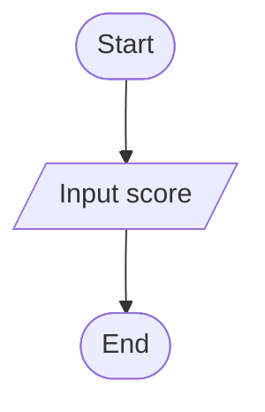

---

## 9. Process Symbol

A process symbol is usually a rectangle.

It is used for:

```text
calculation
assignment
updating a variable
processing data
performing an action
```

### Examples

```text
total ← total + score
average ← total / count
count ← count + 1
discount ← price * 0.10
```

### Mermaid Example

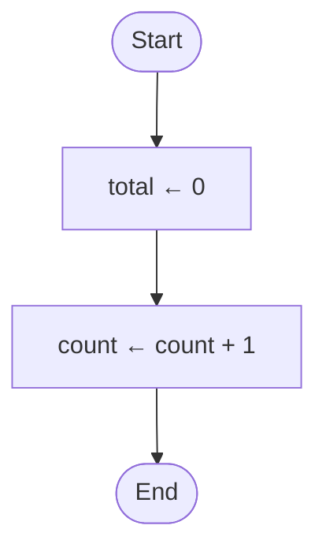

---

## 10. Input/Output Symbol

Input/output is usually shown using a parallelogram.

### Input Examples

```text
Input score
Input username
Input price
Input password
```

### Output Examples

```text
Output average
Output "Pass"
Output finalPrice
Output "Access denied"
```

### Mermaid Example

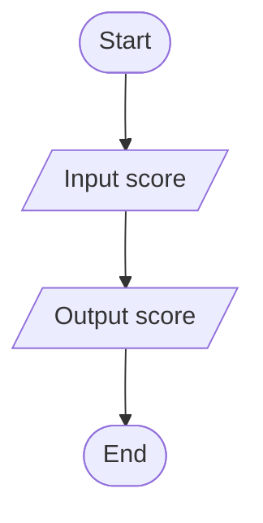

---

## 11. Decision Symbol

A decision is usually shown using a diamond.

It contains a condition.

### Examples

```text
score >= 50?
password = storedPassword?
count < 10?
total > 100?
found = true?
```

### Branches

A decision usually has two branches:

```text
Yes / No
True / False
```

### Mermaid Example


---

## 12. Arrows / Flowlines

Arrows show the direction of control flow.

### Rules

```text
follow arrows from Start
arrows show the next step
decisions should have labelled branches
loops use arrows going back to earlier steps
avoid crossing arrows if possible
```

### Common Mistake

Do not assume the next step based on position only.  
Always follow the arrow.

---

## 13. Sequence in Flowcharts

Sequence means steps happen in order.

### Example: Rectangle Area

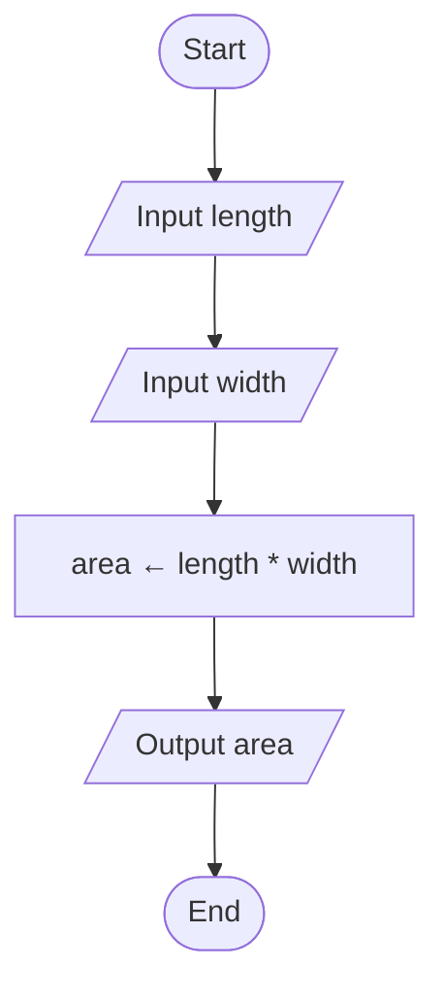

### Explanation

The algorithm:

```text
inputs length
inputs width
calculates area
outputs area
```

This is sequence because each step follows the previous one.

---

## 14. Selection in Flowcharts

Selection means the flowchart chooses a path based on a condition.

### Example: Pass or Fail

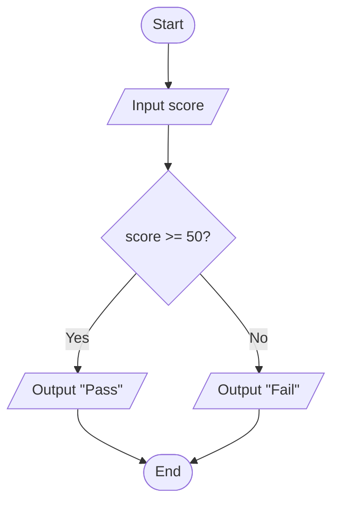

### Pseudocode Equivalent

```text
INPUT score

IF score >= 50 THEN
    OUTPUT "Pass"
ELSE
    OUTPUT "Fail"
ENDIF
```

### Key Idea

The diamond creates different branches.

---

## 15. Iteration in Flowcharts

Iteration means steps are repeated.

### Example: Count from 1 to 5

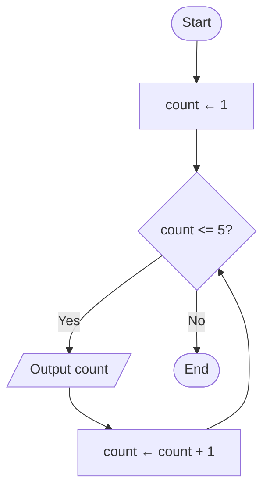

### Pseudocode Equivalent

```text
count ← 1

WHILE count <= 5
    OUTPUT count
    count ← count + 1
ENDWHILE
```

### Key Idea

An arrow goes back to the decision to repeat the loop.

---

## 16. Flowchart for FOR Loop

A FOR loop can be represented using a counter and decision.

### Example: Add 5 Scores


### Key Variables

```text
total = accumulator
count = counter
score = input
```

---

## 17. Flowchart for WHILE Loop

A WHILE loop checks the condition before the loop body.

### Example: Password Until Correct

```mermaid
flowchart TD
    A([Start]) --> B[/Input password/]
    B --> C{password = "secret"?}
    C -- No --> D[/Output "Try again"/]
    D --> B
    C -- Yes --> E[/Output "Access granted"/]
    E --> F([End])
```

### Key Point

If the condition is false, the loop repeats.

---

## 18. Flowchart for REPEAT UNTIL

A REPEAT UNTIL loop runs at least once.

### Example

```mermaid
flowchart TD
    A([Start]) --> B[/Input password/]
    B --> C{password = "secret"?}
    C -- No --> B
    C -- Yes --> D[/Output "Access granted"/]
    D --> E([End])
```

### Difference from WHILE

```text
WHILE checks before loop body
REPEAT UNTIL checks after loop body
```

In a flowchart, this usually means the input/action occurs before the decision.

---

## 19. Nested Decisions

A flowchart may contain decisions inside other decisions.

### Example: Grade Boundary

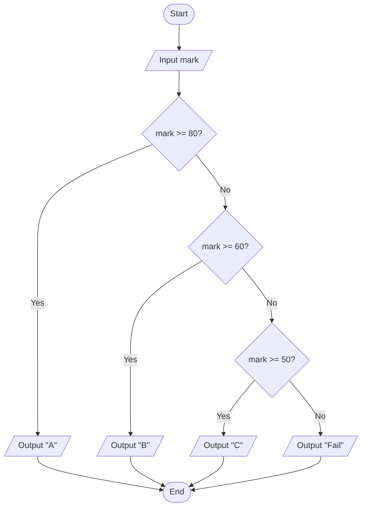

### Key Idea

Each decision should be checked only when the flow reaches it.

---

## 20. Flowchart Reading Method

To read a flowchart:

```text
1. Start at the Start symbol.
2. Follow the arrow to the next symbol.
3. For process symbols, update variables.
4. For input symbols, use the given input value.
5. For output symbols, record the output.
6. For decision symbols, evaluate the condition.
7. Follow the correct branch.
8. Continue until End is reached.
```

### Exam Tip

Do not skip variable updates.  
Most trace-table errors happen because students forget to update variables inside loops.

---

## 21. Converting Algorithm to Flowchart

Use this mapping:

| Algorithm Step | Flowchart Symbol |
|---|---|
| Start | Oval |
| End | Oval |
| INPUT | Parallelogram |
| OUTPUT | Parallelogram |
| assignment/calculation | Rectangle |
| IF condition | Diamond |
| WHILE condition | Diamond with loop arrow |
| FOR loop | counter + decision + update |
| repeated step | arrow back |

### Example

Algorithm:

```text
INPUT score
IF score >= 50 THEN
    OUTPUT "Pass"
ELSE
    OUTPUT "Fail"
ENDIF
```

Flowchart:

```text
Start → Input score → score >= 50? → Yes: Output Pass → End
                                      → No: Output Fail → End
```

---

## 22. Converting Flowchart to Pseudocode

To convert a flowchart to pseudocode:

```text
1. Follow the arrows from Start.
2. Write INPUT/OUTPUT steps.
3. Write process steps as assignments.
4. Write decision branches as IF/ELSE.
5. Write loop arrows as WHILE/FOR/REPEAT.
6. Stop at End.
```

### Example

Flowchart idea:

```text
Start → Input score → score >= 50? → Output Pass/Fail → End
```

Pseudocode:

```text
INPUT score

IF score >= 50 THEN
    OUTPUT "Pass"
ELSE
    OUTPUT "Fail"
ENDIF
```

---

## 23. Worked Example: Rectangle Area

### Problem

Input length and width. Output area.

### Flowchart


### Pseudocode

```text
INPUT length
INPUT width
area ← length * width
OUTPUT area
```

### Structures

```text
sequence
input
process
output
```

---

## 24. Worked Example: Pass or Fail

### Problem

Input a mark. Output Pass if mark is at least 50. Otherwise output Fail.

### Flowchart

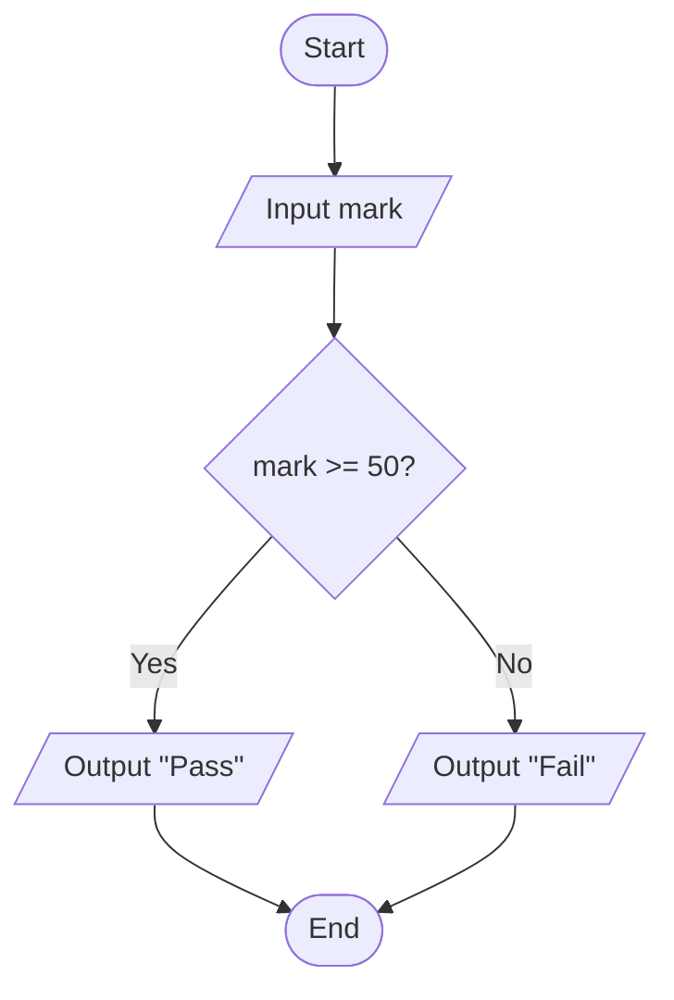

### Pseudocode

```text
INPUT mark

IF mark >= 50 THEN
    OUTPUT "Pass"
ELSE
    OUTPUT "Fail"
ENDIF
```

### Structure

```text
selection
```

---

## 25. Worked Example: Discount Calculator

### Problem

Input total price. If total is over 100, apply 10% discount. Output final price.

### Flowchart

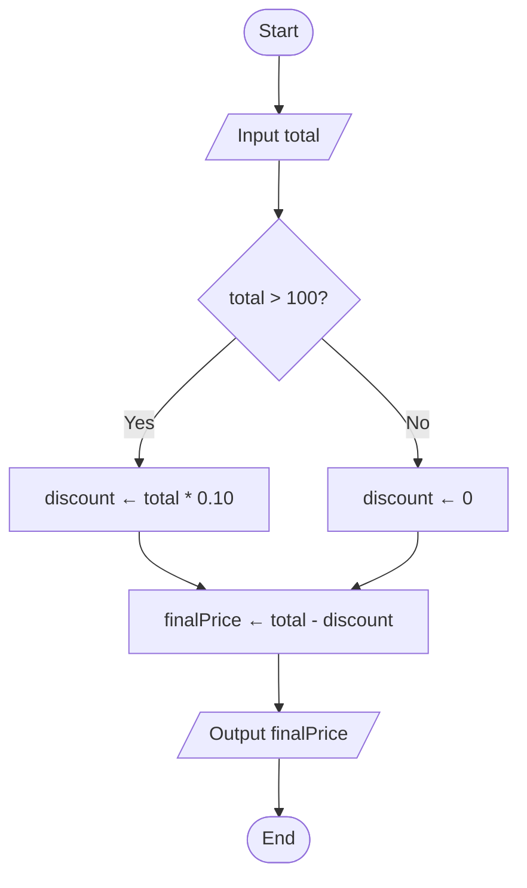

### Pseudocode

```text
INPUT total

IF total > 100 THEN
    discount ← total * 0.10
ELSE
    discount ← 0
ENDIF

finalPrice ← total - discount
OUTPUT finalPrice
```

---

## 26. Worked Example: Add Five Scores

### Problem

Input five scores and output the total.

### Flowchart

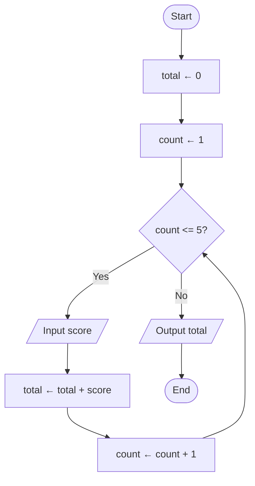

### Pseudocode

```text
total ← 0
count ← 1

WHILE count <= 5
    INPUT score
    total ← total + score
    count ← count + 1
ENDWHILE

OUTPUT total
```

---

## 27. Worked Example: Find Largest Number

### Problem

Input five numbers and output the largest.

### Flowchart

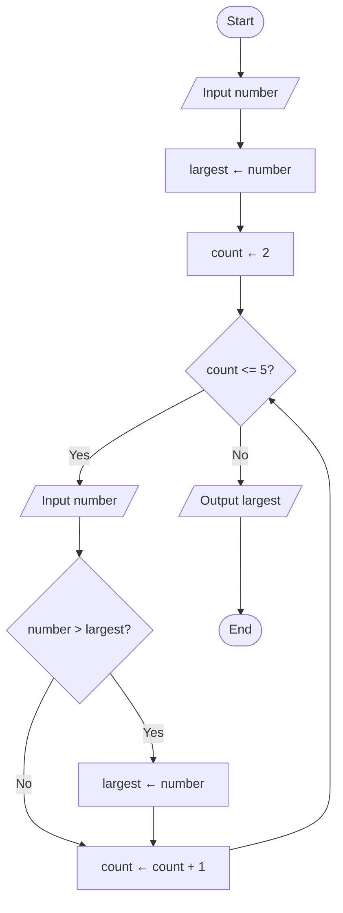

### Key Idea

The first input becomes the starting value of `largest`.

### Common Mistake

Starting `largest` at 0 may fail if all numbers are negative.

---

## 28. Worked Example: Password Attempts

### Problem

Allow up to three password attempts.

### Flowchart

```mermaid
flowchart TD
    A([Start]) --> B[attempts ← 0]
    B --> C[loggedIn ← false]
    C --> D{attempts < 3 AND loggedIn = false?}
    D -- Yes --> E[/Input password/]
    E --> F[attempts ← attempts + 1]
    F --> G{password = "secret"?}
    G -- Yes --> H[loggedIn ← true]
    G -- No --> I[/Output "Incorrect"/]
    H --> D
    I --> D
    D -- No --> J{loggedIn = true?}
    J -- Yes --> K[/Output "Access granted"/]
    J -- No --> L[/Output "Access denied"/]
    K --> M([End])
    L --> M
```

### Variables

```text
attempts = counter
loggedIn = flag
```

---

## 29. Worked Example: Linear Search

### Problem

Search a list for a target.

### Flowchart Idea

```mermaid
flowchart TD
    A([Start]) --> B[found ← false]
    B --> C[index ← 1]
    C --> D{index <= length AND found = false?}
    D -- Yes --> E{list[index] = target?}
    E -- Yes --> F[found ← true]
    E -- No --> G[index ← index + 1]
    F --> G
    G --> D
    D -- No --> H{found = true?}
    H -- Yes --> I[/Output "Found"/]
    H -- No --> J[/Output "Not found"/]
    I --> K([End])
    J --> K
```

### Key Idea

The loop continues while there are still items and the target has not been found.

---

## 30. Common Flowchart Errors

| Error | Why It Is a Problem | Fix |
|---|---|---|
| Missing Start or End | unclear where algorithm begins/ends | add terminator symbols |
| Wrong symbol | meaning becomes unclear | use correct standard symbol |
| Decision not in diamond | condition not clearly shown | use diamond |
| Branches not labelled | unclear which path is true/false | label Yes/No |
| No arrow direction | order cannot be followed | add arrows |
| Loop never updates variable | infinite loop risk | update counter/condition variable |
| Output in wrong place | output repeated or missing | check flow |
| Process before input | variable may not have value | input first |
| Missing join after selection | paths do not reconnect | connect branches properly |
| Too much text in symbol | hard to read | keep short and clear |

---

## 31. Flowchart Exam Strategy

When answering flowchart questions:

```text
1. Identify Start and End.
2. Follow arrows exactly.
3. Label each decision branch.
4. Track variables carefully.
5. Watch for loops.
6. Check where outputs happen.
7. Use given inputs in order.
8. Do not assume all branches run.
9. Stop when End is reached.
```

### For Drawing Questions

Make sure to include:

```text
correct symbols
clear arrows
labelled decision branches
correct loop back arrow
clear output
clear End
```

---

## 32. Scenario Answer Bank

### If Asked: “Define flowchart”

```text
A flowchart is a graphical representation of an algorithm that uses standard symbols and arrows to show the order of steps and decisions.
```

### If Asked: “Why are flowcharts useful?”

```text
Flowcharts are useful because they visually show the logic of an algorithm, including sequence, decisions, and loops, making the algorithm easier to understand and check.
```

### If Asked: “What does a diamond show?”

```text
A diamond represents a decision or condition, usually with Yes/No or True/False branches.
```

### If Asked: “How does a flowchart show iteration?”

```text
Iteration is shown by an arrow that returns to an earlier decision or step, causing part of the flowchart to repeat while a condition is true.
```

### If Asked: “Convert to pseudocode”

Use this pattern:

```text
Start/End are not usually written as code.
Input/output symbols become INPUT/OUTPUT.
Process symbols become assignments or actions.
Decision diamonds become IF/ELSE or loop conditions.
```

---

## 33. Common Misconceptions

| Mistake | Why it is wrong | Better understanding |
|---|---|---|
| Flowchart is code | It is a diagram of an algorithm | visual representation |
| Arrows are optional | arrows show order | always include flowlines |
| Diamond is for calculation | diamond is for decision | rectangle is process |
| Rectangle is for input | parallelogram is input/output | use correct symbol |
| All branches run | only one branch after decision runs | follow condition |
| Loop arrows are mistakes | arrows can go back for iteration | loop repeats |
| Position decides order | arrows decide order | follow arrows |
| Output happens automatically at end | output happens only at output symbol | track output |
| Decision does not need labels | branch direction may be unclear | label Yes/No |
| Flowchart can have no End | algorithm should finish | include End |

---

## 34. Guided Practice

### Practice 1: Symbol

What symbol is used for a decision?

<details>
<summary>Suggested Answer</summary>

A diamond.

</details>

---

### Practice 2: Symbol

What symbol is used for input or output?

<details>
<summary>Suggested Answer</summary>

A parallelogram.

</details>

---

### Practice 3: Selection

A flowchart checks `score >= 50?` and outputs Pass or Fail. What structure is used?

<details>
<summary>Suggested Answer</summary>

Selection, because the flowchart chooses between two branches based on a condition.

</details>

---

### Practice 4: Iteration

A flowchart arrow goes back to an earlier decision after increasing `count`. What structure is this?

<details>
<summary>Suggested Answer</summary>

Iteration, because part of the algorithm repeats.

</details>

---

### Practice 5: Common Error

A loop checks `count <= 10` but never changes `count`. What may happen?

<details>
<summary>Suggested Answer</summary>

The loop may never end because the condition may remain true forever.

</details>

---

## 35. Independent Practice

### Question 1

Define flowchart.

### Question 2

List five common flowchart symbols and their meanings.

### Question 3

Explain how flowcharts show sequence, selection, and iteration.

### Question 4

Draw or describe a flowchart for inputting a score and outputting Pass or Fail.

### Question 5

Draw or describe a flowchart for inputting two numbers and outputting the larger number.

### Question 6

Draw or describe a flowchart for inputting five scores and outputting the total.

### Question 7

Convert this pseudocode into a flowchart description:

```text
INPUT age
IF age >= 18 THEN
    OUTPUT "Adult"
ELSE
    OUTPUT "Child"
ENDIF
```

### Question 8

Convert a simple pass/fail flowchart into pseudocode.

### Question 9

Explain two common mistakes when drawing flowcharts.

### Question 10

Explain why flowcharts help debug algorithms.

---

## 36. Exam-style Questions

### Question 1 [4 marks]

Define flowchart and explain one benefit of using one.

<details>
<summary>Mark Scheme Style Answer</summary>

A flowchart is a graphical representation of an algorithm using standard symbols and arrows to show the order of steps and decisions. One benefit is that it visually shows the logic of the algorithm, making it easier to understand, communicate, and check for errors.

</details>

---

### Question 2 [5 marks]

State the purpose of the following flowchart symbols: oval, rectangle, parallelogram, diamond, arrow.

<details>
<summary>Mark Scheme Style Answer</summary>

An oval is used for Start or End. A rectangle is used for a process or calculation. A parallelogram is used for input or output. A diamond is used for a decision or condition. An arrow shows the direction of control flow.

</details>

---

### Question 3 [6 marks]

Describe a flowchart that inputs a mark and outputs `Pass` if the mark is at least 50, otherwise outputs `Fail`.

<details>
<summary>Mark Scheme Style Answer</summary>

The flowchart starts with a Start symbol, then an input/output symbol to input the mark. It then uses a decision diamond with the condition `mark >= 50?`. The Yes branch goes to an output symbol displaying `Pass`. The No branch goes to an output symbol displaying `Fail`. Both branches then connect to the End symbol.

</details>

---

### Question 4 [6 marks]

Explain how a loop is represented in a flowchart and give an example.

<details>
<summary>Mark Scheme Style Answer</summary>

A loop is represented by a decision symbol and an arrow that returns to an earlier step if the loop should continue. For example, a flowchart that outputs numbers from 1 to 5 may initialize `count` to 1, check `count <= 5?`, output `count`, increase `count`, and then use an arrow back to the decision. When the condition is false, the flow continues to End.

</details>

---

### Question 5 [6 marks]

A flowchart has a decision symbol but the branches are not labelled. Explain why this is a problem and how to fix it.

<details>
<summary>Mark Scheme Style Answer</summary>

This is a problem because it is unclear which branch should be followed when the condition is true or false. The reader may choose the wrong path, causing misunderstanding of the algorithm. The branches should be labelled clearly, usually as Yes/No or True/False.

</details>

---

## 37. Practice task
### Activity 1: Symbol Match

Match symbols to meanings:

```text
oval
rectangle
parallelogram
diamond
arrow
connector
```

Meanings:

```text
start/end
process
input/output
decision
flow direction
connect parts
```

---

### Activity 2: Algorithm to Flowchart

Convert these algorithms into flowchart descriptions:

```text
rectangle area
pass/fail
discount calculator
count from 1 to 5
add five scores
```

---

### Activity 3: Flowchart Debugging

Check faulty flowcharts with:

```text
missing End
unlabelled decision branches
loop without counter update
wrong symbol
output in wrong place
arrow pointing the wrong way
```

Identify and fix the issue.

---

## 38. Independent practice
### Independent practice part A: Concept Explanation

In 6-8 sentences, explain what a flowchart is and how it can show sequence, selection, and iteration.

---

### Independent practice part B: Flowchart Design

Draw or describe flowcharts for:

```text
1. input two numbers and output their sum
2. input a score and output Pass/Fail
3. input 5 prices and output total
4. input password until it is correct
```

---

### Independent practice part C: Conversion

Convert this pseudocode into a flowchart description:

```text
INPUT total

IF total > 100 THEN
    discount ← total * 0.10
ELSE
    discount ← 0
ENDIF

finalPrice ← total - discount
OUTPUT finalPrice
```

---

### Independent practice part D: Misconception Correction

Correct these statements:

```text
A flowchart does not need arrows.
A diamond is used for calculation.
All branches after a decision are followed.
A loop arrow means the flowchart is wrong.
A flowchart does not need an End symbol.
```

---

## 39. One-page Revision Summary

| Point | Summary |
|---|---|
| Flowchart | Graphical representation of an algorithm |
| Oval | Start / End |
| Rectangle | Process / calculation / assignment |
| Parallelogram | Input / Output |
| Diamond | Decision / condition |
| Arrow | Direction of control flow |
| Connector | Joins separated parts |
| Sequence | Steps happen in order |
| Selection | Decision creates branches |
| Iteration | Arrow returns to repeat steps |
| Condition | True/false expression inside decision |
| Yes/No labels | Show which branch to follow |
| Loop body | Steps repeated in a loop |
| Common error | missing arrows, wrong symbols, unlabelled branches |
| Exam phrase | A flowchart uses standard symbols and arrows to visually show the steps, decisions, and loops in an algorithm |

---

## 40. Quick Self-test

Before moving on, students should be able to answer these:

1. What is a flowchart?
2. What symbol is used for Start/End?
3. What symbol is used for a process?
4. What symbol is used for input/output?
5. What symbol is used for a decision?
6. What do arrows show?
7. How does a flowchart show selection?
8. How does a flowchart show iteration?
9. Why should decision branches be labelled?
10. What is one common flowchart error?

