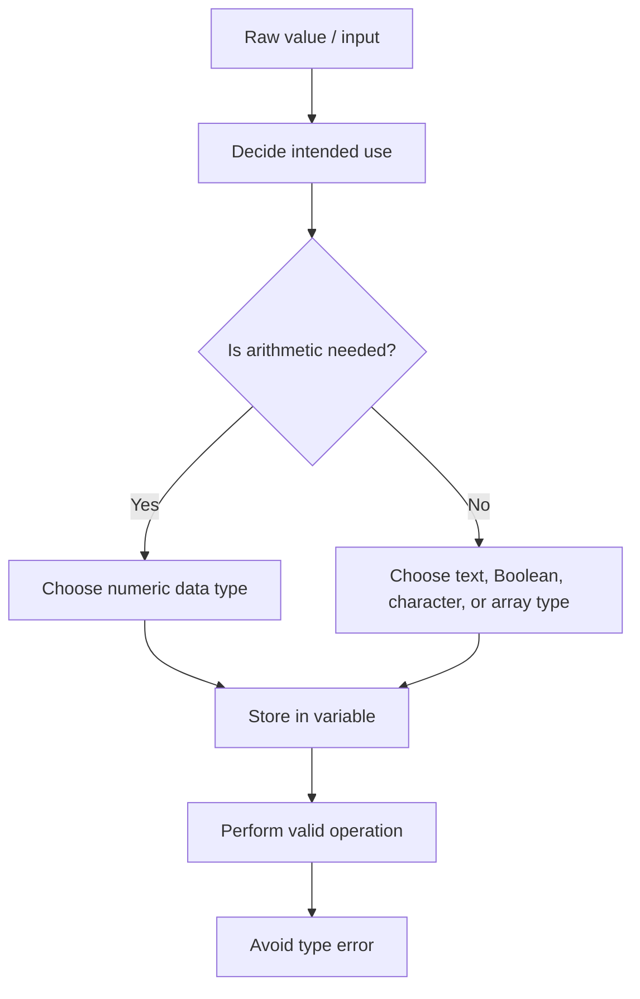

# Data Types

## Start here

A **data type** tells a program what kind of **value** a **variable** can store and what operations are valid for that value. In simple terms, it helps the program decide whether a value should be treated as a number, text, true/false flag, single symbol, or collection.

本页重点是：看到一个场景中的数据时，能选择合适的 **data type**，并解释为什么这个选择能避免 **type error**。

Core keywords for this page:

```text
data type, integer, real, Boolean, character, string, array, value, variable, type error
```

::: tip Core idea
A value that looks like a number is not always numeric data. Use a numeric type when arithmetic is needed. Use a string when formatting, leading zeros, or identifier meaning must be preserved.
:::

---

## Core checklist

By the end of this page, you should be able to:

- define **data type**
- distinguish **integer**, **real/float**, **Boolean**, **character**, and **string**
- choose suitable data types for fields in a school, hospital, or shop scenario
- explain why choosing the correct data type matters
- identify **type errors** in simple code
- distinguish numeric data from text data
- explain why some number-like values, such as phone numbers, postcodes, and IDs, should be stored as strings

---

## Common data types at SL

| Data type | What it stores | Example value | Suitable scenario | Common operation | Common mistake |
|---|---|---|---|---|---|
| `INTEGER` / `int` | Whole numbers without decimal places | `16`, `0`, `125` | Number of students in a class | Counting, adding, comparing | Using it for a decimal price or average |
| `REAL` / `double` / `float` | Numbers that may contain decimal places | `12.50`, `78.5` | Shop price or average exam mark | Decimal arithmetic | Using it when a whole-number count is enough |
| `BOOLEAN` / `boolean` | One of two values: `true` or `false` | `true` | Whether a patient record is valid | Conditions and flags | Storing `"true"` as text instead of `true` |
| `CHARACTER` / `char` | One symbol or letter | `'A'`, `'Y'` | One-letter grade | Comparing a single symbol | Confusing `'A'` with `"A"` |
| `STRING` / `String` | A sequence of characters | `"Alice"`, `"001245"` | Student name or ID number | Joining, searching, comparing text | Using it for values that need arithmetic |
| `ARRAY` | A collection of values, usually of the same type | `[75, 82, 91]` | A list of exam marks | Accessing items by position | Treating the whole array as one simple value |

For arrays, this page only uses the basic idea that an array stores a collection. See [Arrays](./arrays) for indexing, traversal, and array algorithms.

---

## Key data type cards

| Type | Simple Chinese explanation | English mark-scheme style phrase | Valid examples | Invalid or confusing examples | Scenario use |
|---|---|---|---|---|---|
| Integer | 整数；没有小数部分，适合数量和计数。 | An integer stores whole numbers without decimal places. | `0`, `16`, `250` | `12.5`, `"16"`, phone number `0123456789` | School: store `numberOfStudents = 24` because it is a count. |
| Real / float | 实数/小数；适合可能有小数的测量值、价格、平均分。 | A real/float stores numbers that may contain decimal places. | `49.99`, `36.6`, `82.5` | `"49.99"`, `true`, using `int` for `82.5` | Hospital: store `temperature = 37.4` because it may have a decimal. |
| Boolean | 布尔值；只能表示 `true` 或 `false`。 | A Boolean stores one of two values, true or false. | `true`, `false`, `mark >= 50` | `"true"`, `"false"`, `"yes"` | Shop: store `hasPaid = true` after payment succeeds. |
| Character | 字符；只存一个字母、数字符号或标点。 | A character stores a single symbol or letter. | `'A'`, `'Y'`, `'7'` | `"A"`, `'AB'`, `65` if it means a grade | School: store `grade = 'A'` for a one-letter grade. |
| String | 字符串；一串字符，可以是名字、消息、编号或代码。 | A string stores a sequence of characters. | `"Alice Chen"`, `"001245"`, `"A12B"` | using `"82"` when arithmetic is needed, using `int` for `"001245"` | School: store `studentID = "001245"` to preserve leading zeros. |
| Array | 数组；一组相关值的集合，例如多个分数。 | An array stores a collection of values that can be accessed by position. | `[80, 75, 91]`, `["Ana", "Ben"]` | one mark stored as an array, mixed meanings in one array | School: store all quiz marks for one student in an array. |

---

## Choosing the right data type

When choosing a data type, ask two questions:

1. What kind of value is stored?
2. What will the program do with it?

| Scenario field | Suitable data type | Why this type fits |
|---|---|---|
| Age | `INTEGER` / `int` | Age is usually stored as a whole-number count of years. |
| Price | `REAL` / `double` | A price may include cents, so decimal values must be allowed. |
| Student name | `STRING` / `String` | A name is text and may contain several characters or spaces. |
| Exam score | `INTEGER` or `REAL` | Use integer for whole-number marks; use real if averages or decimals are possible. |
| Pass/fail flag | `BOOLEAN` / `boolean` | The value is one of two states, such as passed or not passed. |
| Phone number | `STRING` / `String` | It is an identifier/contact detail, not a value for arithmetic; formatting and leading zeros may matter. |
| Student ID | `STRING` / `String` | IDs may contain leading zeros, letters, or fixed formatting. |
| One-letter grade | `CHARACTER` / `char` | A single grade such as `A` can be stored as one character. |
| Appointment date/time | `STRING` at SL pseudocode level, or a date/time type in real systems | At SL level, it can be stored as formatted text; in real programs, a date/time type supports ordering and validation. |

::: warning Exam habit
Do not only write "integer is number" or "string is words". Link the type to valid values, operations, and the scenario.
:::

---

## Numeric data vs text data

A value that **looks like a number** is not always numeric data.

| Value | Better type | Reason |
|---|---|---|
| `82` as an exam mark | `INTEGER` / `int` | The program may compare it, add it, or calculate an average. |
| `49.99` as a price | `REAL` / `double` | The program may calculate totals or discounts. |
| `"0123456789"` as a phone number | `STRING` / `String` | It should not be added or averaged, and the leading zero must remain. |
| `"001245"` as a student ID | `STRING` / `String` | It identifies a person; losing zeros changes the ID. |
| `"SW1A 1AA"` as a postcode | `STRING` / `String` | It may contain letters, spaces, and leading characters. |

Use numeric types when arithmetic is needed. Use string types when preserving formatting matters.

Mark-scheme phrase: **A value should be stored as a string when arithmetic is not needed and formatting must be preserved.**

---

## Boolean values and flags

A **Boolean** stores exactly one of two values:

```text
true
false
```

Booleans are useful for flags and conditions:

| Boolean variable | Meaning |
|---|---|
| `isLoggedIn` | whether the user has logged in |
| `hasPaid` | whether payment has been completed |
| `found` | whether a search has found the target |
| `isValid` | whether input passes validation |

Common mistake:

```java
boolean isValid = "true"; // wrong: this is text
boolean isValid = true;   // correct: this is Boolean
```

---

## Type conversion and casting

Input often arrives as text. If the program needs arithmetic, the text may need to be converted before calculation.

Example idea:

```text
"16" as input text -> convert to integer 16 -> add or compare
```

If conversion is invalid, the program may produce an error:

```text
"sixteen" cannot be converted safely into the integer 16
```

At SL level, remember the purpose: convert only when the intended use requires it, such as calculating with a number entered by the user.

---

## Data type choice workflow



---

## Exam focus

Command terms you may see:

| Command term | What to write |
|---|---|
| State | Give the data type name only. |
| Identify | Pick the correct type from a scenario or code fragment. |
| Outline | Give the type and one brief reason. |
| Describe | Explain what the type stores and how it is used. |
| Explain | Link the type choice to valid values, valid operations, and avoiding errors. |
| Choose / select | Select a type and justify it using the scenario. |

How much detail is usually needed:

| Marks | What a strong answer includes |
|---:|---|
| 1 mark | Correct type name, such as `INTEGER` or `STRING`. |
| 2 marks | Type name plus a short reason linked to the value. |
| 3 marks | Type name, valid example, and why another type would be weaker. |
| 4 marks | Several fields matched to suitable types with clear reasons. |
| 6 marks | Scenario-based explanation covering type choice, operations, possible type errors, and formatting issues. |

Avoid vague answers such as:

- "integer is number"
- "string is words"
- "Boolean is yes/no"

Better answers mention whole numbers, decimal places, true/false values, sequences of characters, arithmetic, formatting, or scenario use.

---

## Common exam mistakes

| Mistake | Why it loses marks | Better answer habit |
|---|---|---|
| Storing phone numbers as integers | Leading zeros and formatting may be lost; arithmetic is not needed. | Use `STRING` and explain it is contact information. |
| Confusing character and string | `'A'` and `"A"` are different in Java. | Use `CHARACTER` for one symbol; use `STRING` for text. |
| Using real when integer is enough | It suggests decimals are needed when the value is only a count. | Use `INTEGER` for counts such as number of students. |
| Using string for values that need arithmetic | Text cannot be directly added, averaged, or compared numerically. | Use numeric types for marks, totals, prices, and measurements. |
| Confusing Boolean `true`/`false` with text `"true"`/`"false"` | Text strings are not Boolean values. | Use unquoted `true` or `false` for Boolean flags. |
| Forgetting decimals require real/float | Integer types cannot store decimal parts accurately. | Use `REAL`, `double`, or `float` for decimal values. |
| Ignoring leading zeros in IDs or postcodes | Numeric storage may remove important formatting. | Use `STRING` for identifiers and codes. |
| Choosing a data type without explaining the scenario | The answer may be too generic for exam marks. | Say what the value represents and what operations are needed. |

---

## Reusable mark-scheme style phrases

- **A data type defines the kind of value a variable can store and the operations that can be performed on it.**
- **An integer stores whole numbers without decimal places.**
- **A real/float stores numbers that may contain decimal places.**
- **A Boolean stores one of two values, true or false.**
- **A character stores a single symbol or letter.**
- **A string stores a sequence of characters.**
- **A value should be stored as a string when arithmetic is not needed and formatting must be preserved.**
- **Choosing the correct data type helps prevent type errors and makes the purpose of the variable clear.**
- **A type error can occur when a value is used in an operation that is not valid for its data type.**

---

## Quick-check questions

1. What does a data type define?
2. Which type is suitable for a whole-number count?
3. Which type is suitable for a decimal average?
4. Which type stores `true` or `false`?
5. Why is `"true"` not the same as `true` in Java?
6. Why might a phone number be stored as a string?
7. What is the difference between a character and a string?
8. Why is `12.5` not suitable for an integer variable?
9. When might input text need conversion?
10. What is a type error?

<details>
<summary>Short answers</summary>

1. It defines the kind of value a variable can store and the operations that are valid.
2. `INTEGER` / `int`.
3. `REAL` / `double` / `float`.
4. `BOOLEAN` / `boolean`.
5. `"true"` is a string; `true` is a Boolean value.
6. It may have leading zeros or formatting, and arithmetic is not needed.
7. A character stores one symbol; a string stores a sequence of characters.
8. It contains a decimal part, so a real/float type is needed.
9. When the program must calculate with a value entered as text.
10. An error caused by using a value with an unsuitable data type or invalid operation.

</details>

---

## Exam-style practice: data type choice

### Question A [6 marks]

A school system stores these fields:

| Field | Example |
|---|---|
| student name | `"Maya Singh"` |
| student ID | `"007518"` |
| age | `16` |
| average score | `83.5` |
| passed course | `true` |
| grade letter | `'B'` |

Choose a suitable data type for each field.

<details>
<summary>Mark scheme</summary>

- student name: `STRING` / `String`, because it is text and may contain spaces
- student ID: `STRING` / `String`, because it is an identifier and leading zeros must be preserved
- age: `INTEGER` / `int`, because it is a whole-number count of years
- average score: `REAL` / `double`, because it may contain a decimal
- passed course: `BOOLEAN` / `boolean`, because it is true or false
- grade letter: `CHARACTER` / `char`, because it is one letter

</details>

### Question B [4 marks]

Explain why a phone number or student ID should often be stored as a `String` rather than an `INTEGER`.

<details>
<summary>Mark scheme</summary>

A phone number or student ID is used as an identifier, not as a number for arithmetic. Storing it as an integer may remove leading zeros or change formatting. A string preserves the exact sequence of characters. This is useful when the value may contain spaces, symbols, or letters.

</details>

### Question C [5 marks]

Read the code:

```java
String markText = "82";
int bonus = 5;
int finalMark = markText + bonus;
```

Identify the problem and explain how it could be fixed.

<details>
<summary>Mark scheme</summary>

`markText` is a `String`, so it is text, not numeric data. The program is trying to perform arithmetic using text, which can cause a type error or incorrect behaviour depending on the language. The input should be converted to an integer before arithmetic, for example by converting `"82"` to `82`. Then `finalMark` can store `82 + 5`.

</details>

---

## 1. Lesson Goals

By the end of this lesson, students should be able to:

- explain what a data type is
- choose suitable data types for different values
- distinguish `int`, `double`, `boolean`, `char`, and `String` in Java
- compare Java data types with IB pseudocode data types
- explain why choosing the correct data type matters
- identify common errors caused by wrong data types
- explain integer division and decimal division
- use casting when a decimal result is needed
- trace simple expressions involving different data types
- answer exam-style questions about data types and type errors

---

## 2. Syllabus Mapping

| Item | Detail |
|---|---|
| Unit | B2 Programming |
| Label | SL Core |
| Main skill | Choosing and using suitable data types |
| Connected topics | Variables, input/output, selection, loops, arrays, testing |
| Programming language focus | IB pseudocode + Java |
| Exam relevance | Variable declaration, data type selection, expression tracing, debugging |

::: tip Learning Focus
A variable is not only a name. It also has a data type. The data type controls what kind of value can be stored and what operations can be performed.
:::

---

## 3. Key Terms

| English Term | 中文解释 | Exam-style meaning |
|---|---|---|
| Data type | 数据类型 | The kind of data a variable can store |
| Integer | 整数 | A whole number without a decimal part |
| Real / Double | 实数 / 小数 | A number that may contain a decimal part |
| Boolean | 布尔值 | A value that is either true or false |
| Character | 字符 | A single character, such as `'A'` |
| String | 字符串 | A sequence of characters, such as `"Alice"` |
| Declaration | 声明 | Creating a variable with a data type |
| Assignment | 赋值 | Storing a value in a variable |
| Casting | 类型转换 | Converting a value from one data type to another |
| Integer division | 整数除法 | Division where the decimal part is removed |
| Type mismatch | 类型不匹配 | Trying to store or use a value with an unsuitable data type |

---

## 4. Concept Explanation

<LangBlock>
<template #cn>

### 中文讲解

**Data type（数据类型）** 表示变量可以存储什么类型的数据。

例如：

```java
int age = 16;
double price = 12.5;
boolean passed = true;
char grade = 'A';
String name = "Alice";
```

每个变量都有一个合适的数据类型：

| Value | Suitable Type |
|---|---|
| `16` | `int` |
| `12.5` | `double` |
| `true` | `boolean` |
| `'A'` | `char` |
| `"Alice"` | `String` |

选择正确的数据类型很重要。  
如果用错类型，程序可能：

- 不能编译
- 运行时报错
- 计算结果不准确
- 代码含义不清楚

例如，学生年龄通常用 `int`，因为年龄通常是整数。  
商品价格通常用 `double`，因为价格可能有小数。  
是否通过考试可以用 `boolean`，因为只有 true 或 false。

</template>

<template #en>

### English Explanation

A **data type** describes what kind of data a variable can store.

For example:

```java
int age = 16;
double price = 12.5;
boolean passed = true;
char grade = 'A';
String name = "Alice";
```

Each variable has a suitable data type:

| Value | Suitable Type |
|---|---|
| `16` | `int` |
| `12.5` | `double` |
| `true` | `boolean` |
| `'A'` | `char` |
| `"Alice"` | `String` |

Choosing the correct data type is important.  
If the wrong type is used, the program may:

- fail to compile
- crash at runtime
- calculate an inaccurate result
- become unclear to read

For example, student age is usually stored as an `int` because age is usually a whole number.  
Product price is usually stored as a `double` because prices may have decimals.  
Whether a student passed can be stored as a `boolean` because it is either true or false.

</template>
</LangBlock>

---

## 5. Real-life Example

### Example: Student Record

A program stores information about a student.

| Data | Example Value | Suitable Java Type | Reason |
|---|---|---|---|
| Student name | `"Alice Chen"` | `String` | Text with multiple characters |
| Age | `16` | `int` | Whole number |
| Average mark | `82.5` | `double` | May contain decimal |
| Passed? | `true` | `boolean` | True or false |
| Grade letter | `'A'` | `char` | Single character |

::: info Scenario Link
Choosing suitable data types makes the program more reliable and easier to understand.
:::

---

## 6. IB Pseudocode Data Types vs Java Data Types

| Concept | IB Pseudocode | Java |
|---|---|---|
| Whole number | `INTEGER` | `int` |
| Decimal number | `REAL` | `double` |
| True/false | `BOOLEAN` | `boolean` |
| Single character | `CHARACTER` | `char` |
| Text | `STRING` | `String` |

### Example in IB Pseudocode

```text
DECLARE age : INTEGER
DECLARE price : REAL
DECLARE passed : BOOLEAN
DECLARE grade : CHARACTER
DECLARE name : STRING
```

### Example in Java

```java
int age = 16;
double price = 12.5;
boolean passed = true;
char grade = 'A';
String name = "Alice";
```

---

## 7. Integer: `int`

## 7.1 What is `int`?

`int` stores whole numbers.

Examples:

```java
int age = 16;
int numberOfStudents = 24;
int score = 90;
```

### Suitable for

| Data | Why |
|---|---|
| Age | Whole number |
| Number of students | Count |
| Score out of 100 | Usually whole number |
| Array index | Whole number position |

### Not suitable for

```java
int price = 12.5; // wrong
```

`12.5` has a decimal part, so `double` is better.

---

## 8. Real Number: `double`

## 8.1 What is `double`?

`double` stores numbers that may have decimals.

Examples:

```java
double price = 12.5;
double average = 76.75;
double height = 1.82;
```

### Suitable for

| Data | Why |
|---|---|
| Price | May include cents |
| Average mark | May be decimal |
| Height | Often decimal |
| Measurement | May need precision |

### Example

```java
int total = 155;
double average = total / 2.0;
```

Output value:

```text
77.5
```

---

## 9. Boolean: `boolean`

## 9.1 What is `boolean`?

`boolean` stores either:

```text
true
false
```

Examples:

```java
boolean found = false;
boolean passed = true;
boolean loggedIn = false;
```

### Suitable for

| Data | Example |
|---|---|
| Whether target is found | `found = true` |
| Whether student passed | `passed = mark >= 50` |
| Whether login is successful | `loggedIn = true` |
| Whether input is valid | `valid = age >= 0` |

### Example with Selection

```java
boolean found = true;

if (found) {
    System.out.println("Target found");
}
```

You do not need to write:

```java
if (found == true)
```

This works, but it is longer than needed.

---

## 10. Character: `char`

## 10.1 What is `char`?

`char` stores a single character.

Examples:

```java
char grade = 'A';
char initial = 'J';
char answer = 'Y';
```

### Important Syntax

Use single quotes for `char`:

```java
char grade = 'A';
```

Do not use double quotes for `char`:

```java
char grade = "A"; // wrong
```

Double quotes create a `String`.

---

## 11. String: `String`

## 11.1 What is `String`?

`String` stores text.

Examples:

```java
String name = "Alice";
String fullName = "Alice Chen";
String password = "abc123";
```

### Important Syntax

Use double quotes for `String`:

```java
String name = "Alice";
```

### String with Spaces

```java
String fullName = "Alice Chen";
```

### String Comparison

Use `.equals()`:

```java
if (name.equals("Alice")) {
    System.out.println("Found");
}
```

Do not use `==` for text comparison when learning Java:

```java
if (name == "Alice") {  // avoid
}
```

---

## 12. `char` vs `String`

| Feature | `char` | `String` |
|---|---|---|
| Meaning | Single character | Text / sequence of characters |
| Quotes | Single quotes | Double quotes |
| Example | `'A'` | `"Alice"` |
| Java type | primitive type | class/reference type |
| Used for | grade letter, initial | names, messages, passwords |

### Examples

```java
char grade = 'A';
String name = "Alice";
String gradeText = "A";
```

`'A'` and `"A"` look similar, but they are different data types.

---

## 13. Type Mismatch

A type mismatch happens when a value does not match the variable's data type.

### Examples

```java
int age = "sixteen";      // wrong
double price = "12.5";    // wrong
boolean passed = "true";  // wrong
char grade = "A";         // wrong
String name = 'A';        // wrong
```

Correct versions:

```java
int age = 16;
double price = 12.5;
boolean passed = true;
char grade = 'A';
String name = "Alice";
```

::: warning Common Mistake
Text values need quotes. Numeric values usually do not.
:::

---

## 14. Integer Division

## 14.1 The Problem

In Java:

```java
int result = 5 / 2;
System.out.println(result);
```

Output:

```text
2
```

Why not `2.5`?

Because both `5` and `2` are integers, so Java performs integer division and removes the decimal part.

---

## 14.2 Decimal Division

To get a decimal result, at least one side should be `double`.

```java
double result = 5 / 2.0;
System.out.println(result);
```

Output:

```text
2.5
```

Other valid version:

```java
double result = (double) 5 / 2;
```

---

## 15. Casting

## 15.1 What is Casting?

**Casting** converts a value from one data type to another.

Example:

```java
int total = 155;
int count = 2;

double average = (double) total / count;
```

Without `(double)`:

```java
double average = total / count;
```

Java first performs integer division:

```text
155 / 2 = 77
```

Then stores `77.0`.

With `(double)`:

```text
155.0 / 2 = 77.5
```

---

## 16. Worked Example 1: Average Mark

### Problem

Calculate the average of two integer marks.

### Wrong Version

```java
int mark1 = 80;
int mark2 = 75;

double average = (mark1 + mark2) / 2;

System.out.println(average);
```

Output:

```text
77.0
```

### Why?

`(mark1 + mark2)` is integer 155.  
`155 / 2` uses integer division, giving 77.

### Correct Version

```java
int mark1 = 80;
int mark2 = 75;

double average = (mark1 + mark2) / 2.0;

System.out.println(average);
```

Output:

```text
77.5
```

---

## 17. Worked Example 2: Choosing Data Types

### Scenario

A program stores product information.

| Data | Example | Best Type | Reason |
|---|---|---|---|
| Product name | `"Keyboard"` | `String` | Text |
| Quantity | `25` | `int` | Whole number count |
| Price | `49.99` | `double` | Decimal money value |
| In stock? | `true` | `boolean` | True or false |
| Category code | `'A'` | `char` | Single letter code |

### Java Code

```java
String productName = "Keyboard";
int quantity = 25;
double price = 49.99;
boolean inStock = true;
char categoryCode = 'A';
```

---

## 18. Worked Example 3: Boolean from a Condition

A Boolean value can store the result of a condition.

```java
int mark = 72;
boolean passed = mark >= 50;

System.out.println(passed);
```

Trace:

| mark | Condition `mark >= 50` | passed |
|---:|---|---|
| 72 | true | true |

Output:

```text
true
```

This is useful because later code can use:

```java
if (passed) {
    System.out.println("Well done");
}
```

---

## 19. Worked Example 4: Input and Data Types

```java
import java.util.Scanner;

public class StudentInput {
    public static void main(String[] args) {
        Scanner input = new Scanner(System.in);

        System.out.print("Enter name: ");
        String name = input.nextLine();

        System.out.print("Enter age: ");
        int age = input.nextInt();

        System.out.print("Enter average mark: ");
        double average = input.nextDouble();

        boolean passed = average >= 50;

        System.out.println(name + " is " + age + " years old.");
        System.out.println("Average: " + average);
        System.out.println("Passed: " + passed);

        input.close();
    }
}
```

### Variable Table

| Variable | Type | Reason |
|---|---|---|
| `name` | `String` | Full name can contain spaces |
| `age` | `int` | Whole number |
| `average` | `double` | May contain decimal |
| `passed` | `boolean` | True or false |

---

## 20. Choosing Suitable Data Types

| Data | Suitable Type | Reason |
|---|---|---|
| Number of books | `int` | Count is whole number |
| Temperature | `double` | May contain decimal |
| Student name | `String` | Text |
| First initial | `char` | Single character |
| Login successful? | `boolean` | True/false |
| Grade letter | `char` or `String` | Single letter or grade text |
| Phone number | `String` | May start with 0 and should not be calculated |
| Postcode | `String` | May contain leading zeros or letters |
| Student ID | `String` or `int` | Use `String` if leading zeros matter |
| Price | `double` | Decimal value |

::: warning Important
Not every number-like value should be an `int`. Phone numbers, postcodes, and IDs are often better as `String` because they are identifiers, not values for calculation.
:::

---

## 21. Common Mistakes

| Mistake | Why it is a problem | Better habit |
|---|---|---|
| Storing decimal in `int` | Decimal part cannot be stored | Use `double` |
| Using `String` for calculation | Text cannot be directly added mathematically | Use numeric type for calculations |
| Using `int` for phone number | Leading zero may be lost | Use `String` |
| Using `==` for String comparison | May not compare text correctly | Use `.equals()` |
| Confusing `char` and `String` | Different quotes and types | `char` uses `'A'`, String uses `"A"` |
| Forgetting Boolean values are lowercase | `True` is wrong in Java | Use `true` and `false` |
| Integer division mistake | Decimal result lost | Use `2.0` or casting |
| Choosing vague data type | Code becomes unclear or incorrect | Match data type to purpose |
| Assigning wrong type | Causes type mismatch error | Check value and variable type |
| Assuming all numbers are for calculation | Some are identifiers | Use `String` for IDs/phone/postcodes |

---

## 22. Guided Practice

### Practice 1: Choose the Data Type

Choose the best Java data type.

| Data | Best Type |
|---|---|
| age | ? |
| average mark | ? |
| full name | ? |
| passed exam? | ? |
| grade letter | ? |

<details>
<summary>Suggested Answer</summary>

| Data | Best Type |
|---|---|
| age | `int` |
| average mark | `double` |
| full name | `String` |
| passed exam? | `boolean` |
| grade letter | `char` |

</details>

---

### Practice 2: Predict Integer Division

What is the output?

```java
int result = 7 / 2;
System.out.println(result);
```

<details>
<summary>Suggested Answer</summary>

Output:

```text
3
```

Because integer division removes the decimal part.

</details>

---

### Practice 3: Fix Decimal Average

Fix the code so the average is `77.5`.

```java
int total = 155;
int count = 2;

double average = total / count;
System.out.println(average);
```

<details>
<summary>Suggested Answer</summary>

```java
double average = (double) total / count;
```

or:

```java
double average = total / 2.0;
```

</details>

---

### Practice 4: char or String?

Which one is correct for a single grade letter?

```java
char grade = 'A';
char grade = "A";
String grade = 'A';
String grade = "A";
```

<details>
<summary>Suggested Answer</summary>

For `char`:

```java
char grade = 'A';
```

For `String`:

```java
String grade = "A";
```

`char` uses single quotes and stores one character. `String` uses double quotes and stores text.

</details>

---

### Practice 5: Boolean Trace

What is the output?

```java
int mark = 45;
boolean passed = mark >= 50;

System.out.println(passed);
```

<details>
<summary>Suggested Answer</summary>

Output:

```text
false
```

Because `45 >= 50` is false.

</details>

---

## 23. Independent Practice

### Question 1

Choose suitable Java data types for:

```text
student name
student age
student average mark
whether an assignment is submitted
student grade letter
```

### Question 2

Write Java declarations for the five values in Question 1.

### Question 3

Explain why a phone number is often better stored as a `String` than an `int`.

### Question 4

Trace the output:

```java
int a = 9;
int b = 2;
double result = a / b;

System.out.println(result);
```

### Question 5

Correct Question 4 so the output is `4.5`.

### Question 6

Find and correct the errors:

```java
int price = 12.5;
boolean valid = True;
char grade = "A";
String initial = 'J';
```

### Question 7

Write IB pseudocode declarations for:

```text
age, name, average, passed
```

### Question 8

Write Java code that inputs two integer marks and calculates a decimal average.

### Question 9

Explain the difference between `char` and `String`.

### Question 10

Explain what a type mismatch is and give one Java example.

---

## 24. Exam-style Questions

### Question 1 [4 marks]

State suitable data types for the following data items.

| Data Item | Suitable Data Type |
|---|---|
| Number of students in a class | ? |
| Student full name | ? |
| Average score | ? |
| Whether a password is correct | ? |

<details>
<summary>Mark Scheme Style Answer</summary>

| Data Item | Suitable Data Type |
|---|---|
| Number of students in a class | `INTEGER` / `int` |
| Student full name | `STRING` / `String` |
| Average score | `REAL` / `double` |
| Whether a password is correct | `BOOLEAN` / `boolean` |

</details>

---

### Question 2 [5 marks]

Explain why choosing a correct data type is important.

<details>
<summary>Mark Scheme Style Answer</summary>

Choosing the correct data type ensures that a variable can store suitable values and that operations work correctly. For example, a decimal average needs a real or double type so the decimal part is not lost. A Boolean is suitable for true/false values such as whether a user is logged in. Using the wrong data type may cause type mismatch errors, inaccurate results, or unclear code.

</details>

---

### Question 3 [5 marks]

The following code should calculate an average of `77.5`, but outputs `77.0`.

```java
int total = 155;
int count = 2;
double average = total / count;
```

Explain why this happens and how to fix it.

<details>
<summary>Mark Scheme Style Answer</summary>

Both `total` and `count` are integers, so Java performs integer division first. `155 / 2` gives `77`, with the decimal part removed. This integer result is then stored as `77.0` in the double variable. To fix it, one value should be converted to double, for example `double average = (double) total / count;` or division can use `2.0`.

</details>

---

### Question 4 [4 marks]

Explain the difference between `char` and `String` in Java.

<details>
<summary>Mark Scheme Style Answer</summary>

A `char` stores a single character and uses single quotes, for example `'A'`. A `String` stores a sequence of characters or text and uses double quotes, for example `"Alice"` or `"A"`. `char` is suitable for one letter, while `String` is suitable for names, messages, or longer text.

</details>

---

### Question 5 [6 marks]

A student ID looks like `001245`. Explain why it may be better stored as a `String` rather than an `int`.

<details>
<summary>Mark Scheme Style Answer</summary>

A student ID is an identifier rather than a number used for calculation. If it is stored as an `int`, leading zeros may be lost, so `001245` could become `1245`. Storing it as a `String` preserves all characters exactly as written. It also allows IDs that contain letters or symbols if needed.

</details>

---

## 25. Practice task
### Activity 1: Data Type Sorting Cards

Students receive cards with values such as:

```text
16
12.5
true
'A'
"Alice"
"00123"
```

They sort the cards into:

```text
int
double
boolean
char
String
```

---

### Activity 2: Type Mismatch Detective

Give students incorrect declarations:

```java
int name = "Alice";
boolean passed = "true";
char grade = "A";
double count = "5";
```

Students identify the type mismatch and correct each line.

---

### Activity 3: Integer Division Experiment

Students predict outputs before running:

```java
System.out.println(5 / 2);
System.out.println(5 / 2.0);
System.out.println((double) 5 / 2);
```

Then they explain why the results are different.

---

## 26. Independent practice
### Independent practice part A: Choose Types

For each data item, choose a Java type and explain why:

```text
product code
product price
number of products
customer name
whether payment is successful
grade letter
```

---

### Independent practice part B: Debug

Fix this Java code:

```java
int average = 85.5;
String age = 16;
boolean submitted = "false";
char grade = "B";
```

---

### Independent practice part C: Average

Write Java code that:

1. stores three integer marks
2. calculates the total
3. calculates a decimal average
4. outputs the average

---

### Independent practice part D: Explanation

In 4-5 sentences, explain why `5 / 2` and `5 / 2.0` produce different results in Java.

---

## 27. One-page Revision Summary

| Point | Summary |
|---|---|
| Data type | Defines what kind of value a variable can store |
| `int` | Whole number |
| `double` | Decimal number |
| `boolean` | `true` or `false` |
| `char` | Single character using single quotes |
| `String` | Text using double quotes |
| IB `INTEGER` | Java `int` |
| IB `REAL` | Java `double` |
| IB `BOOLEAN` | Java `boolean` |
| Type mismatch | Value does not match variable type |
| Integer division | Removes decimal part when both operands are integers |
| Casting | Converts a value to another type |
| `.equals()` | Used to compare Strings |
| Exam phrase | The data type controls the kind of value that can be stored and the operations that can be performed |

---

## 28. Quick Self-test

Before moving on, students should be able to answer these:

1. What is a data type?
2. What data type stores whole numbers?
3. What data type stores decimal numbers?
4. What data type stores true/false?
5. What is the difference between `char` and `String`?
6. Why should Strings use double quotes?
7. Why does `5 / 2` output `2` in Java?
8. How can you force decimal division?
9. Why might a phone number be stored as a String?
10. What is a type mismatch?

