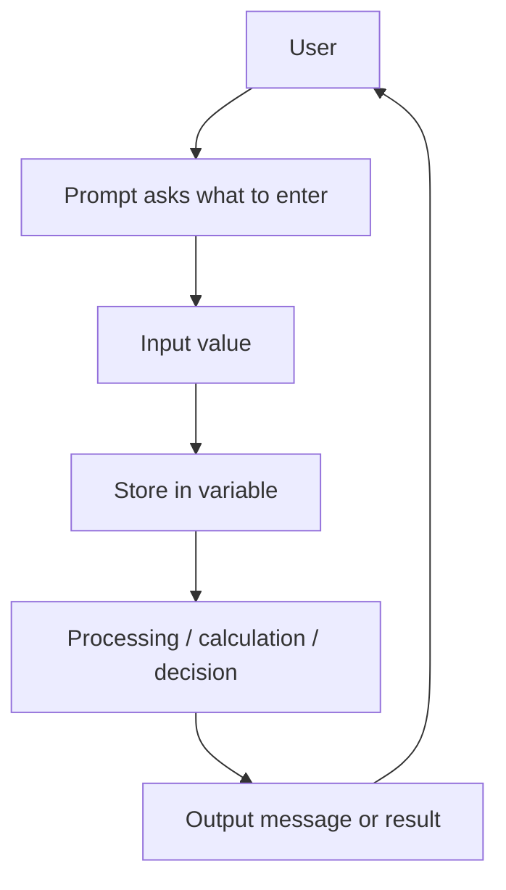

# Input and Output

## Start here

**Input** brings data into a program. **Output** sends information, messages, or results out of a program. A useful program often follows this pattern: ask the user for data, store the **user input** in a **variable**, process it, then **display** or **print** the result.

本页重点是：读懂程序如何接收输入、把输入赋值给变量、按顺序处理变量，并输出准确的信息。考试中要特别注意 prompt、input value、variable、assignment 和 exact output text 的区别。

Core keywords for this page:

```text
input, output, prompt, user input, variable, assignment, display, print, validation, error message
```

::: tip Core idea
A prompt is not the user's input. A prompt is the message asking for input. The input value is what the user enters and the program stores.
:::

---

## Core checklist

By the end of this page, you should be able to:

- define **input** and **output**
- identify input and output statements in code or pseudocode
- explain why prompts are useful
- store user input in variables
- distinguish input data from an output result
- trace programs involving input, assignment, processing, and output
- explain basic validation and error message ideas without writing a full validation system

---

## Key terms for input and output

| Term | Simple Chinese explanation | English mark-scheme style phrase | Small example |
|---|---|---|---|
| Input | 输入；进入程序的数据，可以来自用户、文件或传感器。 | Input allows data to be entered into a program. | User enters `16` for age. |
| Output | 输出；程序显示给用户的信息或结果。 | Output displays information or results to the user. | Program displays `"Average: 77.5"`. |
| Prompt | 提示语；告诉用户应该输入什么。 | A prompt tells the user what data should be entered. | `"Enter age as a whole number:"` |
| User input | 用户实际输入的值。 | User input is the value entered by the user during program execution. | The user types `80`. |
| Display / print | 显示/打印；把文字或变量值输出到屏幕。 | Display or print sends information from the program to the user. | `OUTPUT total` or `System.out.println(total)` |
| Assignment from input | 把输入值赋给变量，之后程序才能使用它。 | User input is stored in a variable so it can be processed later. | `INPUT mark` stores the value in `mark`. |
| Validation | 验证；检查输入是否合理或符合规则。 | Validation checks whether input meets defined rules before it is accepted. | Check that a mark is between `0` and `100`. |
| Error message | 错误信息；告诉用户输入为什么不被接受。 | An error message explains why the input was not accepted and helps the user correct it. | `"Mark must be between 0 and 100."` |
| Input data type | 输入数据类型；程序期望输入是整数、小数、字符串等。 | The input data type should match how the value will be stored and processed. | Age uses integer; full name uses string. |
| Output formatting | 输出格式；让结果带有清楚标签、空格和单位。 | Output formatting makes displayed results clear and readable. | `"Total price: $12.50"` |

---

## Input, process, output pattern

Many short programming questions follow the **input-process-output** pattern.

| Stage | Purpose | Example: total price |
|---|---|---|
| Input | Collect values needed by the program. | Input `quantity` and `price`. |
| Process | Perform calculation or decision. | `total = quantity * price` |
| Output | Display the result or message. | Output `"Total price: " + total` |

IB pseudocode example:

```text
OUTPUT "Enter quantity"
INPUT quantity

OUTPUT "Enter price"
INPUT price

total = quantity * price

OUTPUT "Total price: ", total
```

The input values are not the final answer. They are the data used to calculate the output result.

---

## Input vs output

| Feature | Input | Output |
|---|---|---|
| Direction of data flow | From user/source into the program | From program to user/screen |
| Purpose | Collect data for processing | Show messages, results, or feedback |
| Common statement | `INPUT age`, `input.nextInt()` | `OUTPUT age`, `System.out.println(age)` |
| Example | User enters `15` | Program displays `"Child ticket"` |
| Common exam phrase | Input allows data to be entered into a program. | Output displays information or results to the user. |
| Common mistake | Confusing the prompt with the value entered | Forgetting exact labels, spaces, or message text |

---

## Prompts

A **prompt** tells the user what to enter. Clear prompts reduce input mistakes because the user knows the expected value, format, or range.

| Poor prompt | Improved prompt | Why it is better |
|---|---|---|
| `Enter:` | `Enter your age as a whole number:` | Says what value and type are expected. |
| `Input mark:` | `Enter a mark from 0 to 100:` | Includes the valid range. |
| `Name:` | `Enter your full name:` | Makes clear that spaces may be included. |
| `Number:` | `Enter the number of tickets:` | Gives the meaning of the number. |

In a trace question, prompt text is output. The user's typed value is input.

---

## Storing input in variables

Input must usually be assigned to a variable before the program can use it later. The variable name should make the purpose of the input clear.

```text
OUTPUT "Enter score"
INPUT score
bonusScore = score + 5
OUTPUT bonusScore
```

In Java, input may need the correct Scanner method or conversion before arithmetic:

```java
System.out.print("Enter score: ");
int score = input.nextInt();

int bonusScore = score + 5;
System.out.println("Bonus score: " + bonusScore);
```

If input arrives as text, it may need conversion before calculation. This connects to choosing suitable data types: text input such as `"82"` is not the same as the integer `82`.

---

## Validation and error messages

**Validation** checks whether input is reasonable or allowed before it is accepted. An **error message** helps the user correct invalid input.

Example:

```text
IF mark < 0 OR mark > 100 THEN
    OUTPUT "Error: mark must be between 0 and 100"
END IF
```

Keep the idea simple for this page:

- validation checks a rule
- an error message explains the problem
- the program should not silently accept unreasonable input

For more detail, connect this idea to [Testing and Debugging](./testing-debugging), where test data and expected results are used to check program behaviour.

---

## Code-reading pattern for input and output

When tracing input/output code:

1. Write down the given input values first.
2. Store each input into the correct variable.
3. Process statements in order.
4. Update variables after assignments.
5. Record exact output messages, including labels and spaces.

Trace example:

```text
Given input values:
name = "Lina"
score = 72
```

```text
OUTPUT "Enter name"
INPUT name
OUTPUT "Enter score"
INPUT score
newScore = score + 5
OUTPUT name, " new score is ", newScore
```

Trace:

| Step | Action | Variable state / output |
|---|---|---|
| 1 | Output prompt | `Enter name` |
| 2 | Input name | `name = "Lina"` |
| 3 | Output prompt | `Enter score` |
| 4 | Input score | `score = 72` |
| 5 | Assignment | `newScore = 77` |
| 6 | Output result | `Lina new score is 77` |

Answer output:

```text
Enter name
Enter score
Lina new score is 77
```

---

## Input-output workflow



---

## Exam focus

Command terms you may see:

| Command term | What to write |
|---|---|
| State | Give a short definition or statement, such as what input means. |
| Identify | Pick out input, processing, or output statements from code. |
| Outline | Give the main purpose and one brief example. |
| Describe | Explain how input/output works in a short program. |
| Explain | Link data flow, variables, prompts, validation, and program behaviour. |
| Trace | Follow the program using given input values and record exact output. |
| Write | Produce pseudocode or code with prompts, input, processing, and output. |

How much detail is usually needed:

| Marks | What a strong answer includes |
|---:|---|
| 1 mark | Correct term or statement, such as `INPUT score`. |
| 2 marks | Term plus purpose, such as input stores a user value in a variable. |
| 3 marks | Input, processing, and output identified with a short reason. |
| 4 marks | Clear explanation using variables, prompts, and displayed results. |
| 6 marks | Full scenario answer covering prompts, input storage, processing, validation or error messages, and exact output. |

Avoid vague answers such as:

- "input is typing"
- "output is answer"
- "print means save"

Better answers explain data flow and program behaviour: input enters the program, output is displayed to the user, and print/display does not store a value by itself.

---

## Common exam mistakes

| Mistake | Why it is a problem | Better answer habit |
|---|---|---|
| Forgetting to store input in a variable | The program cannot use the value later. | Show `INPUT variableName` or an assignment from input. |
| Confusing prompt text with input value | The prompt is output; the user's typed value is input. | Label prompts and input values separately in traces. |
| Confusing output with returned value | Displaying a value is not the same as returning it from a function. | Say output is shown to the user. |
| Treating all input as numeric without conversion | Text input cannot always be used directly in arithmetic. | Match input method or conversion to the data type. |
| Not showing exact output text in trace questions | Marks may depend on exact labels, spaces, and line breaks. | Copy output messages carefully. |
| Ignoring spaces or labels in output | Output becomes ambiguous or differs from the program. | Include labels such as `"Average: "`. |
| Forgetting validation or error messages in user-input scenarios | Invalid data may be accepted silently. | Add a rule check and a helpful error message. |
| Printing before calculating | The result shown may be missing or outdated. | Follow input, process, then output order. |

---

## Reusable mark-scheme style phrases

- **Input allows data to be entered into a program.**
- **Output displays information or results to the user.**
- **A prompt tells the user what data should be entered.**
- **User input is stored in a variable so it can be processed later.**
- **Validation checks whether input meets defined rules before it is accepted.**
- **An error message explains why the input was not accepted and helps the user correct it.**
- **Output should include clear labels so the user understands the result.**
- **In a trace question, the exact output text should be recorded in order.**

---

## Quick-check questions

1. What is input?
2. What is output?
3. What is a prompt?
4. Why should input usually be stored in a variable?
5. In `OUTPUT "Enter age"`, is `"Enter age"` input or output?
6. Why might text input need conversion before arithmetic?
7. What does validation check?
8. What should a useful error message do?
9. Why is exact output important in trace questions?
10. In input-process-output, what happens during the process stage?

<details>
<summary>Short answers</summary>

1. Data entered into a program.
2. Information or results displayed by a program.
3. A message telling the user what to enter.
4. So the program can use the value later.
5. Output, because it is displayed to the user.
6. Arithmetic needs numeric data, not text.
7. Whether input meets defined rules.
8. Explain why input was rejected and help the user correct it.
9. Marks may depend on labels, spaces, line breaks, and order.
10. The program calculates, compares, or changes stored values.

</details>

---

## Exam-style practice: input and output

### Question A [5 marks]

Identify the input, processing, and output in this program.

```text
OUTPUT "Enter number of tickets"
INPUT tickets
cost = tickets * 8
OUTPUT "Total cost: ", cost
```

<details>
<summary>Mark scheme</summary>

- Prompt/output: `"Enter number of tickets"`
- Input: `tickets`
- Processing: `cost = tickets * 8`
- Output/result: `"Total cost: ", cost`
- Explanation: the input value is stored in `tickets`, processed by multiplication, and the result is displayed.

</details>

### Question B [6 marks]

Trace the program when the user enters `3` and then `12.50`.

```text
OUTPUT "Enter quantity"
INPUT quantity
OUTPUT "Enter price"
INPUT price
total = quantity * price
OUTPUT "Total: ", total
```

<details>
<summary>Mark scheme</summary>

Variable trace:

| Variable | Value |
|---|---:|
| `quantity` | `3` |
| `price` | `12.50` |
| `total` | `37.50` |

Exact output:

```text
Enter quantity
Enter price
Total: 37.5
```

Accept `37.50` if the answer explains two-decimal formatting.

</details>

### Question C [6 marks]

A school program asks students to enter an exam mark. Explain why clear prompts and validation improve the usability and reliability of the program.

<details>
<summary>Mark scheme</summary>

A clear prompt tells the student what to enter, such as a mark from `0` to `100`, so the user is less likely to enter the wrong type or range of data. Validation checks that the entered mark follows the defined rule before it is accepted. This improves reliability because invalid values such as `-5` or `120` are not processed as normal marks. An error message helps the user understand the problem and correct the input.

</details>

---

## Page map

- [Lesson goals](#1-lesson-goals)
- [Syllabus mapping](#2-syllabus-mapping)
- [Core checklist](#core-checklist)
- [Key terms and detailed lesson](#3-key-terms)

---

## 1. Lesson Goals

By the end of this lesson, students should be able to:

- explain the purpose of input and output in a program
- write simple IB pseudocode using `INPUT` and `OUTPUT`
- use Java `Scanner` to input `int`, `double`, and `String` values
- output text, variables, and combined messages in Java
- explain the difference between `nextInt()`, `nextDouble()`, `next()`, and `nextLine()`
- identify common input mistakes, especially the `nextInt()` and `nextLine()` newline problem
- write simple input-process-output programs
- use prompts to make programs user-friendly
- answer exam-style code tracing and debugging questions

---

## 2. Syllabus Mapping

| Item | Detail |
|---|---|
| Unit | B2 Programming |
| Label | SL Core |
| Main skill | Reading data from the user and displaying results |
| Connected topics | Variables, data types, selection, loops, testing, validation |
| Programming language focus | IB pseudocode + Java |
| Exam relevance | Algorithm writing, code understanding, debugging, input validation |

::: tip Learning Focus
Input and output are the bridge between the user and the program. A program becomes useful when it can receive data, process it, and display a result.
:::

---

## 3. Key Terms

| English Term | 中文解释 | Exam-style meaning |
|---|---|---|
| Input | 输入 | Data entered into a program |
| Output | 输出 | Information produced by a program |
| Prompt | 提示信息 | A message asking the user to enter data |
| Scanner | Java 输入工具 | A Java class used to read input from the keyboard |
| `nextInt()` | 读取整数 | Reads an integer input |
| `nextDouble()` | 读取小数 | Reads a decimal number input |
| `next()` | 读取一个单词 | Reads one token/word |
| `nextLine()` | 读取整行文本 | Reads a full line of text |
| Concatenation | 字符串连接 | Joining text and variables using `+` |
| Input-process-output | 输入-处理-输出 | A common program structure: receive data, process data, show result |

---

## 4. Concept Explanation

<LangBlock>
<template #cn>

### 中文讲解

大多数程序都需要和用户互动。用户给程序的数据叫 **input（输入）**，程序显示给用户的结果叫 **output（输出）**。

例如，一个计算平均分的程序：

```text
输入: 两个分数
处理: 计算平均值
输出: 平均分
```

这就是非常经典的：

```text
Input → Process → Output
```

在 IB pseudocode 中，输入和输出通常写成：

```text
INPUT name
OUTPUT name
```

在 Java 中，输出常用：

```java
System.out.println("Hello");
```

输入常用 `Scanner`：

```java
Scanner input = new Scanner(System.in);
```

学习这一页时，重点不是死记语法，而是理解：

1. 程序需要什么输入
2. 输入要存到哪个变量里
3. 程序如何处理这些变量
4. 最后要输出什么结果
5. 输入类型是否和变量类型匹配

</template>

<template #en>

### English Explanation

Most programs need to interact with users. Data entered by the user is called **input**, and information displayed by the program is called **output**.

For example, a program that calculates an average mark:

```text
Input: two marks
Process: calculate the average
Output: the average mark
```

This is the classic structure:

```text
Input → Process → Output
```

In IB pseudocode, input and output are often written as:

```text
INPUT name
OUTPUT name
```

In Java, output often uses:

```java
System.out.println("Hello");
```

Input often uses `Scanner`:

```java
Scanner input = new Scanner(System.in);
```

The focus of this page is not only memorizing syntax. Students should understand:

1. what input the program needs
2. which variable stores the input
3. how the program processes the variables
4. what result should be output
5. whether the input type matches the variable type

</template>
</LangBlock>

---

## 5. Real-life Example

### Example: Ticket Price Calculator

A cinema ticket system asks the user for their age and outputs a ticket type.

```text
Input: age
Process: check age group
Output: child ticket / adult ticket
```

| Stage | Example |
|---|---|
| Input | user enters `15` |
| Process | program checks whether age is below 18 |
| Output | `Child ticket` |

::: info Scenario Link
Input and output make a program interactive. Without input, the program always uses fixed values. Without output, the user cannot see the result.
:::

---

## 6. IB Pseudocode: INPUT and OUTPUT

### 6.1 Basic Input

```text
INPUT name
```

This means the user enters a value and it is stored in the variable `name`.

### 6.2 Basic Output

```text
OUTPUT "Hello"
OUTPUT name
```

This displays text or a variable value.

### 6.3 Full Pseudocode Example

```text
OUTPUT "Enter your name"
INPUT name
OUTPUT "Hello"
OUTPUT name
```

Possible output:

```text
Enter your name
Hello
Alice
```

---

## 7. Java Output

## 7.1 Output Text

```java
System.out.println("Hello");
```

Output:

```text
Hello
```

## 7.2 Output a Variable

```java
int score = 90;
System.out.println(score);
```

Output:

```text
90
```

## 7.3 Output Text and Variable Together

```java
int score = 90;
System.out.println("Your score is " + score);
```

Output:

```text
Your score is 90
```

The `+` joins the text and the variable. This is called **concatenation**.

---

## 8. `print` vs `println`

| Java Code | Meaning |
|---|---|
| `System.out.print()` | Outputs without moving to a new line |
| `System.out.println()` | Outputs and moves to a new line |

### Example

```java
System.out.print("Hello ");
System.out.print("World");
```

Output:

```text
Hello World
```

### Example

```java
System.out.println("Hello");
System.out.println("World");
```

Output:

```text
Hello
World
```

::: tip Learning tip
Use `print` when you want the user's input to appear on the same line as the prompt.
:::

---

## 9. Java Input Using Scanner

To use `Scanner`, first import it:

```java
import java.util.Scanner;
```

Then create a Scanner object:

```java
Scanner input = new Scanner(System.in);
```

Full basic structure:

```java
import java.util.Scanner;

public class InputExample {
    public static void main(String[] args) {
        Scanner input = new Scanner(System.in);

        System.out.print("Enter your name: ");
        String name = input.nextLine();

        System.out.println("Hello " + name);

        input.close();
    }
}
```

---

## 10. Scanner Methods

| Method | Reads | Example Input | Variable Type |
|---|---|---|---|
| `nextInt()` | integer | `15` | `int` |
| `nextDouble()` | decimal number | `3.14` | `double` |
| `next()` | one word/token | `Alice` | `String` |
| `nextLine()` | full line | `Alice Chen` | `String` |

---

## 11. Input an Integer

### Java Example

```java
import java.util.Scanner;

public class InputInteger {
    public static void main(String[] args) {
        Scanner input = new Scanner(System.in);

        System.out.print("Enter your age: ");
        int age = input.nextInt();

        System.out.println("You are " + age + " years old.");

        input.close();
    }
}
```

### Example Run

```text
Enter your age: 16
You are 16 years old.
```

### Explanation

| Code | Explanation |
|---|---|
| `Scanner input = new Scanner(System.in);` | Creates input reader |
| `System.out.print(...)` | Prompts the user |
| `int age = input.nextInt();` | Reads an integer and stores it in `age` |
| `System.out.println(...)` | Outputs result |
| `input.close();` | Closes Scanner when finished |

---

## 12. Input a Decimal Number

### Java Example

```java
import java.util.Scanner;

public class InputDouble {
    public static void main(String[] args) {
        Scanner input = new Scanner(System.in);

        System.out.print("Enter price: ");
        double price = input.nextDouble();

        System.out.println("Price: " + price);

        input.close();
    }
}
```

### Example Run

```text
Enter price: 12.5
Price: 12.5
```

Use `double` when the value may contain decimals.

---

## 13. Input a Single Word

### Java Example

```java
import java.util.Scanner;

public class InputWord {
    public static void main(String[] args) {
        Scanner input = new Scanner(System.in);

        System.out.print("Enter username: ");
        String username = input.next();

        System.out.println("Username: " + username);

        input.close();
    }
}
```

If the user enters:

```text
Alice Chen
```

`next()` only reads:

```text
Alice
```

It stops at the space.

---

## 14. Input a Full Line

### Java Example

```java
import java.util.Scanner;

public class InputLine {
    public static void main(String[] args) {
        Scanner input = new Scanner(System.in);

        System.out.print("Enter full name: ");
        String fullName = input.nextLine();

        System.out.println("Full name: " + fullName);

        input.close();
    }
}
```

If the user enters:

```text
Alice Chen
```

`nextLine()` reads:

```text
Alice Chen
```

---

## 15. Worked Example 1: Input-Process-Output

### Problem

Input two marks and output the average.

### IB Pseudocode

```text
OUTPUT "Enter first mark"
INPUT mark1

OUTPUT "Enter second mark"
INPUT mark2

average = (mark1 + mark2) / 2

OUTPUT average
```

### Java Code

```java
import java.util.Scanner;

public class AverageMarks {
    public static void main(String[] args) {
        Scanner input = new Scanner(System.in);

        System.out.print("Enter first mark: ");
        int mark1 = input.nextInt();

        System.out.print("Enter second mark: ");
        int mark2 = input.nextInt();

        double average = (mark1 + mark2) / 2.0;

        System.out.println("Average: " + average);

        input.close();
    }
}
```

### Line-by-line Explanation

| Code | Explanation |
|---|---|
| `int mark1 = input.nextInt();` | Reads first integer mark |
| `int mark2 = input.nextInt();` | Reads second integer mark |
| `(mark1 + mark2) / 2.0` | Calculates average as a decimal |
| `System.out.println(...)` | Outputs result |

### Example Trace

| mark1 | mark2 | Calculation | average |
|---:|---:|---|---:|
| 80 | 75 | `(80 + 75) / 2.0` | 77.5 |

Output:

```text
Average: 77.5
```

---

## 16. Worked Example 2: Input with Selection

### Problem

Input a mark and output `"Pass"` if the mark is at least 50.

### IB Pseudocode

```text
OUTPUT "Enter mark"
INPUT mark

IF mark >= 50 THEN
    OUTPUT "Pass"
ELSE
    OUTPUT "Fail"
END IF
```

### Java Code

```java
import java.util.Scanner;

public class PassFailInput {
    public static void main(String[] args) {
        Scanner input = new Scanner(System.in);

        System.out.print("Enter mark: ");
        int mark = input.nextInt();

        if (mark >= 50) {
            System.out.println("Pass");
        } else {
            System.out.println("Fail");
        }

        input.close();
    }
}
```

### Trace Table

| Input mark | Condition `mark >= 50` | Output |
|---:|---|---|
| 75 | true | Pass |
| 50 | true | Pass |
| 49 | false | Fail |

---

## 17. Worked Example 3: Input with Validation

### Problem

Input a mark and check whether it is valid. A valid mark is from 0 to 100 inclusive.

### Java Code

```java
import java.util.Scanner;

public class MarkInputValidation {
    public static void main(String[] args) {
        Scanner input = new Scanner(System.in);

        System.out.print("Enter mark: ");
        int mark = input.nextInt();

        if (mark >= 0 && mark <= 100) {
            System.out.println("Valid mark");
        } else {
            System.out.println("Invalid mark");
        }

        input.close();
    }
}
```

### Test Data

| Input | Expected Output |
|---:|---|
| 75 | Valid mark |
| 0 | Valid mark |
| 100 | Valid mark |
| -1 | Invalid mark |
| 101 | Invalid mark |

::: tip Connection
This combines input, data types, selection, Boolean operators, and testing.
:::

---

## 18. Common Scanner Problem: `nextInt()` then `nextLine()`

This is one of the most common Java input problems.

### 18.1 Problem Code

```java
import java.util.Scanner;

public class ScannerProblem {
    public static void main(String[] args) {
        Scanner input = new Scanner(System.in);

        System.out.print("Enter age: ");
        int age = input.nextInt();

        System.out.print("Enter full name: ");
        String name = input.nextLine();

        System.out.println(age);
        System.out.println(name);

        input.close();
    }
}
```

### What Happens?

If the user enters:

```text
16
Alice Chen
```

The program may skip the full name input.

### Why?

`nextInt()` reads the number but leaves the newline character in the input buffer.  
Then `nextLine()` reads that leftover newline immediately.

---

## 19. Fixing the `nextInt()` then `nextLine()` Problem

### Corrected Code

```java
import java.util.Scanner;

public class ScannerFixed {
    public static void main(String[] args) {
        Scanner input = new Scanner(System.in);

        System.out.print("Enter age: ");
        int age = input.nextInt();
        input.nextLine(); // consume leftover newline

        System.out.print("Enter full name: ");
        String name = input.nextLine();

        System.out.println("Age: " + age);
        System.out.println("Name: " + name);

        input.close();
    }
}
```

### Key Line

```java
input.nextLine();
```

This line consumes the leftover newline after `nextInt()`.

::: warning Common Mistake
If your `nextLine()` seems to be skipped after `nextInt()` or `nextDouble()`, add an extra `input.nextLine();` before reading the full line.
:::

---

## 20. Input Mismatch Error

### Problem

If Java expects an integer but the user enters text, a runtime error may occur.

```java
int age = input.nextInt();
```

Expected input:

```text
16
```

Invalid input:

```text
sixteen
```

This can cause an `InputMismatchException`.

### Defensive Idea

At this stage, students only need to understand the problem. Full exception handling can be introduced later.

Simple prevention:

```text
Tell the user clearly what type of input is expected.
Use validation after input where possible.
```

Example prompt:

```java
System.out.print("Enter age as a whole number: ");
```

---

## 21. Output Formatting Basics

### 21.1 Clear Labels

Weak output:

```java
System.out.println(77.5);
```

Better output:

```java
System.out.println("Average mark: " + average);
```

### 21.2 Multiple Variables

```java
String name = "Alice";
int mark = 85;

System.out.println(name + " scored " + mark + " marks.");
```

Output:

```text
Alice scored 85 marks.
```

### 21.3 Basic Decimal Formatting

For simple courses, outputting full decimals is acceptable.  
If needed, Java can use `printf`:

```java
System.out.printf("Average: %.2f%n", average);
```

This outputs average to 2 decimal places.

---

## 22. Input Design: Good Prompts

A good prompt tells the user what to enter.

| Weak Prompt | Better Prompt |
|---|---|
| `Enter:` | `Enter your age as a whole number:` |
| `Input:` | `Enter a mark from 0 to 100:` |
| `Name:` | `Enter your full name:` |
| `Number:` | `Enter the number of tickets:` |

Good prompts reduce input mistakes.

---

## 23. Common Mistakes

| Mistake | Why it is a problem | Better habit |
|---|---|---|
| Forgetting `import java.util.Scanner;` | Java cannot find Scanner | Add import at the top |
| Forgetting to create Scanner object | Cannot read input | Use `Scanner input = new Scanner(System.in);` |
| Using wrong Scanner method | Type mismatch or incomplete input | Match method to data type |
| Using `next()` for full name | Stops at the first space | Use `nextLine()` for full line |
| Mixing `nextInt()` and `nextLine()` without clearing newline | `nextLine()` may be skipped | Add extra `input.nextLine();` |
| No user prompt | User does not know what to enter | Print a clear prompt first |
| Output has no label | Result is unclear | Use text with variables |
| Integer division mistake | Average may lose decimal part | Use `2.0` or cast to double |
| Not closing Scanner | Resource warning may appear | Use `input.close();` at the end |
| Asking for invalid type | Program may crash | Make expected input clear |

---

## 24. Guided Practice

### Practice 1: Output

What is the output?

```java
String name = "Ben";
int score = 88;

System.out.println(name + " scored " + score);
```

<details>
<summary>Suggested Answer</summary>

Output:

```text
Ben scored 88
```

</details>

---

### Practice 2: Choose Scanner Method

Which Scanner method should be used?

| Data needed | Best Method |
|---|---|
| age as whole number | ? |
| price with decimals | ? |
| one-word username | ? |
| full name with spaces | ? |

<details>
<summary>Suggested Answer</summary>

| Data needed | Best Method |
|---|---|
| age as whole number | `nextInt()` |
| price with decimals | `nextDouble()` |
| one-word username | `next()` |
| full name with spaces | `nextLine()` |

</details>

---

### Practice 3: Input-Process-Output

Complete the missing line.

```java
System.out.print("Enter price: ");
double price = input.nextDouble();

double tax = price * 0.1;

System.out.println(_______________);
```

The output should look like:

```text
Tax: 2.5
```

<details>
<summary>Suggested Answer</summary>

```java
System.out.println("Tax: " + tax);
```

</details>

---

### Practice 4: Scanner Bug

What is the problem?

```java
int age = input.nextInt();
String name = input.nextLine();
```

<details>
<summary>Suggested Answer</summary>

After `nextInt()`, the newline is left in the input buffer. `nextLine()` may read that leftover newline and appear to be skipped.

Fix:

```java
int age = input.nextInt();
input.nextLine();
String name = input.nextLine();
```

</details>

---

### Practice 5: Average Calculation

What is wrong with this code if a decimal average is needed?

```java
int mark1 = 80;
int mark2 = 75;

double average = (mark1 + mark2) / 2;
```

<details>
<summary>Suggested Answer</summary>

`(mark1 + mark2) / 2` uses integer division because both values are integers.

Better:

```java
double average = (mark1 + mark2) / 2.0;
```

</details>

---

## 25. Independent Practice

### Question 1

Write Java code to input a user's name and output:

```text
Hello, name
```

### Question 2

Write Java code to input two integers and output their sum.

### Question 3

Write Java code to input a price and output a 10% discount amount.

### Question 4

Write Java code to input a full name and age, then output both clearly.

### Question 5

Write IB pseudocode for a program that inputs length and width, then outputs area.

### Question 6

Explain the difference between `next()` and `nextLine()`.

### Question 7

Explain why `nextLine()` may be skipped after `nextInt()`.

### Question 8

Write Java code to input a mark and output `"Valid"` if it is from 0 to 100 inclusive.

### Question 9

Find and correct the error:

```java
Scanner input = new Scanner(System.in);

System.out.print("Enter full name: ");
String name = input.next();
```

The program should accept names with spaces.

### Question 10

Create a program using the input-process-output structure:

```text
Input: radius
Process: area = 3.14 * radius * radius
Output: area
```

---

## 26. Exam-style Questions

### Question 1 [4 marks]

State the purpose of input and output in a program.

<details>
<summary>Mark Scheme Style Answer</summary>

Input allows a program to receive data from a user or another source. Output allows a program to display results or information after processing. Together, input and output allow interaction between the user and the program.

</details>

---

### Question 2 [5 marks]

Write Java code to input a user's age and output whether they are old enough to vote. Assume voting age is 18.

<details>
<summary>Mark Scheme Style Answer</summary>

```java
import java.util.Scanner;

public class VoteCheck {
    public static void main(String[] args) {
        Scanner input = new Scanner(System.in);

        System.out.print("Enter age: ");
        int age = input.nextInt();

        if (age >= 18) {
            System.out.println("Can vote");
        } else {
            System.out.println("Cannot vote");
        }

        input.close();
    }
}
```

Possible marks:

- imports Scanner
- creates Scanner object
- prompts user
- inputs integer age
- uses correct selection condition
- outputs suitable result

</details>

---

### Question 3 [4 marks]

Explain why the following code may skip the full name input.

```java
int age = input.nextInt();
String name = input.nextLine();
```

<details>
<summary>Mark Scheme Style Answer</summary>

`nextInt()` reads the integer but leaves the newline character in the input buffer. Then `nextLine()` reads this leftover newline immediately, so it appears to skip the full name input. To fix this, an extra `input.nextLine();` should be used after `nextInt()` to consume the leftover newline before reading the full name.

</details>

---

### Question 4 [5 marks]

A program needs to input a full name, an age, and a decimal height. State suitable Java Scanner methods for each and justify your choices.

<details>
<summary>Mark Scheme Style Answer</summary>

A full name should use `nextLine()` because it may contain spaces. Age should use `nextInt()` because it is a whole number. Height should use `nextDouble()` because it may contain a decimal value. The method should match the expected data type of the input.

</details>

---

### Question 5 [6 marks]

Write IB pseudocode for a program that inputs two numbers, calculates their average, and outputs the result.

<details>
<summary>Mark Scheme Style Answer</summary>

```text
OUTPUT "Enter first number"
INPUT number1

OUTPUT "Enter second number"
INPUT number2

average = (number1 + number2) / 2

OUTPUT average
```

Possible marks:

- asks for or inputs first number
- asks for or inputs second number
- stores both values
- calculates total or average correctly
- outputs average
- uses clear sequence

</details>

---

## 27. Independent practice
### Independent practice part A: Write Code

Write a Java program that:

1. inputs a full name
2. inputs two marks
3. calculates the average
4. outputs the name and average clearly

Be careful if mixing `nextLine()` and `nextInt()`.

---

### Independent practice part B: Pseudocode

Write IB pseudocode for a program that:

1. inputs the number of items bought
2. inputs the price per item
3. calculates the total cost
4. outputs the total cost

---

### Independent practice part C: Debug

Fix this code:

```java
import java.util.Scanner;

public class Test {
    public static void main(String[] args) {
        Scanner input = new Scanner(System.in);

        System.out.print("Enter age: ");
        int age = input.nextInt();

        System.out.print("Enter full name: ");
        String name = input.nextLine();

        System.out.println(name + " is " + age + " years old.");
    }
}
```

---

### Independent practice part D: Explain

In 4-5 sentences, explain why clear prompts are important in programs that use user input.

---

## 28. One-page Revision Summary

| Point | Summary |
|---|---|
| Input | Data entered into a program |
| Output | Information displayed by a program |
| Prompt | Message telling the user what to enter |
| Scanner | Java class used for keyboard input |
| `nextInt()` | Reads an integer |
| `nextDouble()` | Reads a decimal number |
| `next()` | Reads one word |
| `nextLine()` | Reads a full line |
| `println()` | Outputs then moves to new line |
| `print()` | Outputs without moving to new line |
| Concatenation | Joining text and variables using `+` |
| Common Scanner bug | `nextLine()` skipped after `nextInt()` or `nextDouble()` |
| Fix for Scanner bug | Add extra `input.nextLine();` before reading full line |
| Exam phrase | Input provides data to the program, and output displays the result after processing |

---

## 29. Quick Self-test

Before moving on, students should be able to answer these:

1. What is input?
2. What is output?
3. What is a prompt?
4. What does `System.out.println()` do?
5. What is the difference between `print` and `println`?
6. What import is needed for Scanner?
7. Which Scanner method reads an integer?
8. Which Scanner method reads a full line?
9. Why can `nextLine()` be skipped after `nextInt()`?
10. How do you fix the `nextInt()` then `nextLine()` problem?
