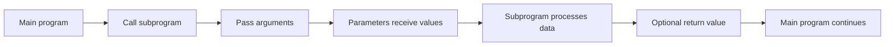

# Programming Basics

## Page map

- [Lesson goals](#1-lesson-goals)
- [Syllabus mapping](#2-syllabus-mapping)
- [Core checklist](#core-checklist)
- [Key terms and detailed lesson](#3-key-terms)

---

## 1. Lesson Goals

By the end of this lesson, students should be able to:

- explain what programming is
- explain the basic **input → process → output** model
- distinguish source code, program, instruction, and statement
- describe how a Java program runs from top to bottom
- identify the basic structure of a Java program
- write and explain a simple Java program
- use comments to make code easier to understand
- distinguish syntax errors, runtime errors, and logic errors at a basic level
- trace a short program step by step
- answer exam-style questions about basic programming concepts

---

## 2. Syllabus Mapping

| Item | Detail |
|---|---|
| Unit | B2 Programming |
| Label | SL Core |
| Main skill | Understanding how programs are written, executed, and explained |
| Connected topics | Variables, data types, input/output, selection, loops, testing |
| Programming language focus | IB pseudocode + Java |
| Exam relevance | Basic code understanding, tracing, program structure, error explanation |

::: tip Learning Focus
This page is the bridge between computational thinking and real code. Students should understand what a program does before memorizing Java syntax.
:::

---

## Start here: programming basics help you read and trace code

Programming basics are the foundation for **reading**, **tracing**, and **writing** code. Before writing long programs, you need to understand how statements run in order, how values are stored, how decisions and loops work, and how larger programs can be split into smaller reusable parts.

Core keywords for this page: **variable**, **assignment**, **input**, **output**, **sequence**, **selection**, **iteration**, **subprogram**, **procedure**, **function**, **parameter**, **argument**, and **return value**.

---

## Core checklist

By the end of this page, you should be able to:

- identify **variables** and **assignments**
- follow the **sequence** of execution
- understand **input** and **output**
- distinguish **selection** and **iteration** at a basic level
- define **subprogram**, **procedure**, and **function**
- identify **parameters** and **arguments**
- explain **return values**
- explain why **modular programming** improves readability, testing, reuse, and maintenance

---

## Programming fundamentals exam table

| Term | 简单中文解释 | English mark-scheme phrase | Simple example |
|---|---|---|---|
| Variable | 存储数据的命名位置 | A named storage location for a value | `score = 80` |
| Assignment | 给变量赋值或更新值 | Storing a value in a variable | `total = price1 + price2` |
| Input | 程序接收的数据 | Data received by the program | User enters a mark |
| Output | 程序显示或发送的结果 | Data produced by the program | `OUTPUT average` |
| Sequence | 语句按顺序执行 | Instructions executed in order | Line 1, then line 2, then line 3 |
| Selection | 根据条件选择分支 | Choosing a path based on a condition | `IF mark >= 50 THEN` |
| Iteration | 重复执行代码 | Repeating code using a loop | `FOR i = 1 TO 10` |
| Subprogram | 有名字的代码块，完成特定任务 | A named block of code that performs a specific task | `calculateAverage()` |
| Procedure | 执行动作但通常不返回值 | Performs an action but does not usually return a value | `printReport()` |
| Function | 执行任务并返回一个值 | Returns a value to the calling code | `getAverage()` returns a number |
| Parameter | 定义中的占位变量 | Placeholder used in a subprogram definition | `mark` in `isPass(mark)` |
| Argument | 调用时传入的实际值 | Actual value passed into a subprogram call | `75` in `isPass(75)` |
| Return value | 函数返回给调用处的数据 | Value sent back by a function | `return average` |
| Local variable | 只在某个子程序内部存在的变量 | Variable accessible only inside its subprogram | `total` inside `calculateTotal()` |
| Scope | 变量可被访问的范围 | Part of a program where a variable can be used | Local scope inside a method |
| Modular programming | 把程序拆成小模块 | Splitting a program into smaller reusable parts | Separate input, calculation, and output subprograms |

---

## Procedure vs function

| Point | Procedure | Function |
|---|---|---|
| Purpose | Performs an action | Calculates or produces a value |
| Returns a value? | Does not usually return a value | Returns a value |
| How it is called | Called as a statement | Often used in assignment, output, or another expression |
| Suitable example | `printMenu()` displays options | `calculateTotal(price, tax)` returns total |
| Common exam phrase | "A procedure performs an action but does not usually return a value." | "A function returns a value to the part of the program that called it." |
| Common mistake | Thinking every subprogram must return data | Calling a function but ignoring the returned value |

---

## Parameters vs arguments

A **parameter** is the placeholder name in the subprogram definition. An **argument** is the actual value passed into the subprogram call.

Do not use these words interchangeably in exam answers.

```java
public static int addTen(int number) {  // number is a parameter
    return number + 10;
}

int result = addTen(5);                 // 5 is an argument
```

When the function is called:

```text
argument 5 is passed into parameter number
number becomes 5 inside the function
function returns 15
```

---

## Return values

Functions usually **return a value**. The returned value can be:

- stored in a variable
- printed as output
- used in another expression

Procedures may perform actions without returning a value, such as printing a message or updating a display.

```java
public static int square(int n) {
    return n * n;
}

int answer = square(4);                 // stores returned value 16
System.out.println(square(5));          // prints returned value 25
int total = square(3) + square(2);      // uses returned values in expression
```

If a function returns a value, check where that value goes. If it is not stored, printed, or used, the result may be lost.

---

## Local variables and scope

A **local variable** exists only inside the subprogram where it is declared. Its **scope** is limited to that subprogram.

```java
public static int calculateTotal(int a, int b) {
    int total = a + b;   // local variable
    return total;
}
```

The variable `total` can be used inside `calculateTotal()`, but not everywhere in the program.

A **global variable** can be accessed more widely, but overusing global variables can make code harder to debug because many parts of the program may change the same value. Local variables reduce unwanted side effects because each subprogram keeps its temporary data separate.

---

## Code-reading pattern for subprogram calls

When tracing code with subprograms:

1. Start from the **main program**.
2. Identify each **subprogram call**.
3. Match **arguments** in the call to **parameters** in the definition.
4. Execute the subprogram body using those parameter values.
5. Record any **returned value**.
6. Continue after the call in the main program.

### Small trace example

```java
public static int doubleValue(int x) {
    return x * 2;
}

public static void main(String[] args) {
    int a = 3;
    int b = doubleValue(a + 1);
    System.out.println(b);
}
```

Trace:

| Step | Action | Value |
|---:|---|---|
| 1 | `a = 3` | `a` is 3 |
| 2 | call `doubleValue(a + 1)` | argument is 4 |
| 3 | parameter `x` receives 4 | `x` is 4 inside function |
| 4 | function returns `x * 2` | returns 8 |
| 5 | `b = 8` | returned value stored in `b` |
| 6 | print `b` | output is 8 |

Answer:

```text
8
```

---

## Subprogram call workflow



For a procedure, the return-value step may be absent. The main program still continues after the procedure call finishes.

---

## Exam focus

| Command term | What to write |
|---|---|
| State | Give a short definition or term. |
| Identify | Pick out variables, assignments, parameters, arguments, calls, or return values from code. |
| Outline | Give the main idea plus one relevant detail. |
| Describe | Explain what a code section or subprogram does step by step. |
| Explain | Link the concept to readability, testing, reuse, maintenance, or tracing. |
| Write | Produce a short code or pseudocode fragment. |
| Trace | Follow execution in order and record changing values. |

For mark levels:

- **1 mark:** name or define one concept, such as parameter or function.
- **2 marks:** identify two code parts, or define one term with an example.
- **3 marks:** explain a simple call by matching arguments to parameters.
- **4 marks:** trace a short function call and record the return value.
- **6 marks:** explain modular design using readability, reuse, testing, maintenance, parameters, and return values.

Avoid vague answers such as:

```text
function does something
procedure is code
parameter is input
```

Better answers mention whether a value is returned, which argument is passed, and how the subprogram fits the scenario.

---

## Reusable mark-scheme style phrases

- "A subprogram is a named block of code that performs a specific task."
- "A procedure performs an action but does not usually return a value."
- "A function returns a value to the part of the program that called it."
- "A parameter is a placeholder used in the subprogram definition."
- "An argument is the actual value passed into the subprogram call."
- "Local variables are only accessible within the subprogram where they are declared."
- "Modular programming improves readability, reuse, testing, and maintenance."
- "A returned value may be stored, printed, or used in another expression."

---

## Common mistakes table

| Mistake | Why it is wrong | Better approach |
|---|---|---|
| Confusing procedure and function | A function returns a value; a procedure usually performs an action | Check whether the call produces a value |
| Confusing parameter and argument | Parameter is in the definition; argument is in the call | Match call values to definition names |
| Forgetting to return a value from a function | The calling code expects a result | Use `return` for the calculated value |
| Using a returned value but not storing it | The result may be lost | Store, print, or use the returned value |
| Assuming local variables can be used everywhere | Local variables only exist inside their subprogram | Check scope before using a variable |
| Overusing global variables | Many parts of the program may change the same value | Prefer parameters and local variables where suitable |
| Tracing the subprogram before knowing the arguments | Parameter values are unknown until the call | Start from main and pass arguments first |
| Not returning to the main program after a function call | Execution continues after the call | Record return value, then continue in main |
| Mixing up assignment and comparison | `=` stores a value; `==` compares values in Java | Read assignment and condition statements carefully |

---

## Quick-check questions with short answers

1. What is a variable?  
   **Answer:** A named storage location for a value.

2. What is assignment?  
   **Answer:** Storing a value in a variable.

3. What is sequence?  
   **Answer:** Executing statements in order.

4. What is selection?  
   **Answer:** Choosing a path based on a condition.

5. What is iteration?  
   **Answer:** Repeating code using a loop.

6. What is a subprogram?  
   **Answer:** A named block of code that performs a specific task.

7. What is the main difference between a procedure and a function?  
   **Answer:** A function returns a value; a procedure usually does not.

8. What is a parameter?  
   **Answer:** A placeholder used in a subprogram definition.

9. What is an argument?  
   **Answer:** The actual value passed into a subprogram call.

10. Why is modular programming useful?  
    **Answer:** It improves readability, reuse, testing, and maintenance.

---

## Exam-style practice: programming basics and subprograms

### Question A [6 marks]

Compare procedures and functions.

<details>
<summary>Mark Scheme Style Answer</summary>

A procedure is a named block of code that performs an action but does not usually return a value. For example, a procedure may display a menu or print a report. A function is a named block of code that returns a value to the part of the program that called it. For example, a function may calculate an average and return it. A function call is often used in an assignment, output statement, or expression, while a procedure call is often used as a statement.

</details>

---

### Question B [6 marks]

Trace the code and state the output.

```java
public static int addBonus(int score, int bonus) {
    int total = score + bonus;
    return total;
}

public static void main(String[] args) {
    int mark = 70;
    int result = addBonus(mark, 5);
    System.out.println(result);
}
```

<details>
<summary>Mark Scheme Style Answer</summary>

The main program starts with `mark = 70`. The function call is `addBonus(mark, 5)`, so the arguments are `70` and `5`. These are passed to the parameters `score` and `bonus`. Inside the function, `total = score + bonus`, so `total = 75`. The function returns `75`, which is stored in `result`. The output is:

```text
75
```

</details>

---

### Question C [6 marks]

A school attendance program has one long block of code for input, validation, calculation, and printing reports. Explain why using subprograms could improve maintainability and testing.

<details>
<summary>Mark Scheme Style Answer</summary>

Using subprograms would split the long program into smaller named parts, such as input attendance, validate data, calculate absence totals, and print reports. This improves readability because each subprogram has a clear purpose. It improves testing because each part can be tested separately with known inputs and expected outputs. It improves reuse because the same validation or report procedure can be called in different places. It improves maintenance because changes can be made to one subprogram instead of searching through one large block of code.

</details>

---

## 3. Key Terms

| English Term | 中文解释 | Exam-style meaning |
|---|---|---|
| Program | 程序 | A set of instructions that a computer can execute |
| Programming | 编程 | Writing instructions for a computer to solve a problem |
| Source code | 源代码 | Human-readable instructions written in a programming language |
| Instruction | 指令 | A command that tells the computer what to do |
| Statement | 语句 | A single executable line or command in a program |
| Algorithm | 算法 | A step-by-step solution to a problem |
| Pseudocode | 伪代码 | A language-independent way to describe an algorithm |
| Syntax | 语法 | The rules of a programming language |
| Comment | 注释 | Text in code for humans, ignored by the computer |
| Execution | 执行 | The process of running program instructions |
| Compiler | 编译器 | Software that translates source code into executable form |
| IDE | 集成开发环境 | Software used to write, run, and debug programs |
| Debugging | 调试 | Finding and fixing errors in code |

---

## 4. Concept Explanation

<LangBlock>
<template #cn>

### 中文讲解

**Programming（编程）** 就是把解决问题的步骤写成计算机能执行的指令。

在 B1 Computational Thinking 中，我们学过 algorithm：

```text
step-by-step solution
```

Programming 就是把这些步骤变成代码。例如：

```text
算法想法:
输入两个数字
计算它们的和
输出结果
```

可以写成 Java：

```java
int a = 5;
int b = 3;
int total = a + b;
System.out.println(total);
```

程序通常遵循一个基本结构：

```text
Input → Process → Output
```

也就是：

1. 输入数据
2. 处理数据
3. 输出结果

学习 programming basics 的重点不是背所有语法，而是理解：

- 程序是按顺序执行的
- 每一行代码都有作用
- 变量可以存储数据
- 程序通过 input 获取数据
- 程序通过 output 显示结果
- 出错时要能看懂错误类型并调试

</template>

<template #en>

### English Explanation

**Programming** means writing instructions that a computer can execute to solve a problem.

In B1 Computational Thinking, we learned about algorithms:

```text
step-by-step solution
```

Programming turns these steps into code. For example:

```text
Algorithm idea:
Input two numbers
Calculate their sum
Output the result
```

This can be written in Java:

```java
int a = 5;
int b = 3;
int total = a + b;
System.out.println(total);
```

Programs often follow a basic structure:

```text
Input → Process → Output
```

This means:

1. receive data
2. process data
3. output the result

The focus of programming basics is not memorizing all syntax. Students should understand:

- programs run in order
- each line has a purpose
- variables store data
- input lets the program receive data
- output lets the program display results
- errors must be identified and debugged

</template>
</LangBlock>

---

## 5. From Algorithm to Program

### 5.1 Algorithm in Words

Problem:

```text
Calculate the total price of two items.
```

Algorithm:

```text
1. Store price of first item
2. Store price of second item
3. Add the two prices
4. Output the total
```

### 5.2 IB Pseudocode

```text
price1 = 12.5
price2 = 8.0

total = price1 + price2

OUTPUT total
```

### 5.3 Java Code

```java
public class TotalPrice {
    public static void main(String[] args) {
        double price1 = 12.5;
        double price2 = 8.0;

        double total = price1 + price2;

        System.out.println("Total price: " + total);
    }
}
```

### 5.4 Explanation

| Part | Purpose |
|---|---|
| `price1` and `price2` | store input or fixed data |
| `total = price1 + price2` | process data |
| `System.out.println(...)` | output result |

---

## 6. Input → Process → Output Model

Many programs can be understood using:

```text
Input → Process → Output
```

| Stage | Meaning | Example |
|---|---|---|
| Input | Data received by the program | Two marks |
| Process | Calculation or decision | Calculate average |
| Output | Result shown to user | Display average |

### Example

```text
Input: mark1 = 80, mark2 = 70
Process: average = (80 + 70) / 2
Output: average = 75
```

### Java Example

```java
int mark1 = 80;
int mark2 = 70;

double average = (mark1 + mark2) / 2.0;

System.out.println("Average: " + average);
```

---

## 7. Java Program Structure

A basic Java program often looks like this:

```java
public class HelloWorld {
    public static void main(String[] args) {
        System.out.println("Hello World");
    }
}
```

### Structure Table

| Code | Meaning |
|---|---|
| `public class HelloWorld` | Defines a class called `HelloWorld` |
| `{` and `}` | Braces mark the start and end of a block |
| `public static void main(String[] args)` | Main method where the program starts |
| `System.out.println(...)` | Outputs text |
| `;` | Ends a Java statement |

::: warning Naming Rule
The class name should usually match the file name.

Example:

```text
HelloWorld.java
```

should contain:

```java
public class HelloWorld
```
:::

---

## 8. Java Runs Top to Bottom

Java runs statements in order inside the `main` method.

### Example

```java
public class OrderExample {
    public static void main(String[] args) {
        System.out.println("First");
        System.out.println("Second");
        System.out.println("Third");
    }
}
```

Output:

```text
First
Second
Third
```

If the order changes, the output changes.

---

## 9. Statements and Semicolons

A Java statement usually ends with a semicolon.

```java
int score = 90;
System.out.println(score);
```

If the semicolon is missing:

```java
int score = 90
```

Java will report a syntax error.

### Common Statements

| Statement | Purpose |
|---|---|
| `int score = 90;` | stores a value |
| `score = score + 10;` | updates a value |
| `System.out.println(score);` | outputs a value |
| `if (score >= 50) { ... }` | makes a decision |
| `for (...) { ... }` | repeats code |

---

## 10. Braces and Code Blocks

Braces `{}` group statements into a block.

Example:

```java
if (score >= 50) {
    System.out.println("Pass");
    System.out.println("Well done");
}
```

Both output lines belong to the IF block.

Without braces, beginners often make mistakes. For this course, students should use braces clearly.

---

## 11. Comments

Comments are notes for humans. Java ignores them when running the program.

### Single-line Comment

```java
// This stores the student's score
int score = 90;
```

### Multi-line Comment

```java
/*
This program calculates
the average of two marks.
*/
```

### Why Use Comments?

| Benefit | Explanation |
|---|---|
| Readability | Helps humans understand code |
| Maintenance | Makes code easier to change later |
| Learning | Helps students explain logic |
| Debugging | Helps identify sections of code |

::: tip Good Comment Rule
A useful comment explains why something is done, not just repeats the code.
:::

---

## 12. Worked Example 1: Hello Program

### Java Code

```java
public class HelloProgram {
    public static void main(String[] args) {
        System.out.println("Welcome to IBDP Computer Science");
        System.out.println("Today we are learning programming basics.");
    }
}
```

### Trace

| Step | Statement | Output |
|---:|---|---|
| 1 | first `println` | Welcome to IBDP Computer Science |
| 2 | second `println` | Today we are learning programming basics. |

Final output:

```text
Welcome to IBDP Computer Science
Today we are learning programming basics.
```

---

## 13. Worked Example 2: Input-Process-Output without User Input

### Problem

Calculate and output the area of a rectangle.

### Java Code

```java
public class RectangleAreaBasic {
    public static void main(String[] args) {
        double length = 8.0;
        double width = 5.0;

        double area = length * width;

        System.out.println("Area: " + area);
    }
}
```

### Line-by-line Explanation

| Code | Explanation |
|---|---|
| `double length = 8.0;` | Stores rectangle length |
| `double width = 5.0;` | Stores rectangle width |
| `double area = length * width;` | Calculates area |
| `System.out.println(...)` | Outputs area |

### Trace Table

| length | width | area |
|---:|---:|---:|
| 8.0 | 5.0 | 40.0 |

Output:

```text
Area: 40.0
```

---

## 14. Worked Example 3: Full Program with Input

### Problem

Ask the user for two marks and output the average.

### Java Code

```java
import java.util.Scanner;

public class AverageProgram {
    public static void main(String[] args) {
        Scanner input = new Scanner(System.in);

        System.out.print("Enter first mark: ");
        int mark1 = input.nextInt();

        System.out.print("Enter second mark: ");
        int mark2 = input.nextInt();

        double average = (mark1 + mark2) / 2.0;

        System.out.println("Average: " + average);

        input.close();
    }
}
```

### Program Stages

| Stage | Code |
|---|---|
| Input | `mark1 = input.nextInt()` and `mark2 = input.nextInt()` |
| Process | `average = (mark1 + mark2) / 2.0` |
| Output | `System.out.println("Average: " + average)` |

### Example Run

```text
Enter first mark: 80
Enter second mark: 75
Average: 77.5
```

---

## 15. Worked Example 4: Program with Selection

### Problem

Output whether a student passed.

### Java Code

```java
public class PassFailBasic {
    public static void main(String[] args) {
        int mark = 62;

        if (mark >= 50) {
            System.out.println("Pass");
        } else {
            System.out.println("Fail");
        }
    }
}
```

### Trace

| mark | Condition `mark >= 50` | Output |
|---:|---|---|
| 62 | true | Pass |

---

## 16. Basic Error Types

Programming errors are often called **bugs**.

### 16.1 Syntax Error

The code breaks Java grammar rules.

Example:

```java
System.out.println("Hello")
```

Problem:

```text
missing semicolon
```

Correct:

```java
System.out.println("Hello");
```

---

### 16.2 Runtime Error

The program starts but crashes while running.

Example:

```java
int result = 10 / 0;
```

Problem:

```text
division by zero
```

---

### 16.3 Logic Error

The program runs but gives the wrong result.

Example:

```java
int mark = 50;

if (mark > 50) {
    System.out.println("Pass");
} else {
    System.out.println("Fail");
}
```

If 50 should be a pass, the condition is wrong.

Correct:

```java
if (mark >= 50) {
```

---

## 17. Debugging Process

A simple debugging process:

```text
1. Read the error message or unexpected output
2. Identify where the problem may be
3. Trace the variable values
4. Fix one problem at a time
5. Run the program again
6. Test with more than one input
```

::: tip Student Habit
Do not randomly change code. Trace first, then change one thing, then test again.
:::

---

## 18. Basic Trace Tables

A trace table records how values change.

### Example Code

```java
int x = 3;
int y = 4;

x = x + y;
y = x * 2;

System.out.println(x);
System.out.println(y);
```

### Trace Table

| Step | x | y |
|---:|---:|---:|
| Start | - | - |
| `x = 3` | 3 | - |
| `y = 4` | 3 | 4 |
| `x = x + y` | 7 | 4 |
| `y = x * 2` | 7 | 14 |

Output:

```text
7
14
```

Trace tables are especially useful before loops and arrays.

---

## 19. Pseudocode vs Java

| Feature | IB Pseudocode | Java |
|---|---|---|
| Purpose | Describe algorithm clearly | Executable programming language |
| Syntax strictness | Less strict | Very strict |
| Variable declaration | Often simplified | Type required |
| Output | `OUTPUT value` | `System.out.println(value);` |
| Selection | `IF ... THEN` | `if (...) { ... }` |
| Loop | `FOR ... DO` | `for (...) { ... }` |

### Same Algorithm

#### IB Pseudocode

```text
mark = 75

IF mark >= 50 THEN
    OUTPUT "Pass"
ELSE
    OUTPUT "Fail"
END IF
```

#### Java

```java
int mark = 75;

if (mark >= 50) {
    System.out.println("Pass");
} else {
    System.out.println("Fail");
}
```

---

## 20. Common Beginner Mistakes

| Mistake | Why it is a problem | Better habit |
|---|---|---|
| Missing semicolon | Syntax error | End statements with `;` |
| Mismatched braces | Blocks not closed correctly | Indent and count braces |
| Class name does not match file name | Java may not compile | Match file and public class name |
| Using `=` instead of `==` | Assignment is not comparison | Use `==` in conditions |
| Wrong capitalization | Java is case-sensitive | Use exact spelling |
| Forgetting quotes around text | Java thinks it is a variable | Use `"text"` |
| Forgetting import for Scanner | Java cannot find Scanner | Add `import java.util.Scanner;` |
| Integer division mistake | Decimal result lost | Use `2.0` or casting |
| Not tracing code | Hard to find logic errors | Use trace tables |
| Trying to write too much at once | More bugs | Build small, test often |

---

## 21. Guided Practice

### Practice 1: Identify Input, Process, Output

```java
int length = 6;
int width = 4;
int area = length * width;
System.out.println(area);
```

Identify:

```text
input/fixed data
process
output
```

<details>
<summary>Suggested Answer</summary>

| Stage | Code |
|---|---|
| Input/fixed data | `length = 6`, `width = 4` |
| Process | `area = length * width` |
| Output | `System.out.println(area)` |

</details>

---

### Practice 2: Predict Output

```java
System.out.println("A");
System.out.println("B");
System.out.println("C");
```

<details>
<summary>Suggested Answer</summary>

Output:

```text
A
B
C
```

Java runs the statements from top to bottom.

</details>

---

### Practice 3: Find Syntax Error

```java
public class Test {
    public static void main(String[] args) {
        System.out.println("Hello")
    }
}
```

<details>
<summary>Suggested Answer</summary>

The semicolon is missing after the print statement.

Correct:

```java
System.out.println("Hello");
```

</details>

---

### Practice 4: Trace Variables

```java
int a = 2;
int b = 5;

a = a + b;
b = b + 1;

System.out.println(a);
System.out.println(b);
```

<details>
<summary>Suggested Answer</summary>

| Step | a | b |
|---|---:|---:|
| `a = 2` | 2 | - |
| `b = 5` | 2 | 5 |
| `a = a + b` | 7 | 5 |
| `b = b + 1` | 7 | 6 |

Output:

```text
7
6
```

</details>

---

### Practice 5: Pseudocode to Java

Convert to Java:

```text
score = 80
OUTPUT score
```

<details>
<summary>Suggested Answer</summary>

```java
int score = 80;
System.out.println(score);
```

</details>

---

## 22. Independent Practice

### Question 1

Explain what programming means in your own words.

### Question 2

Write the input-process-output stages for a program that calculates the area of a circle.

### Question 3

Write a Java program that outputs your name and your school.

### Question 4

Write Java code that stores two numbers, calculates their sum, and outputs the sum.

### Question 5

Trace this code:

```java
int x = 10;
int y = 3;

x = x - y;
y = x + y;

System.out.println(x);
System.out.println(y);
```

### Question 6

Identify the error type:

```java
System.out.println("Hello")
```

### Question 7

Identify the error type:

```java
int result = 10 / 0;
```

### Question 8

Identify the logic error:

```java
int mark = 50;

if (mark > 50) {
    System.out.println("Pass");
} else {
    System.out.println("Fail");
}
```

### Question 9

Convert this pseudocode to Java:

```text
length = 10
width = 5
area = length * width
OUTPUT area
```

### Question 10

Explain why comments are useful in programs.

---

## 23. Exam-style Questions

### Question 1 [4 marks]

Explain the difference between an algorithm and a program.

<details>
<summary>Mark Scheme Style Answer</summary>

An algorithm is a step-by-step method for solving a problem. It can be written in natural language, pseudocode, or a flowchart. A program is an implementation of an algorithm in a programming language so that a computer can execute it. The algorithm describes the logic, while the program follows the syntax of a specific language.

</details>

---

### Question 2 [4 marks]

State two purposes of comments in source code.

<details>
<summary>Mark Scheme Style Answer</summary>

Comments help humans understand the purpose of code and make the program easier to maintain or debug. They can explain why a section of code is needed or describe complex logic. Comments are ignored by the computer when the program runs.

</details>

---

### Question 3 [5 marks]

Trace the following code and state the output.

```java
int a = 4;
int b = 6;

int total = a + b;
a = total - 2;

System.out.println(total);
System.out.println(a);
```

<details>
<summary>Mark Scheme Style Answer</summary>

Trace:

| Step | a | b | total |
|---|---:|---:|---:|
| Start | - | - | - |
| `a = 4` | 4 | - | - |
| `b = 6` | 4 | 6 | - |
| `total = a + b` | 4 | 6 | 10 |
| `a = total - 2` | 8 | 6 | 10 |

Output:

```text
10
8
```

</details>

---

### Question 4 [5 marks]

Describe the input-process-output model using an example.

<details>
<summary>Mark Scheme Style Answer</summary>

The input-process-output model describes how a program receives data, processes it, and produces a result. For example, a program may input two marks, process them by calculating the average, and output the average mark. Input provides the data, processing performs the calculation or decision, and output displays the result to the user.

</details>

---

### Question 5 [6 marks]

A program runs but gives the wrong result. Explain what type of error this is and how a programmer could find it.

<details>
<summary>Mark Scheme Style Answer</summary>

This is a logic error because the program runs but does not produce the expected result. A programmer can find it by testing the program with known test data and comparing the actual result with the expected result. They can also use a trace table to follow variable values step by step and identify where the program first behaves incorrectly.

</details>

---

## 24. Independent practice
### Independent practice part A: Write a Simple Program

Write a Java program that:

1. stores your name in a `String`
2. stores your age in an `int`
3. outputs a sentence using both variables

Example output:

```text
My name is Alice and I am 16 years old.
```

---

### Independent practice part B: Pseudocode to Java

Convert this pseudocode to Java:

```text
base = 8
height = 5
area = base * height / 2
OUTPUT area
```

---

### Independent practice part C: Trace

Trace this code:

```java
int x = 1;
int y = 2;

x = x + 5;
y = x + y;
x = y - 3;

System.out.println(x);
System.out.println(y);
```

---

### Independent practice part D: Explain

In 4-5 sentences, explain why beginners should write and test small pieces of code rather than writing a full program all at once.

---

## 25. One-page Revision Summary

| Point | Summary |
|---|---|
| Programming | Writing instructions for a computer |
| Program | A set of instructions that can be executed |
| Source code | Human-readable code |
| Algorithm | Step-by-step solution |
| Pseudocode | Algorithm description not tied to one language |
| Input | Data received by a program |
| Process | Calculation or decision |
| Output | Result displayed by a program |
| Java main method | Starting point of a Java program |
| Statement | One executable instruction |
| Semicolon | Ends many Java statements |
| Braces | Group code into blocks |
| Comment | Human note ignored by computer |
| Syntax error | Breaks grammar rules |
| Runtime error | Happens while program runs |
| Logic error | Program runs but gives wrong result |
| Trace table | Records values step by step |
| Exam phrase | A program implements an algorithm in a programming language so the computer can execute it |

---

## 26. Quick Self-test

Before moving on, students should be able to answer these:

1. What is programming?
2. What is a program?
3. What is the difference between an algorithm and a program?
4. What are input, process, and output?
5. Where does a Java program start running?
6. Why are semicolons important in Java?
7. What do braces do?
8. What is a comment?
9. What is the difference between syntax, runtime, and logic errors?
10. Why are trace tables useful?
