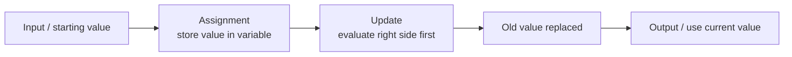

# Variables

## 1. Lesson Goals

By the end of this lesson, students should be able to:

- explain what a variable is and why variables are used
- identify variable name, value, and data type
- write variable assignment in IB pseudocode and Java
- distinguish assignment from comparison
- trace variable values as a program runs
- update variable values correctly
- use variables as counters and accumulators
- swap two variable values using a temporary variable
- choose meaningful variable names
- identify common variable-related errors in Java
- answer exam-style tracing and explanation questions

---

## 2. Syllabus Mapping

| Item | Detail |
|---|---|
| Unit | B2 Programming |
| Label | SL Core |
| Main skill | Storing, updating, and tracing values |
| Connected topics | Input/output, data types, selection, loops, arrays, searching, sorting |
| Programming language focus | IB pseudocode + Java |
| Exam relevance | Trace tables, assignment, output prediction, algorithm writing, debugging |

::: tip Learning Focus
Variables are the memory of a program. Most programming mistakes happen because students do not track how variable values change step by step.
:::

---

## Start here: variables store changing values

A **variable** is a named place in memory that stores a value while a program runs. Variables let a program remember input, store calculated results, update totals, count events, and produce output.

The most important exam skill is tracing how a variable's value changes after each **assignment**. Read code in order and remember that assignment replaces the old value with a new value.

Core keywords for this page: **variable**, **value**, **identifier**, **assignment**, **initialization**, **update**, **constant**, **data type**, and **trace table**.

---

## Core checklist

By the end of this page, you should be able to:

- define **variable**, **value**, **identifier**, and **constant**
- explain **assignment**, **initialization**, and **update**
- explain why `x = x + 1` is an update, not a maths equation
- distinguish variables from constants
- choose meaningful variable names
- match variables with suitable data types
- trace variable values using a trace table
- explain how constants and clear identifiers improve maintainability

---

## Key terms exam table

| Term | 简单中文解释 | English mark-scheme phrase | Simple example |
|---|---|---|---|
| Variable | 存储可变化数据的命名位置 | A named storage location for a value | `score = 80` |
| Value | 变量中当前保存的数据 | The data currently stored in a variable | `80` in `score = 80` |
| Identifier | 变量、方法或类的名字 | The name used to identify a variable, method, or class | `studentAge` |
| Assignment | 把值存入变量 | Storing a value in a variable | `score = 90` |
| Initialization | 第一次给变量设置初始值 | Giving a variable its first value | `int count = 0;` |
| Update | 用新值替换旧值 | Changing a variable by assigning a new value | `count = count + 1` |
| Constant | 程序运行时不应改变的值 | A named value that should not change during execution | `final int PASS_MARK = 50;` |
| Data type | 变量可存储的数据种类 | The type of value a variable can store | `int`, `double`, `boolean`, `String` |
| Trace table | 逐步记录变量值的表格 | A table used to follow variable values step by step | Columns for `x`, `y`, `total` |

---

## Assignment rule: right side first

Assignment does not work like a maths equation. In programming, the computer:

1. evaluates the **right side** first
2. stores the result in the variable on the **left side**
3. replaces the old value with the new value

Example:

```java
int x = 5;
x = x + 1;
```

Read the update as:

```text
new x = old x + 1
new x = 5 + 1
new x = 6
```

After the assignment, the old value `5` is replaced. The variable `x` now stores `6`.

::: warning Common Exam Trap
`x = x + 1` is an update operation. It is not an algebra equation asking whether `x` equals `x + 1`.
:::

---

## Variable vs constant

| Point | Variable | Constant |
|---|---|---|
| Meaning | Named storage whose value may change | Named value that should not change |
| Typical use | Score, total, count, user input | Tax rate, maximum mark, conversion factor |
| Java example | `int score = 0;` | `final int MAX_MARK = 100;` |
| Can be updated? | Yes, using assignment | No, should remain fixed |
| Maintainability benefit | Stores changing program state | Avoids repeated "magic numbers" |
| Common exam phrase | "A variable stores a value that can change during program execution." | "A constant stores a named value that should not change during program execution." |

Constants make code easier to maintain because a fixed value can be changed in one place.

```java
final int PASS_MARK = 50;

if (mark >= PASS_MARK) {
    System.out.println("Pass");
}
```

---

## Good variable names

Good identifiers make code easier to read, trace, test, and maintain.

Use names that describe the value's purpose:

| Weak name | Better name | Why better |
|---|---|---|
| `x` | `studentAge` | explains what the number represents |
| `t` | `totalMarks` | describes the stored value |
| `n` | `numberOfStudents` | avoids guessing |
| `p` | `productPrice` | gives scenario meaning |

Java variable names usually use **camelCase**:

```java
studentName
totalScore
passCount
averageMark
```

Avoid names that are too vague, misleading, or inconsistent. In exam answers, a meaningful name can help show that you understand the scenario.

---

## Data types and variables

A variable's **data type** controls what kind of value it can store.

| Data type | Suitable value | Example variable |
|---|---|---|
| `int` | whole number | `int numberOfStudents = 24;` |
| `double` | decimal number | `double averageMark = 76.5;` |
| `boolean` | true/false value | `boolean hasPassed = true;` |
| `char` | single character | `char grade = 'A';` |
| `String` | text | `String studentName = "Alice";` |

Choose the type that matches the data. For example, an average mark may need `double` because it can include decimals, while a pass/fail result may use `boolean`.

---

## Variable trace pattern

When tracing variables:

1. Read statements from top to bottom.
2. Create one column for each variable.
3. When an assignment occurs, evaluate the right side first.
4. Replace the old value in the left-side variable.
5. Record output only when an output statement runs.
6. Do not use old values after they have been replaced.

Example:

```java
int x = 3;
int y = 2;
x = x + y;
y = x * 2;
System.out.println(y);
```

Trace:

| Step | Statement | x | y | Output |
|---:|---|---:|---:|---|
| 1 | `int x = 3;` | 3 | - | - |
| 2 | `int y = 2;` | 3 | 2 | - |
| 3 | `x = x + y;` | 5 | 2 | - |
| 4 | `y = x * 2;` | 5 | 10 | - |
| 5 | `System.out.println(y);` | 5 | 10 | `10` |

Answer:

```text
10
```

---

## Variable flow diagram



Use this process when reading code: identify the starting value, apply each assignment in order, update the trace table, then read the final output.

---

## Exam focus

| Command term | What to write |
|---|---|
| State | Give a short definition, such as variable or constant. |
| Identify | Pick out the variable, value, identifier, assignment, or data type from code. |
| Outline | Give the main idea plus one example. |
| Describe | Explain how assignment or update changes a variable value. |
| Explain | Link variables, constants, names, or trace tables to readability and maintainability. |
| Trace | Follow each statement in order and record variable values. |

For mark levels:

- **1 mark:** define one term or identify one variable/value.
- **2 marks:** explain assignment or distinguish variable and constant.
- **3 marks:** trace a short code fragment with one or two variables.
- **4 marks:** trace updates and state final output clearly.
- **6 marks:** include a trace table, explain updates, and discuss naming/constants or maintainability in a scenario.

---

## Reusable mark-scheme style phrases

- "A variable is a named storage location for a value."
- "A value is the data currently stored in a variable."
- "An identifier is the name used for a variable, method, or class."
- "Assignment stores the result of an expression in a variable."
- "In assignment, the right side is evaluated first and the result is stored on the left."
- "Initialization gives a variable its first value."
- "An update replaces the old value of a variable with a new value."
- "A constant is a named value that should not change during program execution."
- "A trace table records variable values step by step as a program executes."

---

## Common mistakes table

| Mistake | Why it is wrong | Better approach |
|---|---|---|
| Treating `x = x + 1` as algebra | Assignment updates the value | Read it as "new x becomes old x plus 1" |
| Evaluating the left side first | The left side is where the result is stored | Evaluate the right side first |
| Forgetting old value is replaced | Variables store the current value only | Update the trace table each time |
| Confusing `=` and `==` | `=` assigns; `==` compares in Java | Use `=` for assignment and `==` in conditions |
| Using a variable before initialization | The variable may not have a valid value | Give a starting value before use |
| Choosing vague identifiers | Code becomes harder to understand | Use meaningful names such as `totalMarks` |
| Using the wrong data type | Values may not fit or decimals may be lost | Match the type to the data |
| Changing a constant | Constants should stay fixed | Use `final` in Java for fixed values |
| Missing a row in a trace table | Final values may be wrong | Add one row per important statement |
| Recording output too early | Output occurs only at output statements | Trace until the print/output line |

---

## Quick-check questions with short answers

1. What is a variable?  
   **Answer:** A named storage location for a value.

2. What is a value?  
   **Answer:** The data currently stored in a variable.

3. What is an identifier?  
   **Answer:** The name used for a variable, method, or class.

4. What is assignment?  
   **Answer:** Storing a value in a variable.

5. What is initialization?  
   **Answer:** Giving a variable its first value.

6. What is an update?  
   **Answer:** Assigning a new value to replace the old value.

7. What does `x = x + 1` mean?  
   **Answer:** Add 1 to the old value of `x` and store the result back in `x`.

8. What is a constant?  
   **Answer:** A named value that should not change while the program runs.

9. Why are good variable names useful?  
   **Answer:** They make code easier to read, trace, test, and maintain.

10. What is a trace table?  
    **Answer:** A table that records variable values step by step.

---

## Exam-style practice: variables

### Question A [6 marks]

Explain the difference between a variable, a constant, and assignment. Use one example of each.

<details>
<summary>Mark Scheme Style Answer</summary>

A variable is a named storage location whose value may change while the program runs, such as `int score = 0;`. A constant is a named value that should not change during program execution, such as `final int MAX_MARK = 100;`. Assignment stores the result of an expression in a variable, such as `score = score + 10;`. In assignment, the right side is evaluated first, and the result replaces the old value stored in the variable on the left.

</details>

---

### Question B [6 marks]

Trace the code and state the output.

```java
int x = 4;
int y = 3;
x = x + y;
y = x + 2;
x = y - 1;
System.out.println(x);
System.out.println(y);
```

<details>
<summary>Mark Scheme Style Answer</summary>

| Step | Statement | x | y |
|---:|---|---:|---:|
| 1 | `int x = 4;` | 4 | - |
| 2 | `int y = 3;` | 4 | 3 |
| 3 | `x = x + y;` | 7 | 3 |
| 4 | `y = x + 2;` | 7 | 9 |
| 5 | `x = y - 1;` | 8 | 9 |

Output:

```text
8
9
```

</details>

---

### Question C [6 marks]

A program calculates whether students pass a test. The programmer writes the pass mark `50` many times and uses variable names such as `x`, `y`, and `z`. Explain how better names and constants could improve maintainability.

<details>
<summary>Mark Scheme Style Answer</summary>

Meaningful variable names such as `studentMark`, `passMark`, and `passCount` make the code easier to understand because the purpose of each value is clear. A constant such as `final int PASS_MARK = 50;` avoids repeating the number 50 throughout the program. If the pass mark changes later, the programmer only needs to update the constant in one place. This improves maintainability and reduces the chance of inconsistent updates. Clear names also make tracing and debugging easier because each variable's role is easier to follow.

</details>

---

## 3. Key Terms

| English Term | 中文解释 | Exam-style meaning |
|---|---|---|
| Variable | 变量 | A named storage location for a value |
| Value | 值 | The data stored in a variable |
| Identifier | 标识符 | The name used for a variable, method, or class |
| Data type | 数据类型 | The type of data a variable can store |
| Assignment | 赋值 | Storing a value in a variable |
| Reassignment | 重新赋值 | Replacing the old value of a variable with a new value |
| Constant | 常量 | A value that should not change during program execution |
| Counter | 计数器 | A variable used to count events or repetitions |
| Accumulator | 累加器 | A variable used to build a running total |
| Trace table | 跟踪表 | A table used to follow variable values step by step |
| Temporary variable | 临时变量 | A variable used to store a value temporarily |

---

## 4. Concept Explanation

<LangBlock>
<template #cn>

### 中文讲解

**Variable（变量）** 是程序中用来存储数据的“有名字的位置”。

你可以把 variable 想成一个贴了标签的盒子：

```text
盒子名字: score
盒子里面的值: 85
```

在 Java 中可以写成：

```java
int score = 85;
```

这里：

| Part | Meaning |
|---|---|
| `int` | 数据类型，表示整数 |
| `score` | 变量名 |
| `85` | 存进去的值 |

变量的值可以改变。例如：

```java
score = 90;
```

这表示把 `score` 里面原来的 85 替换成 90。

学习 variables 的重点是：

1. 变量有名字
2. 变量有数据类型
3. 变量中存着当前值
4. assignment 会改变变量的值
5. 程序从上到下运行，所以变量值要一步一步 trace

</template>

<template #en>

### English Explanation

A **variable** is a named storage location used to store data in a program.

You can imagine a variable as a labelled box:

```text
box name: score
value inside the box: 85
```

In Java, this can be written as:

```java
int score = 85;
```

Here:

| Part | Meaning |
|---|---|
| `int` | data type, meaning integer |
| `score` | variable name |
| `85` | value stored in the variable |

The value of a variable can change. For example:

```java
score = 90;
```

This replaces the old value 85 with the new value 90.

The key ideas for variables are:

1. a variable has a name
2. a variable has a data type
3. a variable stores a current value
4. assignment changes the value stored in a variable
5. programs run from top to bottom, so variable values must be traced step by step

</template>
</LangBlock>

---

## 5. Real-life Example

### Example: Score in a Game

A game stores the player's score.

```java
int score = 0;
```

When the player collects a coin:

```java
score = score + 10;
```

When the player collects another coin:

```java
score = score + 10;
```

Trace:

| Step | Code | score |
|---|---|---:|
| 1 | `int score = 0;` | 0 |
| 2 | `score = score + 10;` | 10 |
| 3 | `score = score + 10;` | 20 |

::: info Scenario Link
The variable `score` stores the current state of the game. Each assignment updates that state.
:::

---

## 6. Variables in IB Pseudocode

### 6.1 Assignment

```text
score = 85
name = "Alice"
passed = true
```

In pseudocode, assignment usually uses `=`.

### 6.2 Updating a Variable

```text
score = score + 5
```

This means:

```text
new score = old score + 5
```

If `score` was 10, then after this line:

```text
score = 15
```

---

## 7. Variables in Java

## 7.1 Declaring and Initializing

```java
int score = 85;
```

This line does two things:

| Action | Meaning |
|---|---|
| Declaration | creates the variable `score` |
| Initialization | gives it the starting value `85` |

## 7.2 Declaration First, Assignment Later

```java
int score;
score = 85;
```

This is also allowed, but the variable should be assigned a value before being used.

## 7.3 Multiple Examples

```java
int age = 16;
double price = 12.5;
boolean passed = true;
char grade = 'A';
String name = "Alice";
```

---

## 8. Assignment vs Comparison

This is a very important difference.

| Symbol | Meaning in Java | Example |
|---|---|---|
| `=` | assignment | `score = 80;` |
| `==` | comparison | `score == 80` |

### Assignment

```java
score = 80;
```

This stores 80 in `score`.

### Comparison

```java
if (score == 80) {
    System.out.println("Exact score");
}
```

This checks whether `score` is equal to 80.

::: warning Common Mistake
Do not write `if (score = 80)` in Java. Use `==` for comparison.
:::

---

## 9. Tracing Variable Reassignment

### Java Code

```java
int x = 5;
x = 8;
x = x + 2;

System.out.println(x);
```

### Trace Table

| Step | Code | x |
|---:|---|---:|
| 1 | `int x = 5;` | 5 |
| 2 | `x = 8;` | 8 |
| 3 | `x = x + 2;` | 10 |
| 4 | output x | 10 |

Output:

```text
10
```

### Explanation

The value of `x` changes over time. The program does not remember old values unless they are stored somewhere else.

---

## 10. Important Pattern: `x = x + 1`

Students often find this confusing.

```java
x = x + 1;
```

This does **not** mean normal algebra.

It means:

```text
take the old value of x
add 1
store the result back into x
```

Example:

| Old x | Operation | New x |
|---:|---|---:|
| 3 | `x = x + 1` | 4 |
| 4 | `x = x + 1` | 5 |
| 5 | `x = x + 1` | 6 |

Shortcut:

```java
x++;
```

means:

```java
x = x + 1;
```

---

## 11. Counter Variables

A **counter** counts how many times something happens.

### Java Example

```java
int count = 0;

count = count + 1;
count = count + 1;
count = count + 1;

System.out.println(count);
```

Output:

```text
3
```

### In a Loop

```java
int passCount = 0;
int[] marks = {40, 55, 70, 31, 90};

for (int i = 0; i < marks.length; i++) {
    if (marks[i] >= 50) {
        passCount++;
    }
}

System.out.println(passCount);
```

`passCount` counts how many marks are 50 or above.

---

## 12. Accumulator Variables

An **accumulator** builds up a total.

### Java Example

```java
int total = 0;

total = total + 10;
total = total + 20;
total = total + 30;

System.out.println(total);
```

Output:

```text
60
```

### In a Loop

```java
int total = 0;
int[] marks = {80, 75, 90};

for (int i = 0; i < marks.length; i++) {
    total = total + marks[i];
}

System.out.println(total);
```

Trace:

| i | marks[i] | total after update |
|---:|---:|---:|
| 0 | 80 | 80 |
| 1 | 75 | 155 |
| 2 | 90 | 245 |

Output:

```text
245
```

---

## 13. Swapping Two Variables

### 13.1 Problem

Suppose:

```java
int a = 5;
int b = 9;
```

We want:

```text
a = 9
b = 5
```

### 13.2 Wrong Swap

```java
a = b;
b = a;
```

Trace:

| Step | a | b |
|---|---:|---:|
| Start | 5 | 9 |
| `a = b` | 9 | 9 |
| `b = a` | 9 | 9 |

The original value of `a` is lost.

### 13.3 Correct Swap

```java
int temp = a;
a = b;
b = temp;
```

Trace:

| Step | a | b | temp |
|---|---:|---:|---:|
| Start | 5 | 9 | - |
| `temp = a` | 5 | 9 | 5 |
| `a = b` | 9 | 9 | 5 |
| `b = temp` | 9 | 5 | 5 |

Final:

```text
a = 9
b = 5
```

::: tip Later Connection
Swapping is used in sorting algorithms such as bubble sort.
:::

---

## 14. Constants

A **constant** is a value that should not change.

In Java, constants are often written using `final`.

```java
final double PI = 3.14159;
final int MAX_MARK = 100;
```

If a value should remain fixed, a constant makes the code clearer and safer.

### Example

```java
final int PASS_MARK = 50;

if (mark >= PASS_MARK) {
    System.out.println("Pass");
}
```

This is clearer than writing `50` many times.

---

## 15. Variable Naming Rules and Style

## 15.1 Java Naming Rules

Variable names:

- can contain letters, digits, `_`, and `$`
- cannot start with a digit
- cannot contain spaces
- cannot be Java keywords
- are case-sensitive

| Valid | Invalid | Reason |
|---|---|---|
| `score` | `2score` | cannot start with digit |
| `studentName` | `student name` | no spaces |
| `totalMarks` | `class` | `class` is a Java keyword |
| `mark1` | `mark-1` | hyphen not allowed |

## 15.2 Good Naming Style

Use meaningful names.

| Weak Name | Better Name |
|---|---|
| `x` | `studentAge` |
| `n` | `numberOfStudents` |
| `t` | `totalMarks` |
| `a` | `averageScore` |

Java usually uses **camelCase** for variable names:

```java
studentName
totalMarks
passCount
```

---

## 16. Worked Example 1: Input and Variable Update

### Problem

Input a mark, add 5 bonus marks, output final mark.

### Java Code

```java
import java.util.Scanner;

public class BonusMark {
    public static void main(String[] args) {
        Scanner input = new Scanner(System.in);

        System.out.print("Enter mark: ");
        int mark = input.nextInt();

        mark = mark + 5;

        System.out.println("Final mark: " + mark);

        input.close();
    }
}
```

### Trace Example

| Input mark | Code | mark |
|---:|---|---:|
| 70 | `int mark = input.nextInt();` | 70 |
| - | `mark = mark + 5;` | 75 |
| - | output | 75 |

---

## 17. Worked Example 2: Calculate Area

### IB Pseudocode

```text
INPUT length
INPUT width

area = length * width

OUTPUT area
```

### Java Code

```java
import java.util.Scanner;

public class RectangleArea {
    public static void main(String[] args) {
        Scanner input = new Scanner(System.in);

        System.out.print("Enter length: ");
        double length = input.nextDouble();

        System.out.print("Enter width: ");
        double width = input.nextDouble();

        double area = length * width;

        System.out.println("Area: " + area);

        input.close();
    }
}
```

### Variable Roles

| Variable | Role |
|---|---|
| `length` | input value |
| `width` | input value |
| `area` | calculated output value |

---

## 18. Common Mistakes

| Mistake | Why it is a problem | Better habit |
|---|---|---|
| Using variable before assigning value | Java may not know what value it has | Initialize variables before use |
| Confusing `=` and `==` | Assignment and comparison are different | Use `=` to store, `==` to compare |
| Thinking `x = x + 1` is algebra | It is an update operation | Read it as “new x becomes old x plus 1” |
| Choosing meaningless names | Code becomes hard to understand | Use descriptive names |
| Wrong data type | Value may not fit or may lose decimals | Match type to data |
| Forgetting semicolon | Syntax error | End Java statements with `;` |
| Losing value during swap | One variable is overwritten | Use temporary variable |
| Reusing variable for unrelated purpose | Code becomes confusing | Use separate meaningful variables |
| Integer division with variables | Decimal part may be lost | Use `double` or divide by `2.0` |
| Wrong capitalization | Java variables are case-sensitive | Keep names consistent |

---

## 19. Guided Practice

### Practice 1: Trace Reassignment

```java
int x = 4;
x = x + 3;
x = x * 2;

System.out.println(x);
```

<details>
<summary>Suggested Answer</summary>

| Step | x |
|---|---:|
| `int x = 4;` | 4 |
| `x = x + 3;` | 7 |
| `x = x * 2;` | 14 |

Output:

```text
14
```

</details>

---

### Practice 2: Counter

What is the output?

```java
int count = 0;

count++;
count++;
count = count + 3;

System.out.println(count);
```

<details>
<summary>Suggested Answer</summary>

Trace:

```text
count starts at 0
after count++: 1
after count++: 2
after count = count + 3: 5
```

Output:

```text
5
```

</details>

---

### Practice 3: Accumulator

```java
int total = 0;

total = total + 8;
total = total + 12;
total = total + 5;

System.out.println(total);
```

<details>
<summary>Suggested Answer</summary>

Output:

```text
25
```

</details>

---

### Practice 4: Swap

Trace the variables.

```java
int a = 2;
int b = 7;
int temp = a;
a = b;
b = temp;
```

<details>
<summary>Suggested Answer</summary>

| Step | a | b | temp |
|---|---:|---:|---:|
| Start | 2 | 7 | - |
| `temp = a` | 2 | 7 | 2 |
| `a = b` | 7 | 7 | 2 |
| `b = temp` | 7 | 2 | 2 |

Final:

```text
a = 7
b = 2
```

</details>

---

### Practice 5: Choose Good Variable Names

Improve these variable names:

```text
x = student age
t = total score
n = number of students
```

<details>
<summary>Suggested Answer</summary>

```text
studentAge
totalScore
numberOfStudents
```

</details>

---

## 20. Independent Practice

### Question 1

Write Java code to declare an integer variable called `score` with value `0`.

### Question 2

Trace this code:

```java
int number = 10;
number = number - 3;
number = number * 2;
System.out.println(number);
```

### Question 3

Write IB pseudocode that inputs `price`, calculates `tax = price * 0.1`, and outputs `tax`.

### Question 4

Explain the difference between assignment and comparison in Java.

### Question 5

Write Java code to swap two variables `x` and `y`.

### Question 6

Choose suitable data types and variable names for:

```text
student full name
number of lessons
average mark
whether an assignment is submitted
```

### Question 7

Find and correct the error:

```java
int score;
System.out.println(score);
```

### Question 8

Use a counter variable to count three events manually.

### Question 9

Use an accumulator variable to add 5, 10, and 20.

### Question 10

Explain why meaningful variable names improve code readability.

---

## 21. Exam-style Questions

### Question 1 [4 marks]

Trace the following code and state the output.

```java
int a = 5;
int b = 2;

a = a + b;
b = a - b;

System.out.println(a);
System.out.println(b);
```

<details>
<summary>Mark Scheme Style Answer</summary>

Trace:

| Step | a | b |
|---|---:|---:|
| Start | 5 | 2 |
| `a = a + b` | 7 | 2 |
| `b = a - b` | 7 | 5 |

Output:

```text
7
5
```

</details>

---

### Question 2 [5 marks]

Explain what is meant by a variable and give one example.

<details>
<summary>Mark Scheme Style Answer</summary>

A variable is a named storage location used to store a value in a program. The value can be used and may be changed while the program runs. For example, `int score = 85;` creates an integer variable called `score` and stores the value 85 in it.

</details>

---

### Question 3 [5 marks]

Explain the difference between a counter and an accumulator.

<details>
<summary>Mark Scheme Style Answer</summary>

A counter is a variable used to count how many times an event occurs, such as counting how many students passed. It is usually increased by 1. An accumulator is a variable used to build a running total, such as adding all marks together. It is usually increased by a value from input or an array.

</details>

---

### Question 4 [6 marks]

The following code is intended to swap two variables, but it does not work correctly.

```java
a = b;
b = a;
```

Explain why it is wrong and write corrected Java code.

<details>
<summary>Mark Scheme Style Answer</summary>

The code is wrong because after `a = b`, the original value of `a` is lost. Both variables may end up storing the same value. A temporary variable is needed to store one original value while the swap happens.

Correct code:

```java
int temp = a;
a = b;
b = temp;
```

</details>

---

### Question 5 [6 marks]

A student writes this code:

```java
int total = 0;
total = total + 10;
total = total + 15;
total = total + 20;
```

Explain the role of `total` in this code.

<details>
<summary>Mark Scheme Style Answer</summary>

The variable `total` is acting as an accumulator. It starts at 0 and is updated several times by adding new values. Each assignment stores the new running total back into the same variable. At the end, `total` stores the sum of 10, 15, and 20, which is 45.

</details>

---

## 22. Practice task
### Activity 1: Variable Boxes

Students use paper boxes or cards.

Each card has:

```text
variable name
current value
data type
```

The teacher reads assignment statements, and students update the cards.

Example:

```text
score = score + 10
```

---

### Activity 2: Trace Relay

Groups trace the same code, one line per student. Each student updates one variable value and passes the trace table to the next student.

---

### Activity 3: Swap Demonstration

Two students hold number cards. A third student acts as the `temp` variable. The class physically demonstrates why `temp` is needed.

---

## 23. Independent practice
### Independent practice part A: Trace

Trace this code:

```java
int x = 3;
int y = 4;

x = x + y;
y = x * 2;
x = y - x;

System.out.println(x);
System.out.println(y);
```

Create a trace table with:

```text
line, x, y
```

---

### Independent practice part B: Write Code

Write a Java program that:

1. stores a product price
2. stores a quantity
3. calculates total cost
4. outputs total cost clearly

---

### Independent practice part C: Swap

Write pseudocode and Java code to swap two variables.

---

### Independent practice part D: Explain

In 4-5 sentences, explain why variables are important in programming.

---

## 24. One-page Revision Summary

| Point | Summary |
|---|---|
| Variable | Named storage location |
| Value | Data stored in a variable |
| Data type | Determines what kind of value can be stored |
| Assignment | Stores a value using `=` |
| Comparison | Checks equality using `==` in Java |
| Reassignment | Replaces old value with new value |
| `x = x + 1` | Updates x by adding 1 |
| Counter | Counts events, often increases by 1 |
| Accumulator | Builds a running total |
| Temporary variable | Helps store a value during swapping |
| Constant | Fixed value, often written with `final` |
| Good variable name | Meaningful and readable |
| Trace table | Tracks variable values step by step |
| Exam phrase | A variable stores a value that can be used and changed while the program runs |

---

## 25. Quick Self-test

Before moving on, students should be able to answer these:

1. What is a variable?
2. What is assignment?
3. What is reassignment?
4. What is the difference between `=` and `==`?
5. What does `x = x + 1` mean?
6. What is a counter?
7. What is an accumulator?
8. Why is a temporary variable needed when swapping?
9. What makes a variable name good?
10. Why are trace tables useful for variables?

