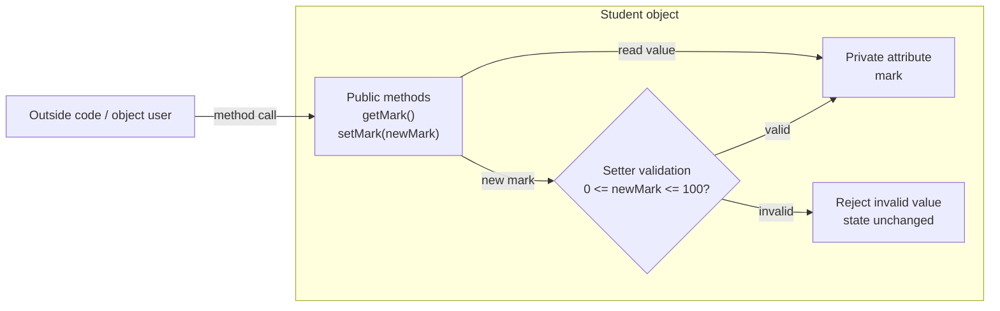

# Encapsulation

## Page map

- [Lesson goals](#1-lesson-goals)
- [Syllabus mapping](#2-syllabus-mapping)
- [Core checklist](#core-checklist)
- [Key terms and detailed lesson](#3-key-terms)

---

## 1. Lesson Goals

By the end of this lesson, students should be able to:

- explain what **encapsulation** means in object-oriented programming
- explain why attributes are often declared `private`
- distinguish `private` and `public`
- explain why direct access to attributes can be risky
- use methods to control access to object data
- explain how encapsulation protects object state
- understand how validation can be used before changing an attribute
- connect encapsulation to accessors and mutators
- identify poor and improved class design
- answer exam-style questions about encapsulation and data protection

---

## 2. Syllabus Mapping

| Item | Detail |
|---|---|
| Unit | B3 Object-Oriented Programming |
| Label | SL Core, with Java support |
| Main skill | Protecting object data and controlling access |
| Connected topics | Classes, objects, attributes, methods, constructors, accessors/mutators, UML |
| Programming language focus | Java |
| Exam relevance | OOP principles, public/private visibility, data protection, class design explanation |

::: tip Learning Focus
Encapsulation is not only about writing `private`. The key idea is **controlled access**: object data should not be changed freely from outside the class.
:::

---

## Start here: encapsulation controls access to object data

**Encapsulation** means keeping an object's data and the methods that use that data together inside a **class**. In simple terms, the class should protect its own **attributes** and provide **methods** for safe access.

Object data should usually be protected from direct outside access. That is why attributes are often `private`, while selected methods are `public`. Public methods such as a **getter** or **setter** can control how outside code reads or changes private data.

Core keywords for this page: **encapsulation**, **class**, **object**, **attribute**, **method**, **private**, **public**, **getter**, **setter**, **data hiding**, and **validation**.

---

## Core checklist

By the end of this page, you should be able to:

- define **encapsulation**
- explain why attributes are often made `private`
- explain how `public` methods control access to `private` attributes
- identify **getters** and **setters**
- explain how setters can validate data
- compare direct attribute access with controlled access through methods
- apply encapsulation to simple class scenarios

---

## Key terms exam table

| Term | 简单中文解释 | English mark-scheme phrase | Simple example |
|---|---|---|---|
| Encapsulation | 把数据和相关方法放在同一个类中，并控制访问 | Combines data and methods in a class while restricting direct access to data | `Student` stores `mark` and has `setMark()` |
| Data hiding | 隐藏对象内部数据，避免外部直接访问 | Prevents outside code from directly accessing internal attributes | `private int mark;` |
| Private attribute | 只能在本类内部直接访问的属性 | An attribute that cannot be accessed directly from outside the class | `private double balance;` |
| Public method | 外部代码可以调用的方法 | A method that provides controlled access to the object | `getBalance()` |
| Getter / accessor | 读取私有属性的方法 | A method that returns the value of a private attribute | `getMark()` returns `mark` |
| Setter / mutator | 修改私有属性的方法 | A method that changes a private attribute, often after validation | `setMark(85)` |
| Validation | 修改前检查新值是否合理 | Checking data before accepting it | Only allow marks from 0 to 100 |
| Class interface | 外部代码能使用的一组公开方法 | The public methods outside code can call | Constructor, `getMark()`, `setMark()` |
| Implementation detail | 类内部如何存储或处理数据的细节 | Internal code hidden from outside users of the class | How `setMark()` checks the range |

---

## Student-friendly Java example

This example uses a `Student` class. The `mark` attribute is private, so outside code must use methods to read or change it.

```java
public class Student {
    private String name;
    private int mark;

    public Student(String name, int mark) {
        this.name = name;
        setMark(mark);
    }

    public String getName() {
        return name;
    }

    public int getMark() {
        return mark;
    }

    public void setMark(int mark) {
        if (mark >= 0 && mark <= 100) {
            this.mark = mark;
        }
    }
}
```

Example object creation and method calls:

```java
Student s1 = new Student("Alice", 80);

System.out.println(s1.getMark());  // 80

s1.setMark(95);
System.out.println(s1.getMark());  // 95

s1.setMark(150);
System.out.println(s1.getMark());  // still 95
```

The invalid value `150` is rejected because the setter validates the mark before updating the private attribute.

---

## Direct access vs encapsulated access

| Point | Direct public attribute access | Encapsulated access through methods |
|---|---|---|
| Safety | Outside code can change data freely | The class controls how data is changed |
| Validation | No built-in check before assignment | Setter can reject invalid values |
| Maintainability | Rules may be spread across the program | Rules are kept inside the class |
| Control | Object state can be changed from many places | Public methods act as controlled access points |
| Exam phrase | "Public attributes can be changed directly, which may create invalid object state." | "Private attributes are accessed through public methods, allowing validation and controlled updates." |

---

## Why encapsulation matters in exams

Encapsulation is often tested through short code examples and design scenarios.

You should be able to explain that encapsulation:

- prevents invalid data being assigned directly
- protects internal object state
- allows validation before changing data
- allows the class implementation to change without changing external code too much
- makes programs easier to maintain

For example, if `mark` is private, outside code cannot directly assign `s1.mark = 150`. It must call `setMark(150)`, where the class can reject the invalid value.

---

## Encapsulation access diagram



Outside code uses public methods as controlled access points. The private attribute stays hidden inside the object, and setter validation decides whether the object state should change.

---

## Exam focus

| Command term | What to write |
|---|---|
| State | Give the term or one short definition. |
| Outline | Give the main idea plus one useful detail. |
| Describe | Explain how private attributes and public methods are used. |
| Explain | Link encapsulation to validation, object state, reliability, or maintainability. |
| Compare | Give paired differences between direct access and controlled method access. |

For mark levels:

- **2 marks:** define encapsulation and mention controlled access.
- **3 marks:** explain private attributes plus public methods such as getters/setters.
- **4 marks:** add why validation or data hiding matters in the scenario.
- **6 marks:** include definition, code/design detail, validation, object state protection, and maintainability.

Avoid vague answers such as:

```text
encapsulation means hiding everything
private means no one can use the class
getter and setter are just extra code
public is always bad
```

Better answers explain that private attributes are hidden from direct outside access, while public methods provide the controlled interface for using the object.

---

## Reusable mark-scheme style phrases

- "Encapsulation combines data and methods that operate on that data within a class."
- "Private attributes cannot be accessed directly from outside the class."
- "Public methods provide controlled access to private attributes."
- "A getter returns the value of a private attribute."
- "A setter changes the value of a private attribute, often after validation."
- "Encapsulation helps protect object state and reduce unintended changes."
- "Data hiding reduces the chance that outside code will put an object into an invalid state."
- "The class interface can stay similar even if implementation details inside the class change."

---

## Common mistakes table

| Mistake | Why it is wrong | Better understanding |
|---|---|---|
| Confusing encapsulation with inheritance | Inheritance is about reusing/extending classes; encapsulation is about controlled access | "Encapsulation protects object data." |
| Confusing class and object | A class is a blueprint; an object is one instance with actual state | `Student` is a class; `s1` is an object |
| Saying private attributes cannot be changed at all | They can be changed inside the class, often through setters | "Private means no direct outside access." |
| Forgetting getters and setters | Outside code needs controlled methods to interact with private data | Use `getMark()` and `setMark()` |
| Writing setters without validation | The setter may still allow invalid state | Check the value before assigning it |
| Exposing all attributes as public | Outside code can freely change object state | Keep attributes private where appropriate |
| Explaining data hiding without saying why it matters | The exam often expects a benefit | Mention validation, reliability, or maintainability |
| Thinking encapsulation only means putting code in a class | It also involves restricting direct access and controlling changes | Data and methods are together, but access is controlled |

---

## Quick-check questions with short answers

1. What is encapsulation?  
   **Answer:** Combining data and related methods in a class while controlling direct access to the data.

2. Why are attributes often private?  
   **Answer:** To stop outside code from directly changing object state.

3. What is a public method?  
   **Answer:** A method that outside code can call.

4. What does a getter do?  
   **Answer:** It returns the value of a private attribute.

5. What does a setter do?  
   **Answer:** It changes a private attribute, often after validation.

6. Why should a setter validate data?  
   **Answer:** To prevent invalid values from being stored.

7. Can a private attribute ever change?  
   **Answer:** Yes, but only from inside the class, often through a method.

8. What is data hiding?  
   **Answer:** Preventing outside code from directly accessing internal attributes.

9. Why is direct public attribute access risky?  
   **Answer:** It can allow invalid or unintended changes.

10. How does encapsulation help maintainability?  
    **Answer:** Access rules and validation can be kept inside the class, so changes are easier to manage.

---

## Exam-style practice: encapsulation

### Question A [4 marks]

Define encapsulation and explain why it is useful.

<details>
<summary>Mark Scheme Style Answer</summary>

Encapsulation combines data and the methods that operate on that data within a class. It is useful because attributes can be made private so outside code cannot directly change object state. Public methods can provide controlled access, and setters can validate data before changing private attributes.

</details>

---

### Question B [6 marks]

Study the code below.

```java
public class BankAccount {
    private double balance;

    public BankAccount(double startingBalance) {
        setBalance(startingBalance);
    }

    public double getBalance() {
        return balance;
    }

    public void setBalance(double balance) {
        if (balance >= 0) {
            this.balance = balance;
        }
    }
}
```

Identify the private attribute, getter, setter, and one validation rule used in this class.

<details>
<summary>Mark Scheme Style Answer</summary>

The private attribute is `balance`. The getter is `getBalance()` because it returns the value of the private attribute. The setter is `setBalance(double balance)` because it attempts to change the value of the private attribute. The validation rule is `balance >= 0`, which prevents a negative balance from being assigned.

</details>

---

### Question C [6 marks]

A school system stores student marks. Explain why using private attributes and setter methods can improve reliability or maintainability.

<details>
<summary>Mark Scheme Style Answer</summary>

Private attributes prevent outside code from directly assigning invalid marks, such as `-10` or `150`. A setter method can validate that the mark is within an allowed range before updating the object state. This improves reliability because each `Student` object is less likely to store invalid data. It also improves maintainability because the validation rule is kept inside the class. If the rule changes, the programmer can update the setter rather than searching for direct assignments throughout the program.

</details>

---

## 3. Key Terms

| English Term | 中文解释 | Exam-style meaning |
|---|---|---|
| Encapsulation | 封装 | Combining data and methods in a class while restricting direct access to internal data |
| Data hiding | 数据隐藏 | Preventing outside code from directly accessing internal attributes |
| Access modifier | 访问修饰符 | Keyword that controls visibility, such as `private` or `public` |
| `private` | 私有 | Can only be accessed inside the same class |
| `public` | 公有 | Can be accessed from outside the class |
| Attribute | 属性 | Data stored inside an object |
| Method | 方法 | Behaviour or operation of a class/object |
| Object state | 对象状态 | Current values of an object's attributes |
| Accessor | 访问器 / getter | Method used to read private data |
| Mutator | 修改器 / setter | Method used to change private data |
| Validation | 验证 | Checking whether a new value is acceptable before storing it |
| Controlled access | 受控访问 | Accessing or changing data through methods rather than directly |

---

## 4. Concept Explanation

<LangBlock>
<template #cn>

### 中文讲解

**Encapsulation（封装）** 是 OOP 的一个重要原则。

它的核心思想是：

```text
把数据和操作这些数据的方法放在同一个 class 里面，
同时限制外部代码直接修改内部数据。
```

简单来说：

```text
attributes 通常设为 private
methods 可以设为 public
外部代码通过 methods 来读取或修改 attributes
```

为什么要这样做？

如果 attributes 是 public，外部代码可以随便修改对象状态：

```java
s1.mark = 150;
```

但是学生成绩应该只能在 0 到 100 之间。  
如果外部可以直接改成 150，object 的状态就变得不合理。

使用 encapsulation 后，`mark` 可以设为 private：

```java
private int mark;
```

外部不能直接改 `mark`。如果要修改，就必须通过方法：

```java
setMark(85);
```

在 `setMark()` 里面可以加入 validation：

```java
if (mark >= 0 && mark <= 100) {
    this.mark = mark;
}
```

这样 object 的数据会更安全，也更容易维护。

</template>

<template #en>

### English Explanation

**Encapsulation** is an important principle in object-oriented programming.

The core idea is:

```text
keep data and the methods that operate on that data inside the same class,
while restricting direct access to the internal data from outside the class.
```

In simple terms:

```text
attributes are usually private
methods can be public
outside code reads or changes attributes through methods
```

Why is this useful?

If attributes are public, outside code can freely change object state:

```java
s1.mark = 150;
```

However, a student mark should only be between 0 and 100.  
If outside code can directly set the mark to 150, the object state becomes invalid.

With encapsulation, `mark` can be private:

```java
private int mark;
```

Outside code cannot directly change `mark`. To update it, code must use a method:

```java
setMark(85);
```

Inside `setMark()`, validation can be added:

```java
if (mark >= 0 && mark <= 100) {
    this.mark = mark;
}
```

This makes object data safer and easier to maintain.

</template>
</LangBlock>

---

## 5. Real-life Analogy: Bank Account

A bank account should protect its balance.

Bad design:

```text
Anyone can directly change the balance.
```

This is dangerous:

```text
balance = -999999
balance = 100000000
```

Better design:

```text
The balance is private.
Users must deposit or withdraw using methods.
The methods check whether the operation is valid.
```

| OOP Idea | Bank Account Example |
|---|---|
| Private attribute | `balance` |
| Public method | `deposit(amount)` |
| Public method | `withdraw(amount)` |
| Validation | Do not allow withdrawal if amount is greater than balance |
| Encapsulation benefit | Balance cannot be changed freely from outside |

::: info Scenario Link
Encapsulation protects the internal state of an object, just like a bank protects account data from uncontrolled access.
:::

---

## 6. Public Attributes: Poor Design

### Poor Student Class

```java
public class Student {
    public String name;
    public int mark;
}
```

### Main Program

```java
public class TestStudent {
    public static void main(String[] args) {
        Student s1 = new Student();

        s1.name = "Alice";
        s1.mark = 150;

        System.out.println(s1.mark);
    }
}
```

### Problem

Output:

```text
150
```

This is a problem because a mark of 150 is invalid if the valid range is 0 to 100.

### Why Poor Design?

| Issue | Explanation |
|---|---|
| Attributes are public | Outside code can directly change them |
| No validation | Invalid values can be stored |
| Weak data protection | Object state can become unreasonable |
| Harder to maintain | Many parts of the program may change the data directly |

---

## 7. Private Attributes: Better Design

### Improved Student Class

```java
public class Student {
    private String name;
    private int mark;

    public Student(String name, int mark) {
        this.name = name;

        if (mark >= 0 && mark <= 100) {
            this.mark = mark;
        } else {
            this.mark = 0;
        }
    }

    public void displayInfo() {
        System.out.println(name + " scored " + mark);
    }
}
```

### Main Program

```java
public class TestStudent {
    public static void main(String[] args) {
        Student s1 = new Student("Alice", 85);

        s1.displayInfo();
    }
}
```

### Output

```text
Alice scored 85
```

Now the attributes are protected because they are `private`.

---

## 8. `private` vs `public`

| Access Modifier | Meaning | Usually Used For |
|---|---|---|
| `private` | Only accessible inside the same class | Attributes |
| `public` | Accessible from outside the class | Constructors and methods |

### Example

```java
public class Student {
    private String name;
    private int mark;

    public void displayInfo() {
        System.out.println(name + " scored " + mark);
    }
}
```

| Code | Visibility | Meaning |
|---|---|---|
| `private String name;` | private | only Student class can directly access it |
| `private int mark;` | private | only Student class can directly access it |
| `public void displayInfo()` | public | outside code can call it |

::: tip Exam Phrase
Attributes are often declared private so that outside code cannot directly change object state.
:::

---

## 9. What Happens If Outside Code Accesses Private Data?

### Student.java

```java
public class Student {
    private String name;
    private int mark;
}
```

### TestStudent.java

```java
public class TestStudent {
    public static void main(String[] args) {
        Student s1 = new Student();

        s1.mark = 90;
    }
}
```

This causes an error because `mark` is private.

Possible idea of error:

```text
mark has private access in Student
```

### Meaning

Outside code cannot directly access private attributes.

This is intentional. It protects object data.

---

## 10. Controlled Access Through Methods

If attributes are private, outside code needs public methods to interact with them.

### Student.java

```java
public class Student {
    private String name;
    private int mark;

    public Student(String name, int mark) {
        this.name = name;
        setMark(mark);
    }

    public void setMark(int mark) {
        if (mark >= 0 && mark <= 100) {
            this.mark = mark;
        }
    }

    public int getMark() {
        return mark;
    }

    public void displayInfo() {
        System.out.println(name + " scored " + mark);
    }
}
```

### TestStudent.java

```java
public class TestStudent {
    public static void main(String[] args) {
        Student s1 = new Student("Alice", 85);

        s1.setMark(90);
        System.out.println(s1.getMark());

        s1.setMark(150);
        System.out.println(s1.getMark());
    }
}
```

### Output

```text
90
90
```

The invalid value 150 is rejected, so the mark remains 90.

---

## 11. Object State Trace with Encapsulation

### Code

```java
Student s1 = new Student("Alice", 85);

s1.setMark(90);
s1.setMark(150);
```

### Trace Table

| Step | Action | Valid? | s1.mark |
|---:|---|---|---:|
| 1 | constructor sets 85 | yes | 85 |
| 2 | `setMark(90)` | yes | 90 |
| 3 | `setMark(150)` | no | 90 |

Final state:

| Object | name | mark |
|---|---|---:|
| s1 | Alice | 90 |

::: warning Key Idea
Encapsulation does not mean data can never change. It means data changes through controlled methods.
:::

---

## 12. Accessors and Mutators Preview

Encapsulation often uses:

```text
accessors + mutators
```

| Method Type | Common Name | Purpose |
|---|---|---|
| Accessor | getter | Read private data |
| Mutator | setter | Change private data |

### Getter Example

```java
public int getMark() {
    return mark;
}
```

### Setter Example

```java
public void setMark(int mark) {
    if (mark >= 0 && mark <= 100) {
        this.mark = mark;
    }
}
```

These will be explained fully in the next page.

---

## 13. Encapsulation and Validation

Validation is one of the strongest reasons for encapsulation.

### Without Encapsulation

```java
s1.mark = -20;
```

The object now has invalid state.

### With Encapsulation

```java
s1.setMark(-20);
```

Inside the method:

```java
public void setMark(int mark) {
    if (mark >= 0 && mark <= 100) {
        this.mark = mark;
    }
}
```

The invalid value is rejected.

### Why This Helps

| Benefit | Explanation |
|---|---|
| Prevents invalid data | Object cannot easily enter invalid state |
| Centralizes rules | Validation is written in one place |
| Easier maintenance | Rules can be changed inside the class |
| Safer class use | Other programmers use public methods instead of direct access |

---

## 14. Encapsulation and Maintainability

Imagine many parts of a program directly change `mark`:

```java
s1.mark = 75;
s1.mark = -10;
s1.mark = 120;
```

If the rule changes, every place must be checked.

With encapsulation, all changes go through one method:

```java
s1.setMark(value);
```

If the rule changes, update only the setter method.

This makes the program easier to maintain.

---

## 15. Encapsulation and Abstraction

Encapsulation is related to abstraction.

Outside code does not need to know exactly how the object stores data internally.

Example:

```java
s1.setMark(85);
System.out.println(s1.getMark());
```

The outside code uses public methods. It does not need to know the internal details of validation or storage.

| Idea | Meaning |
|---|---|
| Encapsulation | protects and controls access to data |
| Abstraction | hides unnecessary internal details |

---

## 16. Complete Example: BankAccount

### BankAccount.java

```java
public class BankAccount {
    private String accountNumber;
    private double balance;

    public BankAccount(String accountNumber, double startingBalance) {
        this.accountNumber = accountNumber;

        if (startingBalance >= 0) {
            balance = startingBalance;
        } else {
            balance = 0;
        }
    }

    public void deposit(double amount) {
        if (amount > 0) {
            balance = balance + amount;
        }
    }

    public void withdraw(double amount) {
        if (amount > 0 && amount <= balance) {
            balance = balance - amount;
        }
    }

    public double getBalance() {
        return balance;
    }

    public void displayInfo() {
        System.out.println(accountNumber + ": " + balance);
    }
}
```

### TestBankAccount.java

```java
public class TestBankAccount {
    public static void main(String[] args) {
        BankAccount account = new BankAccount("A001", 100.0);

        account.deposit(50.0);
        account.withdraw(30.0);
        account.withdraw(500.0);

        account.displayInfo();
    }
}
```

### Output

```text
A001: 120.0
```

### Trace Table

| Step | Action | Valid? | balance |
|---:|---|---|---:|
| 1 | starting balance 100 | yes | 100.0 |
| 2 | deposit 50 | yes | 150.0 |
| 3 | withdraw 30 | yes | 120.0 |
| 4 | withdraw 500 | no | 120.0 |

The invalid withdrawal is rejected.

---

## 17. Poor vs Improved Design

| Design | Example | Problem / Benefit |
|---|---|---|
| Poor | `public int mark;` | Outside code can set invalid values |
| Improved | `private int mark;` + `setMark()` | Method can validate before changing mark |
| Poor | direct balance update | Bank balance can become invalid |
| Improved | `deposit()` and `withdraw()` | Operations follow rules |
| Poor | rules spread everywhere | Hard to maintain |
| Improved | rules inside class | Easier to update and protect |

---

## 18. Common Mistakes

| Mistake | Why it is a problem | Better habit |
|---|---|---|
| Thinking encapsulation means “hide everything” | Public methods are still needed | Hide data, expose controlled behaviour |
| Making all attributes public | Data can be changed freely | Use private attributes |
| No getter for needed data | Outside code cannot read necessary information | Add accessor when suitable |
| Setter without validation | Still allows invalid state | Validate inside mutator |
| Making all methods private | Outside code cannot use object | Public methods should provide safe interface |
| Directly accessing private attribute | Causes access error | Use public method |
| Putting validation outside the class only | Rules are scattered | Keep validation close to data |
| Confusing encapsulation with inheritance | Different OOP principles | Encapsulation controls access |
| Forgetting `this` in setter | May assign parameter to itself | Use `this.attribute = parameter` |
| Overusing setters | Object may become too open | Only provide setters when change is allowed |

---

## 19. Guided Practice

### Practice 1: Public or Private?

For a `Student` class, decide whether each should usually be public or private.

| Member | Public or Private? |
|---|---|
| `name` attribute |
| `mark` attribute |
| `displayInfo()` method |
| `setMark()` method |
| constructor |

<details>
<summary>Suggested Answer</summary>

| Member | Public or Private? |
|---|---|
| `name` attribute | private |
| `mark` attribute | private |
| `displayInfo()` method | public |
| `setMark()` method | public |
| constructor | public |

Attributes are usually private. Methods that safely interact with the object are often public.

</details>

---

### Practice 2: Identify the Risk

What is risky about this code?

```java
public class Student {
    public int mark;
}
```

<details>
<summary>Suggested Answer</summary>

The attribute `mark` is public, so outside code can directly set it to invalid values such as `-10` or `150`. There is no validation or controlled access.

</details>

---

### Practice 3: Trace State

Given a setter that only accepts marks from 0 to 100:

```java
Student s1 = new Student("Alice", 80);
s1.setMark(95);
s1.setMark(130);
```

What is the final mark?

<details>
<summary>Suggested Answer</summary>

Final mark:

```text
95
```

The value 130 is invalid, so the setter rejects it and the mark remains 95.

</details>

---

### Practice 4: Encapsulation Benefit

Give one reason why `balance` in a bank account should be private.

<details>
<summary>Suggested Answer</summary>

`balance` should be private so outside code cannot directly set it to invalid values. Changes should go through methods such as `deposit()` and `withdraw()`, where validation rules can be checked.

</details>

---

### Practice 5: Fix the Design

Improve this class design:

```java
public class Player {
    public String name;
    public int health;
}
```

<details>
<summary>Suggested Answer</summary>

Example improvement:

```java
public class Player {
    private String name;
    private int health;

    public Player(String name, int health) {
        this.name = name;
        setHealth(health);
    }

    public void setHealth(int health) {
        if (health >= 0 && health <= 100) {
            this.health = health;
        }
    }

    public int getHealth() {
        return health;
    }
}
```

</details>

---

## 20. Independent Practice

### Question 1

Define encapsulation in your own words.

### Question 2

Explain why attributes are often declared `private`.

### Question 3

Explain the difference between `private` and `public`.

### Question 4

For a `BankAccount` class, explain why `balance` should not be public.

### Question 5

Write a `Student` class with private attributes:

```text
name
mark
```

Add a constructor and a `displayInfo()` method.

### Question 6

Add a `setMark(int mark)` method that only accepts marks from 0 to 100.

### Question 7

Trace the object state:

```java
Student s1 = new Student("Ben", 40);
s1.setMark(55);
s1.setMark(-5);
```

### Question 8

Explain how encapsulation improves maintainability.

### Question 9

Explain how encapsulation supports validation.

### Question 10

Identify what is wrong with this design:

```java
public class BankAccount {
    public double balance;
}
```

---

## 21. Exam-style Questions

### Question 1 [4 marks]

Define encapsulation.

<details>
<summary>Mark Scheme Style Answer</summary>

Encapsulation is the OOP principle of combining data and the methods that operate on that data inside a class, while restricting direct access to the internal data. This is often done by making attributes private and providing public methods for controlled access.

</details>

---

### Question 2 [5 marks]

Explain why attributes are often declared `private`.

<details>
<summary>Mark Scheme Style Answer</summary>

Attributes are often declared private to prevent outside code from directly accessing or changing object data. This helps protect the object's state from invalid values. Access can instead be controlled through public methods, where validation can be added before data is changed. This improves data security and makes the class easier to maintain.

</details>

---

### Question 3 [6 marks]

A `Student` class has a public `mark` attribute.

```java
public int mark;
```

Explain one problem with this design and suggest an improvement.

<details>
<summary>Mark Scheme Style Answer</summary>

If `mark` is public, outside code can directly assign invalid values such as `-10` or `150`. This can make the object's state invalid. A better design is to declare `mark` as private and provide a public setter method that validates the value before assigning it. For example, the setter can only allow marks from 0 to 100.

</details>

---

### Question 4 [6 marks]

Explain how encapsulation can make a program easier to maintain.

<details>
<summary>Mark Scheme Style Answer</summary>

Encapsulation keeps the rules for accessing and changing data inside the class. If an attribute can only be changed through a method, validation rules can be written in one place. If the rule changes later, the programmer only needs to update that method instead of finding many direct changes across the program. This makes the program easier to maintain and reduces the chance of inconsistent updates.

</details>

---

### Question 5 [6 marks]

Trace the final state.

Assume `setMark()` only accepts values from 0 to 100 inclusive.

```java
Student s1 = new Student("Alice", 80);
s1.setMark(90);
s1.setMark(120);
s1.setMark(75);
```

<details>
<summary>Mark Scheme Style Answer</summary>

| Step | Action | Valid? | mark |
|---:|---|---|---:|
| 1 | constructor sets 80 | yes | 80 |
| 2 | `setMark(90)` | yes | 90 |
| 3 | `setMark(120)` | no | 90 |
| 4 | `setMark(75)` | yes | 75 |

Final state:

```text
name = "Alice"
mark = 75
```

</details>

---

## 22. Independent practice
### Independent practice part A: Concept Explanation

In 5-6 sentences, explain encapsulation using a bank account or student mark example.

---

### Independent practice part B: Java Code

Create a `BankAccount` class with:

```text
private accountNumber
private balance
constructor
deposit()
withdraw()
getBalance()
displayInfo()
```

Make sure invalid withdrawals are rejected.

---

### Independent practice part C: Design Task

Choose one class:

```text
GameCharacter
Laptop
Course
Book
```

List:

```text
private attributes
public methods
which methods should validate input
```

---

### Independent practice part D: Trace

Trace this account state:

```java
BankAccount account = new BankAccount("A001", 100);
account.deposit(50);
account.withdraw(30);
account.withdraw(200);
```

Assume invalid withdrawals are rejected.

---

## 23. One-page Revision Summary

| Point | Summary |
|---|---|
| Encapsulation | Protects object data using controlled access |
| Data hiding | Prevents direct access to internal attributes |
| `private` | Accessible only inside the class |
| `public` | Accessible from outside the class |
| Usual design | private attributes, public methods |
| Getter | Reads private data |
| Setter | Changes private data |
| Validation | Checks data before changing attributes |
| Object state | Current attribute values |
| Benefit | Prevents invalid data |
| Benefit | Improves maintainability |
| Benefit | Hides internal details |
| Common mistake | Making all attributes public |
| Exam phrase | Encapsulation restricts direct access to data and allows controlled access through methods |

---

## 24. Quick Self-test

Before moving on, students should be able to answer these:

1. What is encapsulation?
2. What does `private` mean?
3. What does `public` mean?
4. Why are attributes usually private?
5. Why are methods often public?
6. What is data hiding?
7. How can a setter protect object state?
8. Why is validation useful?
9. How does encapsulation improve maintainability?
10. What is wrong with public attributes?
