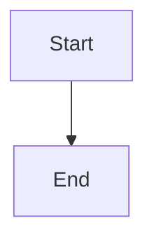

# Module Audit Table

## 1. Purpose of This Page

This page is the final quality-control audit page for the IBDP Computer Science SL learning website.

The aim is to make sure the site is ready to publish:

```text
sidebar links are valid
page files exist
internal links work
module coverage is complete
page style is consistent
build succeeds
private/local-only content is not exposed
GitHub Pages deployment is ready
```

::: tip Main Idea
A strong learning website is not only about writing pages. It also needs stable navigation, clean links, consistent file names, and a successful production build.
:::

---

## 2. Quality Control Workflow

Use this order:

```text
1. Check folder and file structure
2. Check sidebar links in config.mts
3. Check Markdown internal links
4. Check page coverage by module
5. Check page style consistency
6. Run local dev preview
7. Run production build
8. Run link checker
9. Check Git status
10. Commit and push
```

---

## 3. Quick PowerShell Audit

This package includes:

```text
tools/qc-audit-v1-1.ps1
```

Run it from the project root:

```powershell
cd D:\ibdp-cs-sl-website

.\tools\qc-audit-v1-1.ps1
```

The script checks:

```text
docs folder exists
VitePress config exists
sidebar/page links in config.mts point to real files
local Markdown links point to real files
empty placeholder pages
basic required section headings
potential local absolute paths
potential TODO/FIXME placeholders
```

::: warning Script Note
This script is a local helper, not a replacement for `npm run docs:build`. Always run the actual VitePress build after the script.
:::

---

## 4. Build and Link Check Commands

After copying the updated files, run:

```powershell
cd D:\ibdp-cs-sl-website

npm run docs:dev
```

Preview the site in the browser and click major sidebar sections.

Then run:

```powershell
npm run docs:build
.\tools\check-vitepress-links.ps1
.\tools\qc-audit-v1-1.ps1
```

If all checks are clean, commit:

```powershell
git status
git add .
git commit -m "Add site quality control audit"
git push
```

---

## 5. Module Coverage Audit Table

| Module | Folder | Index Page | Content Pages | Practice / Review | Status |
|---|---|---:|---:|---:|---|
| Home | `docs/index.md` | ✅ | - | - | Check final homepage |
| A1 Computer Fundamentals | `docs/a1-computer-fundamentals` | ✅ | ✅ | ✅ | Complete / audit links |
| A2 Networks | `docs/a2-networks` | ✅ | ✅ | ✅ | Complete / audit links |
| A3 Databases | `docs/a3-databases` | ✅ | ✅ | ✅ | Complete / audit links |
| A4 Machine Learning | `docs/a4-machine-learning` | ✅ | ✅ | ✅ | Complete / audit links |
| B1 Computational Thinking | `docs/b1-computational-thinking` | ✅ | ✅ | ✅ | Complete / audit links |
| B2 Programming | `docs/b2-programming` | ✅ | ✅ | ✅ | Already completed earlier |
| Exam Practice | `docs/exam-practice` | ✅ | ✅ | ✅ | Check all practice links |
| Extension HL Programming | `docs/extension-hl-programming` | ✅ | ✅ | ✅ | Check extension pages |
| Extension Social Engineering | `docs/extension-social-engineering` | ✅ | ✅ | ✅ | Newly completed |
| IA Support | `docs/ia-support` | ✅ | ✅ | ✅ | Newly completed |
| Glossary | `docs/glossary` | ✅ | ✅ | ✅ | Newly completed |
| Quality Control | `docs/quality-control` | ✅ | ✅ | - | This page |

---

## 6. Sidebar Link Audit

The sidebar links are mainly controlled by:

```text
docs/.vitepress/config.mts
```

### What to Check

```text
Every sidebar link points to an existing Markdown file.
Every folder index link points to index.md.
No old renamed file remains in config.mts.
No link has a typo in folder name.
No link points to a deleted page.
No duplicate sidebar items confuse students.
```

### Manual Command

```powershell
Select-String -Path ".\docs\.vitepress\config.mts" -Pattern "link:" -CaseSensitive:$false
```

### Common Link Mapping

| Sidebar Link | Real File |
|---|---|
| `/a3-databases/` | `docs/a3-databases/index.md` |
| `/a3-databases/sql-select` | `docs/a3-databases/sql-select.md` |
| `/extension-social-engineering/phishing-and-spear-phishing` | `docs/extension-social-engineering/phishing-and-spear-phishing.md` |
| `/ia-support/problem-analysis` | `docs/ia-support/problem-analysis.md` |
| `/glossary/pseudocode-java-cheatsheet` | `docs/glossary/pseudocode-java-cheatsheet.md` |

---

## 7. Real File Audit

Run:

```powershell
Get-ChildItem ".\docs" -Recurse -File -Filter "*.md" | Select-Object FullName
```

Check that important folders include:

```text
index.md
all sidebar-linked pages
no empty accidental files
no duplicate old drafts
no wrongly named files with spaces
```

### Recommended File Naming

Use:

```text
lowercase
hyphen-separated
.md extension
no spaces
no Chinese punctuation in file names
```

Example:

```text
database-security-privacy.md
pseudocode-java-cheatsheet.md
development-and-testing.md
```

---

## 8. Markdown Internal Link Audit

Check links inside Markdown pages.

### Good Local Links

```markdown
[Open](./problem-analysis)
[Next](../glossary/command-terms)
```

### Risky Local Links

```markdown
[Open](problem-analysis.md)
[Open](D:\ibdp-cs-sl-website\docs\...)
[Open](file:///...)
```

### What to Avoid

```text
local Windows paths
absolute file paths
links to /mnt/data
links to temporary zip files
links to old file names
links to deleted pages
```

---

## 9. Page Style Consistency Audit

Most teaching pages should include many of these sections:

```text
Lesson Goals
Bilingual Explanation
Key Terms
Concept Explanation
Examples
Common Mistakes
Scenario Answer Bank
Guided Practice
Independent Practice
Classroom Activities
Homework
Teacher Notes
One-page Summary
```

Not every page must have exactly the same headings, but pages should feel consistent.

---

## 10. Bilingual Block Audit

Many pages use:

```text
<LangBlock>
<template #cn>
...
</template>

<template #en>
...
</template>
</LangBlock>
```

### Check

```text
opening and closing tags match
Chinese and English sections both exist
no unfinished template block
no broken Markdown table inside block
```

### Search Command

```powershell
Select-String -Path ".\docs\**\*.md" -Pattern "LangBlock|template #cn|template #en" -CaseSensitive:$false
```

---

## 11. Mermaid Audit

Some pages use Mermaid diagrams.

### Correct Format

````markdown

````

### Check

```text
code fence starts with ```mermaid
code fence closes with ```
diagram syntax is simple
node text does not contain too many special characters
```

---

## 12. Exam Practice Audit

For exam practice pages, check:

```text
questions are clearly numbered
marks are shown if applicable
answers are under details blocks or clearly separated
mark scheme-style wording is used
command terms are respected
questions match the topic page
no answer contradicts the explanation page
```

### Good Practice Format

```markdown
### Question 1 [4 marks]

Explain ...

<details>
<summary>Mark Scheme Style Answer</summary>

Answer here.

</details>
```

---

## 13. IA Support Audit

IA Support pages should connect clearly:

```text
IA Overview
Problem Analysis
Design and Success Criteria
Development and Testing
Evaluation and Reflection
IA Checklist
```

### Check

```text
problem → requirements → criteria → design → development → testing → evaluation
```

If one page mentions a key idea, later pages should reinforce it.

---

## 14. Glossary Audit

Glossary pages should support exam wording.

### Check

```text
command terms are accurate
definitions avoid overclaiming
confusing pairs are clearly distinguished
CN-EN terms are consistent
pseudocode and Java examples compile logically
common mistakes are realistic
```

---

## 15. Security and Privacy Audit

Before publishing, remove:

```text
real student data
private emails
private phone numbers
local file paths
API keys
secret tokens
school internal documents
temporary generated file links
personal screenshots
```

### Search Commands

```powershell
Select-String -Path ".\docs\**\*.md" -Pattern "D:\\|C:\\|/mnt/data|file://|TODO|FIXME|password|api_key|secret|token" -CaseSensitive:$false
```

::: warning Important
Do not publish private student information or internal school data in a public GitHub Pages site.
:::

---

## 16. Production Build Audit

Run:

```powershell
npm run docs:build
```

### Build Should Have

```text
no broken import
no missing page
no Markdown syntax error
no unresolved component problem
no fatal VitePress error
```

### If Build Fails

Check:

```text
line number in error message
unclosed Markdown fence
broken Vue/HTML tag
bad Mermaid syntax
missing file
invalid frontmatter
```

---

## 17. Link Checker Audit

Run:

```powershell
.\tools\check-vitepress-links.ps1
```

If the custom checker reports broken links:

```text
open the file mentioned
check the target path
confirm file exists
fix spelling/case
run checker again
```

Common causes:

```text
folder renamed
file renamed
missing index.md
link uses .md when site route expects no .md
case mismatch
old draft link
```

---

## 18. Final Browser Audit

After `npm run docs:dev`, manually click:

```text
top nav items
each sidebar module index
first page and last page in each module
recently upgraded pages
exam practice pages
IA pages
Glossary pages
Quality Control page
```

### Browser Check

```text
page title appears
sidebar highlights correctly
tables render correctly
details blocks open
Mermaid diagrams render
code blocks display correctly
no red error overlay
links open expected pages
```

---

## 19. Git Audit

Before committing:

```powershell
git status
```

Check:

```text
only intended files changed
no large zip files accidentally added
no temporary folders added
no node_modules added
no build output added unless intended
```

### Useful Command

```powershell
git diff --stat
```

### If You Accidentally Added Generated Zips

```powershell
git restore --staged *.zip
```

or remove them from project folder if copied there accidentally.

---

## 20. Final Release Checklist

| Check | Done? |
|---|---|
| All sidebar links checked |  |
| All Markdown local links checked |  |
| All generated pages copied to correct folders |  |
| `npm run docs:dev` preview checked |  |
| `npm run docs:build` passes |  |
| `check-vitepress-links.ps1` passes |  |
| `qc-audit-v1-1.ps1` passes or warnings reviewed |  |
| No private/local-only paths published |  |
| No TODO/FIXME placeholders left unintentionally |  |
| Git status reviewed |  |
| Commit created |  |
| GitHub Pages deployment checked |  |

---

## 21. Common Quality Control Problems

| Problem | Cause | Fix |
|---|---|---|
| sidebar link opens 404 | file missing or link typo | correct link or create file |
| build fails | Markdown/Vue syntax error | inspect error line |
| table breaks | missing pipe or line break | fix Markdown table |
| Mermaid fails | invalid diagram syntax | simplify diagram |
| details block broken | unclosed HTML tag | close `</details>` |
| bilingual block broken | unclosed template | close templates correctly |
| local path exposed | copied from local notes | remove or replace with relative link |
| old page still linked | sidebar not updated | update config.mts |
| zip accidentally tracked | copied package into repo | remove zip from repo |
| page too inconsistent | missing key sections | add goals, practice, teacher notes |

---

## 22. Suggested Audit Order After This Update

Use this exact order now:

```powershell
cd D:\ibdp-cs-sl-website

.\tools\qc-audit-v1-1.ps1

npm run docs:dev

npm run docs:build

.\tools\check-vitepress-links.ps1

git status
git diff --stat
```

Then commit:

```powershell
git add .
git commit -m "Add site quality control audit"
git push
```

---

## 23. One-page Quality Control Sheet

| Area | Check |
|---|---|
| Sidebar | all links point to real pages |
| Files | all linked `.md` files exist |
| Index pages | every module folder has `index.md` |
| Markdown links | relative/internal links work |
| Build | `npm run docs:build` passes |
| Link checker | no broken site links |
| Page style | headings and sections consistent |
| Bilingual blocks | tags closed correctly |
| Code blocks | fences closed correctly |
| Mermaid | diagrams render |
| Practice | questions and answers formatted clearly |
| Privacy | no private data or local paths |
| Git | only intended files committed |
| Deployment | GitHub Pages shows latest site |
| Best phrase | Quality control ensures the website is complete, navigable, consistent, and safe to publish. |
